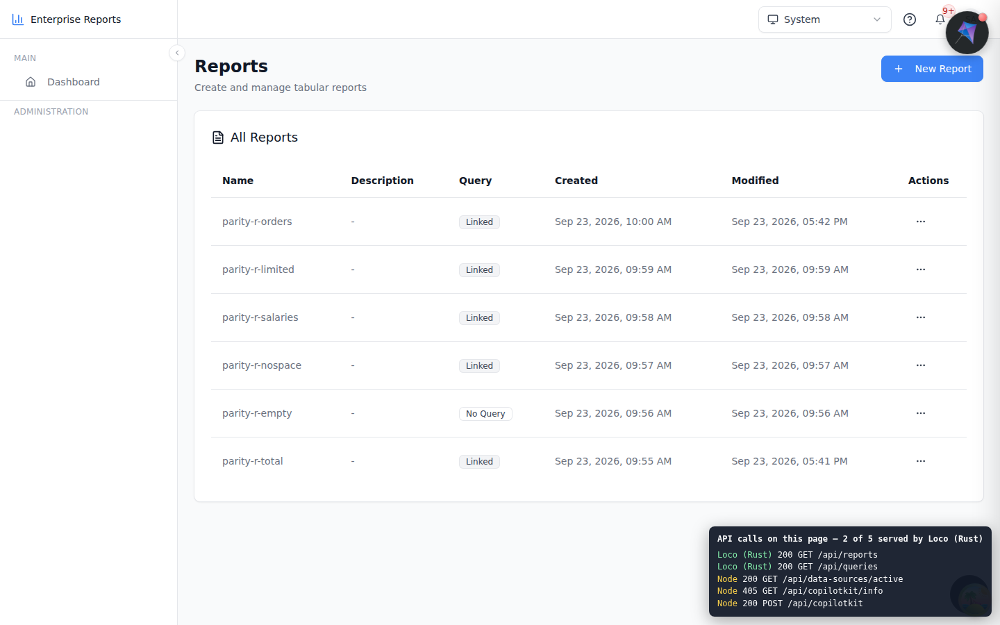
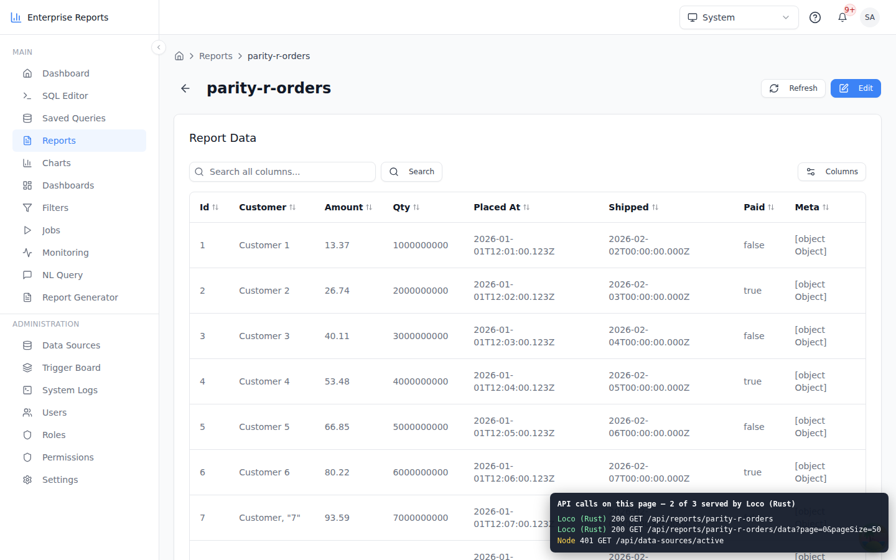
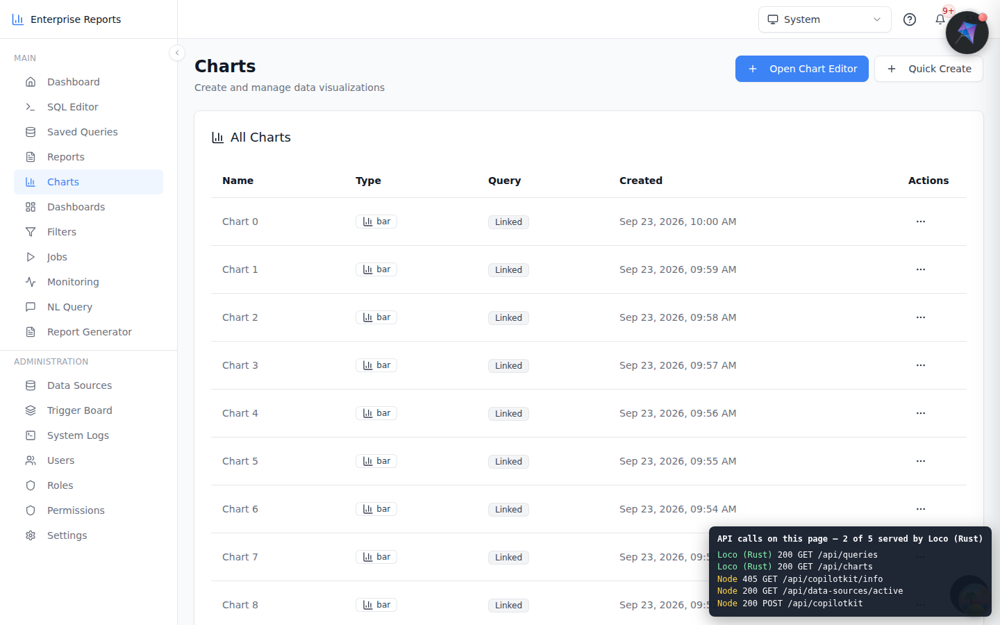
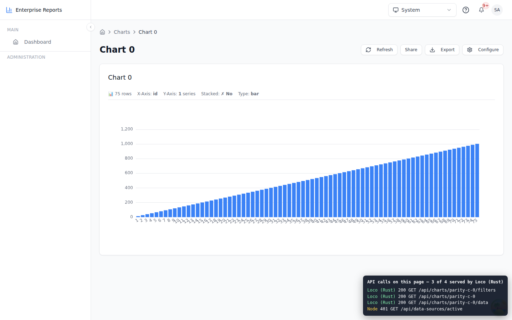
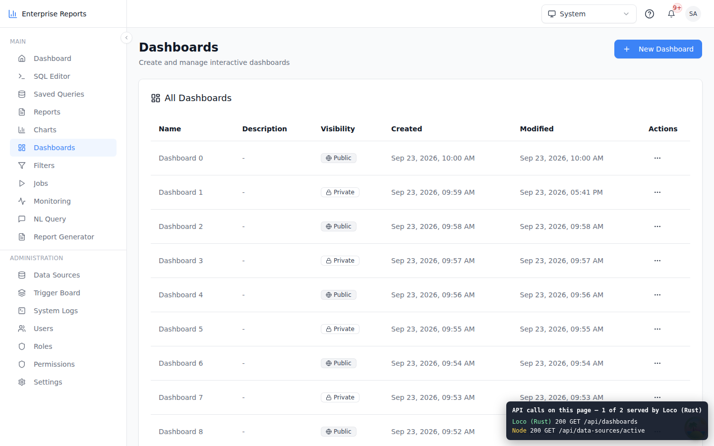
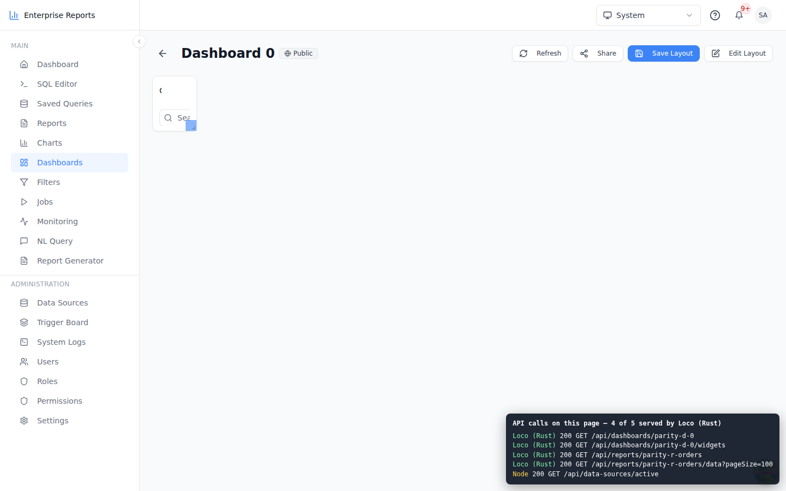
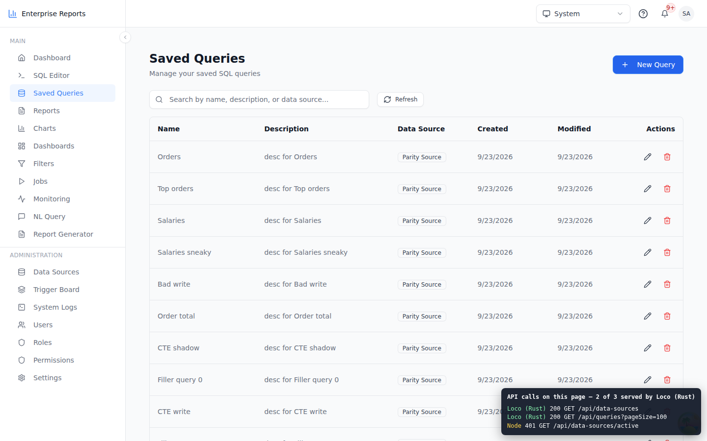
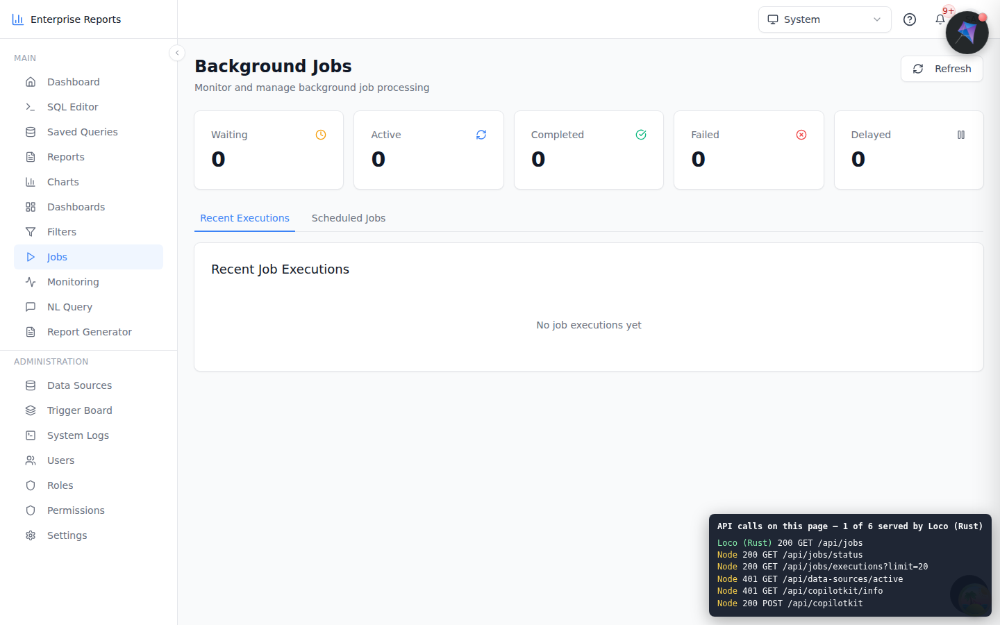
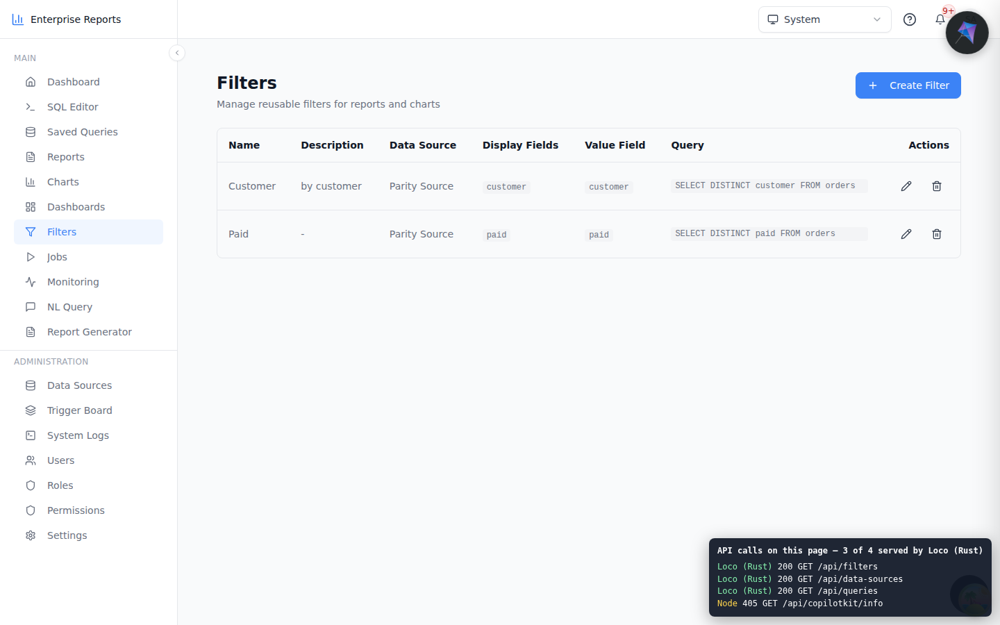
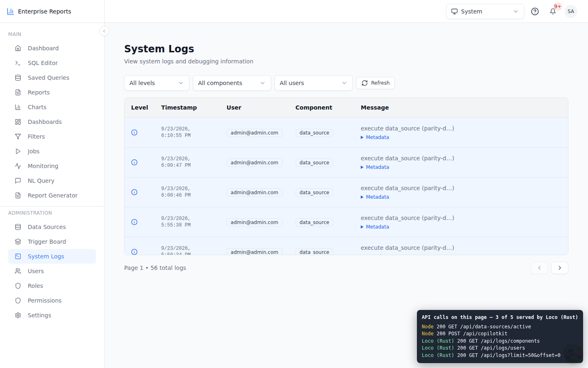

# The TanStack Start frontend on the Loco backend

These screenshots show the unmodified TanStack Start frontend running with its
API on the Loco (Rust) backend:

```bash
ERS_RUST_API_URL=http://localhost:5150 bun --bun vite dev
```

The dev proxy (`vite.config.ts`) sends every method and path listed in
[`rust/routes.json`](../routes.json) to Loco. Everything else stays on Node:
sign-in, the `/api/data-sources/active` lookup the shell makes on every page,
and the areas not ported yet (for example `/api/jobs/status`).

The box in the bottom-right corner of each screenshot is added by the capture
script, not by the application. It lists every `/api/*` call the page made and
which backend answered, read from the `x-ers-backend: loco-rs` header that
Loco adds to every response.

| Page | What Loco served |
|---|---|
|  Reports list | `GET /api/reports`, `GET /api/queries` |
|  Report viewer | the report, and a page of its rows from the user's database (`/api/reports/:id/data`). `int8`, `numeric`, timestamps and dates arrive typed as node-pg types them |
|  Charts list | `GET /api/charts`, `GET /api/queries` |
|  Chart viewer | the chart, its filters, and its 75 data rows |
|  Dashboards list | `GET /api/dashboards` |
|  Dashboard | the dashboard, its widgets, and the widget's report and data |
|  Saved queries | `GET /api/queries`, `GET /api/data-sources` |
|  Jobs | `GET /api/jobs`. The status and executions calls are still Node's (Phase 4) |
|  Filters | `GET /api/filters`, `GET /api/data-sources`, `GET /api/queries` |
|  System logs | `GET /api/logs`, `/api/logs/users`, `/api/logs/components` |

## Two things in these screenshots that are not Loco's

- **The dashboard widget renders collapsed.** It looks exactly the same with
  Node serving everything: see
  [`screenshots/node-only-07-dashboard-detail.png`](screenshots/node-only-07-dashboard-detail.png).
  The layout rows are identical from both backends (the parity cases compare
  them). The collapse is in the grid component (`react-grid-layout`'s
  `WidthProvider`), which is frontend work, not migration work.
- **A few Node calls show 401.** In some captures `/api/data-sources/active`
  (a Node route) answered 401. The Node log shows why: its Better Auth
  session lookup timed out getting a database connection (`Connection
  terminated due to connection timeout`, 5 s). This happens when the Node dev
  server stalls, which it does in this sandbox (it runs under
  `BUN_OPTIONS=--smol`). When a 401 hits the permission lookup, the sidebar
  shows only "Dashboard". Every call Loco answered returned 200.

The `node-only-*` screenshots are the same pages with `ERS_RUST_API_URL`
unset, for comparison.
