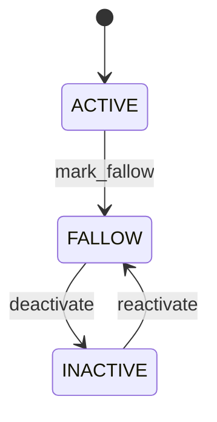

# Farm

Represents a agriculture entity called FarmField within the CEDM business model. FarmField is a business concept with its own identity and lifecycle. It captures information that must remain understandable independently of a database, API, or user interface. Used by business processes, transactions, forms, reports, integrations, and domain capabilities that create, find, change, or relate FarmField records. The entity participates in a wider business graph through relationships with Farm, Crop. These relationships provide the context needed to interpret the record rather than treating its fields as isolated database columns. The entity lifecycle is governed by its status, invariants, and related business processes. State changes must preserve the declared business meaning and relationships. A typical FarmField record represents one identifiable business occurrence or master-data object that can be referenced by related CEDM processes.

## Finding records

Lines are added from the parent: open a **Farm** and choose the **Farm** tab.

The list shows Field Code, Area, Area Unit, Soil Type, Status, Farm, with the most recently changed record first. The **Help** button beside the title opens this window's help text.

- **Search**: type in the search box above the grid to narrow the rows. **Search** at the top left opens advanced search, where you pick a field, a comparison (equals, contains, starts with, before, after, and so on) and a value.
- **Sort**: click a column heading; click again to reverse.
- **Refresh**: the refresh button at the top right re-reads the rows and every dropdown, so a record created a moment ago by someone else appears.
- **Export**: **CSV** downloads the rows you are looking at.
- **Open a record**: click a row. The line under the title, "Showing 1 to n of N entries", tells you how many rows match.

## Adding a line

Open the parent record, choose the **Farm** tab and use **New**. The line is tied to its parent automatically.

## Reading, changing and deleting a record

Click a row to open the record. Above the fields are the arrows that step through the list ("1 of 5"). Below them sit **Notes**, where anyone may leave a comment on the record, and the **Audit Trail**, which lists every change with who made it, when, and which fields changed.

- **Edit** (toolbar) makes the fields editable. Change them and choose **Save**; **Undo Changes** puts back what you changed and **Cancel Editing** leaves edit mode.
- **Copy Record** starts a new record from this one.
- **Delete Record** is available in edit mode and asks you to confirm; a record other records still depend on cannot be deleted.

Every change is also written to the [Audit Log](/administration/#audit-log).

## Fields

| Field | What you use | Rules | What to enter |
| --- | --- | --- | --- |
| Field Code | Text | Required, Up to 100 characters | Captures the business meaning of field code for the FarmField. It is interpreted together with the entity's other attributes and relationships to support the processes that manage this record. Used when creating, reviewing, searching, validating, reporting on, or integrating FarmField records, where applicable. Its meaning is specific to FarmField; it must be interpreted with the entity's relationships, lifecycle, and business rules rather than as an isolated technical value. Required because the business model cannot reliably interpret the record for its declared purpose without this value. |
| Area | Amount | Optional | Captures the business meaning of area for the FarmField. It is interpreted together with the entity's other attributes and relationships to support the processes that manage this record. Used when creating, reviewing, searching, validating, reporting on, or integrating FarmField records, where applicable. Its meaning is specific to FarmField; it must be interpreted with the entity's relationships, lifecycle, and business rules rather than as an isolated technical value. Optional because the business concept can remain valid when this value is not yet known or is not applicable. |
| Area Unit | Lookup | Optional | Identifies the related UnitOfMeasure associated with this FarmField. It provides the link needed to navigate from this record to the related business object. Used when creating, reviewing, searching, validating, reporting on, or integrating FarmField records, where applicable. This field connects FarmField to UnitOfMeasure. The reference establishes business context between the two entities and lets processes navigate from this record to the related UnitOfMeasure. Optional because the business concept can remain valid when this value is not yet known or is not applicable. Pick a record from **Unit Of Measure**. |
| Soil Type | Text | Up to 100 characters | Captures the business meaning of soil type for the FarmField. It is interpreted together with the entity's other attributes and relationships to support the processes that manage this record. Used when creating, reviewing, searching, validating, reporting on, or integrating FarmField records, where applicable. Its meaning is specific to FarmField; it must be interpreted with the entity's relationships, lifecycle, and business rules rather than as an isolated technical value. Optional because the business concept can remain valid when this value is not yet known or is not applicable. |
| Status | Choice | Required | The lifecycle state of the record. It controls which business actions are normally permitted and how the record is treated by related processes. Used when creating, reviewing, searching, validating, reporting on, or integrating FarmField records, where applicable. Its meaning is specific to FarmField; it must be interpreted with the entity's relationships, lifecycle, and business rules rather than as an isolated technical value. Represents the active state or classification in the context of FarmField. Represents the fallow state or classification in the context of FarmField. Represents the inactive state or classification in the context of FarmField. Required because the business model cannot reliably interpret the record for its declared purpose without this value. Choose one: Active, Fallow, Inactive. |
| Farm | Lookup | Required | Connects FarmField to Farm so related business context can be navigated and enforced. Used when processes need to find or reason about Farm records associated with a FarmField. The declared cardinality 1 expresses how many related records may participate in the relationship. The relationship is part of the CEDM semantic graph and is interpreted together with source and target entities, ownership, conditions, and invariants. Pick a record from **Farm**. |

## How it connects to other records

A farm is a line of a **Farm**. It has no window of its own: open the farm and use the **Farm** tab to see and add lines.
- A farm belongs to one **Farm**.
- A farm is linked to many **Crop** records.

## Lifecycle: Farm field lifecycle

A farm record starts as **Active**. Open a record and the bar above its fields shows its current **State** and, after **Next**, a button for each move that leaves it; choose one to make the move. Any move the diagram does not draw is refused, for everyone including the administrator.

| From | To | Move |
| --- | --- | --- |
| Active | Fallow | Mark fallow |
| Fallow | Inactive | Deactivate |
| Inactive | Fallow | Reactivate |

## Who may use it

Anyone who holds a role with access to the **Farm** window. Access is granted by role under [Roles and access](/administration/access/).
