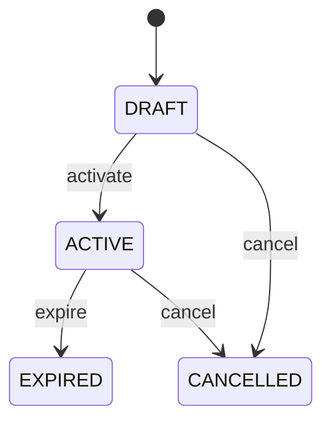

# Exchange Rate

Represents an auditable conversion rate between two currencies for a defined time and business purpose. ExchangeRate is the conversion context between Currency denominations; it is not itself money, a payment, or an accounting entry. Used by multi-currency orders, invoices, payments, payment allocations, bank reconciliation, accounting, consolidation, and financial reporting. Currency defines denominations. Money carries amount plus currency. ExchangeRate provides the conversion between two Money values. PaymentAllocation and accounting consume the rate when cross-currency conversion is permitted. Source Money + source Currency → select valid ExchangeRate by rate type/effective time/source → convert → target Money → preserve ExchangeRate reference and rounding result. The selected rate becomes historical evidence of the conversion decision. Rate is created or imported, activated for its validity window, expires or is cancelled, while historical transactions retain the original rate reference. A customer invoice is USD 1,000 and payment is EUR. An approved EUR-to-USD ExchangeRate is selected according to settlement policy. The Payment remains EUR, the Invoice remains USD, PaymentAllocation records the conversion context, and accounting retains the rate used rather than later recalculating the historical settlement.

## Finding records

Open **Exchange Rate** from the menu or from its card on the dashboard.

The list shows From Currency, To Currency, Rate, Rate Type, Effective At, Expires At, Source, with the most recently changed record first. The **Help** button beside the title opens this window's help text.

- **Search**: type in the search box above the grid to narrow the rows. **Search** at the top left opens advanced search, where you pick a field, a comparison (equals, contains, starts with, before, after, and so on) and a value.
- **Sort**: click a column heading; click again to reverse.
- **Refresh**: the refresh button at the top right re-reads the rows and every dropdown, so a record created a moment ago by someone else appears.
- **Export**: **CSV** downloads the rows you are looking at.
- **Open a record**: click a row. The line under the title, "Showing 1 to n of N entries", tells you how many rows match.

## Creating a record

Choose **New** at the top of the list. The form opens on its own page, with the fields in sections. A badge beside each label names the control (Text, Dropdown, Date, and so on); a red star marks a required field; the question-mark icon shows that field's help; and a hint such as “max 300” shows the longest entry accepted.

1. Fill in the fields described under [Fields](#fields).
2. These are required and must be completed before the record can be saved: **From Currency**, **To Currency**, **Rate**, **Rate Type**, **Effective At**, **Source**, **Status**.
3. For a dropdown that points at another window, pick the matching record; if the record you need does not exist yet, create it in its own window first. A dropdown may narrow to what you have already chosen, for example the states of the chosen country.
4. Choose **Create** (or **Save** in the toolbar). You return to the record, and it appears at the top of the list. If something is wrong the form says which field and why, and nothing is saved.

## Reading, changing and deleting a record

Click a row to open the record. Above the fields are the arrows that step through the list ("1 of 5"). Below them sit **Notes**, where anyone may leave a comment on the record, and the **Audit Trail**, which lists every change with who made it, when, and which fields changed.

- **Edit** (toolbar) makes the fields editable. Change them and choose **Save**; **Undo Changes** puts back what you changed and **Cancel Editing** leaves edit mode.
- **Copy Record** starts a new record from this one.
- **Delete Record** is available in edit mode and asks you to confirm; a record other records still depend on cannot be deleted.

Every change is also written to the [Audit Log](/administration/#audit-log).

## Fields

| Field | What you use | Rules | What to enter |
| --- | --- | --- | --- |
| From Currency | Lookup | Required | Currency from which an amount is converted. Identifies the source denomination of the monetary amount being converted. Must differ from toCurrency for a meaningful exchange-rate conversion. Identifies the currency of the source Money value in an explicit conversion. Required to prevent ambiguous conversion direction. Pick a record from **Currency**. |
| To Currency | Lookup | Required | Currency into which an amount is converted. Identifies the target denomination of the converted monetary amount. Conversion direction is from fromCurrency to toCurrency; reversing the direction requires an appropriate inverse rate rather than assuming arithmetic equivalence. Identifies the currency of the resulting Money value. Required for an auditable conversion. Pick a record from **Currency**. |
| Rate | Amount | Required | Positive conversion factor that expresses how much target currency corresponds to one unit of source currency under this rate convention. Used to calculate converted monetary amounts while preserving the declared direction. Must always be interpreted with fromCurrency, toCurrency, effectiveAt, and rateType. Supplies the mathematical conversion input used by settlement and accounting calculations. Required for conversion. |
| Rate Type | Choice | Required | Classifies the business purpose and provenance context of the exchange rate. Used to select an appropriate rate according to transaction and accounting policy. Different workflows may require different rate types; a spot rate must not automatically replace a contractual or accounting rate. Controls which rate is eligible for a conversion event. Market or transaction-time conversion rate. Rate established by an agreement or commercial contract. Published daily rate for a defined business date. Published rate intended for a defined monthly reporting period. Rate designated by accounting policy for ledger translation or reporting. Controlled rate established for a specific business purpose. Required to preserve conversion context. Choose one: Spot, Contract, Daily, Monthly, Accounting, Custom. |
| Effective At | Date and time | Required | Date and time from which the exchange rate is applicable under its rate policy. Used to select the correct rate for a transaction, settlement, or accounting event. A rate without an effective time cannot be reliably reproduced when rates change over time. Supports deterministic selection and audit of the rate used by PaymentAllocation and accounting conversion. Required for temporal validity. |
| Expires At | Date and time | Optional | Optional end of the period during which the rate is valid. Used to prevent application of expired rates. When supplied, expiresAt must be later than effectiveAt. Defines the rate's validity window for transaction and reporting calculations. Optional for rates whose validity is governed by another period convention. |
| Source | Text | Required, Up to 200 characters | Identifies the provider or business authority from which the rate was obtained. Used for audit, reconciliation, regulatory reporting, and rate governance. Source identifies provenance; it does not by itself determine which rate is applicable. Allows users and systems to reproduce or validate the conversion decision. Required for financial traceability. |
| Status | Choice | Required | Lifecycle state of the exchange-rate record. Used by conversion services to determine whether a rate may be applied. Historical calculations retain the rate record even after it expires. Prevents use of draft, cancelled, or expired rates where policy does not permit them. Required for controlled rate selection. The status of the exchange rate is draft; set it when that is what the business means for this record. The status of the exchange rate is active; set it when that is what the business means for this record. The status of the exchange rate is expired; set it when that is what the business means for this record. The status of the exchange rate is cancelled; set it when that is what the business means for this record. Choose one: Draft, Active, Expired, Cancelled. |

## How it connects to other records
- A exchange rate belongs to one **Currency**.

## Lifecycle: Exchange rate lifecycle

A exchange rate record starts as **Draft** and ends as **Expired** or **Cancelled**. Open a record and the bar above its fields shows its current **State** and, after **Next**, a button for each move that leaves it; choose one to make the move. Any move the diagram does not draw is refused, for everyone including the administrator.

| From | To | Move |
| --- | --- | --- |
| Draft | Active | Activate |
| Active | Expired | Expire |
| Draft | Cancelled | Cancel |
| Active | Cancelled | Cancel |

## What happens when you save
Business rules run around the save. They are listed here and explained in full under [Business rules](/administration/rules/).

| Rule | When | Order |
| --- | --- | --- |
| Exchange rate invariants before create | before a exchange rate is created | 100 |
| Exchange rate invariants before update | before a exchange rate is changed | 100 |
| Exchange rate workflows after update | after a exchange rate is changed | 100 |

Processes started from this record: [Exchange rate follow up required](/administration/processes/#exchange-rate-follow-up-required).

## Who may use it

Anyone who holds a role with access to the **Exchange Rate** window. Access is granted by role under [Roles and access](/administration/access/).
