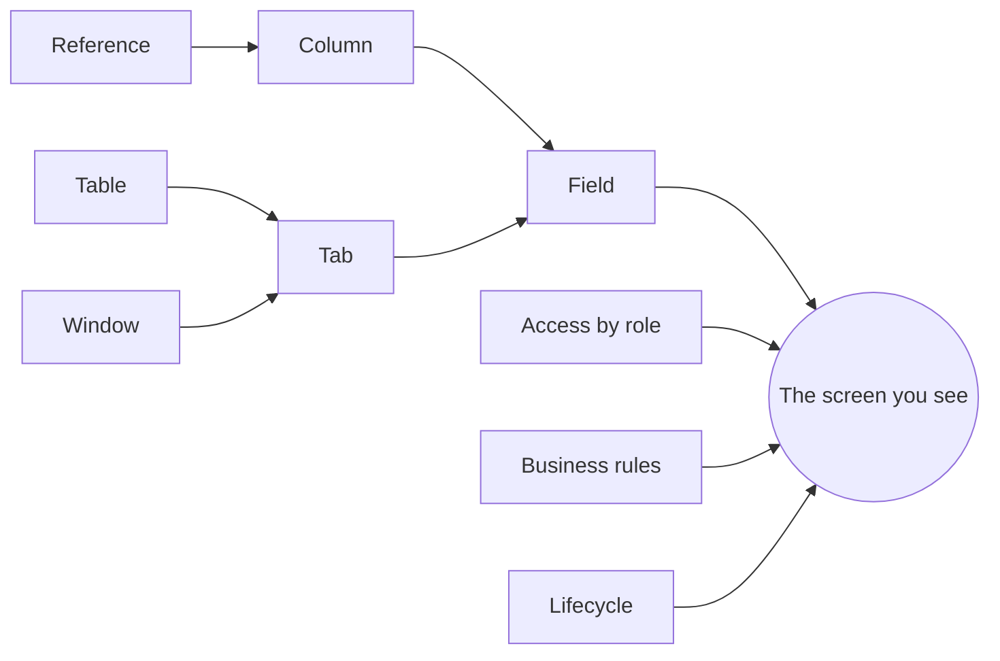

# The Application Dictionary

Every application generated from a CEDM model is **described by a dictionary, and drawn from it**. The menu you click, the card on the dashboard, the columns in a list, the fields on a form, their labels and their help text, which dropdown a field uses, who may open a window, and which lifecycle a record follows are all rows in the Application Dictionary, read when you open a screen. Change a row and the screen changes on the next request: no rebuild, no redeploy.

This manual is common to every application. It explains the dictionary and **every administrator window** that edits it, with the same screens you will see in your own application. Each application's own manual (its entities, forms, fields, lifecycles and rules) is a separate site and links back here.

## Who this is for

- **Administrators** who set up access, adjust screens, maintain the lists behind dropdowns and review what changed.
- **Business analysts** who write business rules, build automations and design processes.
- **Developers** who need to know which part of a screen comes from the model and which from the dictionary.

## What you will find

| Part | What it covers |
| --- | --- |
| [Concepts](concepts.md) | The vocabulary: tables, columns, windows, tabs, fields, references, categories, access, rules, processes. |
| [Getting started](getting-started.md) | Signing in, finding the administrator windows, the controls every window shares. |
| **Administrator windows** | One page per window: what it is for, every control, every field, cautions. |
| **How to** | Task recipes: add a field, reorder a form, create a table and its window, create a dropdown list, write a rule, build an automation, read the audit trail. |
| [What the screens apply today](what-is-applied.md) | Which dictionary settings change a screen now and which are recorded for later. |

## How a screen is made

A **window** has one or more **tabs**; each tab shows one **table**; each **field** on the tab shows one **column**. A column's **reference** says what kind of control it needs. **Access** says who may open the window. **Rules** and **lifecycles** decide what a save does. Everything else on the screen is these rows, rendered.

## Two rules to remember

1. **The dictionary describes the data; it is not the data.** Anyone can read it, because the menu is built from it before sign-in. Only an administrator may change it.
2. **A change applies to everyone, at once.** Test a change in a window you can undo before you rely on it. Record changes are written to the [Audit Log](windows/audit.md).
