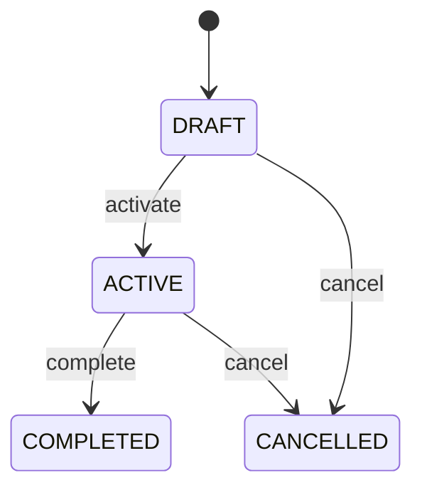

# AI Policy

Represents AIPolicy as a first-class governed CEDM business concept. A governed policy defining constraints, approvals, controls, and permitted use for AI models and predictions. Domain workflows, validation, reporting, audit, integration, and cross-entity traceability. AIModel supplies the primary governing context; dependent workflows consume this record without silently mutating historical evidence. Draft → active → completed, with controlled cancellation and correction paths. Material changes revalidate open dependent workflows and preserve completed historical evidence. A AIPolicy is created for a valid AIModel, progresses through its governed lifecycle, and remains traceable after completion.

## Finding records

Open **AI Policy** from the menu or from its card on the dashboard.

The list shows A I Policy Code, Status, Context, with the most recently changed record first. The **Help** button beside the title opens this window's help text.

- **Search**: type in the search box above the grid to narrow the rows. **Search** at the top left opens advanced search, where you pick a field, a comparison (equals, contains, starts with, before, after, and so on) and a value.
- **Sort**: click a column heading; click again to reverse.
- **Refresh**: the refresh button at the top right re-reads the rows and every dropdown, so a record created a moment ago by someone else appears.
- **Export**: **CSV** downloads the rows you are looking at.
- **Open a record**: click a row. The line under the title, "Showing 1 to n of N entries", tells you how many rows match.

## Creating a record

Choose **New** at the top of the list. The form opens on its own page, with the fields in sections. A badge beside each label names the control (Text, Dropdown, Date, and so on); a red star marks a required field; the question-mark icon shows that field's help; and a hint such as “max 300” shows the longest entry accepted.

1. Fill in the fields described under [Fields](#fields).
2. These are required and must be completed before the record can be saved: **A I Policy Code**, **Status**, **Context**.
3. For a dropdown that points at another window, pick the matching record; if the record you need does not exist yet, create it in its own window first. A dropdown may narrow to what you have already chosen, for example the states of the chosen country.
4. Choose **Create** (or **Save** in the toolbar). You return to the record, and it appears at the top of the list. If something is wrong the form says which field and why, and nothing is saved.

## Reading, changing and deleting a record

Click a row to open the record. Above the fields are the arrows that step through the list ("1 of 5"). Below them sit **Notes**, where anyone may leave a comment on the record, and the **Audit Trail**, which lists every change with who made it, when, and which fields changed.

- **Edit** (toolbar) makes the fields editable. Change them and choose **Save**; **Undo Changes** puts back what you changed and **Cancel Editing** leaves edit mode.
- **Copy Record** starts a new record from this one.
- **Delete Record** is available in edit mode and asks you to confirm; a record other records still depend on cannot be deleted.

Every change is also written to the [Audit Log](/administration/#audit-log).

## Fields

| Field | What you use | Rules | What to enter |
| --- | --- | --- | --- |
| A I Policy Code | Text | Required, Unique, Up to 120 characters | Human-readable business reference for the AIPolicy. Provides an operational identifier for searching, documents, reports, and integrations. Creation, review, search, workflow, reporting, and audit. Distinct from the immutable UUID identity and scoped to the governed business context. Required for operational identification. |
| Status | Choice | Required | Lifecycle state of the AIPolicy. Controls whether the record is being prepared, operationally active, historically complete, or cancelled. Workflow gating, governance, reporting, and audit. Status changes can affect related AIModel workflows but never erase historical evidence. Record is being prepared and is not yet normally effective. Record is effective for its governed business purpose. Governed work or assessment is complete and retained as historical evidence. Record was cancelled through controlled workflow and remains auditable. Required for lifecycle governance. Choose one: Draft, Active, Completed, Cancelled. |
| Context | Lookup | Required | Governing AIModel associated with this AIPolicy. Supplies the business context needed to interpret and validate the record. Workflow navigation, validation, traceability, reporting, and audit. Every AIPolicy belongs to exactly one governing AIModel in this baseline model. Changes to the governing record require revalidation of open dependent records while completed evidence remains historical. Pick a record from **AI Model**. |

## How it connects to other records
- A ai policy has one **AI Model**.

## Lifecycle: Ai policy lifecycle

A ai policy record starts as **Draft** and ends as **Completed** or **Cancelled**. Open a record and the bar above its fields shows its current **State** and, after **Next**, a button for each move that leaves it; choose one to make the move. Any move the diagram does not draw is refused, for everyone including the administrator.

| From | To | Move |
| --- | --- | --- |
| Draft | Active | Activate |
| Active | Completed | Complete |
| Draft | Cancelled | Cancel |
| Active | Cancelled | Cancel |

## What happens when you save
Business rules run around the save. They are listed here and explained in full under [Business rules](/administration/rules/).

| Rule | When | Order |
| --- | --- | --- |
| A i policy workflows after update | after a ai policy is changed | 100 |

Processes started from this record: [Ai policy follow up required](/administration/processes/#aipolicy-follow-up-required).

## Who may use it

Anyone who holds a role with access to the **AI Policy** window. Access is granted by role under [Roles and access](/administration/access/).
