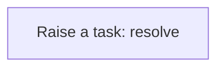
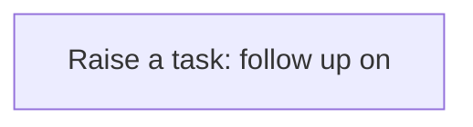
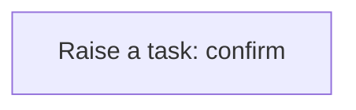

# Processes

A process is a sequence of steps the application runs for you: create a task, update a record, call a service. A business rule usually starts it; you can also run one by hand from the Workflow Designer. Every run is logged step by step in the Workflow Monitor. This application has **8** processes.

## Party exception raised {#party-exception-raised}

When a party is blocked, a high-priority task asks someone to resolve it.

Runs when a **Party** is changed, started by a business rule.

1. **Raise a task: resolve** — creates a **Task** record.

## Exchange rate follow up required {#exchange-rate-follow-up-required}

When a exchange rate is cancelled, a task asks someone to settle what depended on it.

Runs when a **Exchange Rate** is changed, started by a business rule.

1. **Raise a task: follow up on** — creates a **Task** record.

## Bank account exception raised {#bank-account-exception-raised}

When a bank account is blocked, a high-priority task asks someone to resolve it.

Runs when a **Bank Account** is changed, started by a business rule.

1. **Raise a task: resolve** — creates a **Task** record.

## Bank transaction exception raised {#bank-transaction-exception-raised}

When a bank transaction is failed, a high-priority task asks someone to resolve it.

Runs when a **Bank Transaction** is changed, started by a business rule.

1. **Raise a task: resolve** — creates a **Task** record.

## Bank transaction follow up required {#bank-transaction-follow-up-required}

When a bank transaction is reversed, a task asks someone to settle what depended on it.

Runs when a **Bank Transaction** is changed, started by a business rule.

1. **Raise a task: follow up on** — creates a **Task** record.

## Bank loan follow up required {#bank-loan-follow-up-required}

When a bank loan is cancelled, a task asks someone to settle what depended on it.

Runs when a **Bank Loan** is changed, started by a business rule.

1. **Raise a task: follow up on** — creates a **Task** record.

## Credit follow up required {#credit-follow-up-required}

When a credit is cancelled, a task asks someone to settle what depended on it.

Runs when a **Credit** is changed, started by a business rule.

1. **Raise a task: follow up on** — creates a **Task** record.

## Credit completion confirmed {#credit-completion-confirmed}

When a credit is completed, a task asks someone to confirm the outcome.

Runs when a **Credit** is changed, started by a business rule.

1. **Raise a task: confirm** — creates a **Task** record.

