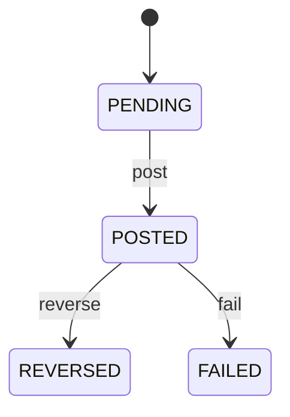

# Bank Transaction

Represents external financial-institution evidence of a bank-side movement while keeping reconciliation, internal payment, and accounting meaning separate. BankTransaction says what the bank reported. Payment says what the organization recognized as a payment. PaymentAllocation says how payment is applied to claims. JournalEntry says how the event is recognized in accounting. Central to treasury, bank-feed ingestion, accounts receivable, accounts payable, cash management, reconciliation, audit, fee processing, and accounting. BankAccount provides the statement account. BankTransaction provides external evidence. Payment is the internal settlement event. PaymentAllocation connects settlement to claims. JournalEntry records accounting consequences. Bank statement import → validate source → deduplicate → classify → candidate match Payment → validate account/date/currency/amount/reference → reconcile → Payment may become CLEARED → Invoice settlement remains driven by active PaymentAllocation. Unmatched items remain reconciliation exceptions. Imported/pending → posted → reconciled through a Payment or other accounting treatment; reversal/failure paths remain explicit. Historical statement evidence is retained and corrected through reconciliation events rather than rewriting the source transaction. A bank statement imports a USD 10,000 credit. The system matches it to a USD 10,000 Payment using account, date, currency, amount, and remittance reference. The BankTransaction remains independent evidence, the Payment becomes CLEARED, and its PaymentAllocations settle the applicable invoices. A separate USD 25 bank fee is recorded as bank-side fee evidence and accounting treatment rather than silently reducing the Payment.

## Finding records

Open **Bank Transaction** from the menu or from its card on the dashboard.

The list shows Transaction Number, Transaction Date, Value Date, Transaction Type, Amount, Status, Reference, with the most recently changed record first. The **Help** button beside the title opens this window's help text.

- **Search**: type in the search box above the grid to narrow the rows. **Search** at the top left opens advanced search, where you pick a field, a comparison (equals, contains, starts with, before, after, and so on) and a value.
- **Sort**: click a column heading; click again to reverse.
- **Refresh**: the refresh button at the top right re-reads the rows and every dropdown, so a record created a moment ago by someone else appears.
- **Export**: **CSV** downloads the rows you are looking at.
- **Open a record**: click a row. The line under the title, "Showing 1 to n of N entries", tells you how many rows match.

## Creating a record

Choose **New** at the top of the list. The form opens on its own page, with the fields in sections. A badge beside each label names the control (Text, Dropdown, Date, and so on); a red star marks a required field; the question-mark icon shows that field's help; and a hint such as “max 300” shows the longest entry accepted.

1. Fill in the fields described under [Fields](#fields).
2. These are required and must be completed before the record can be saved: **Transaction Number**, **Transaction Date**, **Transaction Type**, **Amount**, **Status**, **Account**.
3. For a dropdown that points at another window, pick the matching record; if the record you need does not exist yet, create it in its own window first. A dropdown may narrow to what you have already chosen, for example the states of the chosen country.
4. Choose **Create** (or **Save** in the toolbar). You return to the record, and it appears at the top of the list. If something is wrong the form says which field and why, and nothing is saved.

## Reading, changing and deleting a record

Click a row to open the record. Above the fields are the arrows that step through the list ("1 of 5"). Below them sit **Notes**, where anyone may leave a comment on the record, and the **Audit Trail**, which lists every change with who made it, when, and which fields changed.

- **Edit** (toolbar) makes the fields editable. Change them and choose **Save**; **Undo Changes** puts back what you changed and **Cancel Editing** leaves edit mode.
- **Copy Record** starts a new record from this one.
- **Delete Record** is available in edit mode and asks you to confirm; a record other records still depend on cannot be deleted.

Every change is also written to the [Audit Log](/administration/#audit-log).

## Fields

| Field | What you use | Rules | What to enter |
| --- | --- | --- | --- |
| Transaction Number | Text | Required, Unique, Up to 150 characters | Bank or internally assigned business reference for the statement transaction. Used for search, duplicate detection, reconciliation, investigation, and bank-feed integration. Must not be assumed to equal Payment.paymentNumber. Provides a primary external reference for candidate matching. Required for operational traceability. |
| Transaction Date | Date and time | Required | Timestamp supplied by the bank or statement source for the transaction. Supports statement chronology, reconciliation windows, cash reporting, and investigation. May differ from Payment.paymentDate, Payment.valueDate, accounting posting date, and clearing date. Provides external chronology used in matching and period analysis. Required for bank evidence chronology. |
| Value Date | Date | Optional | Bank-provided economic value date for the transaction. Supports cash availability, interest, treasury analysis, reconciliation, and accounting interpretation. Separate from transactionDate because a bank may record and value a transaction on different dates. Provides bank-side settlement timing context. Optional where the bank source does not provide a distinct value date. |
| Transaction Type | Choice | Required | Classification of the movement reported by the financial institution. Supports matching, cash classification, fee handling, transfer processing, and reconciliation. Bank classification does not by itself determine internal accounting meaning. Helps identify whether evidence is a candidate Payment, fee, transfer, interest, or reversal. Required for reconciliation interpretation. The transaction type of the bank transaction is credit; set it when that is what the business means for this record. The transaction type of the bank transaction is debit; set it when that is what the business means for this record. The transaction type of the bank transaction is transfer; set it when that is what the business means for this record. The transaction type of the bank transaction is fee; set it when that is what the business means for this record. The transaction type of the bank transaction is interest; set it when that is what the business means for this record. The transaction type of the bank transaction is reversal; set it when that is what the business means for this record. The transaction type of the bank transaction is other; set it when that is what the business means for this record. Choose one: Credit, Debit, Transfer, Fee, Interest, Reversal, Other. |
| Amount | Amount | Required | Monetary value reported by the bank for this transaction. Used for matching, reconciliation, cash reporting, fee analysis, and accounting comparison. Currency is intrinsic to Money; direct comparison with Payment.amount is permitted only when currencies and applicable amount semantics match. Provides bank-side monetary evidence used to validate Payment clearing. Required for financial reconciliation. |
| Status | Choice | Required | Lifecycle state of the bank-reported transaction. Controls whether the transaction is eligible as external settlement evidence. Independent from Payment status and JournalEntry status. POSTED evidence can normally support reconciliation; REVERSED evidence must trigger corresponding correction handling. Required for evidence lifecycle control. The status of the bank transaction is pending; set it when that is what the business means for this record. The status of the bank transaction is posted; set it when that is what the business means for this record. The status of the bank transaction is reversed; set it when that is what the business means for this record. The status of the bank transaction is failed; set it when that is what the business means for this record. Choose one: Pending, Posted, Reversed, Failed. |
| Reference | Text | Up to 250 characters | Bank-provided remittance or transaction reference used to identify the underlying business event. Supports automatic and manual matching to Payment, Invoice, customer remittance, or supplier payment. It is a matching signal, not definitive proof without reconciliation controls. Provides high-value matching evidence. Optional when the bank supplies no usable reference. |
| Description | Text | Up to 1000 characters | Bank-provided narrative or transaction description. Supports reconciliation, exception investigation, and manual matching. Descriptive evidence may be incomplete or ambiguous and must not override controlled matching rules. Provides secondary matching and investigation context. Optional depending on bank feed quality. |
| External Reference | Text | Up to 250 characters | Unique processor, bank, statement-line, or gateway identifier supplied by the external source. Supports idempotent imports and duplicate detection across statement retrievals. External reference is evidence metadata and does not replace bankTransactionId. Prevents duplicate ingestion of the same external transaction. Optional where the source provides no stable external identifier. |
| Currency | Lookup | Optional | The Currency this BankTransaction belongs to. Pick a record from **Currency**. |
| Account | Lookup | Required | Bank account whose statement contains the transaction. Establishes cash-account context and reconciliation scope. Exactly one account is the source context for each BankTransaction. Matching is performed within the account and statement context. Pick a record from **Bank Account**. |
| Counterparty | Lookup | Optional | Bank-reported counterparty when identifiable. Supports candidate matching, sanctions/compliance workflows where applicable, and investigation. Optional because bank evidence may omit or obscure counterparty identity. Provides supporting evidence for Payment matching, not definitive internal party identity. Pick a record from **Party**. |
| Bank Reconciliation | Lookup | Optional | The BankReconciliation this BankTransaction belongs to. Pick a record from **Bank Reconciliation**. |

## How it connects to other records
- A bank transaction belongs to one **Currency**.
- A bank transaction belongs to one **Bank Account**.
- A bank transaction belongs to one **Party**.
- A bank transaction belongs to one **Bank Reconciliation**.

## Lifecycle: Bank transaction lifecycle

A bank transaction record starts as **Pending** and ends as **Reversed** or **Failed**. Open a record and the bar above its fields shows its current **State** and, after **Next**, a button for each move that leaves it; choose one to make the move. Any move the diagram does not draw is refused, for everyone including the administrator.

| From | To | Move |
| --- | --- | --- |
| Pending | Posted | Post |
| Posted | Reversed | Reverse |
| Posted | Failed | Fail |

## What happens when you save
Business rules run around the save. They are listed here and explained in full under [Business rules](/administration/rules/).

| Rule | When | Order |
| --- | --- | --- |
| Bank transaction workflows after update | after a bank transaction is changed | 100 |

Processes started from this record: [Bank transaction exception raised](/administration/processes/#bank-transaction-exception-raised), [Bank transaction follow up required](/administration/processes/#bank-transaction-follow-up-required).

## Who may use it

Anyone who holds a role with access to the **Bank Transaction** window. Access is granted by role under [Roles and access](/administration/access/).
