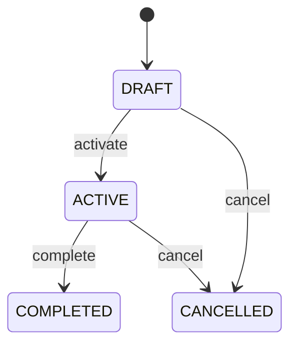

# Risk

Represents RiskTreatment as a first-class governed CEDM business concept. A governed treatment or response planned and executed to modify, accept, transfer, avoid, or monitor a Risk. Domain workflows, validation, reporting, audit, integration, and cross-entity traceability. Risk supplies the primary governing context; dependent workflows consume this record without silently mutating historical evidence. Draft → active → completed, with controlled cancellation and correction paths. Material changes revalidate open dependent workflows and preserve completed historical evidence. A RiskTreatment is created for a valid Risk, progresses through its governed lifecycle, and remains traceable after completion.

## Finding records

Lines are added from the parent: open a **Risk** and choose the **Risk** tab.

The list shows Risk Treatment Code, Status, Context, with the most recently changed record first. The **Help** button beside the title opens this window's help text.

- **Search**: type in the search box above the grid to narrow the rows. **Search** at the top left opens advanced search, where you pick a field, a comparison (equals, contains, starts with, before, after, and so on) and a value.
- **Sort**: click a column heading; click again to reverse.
- **Refresh**: the refresh button at the top right re-reads the rows and every dropdown, so a record created a moment ago by someone else appears.
- **Export**: **CSV** downloads the rows you are looking at.
- **Open a record**: click a row. The line under the title, "Showing 1 to n of N entries", tells you how many rows match.

## Adding a line

Open the parent record, choose the **Risk** tab and use **New**. The line is tied to its parent automatically.

## Reading, changing and deleting a record

Click a row to open the record. Above the fields are the arrows that step through the list ("1 of 5"). Below them sit **Notes**, where anyone may leave a comment on the record, and the **Audit Trail**, which lists every change with who made it, when, and which fields changed.

- **Edit** (toolbar) makes the fields editable. Change them and choose **Save**; **Undo Changes** puts back what you changed and **Cancel Editing** leaves edit mode.
- **Copy Record** starts a new record from this one.
- **Delete Record** is available in edit mode and asks you to confirm; a record other records still depend on cannot be deleted.

Every change is also written to the [Audit Log](/administration/#audit-log).

## Fields

| Field | What you use | Rules | What to enter |
| --- | --- | --- | --- |
| Risk Treatment Code | Text | Required, Unique, Up to 120 characters | Human-readable business reference for the RiskTreatment. Provides an operational identifier for searching, documents, reports, and integrations. Creation, review, search, workflow, reporting, and audit. Distinct from the immutable UUID identity and scoped to the governed business context. Required for operational identification. |
| Status | Choice | Required | Lifecycle state of the RiskTreatment. Controls whether the record is being prepared, operationally active, historically complete, or cancelled. Workflow gating, governance, reporting, and audit. Status changes can affect related Risk workflows but never erase historical evidence. Record is being prepared and is not yet normally effective. Record is effective for its governed business purpose. Governed work or assessment is complete and retained as historical evidence. Record was cancelled through controlled workflow and remains auditable. Required for lifecycle governance. Choose one: Draft, Active, Completed, Cancelled. |
| Context | Lookup | Required | Governing Risk associated with this RiskTreatment. Supplies the business context needed to interpret and validate the record. Workflow navigation, validation, traceability, reporting, and audit. Every RiskTreatment belongs to exactly one governing Risk in this baseline model. Changes to the governing record require revalidation of open dependent records while completed evidence remains historical. Pick a record from **Risk**. |

## How it connects to other records

A risk is a line of a **Risk**. It has no window of its own: open the risk and use the **Risk** tab to see and add lines.
- A risk belongs to one **Risk**.

## Lifecycle: Risk treatment lifecycle

A risk record starts as **Draft** and ends as **Completed** or **Cancelled**. Open a record and the bar above its fields shows its current **State** and, after **Next**, a button for each move that leaves it; choose one to make the move. Any move the diagram does not draw is refused, for everyone including the administrator.

| From | To | Move |
| --- | --- | --- |
| Draft | Active | Activate |
| Active | Completed | Complete |
| Draft | Cancelled | Cancel |
| Active | Cancelled | Cancel |

## What happens when you save
Business rules run around the save. They are listed here and explained in full under [Business rules](/administration/rules/).

| Rule | When | Order |
| --- | --- | --- |
| Risk treatment workflows after update | after a risk is changed | 100 |

Processes started from this record: [Risk treatment follow up required](/administration/processes/#risk-treatment-follow-up-required).

## Who may use it

Anyone who holds a role with access to the **Risk** window. Access is granted by role under [Roles and access](/administration/access/).
