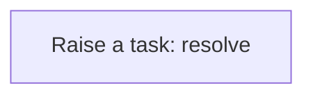
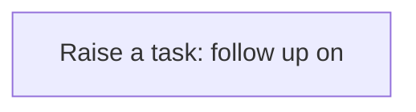

# Processes

A process is a sequence of steps the application runs for you: create a task, update a record, call a service. A business rule usually starts it; you can also run one by hand from the Workflow Designer. Every run is logged step by step in the Workflow Monitor. This application has **5** processes.

## Party exception raised {#party-exception-raised}

When a party is blocked, a high-priority task asks someone to resolve it.

Runs when a **Party** is changed, started by a business rule.

1. **Raise a task: resolve** — creates a **Task** record.

## Exchange rate follow up required {#exchange-rate-follow-up-required}

When a exchange rate is cancelled, a task asks someone to settle what depended on it.

Runs when a **Exchange Rate** is changed, started by a business rule.

1. **Raise a task: follow up on** — creates a **Task** record.

## Construction project follow up required {#construction-project-follow-up-required}

When a construction project is cancelled, a task asks someone to settle what depended on it.

Runs when a **Construction Project** is changed, started by a business rule.

1. **Raise a task: follow up on** — creates a **Task** record.

## Project exception raised {#project-exception-raised}

When a project is on hold, a high-priority task asks someone to resolve it.

Runs when a **Project** is changed, started by a business rule.

1. **Raise a task: resolve** — creates a **Task** record.

## Project follow up required {#project-follow-up-required}

When a project is cancelled, a task asks someone to settle what depended on it.

Runs when a **Project** is changed, started by a business rule.

1. **Raise a task: follow up on** — creates a **Task** record.

