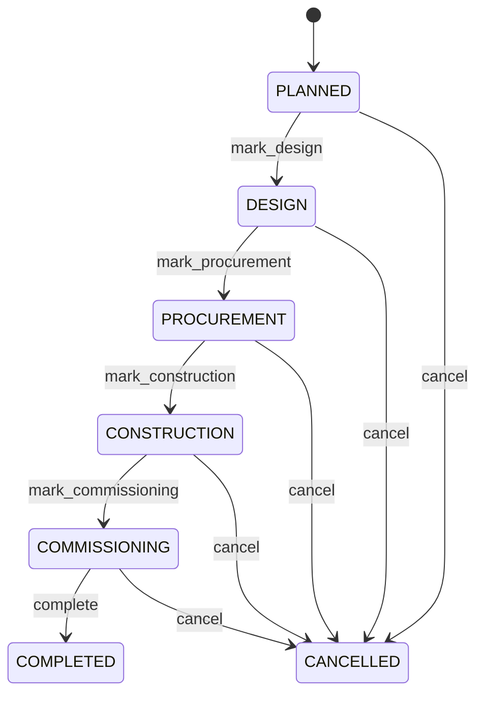

# Construction Project

Represents a construction entity called ConstructionProject within the CEDM business model. ConstructionProject is a business concept with its own identity and lifecycle. It captures information that must remain understandable independently of a database, API, or user interface. Used by business processes, transactions, forms, reports, integrations, and domain capabilities that create, find, change, or relate ConstructionProject records. The entity participates in a wider business graph through relationships with Project, Location, Contract, Asset. These relationships provide the context needed to interpret the record rather than treating its fields as isolated database columns. The entity lifecycle is governed by its status, invariants, and related business processes. State changes must preserve the declared business meaning and relationships. A typical ConstructionProject record represents one identifiable business occurrence or master-data object that can be referenced by related CEDM processes.

## Finding records

Open **Construction Project** from the menu or from its card on the dashboard.

The list shows Project, Project Type, Site Condition, Status, Project Code, Name, Description, with the most recently changed record first. The **Help** button beside the title opens this window's help text.

- **Search**: type in the search box above the grid to narrow the rows. **Search** at the top left opens advanced search, where you pick a field, a comparison (equals, contains, starts with, before, after, and so on) and a value.
- **Sort**: click a column heading; click again to reverse.
- **Refresh**: the refresh button at the top right re-reads the rows and every dropdown, so a record created a moment ago by someone else appears.
- **Export**: **CSV** downloads the rows you are looking at.
- **Open a record**: click a row. The line under the title, "Showing 1 to n of N entries", tells you how many rows match.

## Creating a record

Choose **New** at the top of the list. The form opens on its own page, with the fields in sections. A badge beside each label names the control (Text, Dropdown, Date, and so on); a red star marks a required field; the question-mark icon shows that field's help; and a hint such as “max 300” shows the longest entry accepted.

1. Fill in the fields described under [Fields](#fields).
2. These are required and must be completed before the record can be saved: **Project**, **Project Type**, **Status**, **Project Code**, **Name**.
3. For a dropdown that points at another window, pick the matching record; if the record you need does not exist yet, create it in its own window first. A dropdown may narrow to what you have already chosen, for example the states of the chosen country.
4. Choose **Create** (or **Save** in the toolbar). You return to the record, and it appears at the top of the list. If something is wrong the form says which field and why, and nothing is saved.

## Reading, changing and deleting a record

Click a row to open the record. Above the fields are the arrows that step through the list ("1 of 5"). Below them sit **Notes**, where anyone may leave a comment on the record, and the **Audit Trail**, which lists every change with who made it, when, and which fields changed.

- **Edit** (toolbar) makes the fields editable. Change them and choose **Save**; **Undo Changes** puts back what you changed and **Cancel Editing** leaves edit mode.
- **Copy Record** starts a new record from this one.
- **Delete Record** is available in edit mode and asks you to confirm; a record other records still depend on cannot be deleted.

Every change is also written to the [Audit Log](/administration/#audit-log).

## Fields

| Field | What you use | Rules | What to enter |
| --- | --- | --- | --- |
| Project | Lookup | Required, Unique | Identifies the related Project associated with this ConstructionProject. It provides the link needed to navigate from this record to the related business object. Used when creating, reviewing, searching, validating, reporting on, or integrating ConstructionProject records, where applicable. This field connects ConstructionProject to Project. The reference establishes business context between the two entities and lets processes navigate from this record to the related Project. Required because the business model cannot reliably interpret the record for its declared purpose without this value. Pick a record from **Project**. |
| Project Type | Choice | Required | Captures the business meaning of project type for the ConstructionProject. It is interpreted together with the entity's other attributes and relationships to support the processes that manage this record. Used when creating, reviewing, searching, validating, reporting on, or integrating ConstructionProject records, where applicable. Its meaning is specific to ConstructionProject; it must be interpreted with the entity's relationships, lifecycle, and business rules rather than as an isolated technical value. Represents the building state or classification in the context of ConstructionProject. Represents the infrastructure state or classification in the context of ConstructionProject. Represents the civil state or classification in the context of ConstructionProject. Represents the industrial state or classification in the context of ConstructionProject. Represents the renovation state or classification in the context of ConstructionProject. Represents the other state or classification in the context of ConstructionProject. Required because the business model cannot reliably interpret the record for its declared purpose without this value. Choose one: Building, Infrastructure, Civil, Industrial, Renovation, Other. |
| Site Condition | Text | Up to 2000 characters | Captures the business meaning of site condition for the ConstructionProject. It is interpreted together with the entity's other attributes and relationships to support the processes that manage this record. Used when creating, reviewing, searching, validating, reporting on, or integrating ConstructionProject records, where applicable. Its meaning is specific to ConstructionProject; it must be interpreted with the entity's relationships, lifecycle, and business rules rather than as an isolated technical value. Optional because the business concept can remain valid when this value is not yet known or is not applicable. |
| Status | Choice | Required | The lifecycle state of the record. It controls which business actions are normally permitted and how the record is treated by related processes. Used when creating, reviewing, searching, validating, reporting on, or integrating ConstructionProject records, where applicable. Its meaning is specific to ConstructionProject; it must be interpreted with the entity's relationships, lifecycle, and business rules rather than as an isolated technical value. Represents the planned state or classification in the context of ConstructionProject. Represents the design state or classification in the context of ConstructionProject. Represents the procurement state or classification in the context of ConstructionProject. Represents the construction state or classification in the context of ConstructionProject. Represents the commissioning state or classification in the context of ConstructionProject. Represents the completed state or classification in the context of ConstructionProject. Represents the cancelled state or classification in the context of ConstructionProject. Required because the business model cannot reliably interpret the record for its declared purpose without this value. Choose one: Planned, Design, Procurement, Construction, Commissioning, Completed, Cancelled. |
| Project Code | Text | Required, Unique, Up to 100 characters | Captures the business meaning of project code for the Project. It is interpreted together with the entity's other attributes and relationships to support the processes that manage this record. Used when creating, reviewing, searching, validating, reporting on, or integrating Project records, where applicable. Its meaning is specific to Project; it must be interpreted with the entity's relationships, lifecycle, and business rules rather than as an isolated technical value. Required because the business model cannot reliably interpret the record for its declared purpose without this value. |
| Name | Text | Required, Up to 300 characters | The human-readable name used by people, reports, searches, and related business processes. Used when creating, reviewing, searching, validating, reporting on, or integrating Project records, where applicable. Its meaning is specific to Project; it must be interpreted with the entity's relationships, lifecycle, and business rules rather than as an isolated technical value. Required because the business model cannot reliably interpret the record for its declared purpose without this value. |
| Description | Text | Up to 4000 characters | A business description that explains the purpose, scope, or meaning of the record to users and downstream processes. Used when creating, reviewing, searching, validating, reporting on, or integrating Project records, where applicable. Its meaning is specific to Project; it must be interpreted with the entity's relationships, lifecycle, and business rules rather than as an isolated technical value. Optional because the business concept can remain valid when this value is not yet known or is not applicable. |
| Start Date | Date | Optional | The date on which the applicable business period, agreement, service, or lifecycle begins. Related end dates must follow the business chronology. Used when creating, reviewing, searching, validating, reporting on, or integrating Project records, where applicable. Its meaning is specific to Project; it must be interpreted with the entity's relationships, lifecycle, and business rules rather than as an isolated technical value. Optional because the business concept can remain valid when this value is not yet known or is not applicable. |
| End Date | Date | Optional | The date on which the applicable business period, agreement, service, or lifecycle ends. It is interpreted together with the corresponding start date. Used when creating, reviewing, searching, validating, reporting on, or integrating Project records, where applicable. Its meaning is specific to Project; it must be interpreted with the entity's relationships, lifecycle, and business rules rather than as an isolated technical value. Optional because the business concept can remain valid when this value is not yet known or is not applicable. |
| Budget Amount | Amount | Optional | Captures the business meaning of budget amount for the Project. It is interpreted together with the entity's other attributes and relationships to support the processes that manage this record. Used when creating, reviewing, searching, validating, reporting on, or integrating Project records, where applicable. Its meaning is specific to Project; it must be interpreted with the entity's relationships, lifecycle, and business rules rather than as an isolated technical value. Optional because the business concept can remain valid when this value is not yet known or is not applicable. |
| Site | Lookup | Optional | Connects ConstructionProject to Location so related business context can be navigated and enforced. Used when processes need to find or reason about Location records associated with a ConstructionProject. The declared cardinality 0..1 expresses how many related records may participate in the relationship. The relationship is part of the CEDM semantic graph and is interpreted together with source and target entities, ownership, conditions, and invariants. Pick a record from **Location**. |
| Owner Organization | Lookup | Optional | Connects Project to Organization so related business context can be navigated and enforced. Used when processes need to find or reason about Organization records associated with a Project. The declared cardinality 0..1 expresses how many related records may participate in the relationship. The relationship is part of the CEDM semantic graph and is interpreted together with source and target entities, ownership, conditions, and invariants. Pick a record from **Organization**. |
| Manager | Lookup | Optional | Connects Project to Party so related business context can be navigated and enforced. Used when processes need to find or reason about Party records associated with a Project. The declared cardinality 0..1 expresses how many related records may participate in the relationship. The relationship is part of the CEDM semantic graph and is interpreted together with source and target entities, ownership, conditions, and invariants. Pick a record from **Party**. |

## How it connects to other records
- A construction project belongs to one **Project**.
- A construction project belongs to one **Location**.
- A construction project belongs to one **Organization**.
- A construction project belongs to one **Party**.

## Lifecycle: Construction project lifecycle

A construction project record starts as **Planned** and ends as **Completed** or **Cancelled**. Open a record and the bar above its fields shows its current **State** and, after **Next**, a button for each move that leaves it; choose one to make the move. Any move the diagram does not draw is refused, for everyone including the administrator.

| From | To | Move |
| --- | --- | --- |
| Planned | Design | Mark design |
| Design | Procurement | Mark procurement |
| Procurement | Construction | Mark construction |
| Construction | Commissioning | Mark commissioning |
| Commissioning | Completed | Complete |
| Planned | Cancelled | Cancel |
| Design | Cancelled | Cancel |
| Procurement | Cancelled | Cancel |
| Construction | Cancelled | Cancel |
| Commissioning | Cancelled | Cancel |

## What happens when you save
Business rules run around the save. They are listed here and explained in full under [Business rules](/administration/rules/).

| Rule | When | Order |
| --- | --- | --- |
| Construction project workflows after update | after a construction project is changed | 100 |

Processes started from this record: [Construction project follow up required](/administration/processes/#construction-project-follow-up-required).

## Who may use it

Anyone who holds a role with access to the **Construction Project** window. Access is granted by role under [Roles and access](/administration/access/).
