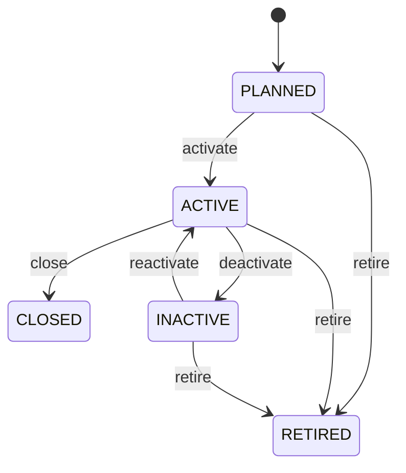

# Location

Core location master with hierarchical, geographic, organizational, and lifecycle context. Location identifies where business activity or resources occur. It is distinct from Address: Location is the business place; Address describes its geographic/contact representation. Supports inventory, warehousing, yard/port operations, shipping, purchasing, sales, tax jurisdiction, service, logistics, and organizational processes. Organization provides operating ownership/context. Address provides geographic representation. Parent/child locations provide operational hierarchy. Dependent entities must react when location status or hierarchy changes. Location create → validate hierarchy/address/organization → activate → use in operational transactions → status change/closure → validate dependent resources and prevent incompatible future use → preserve historical transaction context. Planned → active → inactive/closed → retired. Closure affects future operational selection; it does not delete historical movements, orders, receipts, shipments, or invoices. A warehouse is closed. New GoodsReceipts cannot target it, dependent inventory workflows must resolve or block future operations, but historical receipts and stock movements remain associated with the warehouse where they occurred.

## Finding records

Open **Location** from the menu or from its card on the dashboard.

The list shows Code, Name, Location Type, Status, Address, Parent Location, Organization, with the most recently changed record first. The **Help** button beside the title opens this window's help text.

- **Search**: type in the search box above the grid to narrow the rows. **Search** at the top left opens advanced search, where you pick a field, a comparison (equals, contains, starts with, before, after, and so on) and a value.
- **Sort**: click a column heading; click again to reverse.
- **Refresh**: the refresh button at the top right re-reads the rows and every dropdown, so a record created a moment ago by someone else appears.
- **Export**: **CSV** downloads the rows you are looking at.
- **Open a record**: click a row. The line under the title, "Showing 1 to n of N entries", tells you how many rows match.

## Creating a record

Choose **New** at the top of the list. The form opens on its own page, with the fields in sections. A badge beside each label names the control (Text, Dropdown, Date, and so on); a red star marks a required field; the question-mark icon shows that field's help; and a hint such as “max 300” shows the longest entry accepted.

1. Fill in the fields described under [Fields](#fields).
2. These are required and must be completed before the record can be saved: **Code**, **Name**, **Location Type**, **Status**.
3. For a dropdown that points at another window, pick the matching record; if the record you need does not exist yet, create it in its own window first. A dropdown may narrow to what you have already chosen, for example the states of the chosen country.
4. Choose **Create** (or **Save** in the toolbar). You return to the record, and it appears at the top of the list. If something is wrong the form says which field and why, and nothing is saved.

## Reading, changing and deleting a record

Click a row to open the record. Above the fields are the arrows that step through the list ("1 of 5"). Below them sit **Notes**, where anyone may leave a comment on the record, and the **Audit Trail**, which lists every change with who made it, when, and which fields changed.

- **Edit** (toolbar) makes the fields editable. Change them and choose **Save**; **Undo Changes** puts back what you changed and **Cancel Editing** leaves edit mode.
- **Copy Record** starts a new record from this one.
- **Delete Record** is available in edit mode and asks you to confirm; a record other records still depend on cannot be deleted.

Every change is also written to the [Audit Log](/administration/#audit-log).

## Fields

| Field | What you use | Rules | What to enter |
| --- | --- | --- | --- |
| Code | Text | Required, Unique, Up to 100 characters | The code of the location: a value the business records on it. Entered or maintained when a location is created or changed; shown on its form and available to search and reports. Read together with the location's other fields and its relationships; it is not meaningful on its own. Required: a location cannot be understood without its code. |
| Name | Text | Required, Up to 200 characters | The name of the location: a value the business records on it. Entered or maintained when a location is created or changed; shown on its form and available to search and reports. Read together with the location's other fields and its relationships; it is not meaningful on its own. Required: a location cannot be understood without its name. |
| Location Type | Choice | Required | The location type of the location: a value the business records on it. Entered or maintained when a location is created or changed; shown on its form and available to search and reports. Read together with the location's other fields and its relationships; it is not meaningful on its own. Required: a location cannot be understood without its location type. The location type of the location is site; set it when that is what the business means for this record. The location type of the location is warehouse; set it when that is what the business means for this record. The location type of the location is store; set it when that is what the business means for this record. The location type of the location is office; set it when that is what the business means for this record. The location type of the location is factory; set it when that is what the business means for this record. The location type of the location is yard; set it when that is what the business means for this record. The location type of the location is port; set it when that is what the business means for this record. The location type of the location is depot; set it when that is what the business means for this record. The location type of the location is virtual; set it when that is what the business means for this record. The location type of the location is other; set it when that is what the business means for this record. Choose one: Site, Warehouse, Store, Office, Factory, Yard, Port, Depot, Virtual, Other. |
| Status | Choice | Required | The status of the location: a value the business records on it. Entered or maintained when a location is created or changed; shown on its form and available to search and reports. Read together with the location's other fields and its relationships; it is not meaningful on its own. Required: a location cannot be understood without its status. The status of the location is planned; set it when that is what the business means for this record. The status of the location is active; set it when that is what the business means for this record. The status of the location is inactive; set it when that is what the business means for this record. The status of the location is closed; set it when that is what the business means for this record. The status of the location is retired; set it when that is what the business means for this record. Choose one: Planned, Active, Inactive, Closed, Retired. |
| Address | Lookup | Optional | The address id of the location: a link to another record the business records on it. Entered or maintained when a location is created or changed; shown on its form and available to search and reports. Read together with the location's other fields and its relationships; it is not meaningful on its own. Pick a record from **Address**. |
| Parent Location | Lookup | Optional | The parent location id of the location: a link to another record the business records on it. Entered or maintained when a location is created or changed; shown on its form and available to search and reports. Read together with the location's other fields and its relationships; it is not meaningful on its own. Pick a record from **Parent Location**. |
| Organization | Lookup | Optional | Links a location to organization, the organization it relates to. Chosen from the existing organization records when the location is created or edited. A location has at most one organization in this role. Lets the location be found from, and reported with, its organization. Pick a record from **Organization**. |

## How it connects to other records
- A location belongs to one **Organization**.
- A location has one **Address**.
- A location has many **Location** records.
- A location has many **Construction Project** records.

## Lifecycle: Location lifecycle

A location record starts as **Planned** and ends as **Closed** or **Retired**. Open a record and the bar above its fields shows its current **State** and, after **Next**, a button for each move that leaves it; choose one to make the move. Any move the diagram does not draw is refused, for everyone including the administrator.

| From | To | Move |
| --- | --- | --- |
| Planned | Active | Activate |
| Active | Closed | Close |
| Active | Inactive | Deactivate |
| Inactive | Active | Reactivate |
| Planned | Retired | Retire |
| Active | Retired | Retire |
| Inactive | Retired | Retire |

## Who may use it

Anyone who holds a role with access to the **Location** window. Access is granted by role under [Roles and access](/administration/access/).
