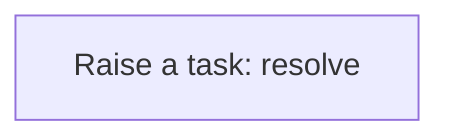
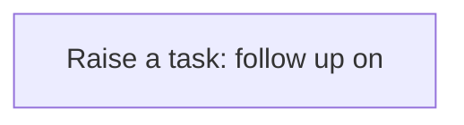
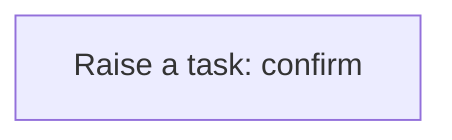

# Processes

A process is a sequence of steps the application runs for you: create a task, update a record, call a service. A business rule usually starts it; you can also run one by hand from the Workflow Designer. Every run is logged step by step in the Workflow Monitor. This application has **9** processes.

## Party exception raised {#party-exception-raised}

When a party is blocked, a high-priority task asks someone to resolve it.

Runs when a **Party** is changed, started by a business rule.

1. **Raise a task: resolve** — creates a **Task** record.

## Exchange rate follow up required {#exchange-rate-follow-up-required}

When a exchange rate is cancelled, a task asks someone to settle what depended on it.

Runs when a **Exchange Rate** is changed, started by a business rule.

1. **Raise a task: follow up on** — creates a **Task** record.

## Container movement exception raised {#container-movement-exception-raised}

When a container movement is failed, a high-priority task asks someone to resolve it.

Runs when a **Container Movement** is changed, started by a business rule.

1. **Raise a task: resolve** — creates a **Task** record.

## Container movement follow up required {#container-movement-follow-up-required}

When a container movement is cancelled, a task asks someone to settle what depended on it.

Runs when a **Container Movement** is changed, started by a business rule.

1. **Raise a task: follow up on** — creates a **Task** record.

## Container movement completion confirmed {#container-movement-completion-confirmed}

When a container movement is completed, a task asks someone to confirm the outcome.

Runs when a **Container Movement** is changed, started by a business rule.

1. **Raise a task: confirm** — creates a **Task** record.

## Yard block exception raised {#yard-block-exception-raised}

When a yard block is blocked, a high-priority task asks someone to resolve it.

Runs when a **Yard** is changed, started by a business rule.

1. **Raise a task: resolve** — creates a **Task** record.

## Yard bay exception raised {#yard-bay-exception-raised}

When a yard bay is blocked, a high-priority task asks someone to resolve it.

Runs when a **Yard Block** is changed, started by a business rule.

1. **Raise a task: resolve** — creates a **Task** record.

## Yard tier exception raised {#yard-tier-exception-raised}

When a yard tier is blocked, a high-priority task asks someone to resolve it.

Runs when a **Yard Bay** is changed, started by a business rule.

1. **Raise a task: resolve** — creates a **Task** record.

## Yard slot exception raised {#yard-slot-exception-raised}

When a yard slot is blocked, a high-priority task asks someone to resolve it.

Runs when a **Yard Tier** is changed, started by a business rule.

1. **Raise a task: resolve** — creates a **Task** record.

