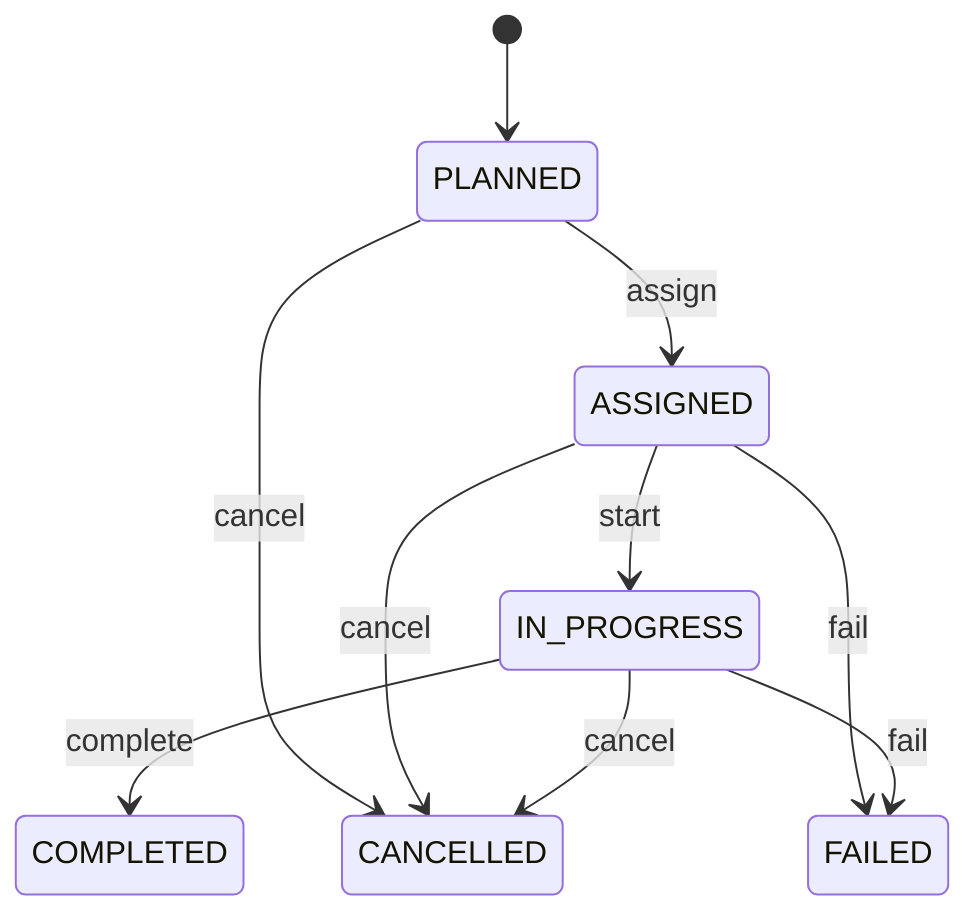

# Container Movement

Represents one traceable physical or operational movement of one shipping container. ContainerMovement is the execution-level event connecting the Container asset to yard positions, transport states, operators, and the business process that caused the move. It is deliberately separate from Container, which represents the asset, and YardSlot, which represents a physical storage position. Used by yard management, terminal/depot operations, gate management, vessel operations, repair operations, dispatch, equipment optimization, safety, audit, and movement analytics. Container answers what asset moved. SourceSlot and targetSlot answer where it moved. MovementType explains the physical purpose. RelatedTransaction explains why it was needed. AssignedTo identifies execution responsibility. Container.currentLocation/currentSlot represent present state; ContainerMovement preserves historical chronology. A movement is planned, optionally assigned, started when physical handling begins, and completed only when the resulting position or transport state is confirmed. Cancellation prevents execution. Failure records unsuccessful execution and triggers recovery or replanning. Completed movements remain immutable historical events. A yard system should reserve a target slot before executing a placement movement, validate container compatibility and stack constraints, atomically release the source and occupy the target when completion is confirmed, and update the container's present position. Optimization may create restack movements whose purpose is to reduce future rehandles rather than fulfill a customer transaction. Container C123 is in B12-08-02 and must leave the depot on an outbound truck. A GATE_OUT movement records the source slot, planned time, priority, and related release transaction. After the container crosses the gate, the movement becomes COMPLETED and the container no longer has an active yard slot. The movement remains immutable evidence of the physical departure.

## Finding records

Open **Container Movement** from the menu or from its card on the dashboard.

The list shows Movement Number, Movement Type, Status, Planned At, Started At, Completed At, Priority, with the most recently changed record first. The **Help** button beside the title opens this window's help text.

- **Search**: type in the search box above the grid to narrow the rows. **Search** at the top left opens advanced search, where you pick a field, a comparison (equals, contains, starts with, before, after, and so on) and a value.
- **Sort**: click a column heading; click again to reverse.
- **Refresh**: the refresh button at the top right re-reads the rows and every dropdown, so a record created a moment ago by someone else appears.
- **Export**: **CSV** downloads the rows you are looking at.
- **Open a record**: click a row. The line under the title, "Showing 1 to n of N entries", tells you how many rows match.

## Creating a record

Choose **New** at the top of the list. The form opens on its own page, with the fields in sections. A badge beside each label names the control (Text, Dropdown, Date, and so on); a red star marks a required field; the question-mark icon shows that field's help; and a hint such as “max 300” shows the longest entry accepted.

1. Fill in the fields described under [Fields](#fields).
2. These are required and must be completed before the record can be saved: **Movement Number**, **Movement Type**, **Status**, **Priority**, **Container**.
3. For a dropdown that points at another window, pick the matching record; if the record you need does not exist yet, create it in its own window first. A dropdown may narrow to what you have already chosen, for example the states of the chosen country.
4. Choose **Create** (or **Save** in the toolbar). You return to the record, and it appears at the top of the list. If something is wrong the form says which field and why, and nothing is saved.

## Reading, changing and deleting a record

Click a row to open the record. Above the fields are the arrows that step through the list ("1 of 5"). Below them sit **Notes**, where anyone may leave a comment on the record, and the **Audit Trail**, which lists every change with who made it, when, and which fields changed.

- **Edit** (toolbar) makes the fields editable. Change them and choose **Save**; **Undo Changes** puts back what you changed and **Cancel Editing** leaves edit mode.
- **Copy Record** starts a new record from this one.
- **Delete Record** is available in edit mode and asks you to confirm; a record other records still depend on cannot be deleted.

Every change is also written to the [Audit Log](/administration/#audit-log).

## Fields

| Field | What you use | Rules | What to enter |
| --- | --- | --- | --- |
| Movement Number | Text | Required, Unique, Up to 100 characters | The human-facing operational reference for the movement. Used by planners, operators, dispatchers, supervisors, gate teams, and external systems. It identifies the operational work item and is distinct from containerNumber and containerMovementId. Required for human and integration traceability. |
| Movement Type | Choice | Required | Defines the operational purpose and physical consequence of the movement. Determines validation, required source/target context, equipment needs, workflow, capacity effects, and reporting. Explains why the container is moving; the related transaction supplies the broader business reason when one exists. Establishes controlled receipt of a container into a facility or receiving flow. Places a container into a yard storage position. Relocates a container between yard positions to improve access, safety, capacity, or operational efficiency. Removes a container from a stacked position for another operation. Moves a container between controlled operational areas or locations. Records controlled exit through a facility gate. Records controlled entry through a facility gate. Places a container onto a transport asset for onward movement. Removes a container from a transport asset into the receiving flow. Positions equipment for inspection or survey. Moves equipment to or from a repair/workshop area. Required because the movement type determines physical and business rules. Choose one: Receive, Stack, Restack, Unstack, Transfer, Gate out, Gate in, Load, Discharge, Inspection, Repair move. |
| Status | Choice | Required | The execution state of the movement work item. Controls dispatch, assignment, execution, exception handling, and operational dashboards. Describes movement execution only; it must not be interpreted as the lifecycle status of the Container. Movement is required or scheduled but execution has not started. An operator, vehicle, crane, tractor, or other execution resource has been assigned. Physical execution has begun. The intended movement and resulting physical/transport state have been confirmed. The movement will not be executed under this instruction. Execution was attempted or initiated but did not complete successfully and requires recovery or replanning. Required for controlled operational execution. Choose one: Planned, Assigned, In progress, Completed, Cancelled, Failed. |
| Planned At | Date and time | Optional | The planned execution time for the movement. Supports yard sequencing, appointment coordination, crane/tractor scheduling, congestion management, and optimization. A planning timestamp is not evidence that movement occurred. Optional until a schedule is established. |
| Started At | Date and time | Optional | The timestamp when physical execution actually began. Supports productivity, equipment utilization, delay analysis, turnaround measurement, and audit. Represents actual execution and is distinct from plannedAt. Optional before execution or when supplied by an external execution system. |
| Completed At | Date and time | Optional | The timestamp when the intended movement was confirmed complete. Establishes completion chronology, move duration, resulting position/state, and operational metrics. For yard movements, completion should correspond to confirmed target-slot occupancy or source-slot release; for external movements it should correspond to the appropriate transport state. Optional until completion. |
| Priority | Choice | Required | The relative urgency used to sequence this movement against competing work. Used by dispatch, yard optimization, exception management, and operational scheduling. Priority influences scheduling order but does not change the movement's physical meaning or the Container's business importance. Can normally wait behind higher-priority work. Follows ordinary operational sequencing. Receives preferential scheduling because delay may affect downstream activity. Requires protected or immediate execution because delay may materially affect safety, vessel operations, gate commitments, customer commitments, or another critical process. Required for consistent competing-work prioritization. Choose one: Low, Normal, High, Critical. |
| Container | Lookup | Required | Identifies the physical container being moved. Connects movement execution to equipment identity, size, type, ownership, condition, status, and current position. Exactly one Container is the subject of a movement. Container is the asset/current-state object; ContainerMovement is the event that changes its operational position or transport state. Pick a record from **Container**. |
| Source Slot | Lookup | Optional | Identifies the exact yard position occupied immediately before the movement when the move originates in a modeled yard slot. Supports occupancy release, validation, stack dependency analysis, travel planning, and historical reconstruction. Zero when the movement originates outside a yard slot, such as a gate-in or external discharge. Source slot is the physical starting position, not merely the facility or block containing the container. Pick a record from **Yard Tier**. |
| Assigned To | Lookup | Optional | Identifies the party responsible for executing the movement when responsibility is modeled at party level. Supports dispatch accountability, contractor management, workload, safety, and performance reporting. Optional because execution may instead be assigned through a specialized worker, vehicle, crane, or external execution model. Party provides identity; specialized assignment entities can provide the operational execution details. Pick a record from **Party**. |

## How it connects to other records
- A container movement belongs to one **Container**.
- A container movement belongs to one **Yard Tier**.
- A container movement belongs to one **Party**.

## Lifecycle: Container movement lifecycle

A container movement record starts as **Planned** and ends as **Completed** or **Cancelled** or **Failed**. Open a record and the bar above its fields shows its current **State** and, after **Next**, a button for each move that leaves it; choose one to make the move. Any move the diagram does not draw is refused, for everyone including the administrator.

| From | To | Move |
| --- | --- | --- |
| Planned | Assigned | Assign |
| Assigned | In progress | Start |
| In progress | Completed | Complete |
| Planned | Cancelled | Cancel |
| Assigned | Cancelled | Cancel |
| In progress | Cancelled | Cancel |
| Assigned | Failed | Fail |
| In progress | Failed | Fail |

## What happens when you save
Business rules run around the save. They are listed here and explained in full under [Business rules](/administration/rules/).

| Rule | When | Order |
| --- | --- | --- |
| Container movement invariants before create | before a container movement is created | 100 |
| Container movement invariants before update | before a container movement is changed | 100 |
| Container movement workflows after update | after a container movement is changed | 100 |

Processes started from this record: [Container movement exception raised](/administration/processes/#container-movement-exception-raised), [Container movement follow up required](/administration/processes/#container-movement-follow-up-required), [Container movement completion confirmed](/administration/processes/#container-movement-completion-confirmed).

## Who may use it

Anyone who holds a role with access to the **Container Movement** window. Access is granted by role under [Roles and access](/administration/access/).
