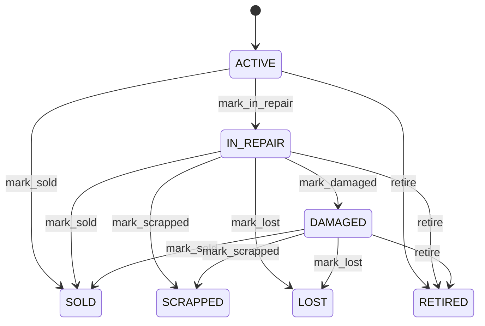

# Container

Represents a reusable intermodal freight container as a continuously identifiable physical logistics asset. Container is the equipment anchor connecting transport, depot, terminal, yard, maintenance, leasing, ownership, inventory, shipment, interchange, and commercial disposition processes. Used for gate events, yard placement, movement tracking, shipment assignment, inspection, repair, inventory, leasing, sale, scrap, and asset reporting. Party provides ownership context; Location provides present geographic context; YardSlot provides exact yard position; ContainerMovement provides chronological movement; RepairEstimate provides repair/disposition assessment. These concepts must remain separate because they represent different business facts. A container can move from active service to damaged or repair state and eventually return to service, be sold, scrapped, lost, or retired. Lifecycle transitions should be tied to the corresponding operational, maintenance, commercial, or exception process. A 40-foot dry container enters a depot, is assigned to YardSlot B03-012-04-02, moves to a repair area after damage, receives a RepairEstimate, returns to ACTIVE service, and later leaves the depot for a customer. The same containerId and containerNumber remain attached throughout the lifecycle while its location, slot, movement history, condition, and commercial context change.

## Finding records

Open **Container** from the menu or from its card on the dashboard.

The list shows Container Number, Iso Code, Size Code, Container Type, Tare Weight, Max Gross Weight, Manufacture Date, with the most recently changed record first. The **Help** button beside the title opens this window's help text.

- **Search**: type in the search box above the grid to narrow the rows. **Search** at the top left opens advanced search, where you pick a field, a comparison (equals, contains, starts with, before, after, and so on) and a value.
- **Sort**: click a column heading; click again to reverse.
- **Refresh**: the refresh button at the top right re-reads the rows and every dropdown, so a record created a moment ago by someone else appears.
- **Export**: **CSV** downloads the rows you are looking at.
- **Open a record**: click a row. The line under the title, "Showing 1 to n of N entries", tells you how many rows match.

## Creating a record

Choose **New** at the top of the list. The form opens on its own page, with the fields in sections. A badge beside each label names the control (Text, Dropdown, Date, and so on); a red star marks a required field; the question-mark icon shows that field's help; and a hint such as “max 300” shows the longest entry accepted.

1. Fill in the fields described under [Fields](#fields).
2. These are required and must be completed before the record can be saved: **Container Number**, **Status**.
3. For a dropdown that points at another window, pick the matching record; if the record you need does not exist yet, create it in its own window first. A dropdown may narrow to what you have already chosen, for example the states of the chosen country.
4. Choose **Create** (or **Save** in the toolbar). You return to the record, and it appears at the top of the list. If something is wrong the form says which field and why, and nothing is saved.

## Reading, changing and deleting a record

Click a row to open the record. Above the fields are the arrows that step through the list ("1 of 5"). Below them sit **Notes**, where anyone may leave a comment on the record, and the **Audit Trail**, which lists every change with who made it, when, and which fields changed.

- **Edit** (toolbar) makes the fields editable. Change them and choose **Save**; **Undo Changes** puts back what you changed and **Cancel Editing** leaves edit mode.
- **Copy Record** starts a new record from this one.
- **Delete Record** is available in edit mode and asks you to confirm; a record other records still depend on cannot be deleted.

Every change is also written to the [Audit Log](/administration/#audit-log).

## Fields

| Field | What you use | Rules | What to enter |
| --- | --- | --- | --- |
| Container Number | Text | Required, Unique, Up to 20 characters | The industry-facing identification number assigned to the physical container. Used by carriers, terminals, depots, customs, gate operations, interchange messages, shipping documents, and customers to identify the equipment. It is the operational identifier of the same asset represented internally by containerId; it must remain stable across movements and commercial events. Required because logistics actors normally identify equipment by its container number. |
| Iso Code | Text | Up to 10 characters | The standardized equipment code describing the container's equipment characteristics. Used for transport compatibility, yard allocation, vessel planning, depot handling, interchange, and equipment classification. Complements containerNumber and informs physical compatibility; it is not itself the container's identity. Optional only while standardized classification is unavailable; operations requiring equipment compatibility should resolve it before execution. |
| Size Code | Text | Up to 20 characters | The operational size classification of the container. Used for slot allocation, transport planning, pricing, capacity calculations, and TEU reporting. Size influences physical placement and transport constraints and should remain consistent with the authoritative equipment classification. Optional when derived from isoCode or an equipment master. |
| Container Type | Text | Up to 50 characters | The functional equipment category of the container, such as dry, refrigerated, tank, or open-top equipment. Drives handling, power, inspection, safety, maintenance, shipment compatibility, and yard-placement rules. Type determines operational capabilities and restrictions but does not replace Product or equipment-master classification where standardized definitions exist. Optional when maintained by a controlled equipment master. |
| Tare Weight | Amount | Optional | The empty weight of the container without cargo. Combined with cargo weight for gross-weight calculations, transport compliance, loading decisions, and interchange. It is an equipment characteristic and should be interpreted with the applicable unit of measure and weighing source. Optional when authoritative equipment specifications provide the value dynamically. |
| Max Gross Weight | Amount | Optional | The maximum permitted gross weight of the container and its cargo under the applicable equipment and operating rules. Used for loading, transport planning, safety, vessel/rail/road compliance, and handling decisions. Must be evaluated with tare weight, cargo weight, transport-mode limits, and regulatory constraints. Optional when maintained by an authoritative equipment specification. |
| Manufacture Date | Date | Optional | The date on which the physical container equipment was manufactured. Used for equipment age, inspection, maintenance, depreciation, leasing, resale, and retirement analysis. Commonly combined with acquisition, depreciation, repair, and disposition history to understand economic and operational life. Optional when provenance is incomplete, but its absence limits age-dependent analytics. |
| Status | Choice | Required | The current lifecycle state governing whether the container is available for ordinary operational use. Controls equipment allocation, yard placement, shipment assignment, repair workflows, disposition, and exception handling. Status is an asset lifecycle state, not a location state or repair estimate result; transitions should be justified by corresponding business processes. Equipment is available for normal assignment subject to operational constraints. Equipment is undergoing repair or maintenance and should normally be excluded from ordinary transport assignment. Equipment has known damage and requires assessment, restriction, or repair before normal use. Ownership or commercial disposition has transferred through a sale process and the equipment is no longer ordinary available inventory unless explicitly returned. Equipment has been designated for disposal and must not be assigned to operational movements. Equipment cannot currently be located and requires investigation or recovery. Equipment has permanently left normal operational service without necessarily being sold or scrapped. Required because equipment availability decisions depend on an explicit lifecycle state. Choose one: Active, In repair, Damaged, Sold, Scrapped, Lost, Retired. |
| Inventory Status | Text | Up to 50 characters | The equipment's inventory classification within the owning or managing organization's asset inventory process. Supports fleet availability, ownership/lease reporting, depot inventory, and disposition workflows. Inventory classification is distinct from physical condition and lifecycle status and should not be used as a substitute for status. Optional where a dedicated equipment-inventory model supplies the classification. |
| Owner | Lookup | Optional | Identifies the party that owns the physical equipment or is recorded as its commercial owner. Supports asset accounting, leasing, billing, maintenance responsibility, sale, and fleet reporting. At most one owner is represented at a point in time; absence means ownership is not modeled here. Owner is distinct from the carrier, lessee, customer, terminal, depot, or party physically possessing the container. Pick a record from **Party**. |
| Current Location | Lookup | Optional | Identifies the current physical or operational location of the container. Provides present-state visibility for routing, pickup, inventory, customer service, and exception handling. A container has at most one current location at a point in time. This is a current-state projection; chronological location changes belong in ContainerMovement. Pick a record from **Location**. |
| Current Slot | Lookup | Optional | Identifies the exact YardSlot currently occupied when the container is physically positioned in a modeled yard. Enables precise yard visibility, crane instructions, retrieval planning, and rehandle optimization. A container can occupy zero or one current slot. currentSlot is more precise than currentLocation and must be consistent with the slot's current occupancy state. Pick a record from **Yard Tier**. |
| Yard | Lookup | Optional | The Yard this Container belongs to. Pick a record from **Yard**. |

## How it connects to other records
- A container belongs to one **Party**.
- A container belongs to one **Location**.
- A container has one **Yard Tier**.
- A container has many **Container Movement** records.
- A container belongs to one **Yard**.

## Lifecycle: Container lifecycle

A container record starts as **Active** and ends as **Sold** or **Scrapped** or **Lost** or **Retired**. Open a record and the bar above its fields shows its current **State** and, after **Next**, a button for each move that leaves it; choose one to make the move. Any move the diagram does not draw is refused, for everyone including the administrator.

| From | To | Move |
| --- | --- | --- |
| Active | In repair | Mark in repair |
| In repair | Damaged | Mark damaged |
| Active | Sold | Mark sold |
| In repair | Sold | Mark sold |
| Damaged | Sold | Mark sold |
| In repair | Scrapped | Mark scrapped |
| Damaged | Scrapped | Mark scrapped |
| In repair | Lost | Mark lost |
| Damaged | Lost | Mark lost |
| Active | Retired | Retire |
| In repair | Retired | Retire |
| Damaged | Retired | Retire |

## What happens when you save
Business rules run around the save. They are listed here and explained in full under [Business rules](/administration/rules/).

| Rule | When | Order |
| --- | --- | --- |
| Container invariants before create | before a container is created | 100 |
| Container invariants before update | before a container is changed | 100 |

## Who may use it

Anyone who holds a role with access to the **Container** window. Access is granted by role under [Roles and access](/administration/access/).
