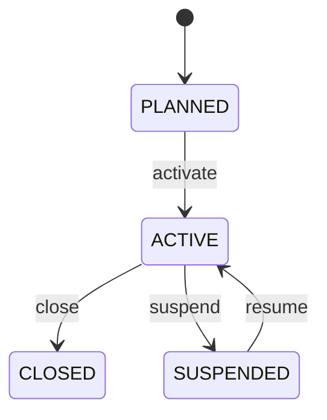

# Yard

Represents the facility-level operational boundary for container storage and handling. Yard is the physical and operational context in which containers enter, occupy storage positions, move between positions, undergo inspection or repair, and eventually leave the facility. It is more specific than Location but broader than a YardBlock or YardSlot. Used by container depots, terminals, inland yards, maintenance facilities, logistics operators, gate systems, yard management systems, capacity planning, and transport integrations. Location provides geographic identity. Yard provides facility semantics. YardBlock → YardBay → YardTier → YardSlot provides progressively finer storage position. Container identifies the equipment. ContainerMovement records movement history. Yard status controls facility-level availability while slot status controls individual placement availability. A yard is planned and configured, activated for operations, potentially suspended during incidents or restrictions, and eventually closed. Suspension or closure changes what new work may be accepted but does not erase historical container, movement, inspection, repair, or gate records. A typical flow is gate-in → equipment identification/inspection → yard allocation → placement in a compatible YardSlot → internal movement as required → inspection/repair or release → pre-dispatch staging → gate-out. Each stage should remain traceable to the yard and its physical position. A container depot operates YARD01. A truck gates in a container, the system identifies its size/type and condition, selects a compatible slot such as Block B / Bay 12 / Tier 3, records the placement, and later moves the container to a repair area. The yard remains the facility context while the slot and movement records provide precise operational history.

## Finding records

Open **Yard** from the menu or from its card on the dashboard.

The list shows Code, Name, Status, Location, with the most recently changed record first. The **Help** button beside the title opens this window's help text.

- **Search**: type in the search box above the grid to narrow the rows. **Search** at the top left opens advanced search, where you pick a field, a comparison (equals, contains, starts with, before, after, and so on) and a value.
- **Sort**: click a column heading; click again to reverse.
- **Refresh**: the refresh button at the top right re-reads the rows and every dropdown, so a record created a moment ago by someone else appears.
- **Export**: **CSV** downloads the rows you are looking at.
- **Open a record**: click a row. The line under the title, "Showing 1 to n of N entries", tells you how many rows match.

## Creating a record

Choose **New** at the top of the list. The form opens on its own page, with the fields in sections. A badge beside each label names the control (Text, Dropdown, Date, and so on); a red star marks a required field; the question-mark icon shows that field's help; and a hint such as “max 300” shows the longest entry accepted.

1. Fill in the fields described under [Fields](#fields).
2. These are required and must be completed before the record can be saved: **Code**, **Name**, **Status**, **Location**.
3. For a dropdown that points at another window, pick the matching record; if the record you need does not exist yet, create it in its own window first. A dropdown may narrow to what you have already chosen, for example the states of the chosen country.
4. Choose **Create** (or **Save** in the toolbar). You return to the record, and it appears at the top of the list. If something is wrong the form says which field and why, and nothing is saved.

## Reading, changing and deleting a record

Click a row to open the record. Above the fields are the arrows that step through the list ("1 of 5"). Below them sit **Notes**, where anyone may leave a comment on the record, and the **Audit Trail**, which lists every change with who made it, when, and which fields changed.

- **Edit** (toolbar) makes the fields editable. Change them and choose **Save**; **Undo Changes** puts back what you changed and **Cancel Editing** leaves edit mode.
- **Copy Record** starts a new record from this one.
- **Delete Record** is available in edit mode and asks you to confirm; a record other records still depend on cannot be deleted.

Every change is also written to the [Audit Log](/administration/#audit-log).

## Fields

| Field | What you use | Rules | What to enter |
| --- | --- | --- | --- |
| Code | Text | Required, Unique, Up to 100 characters | The operational business code used to identify the yard. Provides the concise facility reference used by operators, transport partners, EDI messages, reports, integrations, and searches. Used in gate, movement, inventory, shipment, location, and reporting processes where a yard must be selected or communicated. Code identifies the facility; the YardBlock/YardBay/YardTier/YardSlot hierarchy identifies the exact physical storage position. Required because operational systems need a stable human-facing facility identifier. |
| Name | Text | Required, Up to 200 characters | The human-readable name of the yard facility. Identifies the facility in user interfaces, reports, documents, maps, and business communications. Supports operational search and reporting where a descriptive name is preferable to a technical code. Names the facility identified by yardId and code; it is not the technical identity and should not be used as a unique key. Required for clear human interpretation of the facility. |
| Status | Choice | Required | The controlled operational lifecycle state of the yard. Determines whether the facility is being prepared, accepting normal operations, temporarily restricted, or closed. Controls new allocations, inbound movements, gate activity, planning, and other operational actions. Yard status provides facility-level availability; individual YardSlot status and Container status provide more granular operational constraints. Facility exists in the master model but is not available for normal yard transactions. Facility can perform normal operations subject to capacity, safety, equipment, and process constraints. Normal operations are temporarily restricted because of incidents, maintenance, weather, regulatory action, or another controlled reason. Facility is no longer available for normal operations; closure activities may still be performed under controlled processes. Required because the facility's ability to accept new work must be explicit. Choose one: Planned, Active, Suspended, Closed. |
| Location | Lookup | Required | Associates the yard with its primary geographic or business Location. Provides address, coordinates, jurisdiction, routing, mapping, and regional context. Each yard has exactly one primary Location in this model. Location answers where the facility is; Yard answers what container-yard operational capabilities exist at that location. Pick a record from **Location**. |

## How it connects to other records
- A yard belongs to one **Location**.
- A yard has many **Yard** records.
- A yard has many **Container** records.

## Lifecycle: Yard lifecycle

A yard record starts as **Planned** and ends as **Closed**. Open a record and the bar above its fields shows its current **State** and, after **Next**, a button for each move that leaves it; choose one to make the move. Any move the diagram does not draw is refused, for everyone including the administrator.

| From | To | Move |
| --- | --- | --- |
| Planned | Active | Activate |
| Active | Closed | Close |
| Active | Suspended | Suspend |
| Suspended | Active | Resume |

## Who may use it

Anyone who holds a role with access to the **Yard** window. Access is granted by role under [Roles and access](/administration/access/).
