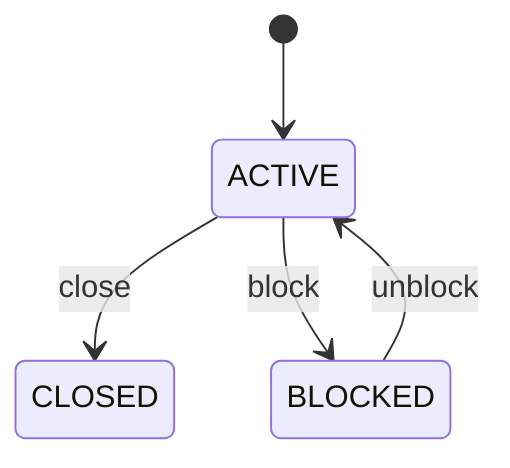

# Yard Block

Represents the longitudinal storage lane between a yard block and the vertical stacking levels used for container storage. YardBay is a physical and operational addressing level. It groups a sequence of vertically stacked positions and provides a useful unit for capacity planning, traffic analysis, container allocation, and rehandling optimization. Used by yard management, gate and dispatch operations, storage allocation, capacity planning, digital-twin visualization, equipment routing, and container movement optimization. The physical hierarchy is Yard → YardBlock → YardBay → YardTier → YardSlot. Yard identifies the facility; YardBlock defines a major storage area; YardBay defines the longitudinal lane; YardTier defines vertical level; YardSlot identifies the atomic physical position. Container records the equipment being stored, while ContainerMovement records changes in its physical position. A bay is not itself a container position. It is a collection of stack levels and slots. Allocation algorithms can use bay-level characteristics such as distance to gate, crane/equipment access, traffic pattern, container class, expected dwell time, and rehandle risk before selecting a precise slot. A bay may be configured, activated, temporarily blocked, or closed. Blocking or closing a bay prevents new normal placements but does not erase current occupancy. Existing containers may require controlled relocation, and each relocation should produce an auditable ContainerMovement event. Bay is a natural optimization unit for balancing yard density, reducing travel distance, minimizing rehandles, grouping containers by destination or dwell profile, and managing equipment workload. A good placement decision evaluates bay-level cost together with tier/slot availability, stack compatibility, container dimensions, weight, hazardous status, reefer requirements, appointment/dispatch timing, and future retrieval priority. Block B03 contains Bay 12. Bay 12 has five tiers and multiple atomic slots. A container arriving at the depot is evaluated against Bay 12's access, capacity, compatibility, and future retrieval cost before a precise YardSlot is selected. If Bay 12 becomes blocked for maintenance, existing containers remain associated with their slots while new placements are prevented until the block is resolved.

## Finding records

Lines are added from the parent: open a **Yard** and choose the **Yard Block** tab.

The list shows Code, Bay Number, Status, Block, with the most recently changed record first. The **Help** button beside the title opens this window's help text.

- **Search**: type in the search box above the grid to narrow the rows. **Search** at the top left opens advanced search, where you pick a field, a comparison (equals, contains, starts with, before, after, and so on) and a value.
- **Sort**: click a column heading; click again to reverse.
- **Refresh**: the refresh button at the top right re-reads the rows and every dropdown, so a record created a moment ago by someone else appears.
- **Export**: **CSV** downloads the rows you are looking at.
- **Open a record**: click a row. The line under the title, "Showing 1 to n of N entries", tells you how many rows match.

## Adding a line

Open the parent record, choose the **Yard Block** tab and use **New**. The line is tied to its parent automatically.

## Reading, changing and deleting a record

Click a row to open the record. Above the fields are the arrows that step through the list ("1 of 5"). Below them sit **Notes**, where anyone may leave a comment on the record, and the **Audit Trail**, which lists every change with who made it, when, and which fields changed.

- **Edit** (toolbar) makes the fields editable. Change them and choose **Save**; **Undo Changes** puts back what you changed and **Cancel Editing** leaves edit mode.
- **Copy Record** starts a new record from this one.
- **Delete Record** is available in edit mode and asks you to confirm; a record other records still depend on cannot be deleted.

Every change is also written to the [Audit Log](/administration/#audit-log).

## Fields

| Field | What you use | Rules | What to enter |
| --- | --- | --- | --- |
| Code | Text | Required, Up to 50 characters | The operational business code used to identify the bay. Provides the human-facing bay address used by operators, terminal systems, equipment instructions, maps, reports, and integrations. Used in container move instructions, search, visualization, slot addressing, and exception handling. The code is scoped to the parent YardBlock and should not be treated as a globally unique yard address. Required for deterministic operational addressing. |
| Bay Number | Whole number | Required | The ordinal position of the bay within its parent YardBlock. Represents the bay's longitudinal sequence in the block's physical addressing scheme. Used for sorting, navigation, visualization, slot-code construction, distance estimation, and movement optimization. It is meaningful within the block; a bayNumber of 12 in two different blocks does not identify the same physical location. Required to provide deterministic physical ordering. |
| Status | Choice | Required | The operational availability of the bay and its subordinate tiers and slots. Determines whether the bay can normally participate in container placement, retrieval, relocation, and planning. Used by allocation and optimization algorithms to eliminate unavailable storage lanes before evaluating individual slots. Bay status is an upper-level constraint. A blocked bay can make otherwise active tiers and slots unavailable for new placement while containers already occupying them remain physically valid. The bay may participate in normal operations subject to tier, slot, container, equipment, safety, and yard rules. The bay is temporarily unavailable for normal placement or movement, for example because of maintenance, safety, congestion, inspection, or an incident. The bay is administratively or physically unavailable for normal operations until an explicit reopening or reconfiguration process occurs. Required because bay availability affects all subordinate storage positions. Choose one: Active, Blocked, Closed. |
| Block | Lookup | Required | Places the bay inside its parent YardBlock. Supplies the yard, zoning, operational rules, capacity context, and addressing scope for the bay. Every YardBay belongs to exactly one YardBlock. YardBlock is the planning/storage-area boundary; YardBay is the longitudinal lane within that boundary. Pick a record from **Yard**. |

## How it connects to other records

A yard block is a line of a **Yard**. It has no window of its own: open the yard and use the **Yard Block** tab to see and add lines.
- A yard block belongs to one **Yard**.
- A yard block has many **Yard Bay** records.

## Lifecycle: Yard bay lifecycle

A yard block record starts as **Active** and ends as **Closed**. Open a record and the bar above its fields shows its current **State** and, after **Next**, a button for each move that leaves it; choose one to make the move. Any move the diagram does not draw is refused, for everyone including the administrator.

| From | To | Move |
| --- | --- | --- |
| Active | Closed | Close |
| Active | Blocked | Block |
| Blocked | Active | Unblock |

## What happens when you save
Business rules run around the save. They are listed here and explained in full under [Business rules](/administration/rules/).

| Rule | When | Order |
| --- | --- | --- |
| Yard bay workflows after update | after a yard block is changed | 100 |

Processes started from this record: [Yard bay exception raised](/administration/processes/#yard-bay-exception-raised).

## Who may use it

Anyone who holds a role with access to the **Yard Block** window. Access is granted by role under [Roles and access](/administration/access/).
