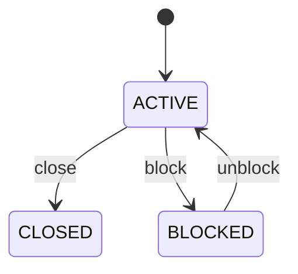

# Yard

Represents a major storage subdivision within a container yard and the planning boundary above individual bays and slots. YardBlock organizes physical capacity into a manageable operational area, commonly grouping bays that share layout, equipment, traffic, cargo, container-type, or handling characteristics. It is a zoning and planning concept as well as a physical hierarchy element. Used for yard zoning, capacity management, container placement strategy, traffic planning, congestion management, navigation, reporting, and movement optimization. The hierarchy is Yard → YardBlock → YardBay → YardTier → YardSlot. Yard supplies the facility boundary; YardBlock groups related bays; YardBay represents a longitudinal storage row; YardTier represents vertical stacking; YardSlot identifies an atomic physical position. Container placement should ultimately resolve to a YardSlot rather than stopping at block level. Block-level rules can constrain all subordinate locations. A placement algorithm should evaluate block status before bay/tier/slot capacity, compatibility, accessibility, safety, and movement cost. A block can also be a useful optimization unit for balancing density, minimizing rehandles, separating container classes, and controlling traffic. A block may be configured before the yard opens, activated for operations, temporarily blocked, or closed. Blocking does not automatically mean that containers disappear or move; existing occupancy must be preserved and any required relocation should be represented by explicit ContainerMovement events. A depot operates Block B03 for export dry containers. B03 contains bays B03-01 through B03-20. Each bay contains tiers and atomic slots. When a container arrives, the yard-planning process evaluates B03 and its subordinate locations for compatibility, availability, travel distance, rehandle impact, and operational rules before assigning a precise slot.

## Finding records

Lines are added from the parent: open a **Yard** and choose the **Yard** tab.

The list shows Code, Name, Status, Yard, with the most recently changed record first. The **Help** button beside the title opens this window's help text.

- **Search**: type in the search box above the grid to narrow the rows. **Search** at the top left opens advanced search, where you pick a field, a comparison (equals, contains, starts with, before, after, and so on) and a value.
- **Sort**: click a column heading; click again to reverse.
- **Refresh**: the refresh button at the top right re-reads the rows and every dropdown, so a record created a moment ago by someone else appears.
- **Export**: **CSV** downloads the rows you are looking at.
- **Open a record**: click a row. The line under the title, "Showing 1 to n of N entries", tells you how many rows match.

## Adding a line

Open the parent record, choose the **Yard** tab and use **New**. The line is tied to its parent automatically.

## Reading, changing and deleting a record

Click a row to open the record. Above the fields are the arrows that step through the list ("1 of 5"). Below them sit **Notes**, where anyone may leave a comment on the record, and the **Audit Trail**, which lists every change with who made it, when, and which fields changed.

- **Edit** (toolbar) makes the fields editable. Change them and choose **Save**; **Undo Changes** puts back what you changed and **Cancel Editing** leaves edit mode.
- **Copy Record** starts a new record from this one.
- **Delete Record** is available in edit mode and asks you to confirm; a record other records still depend on cannot be deleted.

Every change is also written to the [Audit Log](/administration/#audit-log).

## Fields

| Field | What you use | Rules | What to enter |
| --- | --- | --- | --- |
| Code | Text | Required, Up to 50 characters | The operational code used by people and systems to identify the block. Provides the concise block designation shown on yard maps, operator instructions, dashboards, gate/move messages, and integrations. Used for navigation, slot addressing, capacity reporting, movement planning, and exception handling. The code is interpreted within its parent Yard and should be unique within that yard; it is not the identity of a bay or slot. Required because operators and systems need a practical hierarchical address. |
| Name | Text | Up to 150 characters | A descriptive name for the block used in user-facing operations and reporting. Allows a block to be identified by operational purpose, physical area, or local terminology in addition to its code. Used in yard maps, dashboards, reports, planning screens, and operator interfaces. Describes the same block identified by yardBlockId and code and should not replace those technical/business identifiers. Optional when the operational code is sufficient. |
| Status | Choice | Required | The operational availability of the entire block for container storage and movement activity. Determines whether subordinate bays may normally be selected for placement, relocation, or planning. Used by allocation and optimization algorithms to exclude unavailable storage areas. Block status is an upper-level constraint: a BLOCKED or CLOSED block can make otherwise ACTIVE bays and slots unusable for new placement. The block may participate in normal yard operations subject to bay, tier, slot, equipment, safety, and container constraints. The block is temporarily unavailable for normal placement or movement, for example because of maintenance, safety, congestion, inspection, or an incident. The block is administratively or permanently unavailable for normal operations. Required because block availability affects all subordinate storage positions. Choose one: Active, Blocked, Closed. |
| Yard | Lookup | Required | Places the block within its parent Yard facility. Supplies facility identity, location, operating status, capacity context, and the top-level yard rules governing the block. Every YardBlock belongs to exactly one Yard. Yard is the facility boundary; YardBlock is a subdivision within that facility. Pick a record from **Yard**. |

## How it connects to other records

A yard is a line of a **Yard**. It has no window of its own: open the yard and use the **Yard** tab to see and add lines.
- A yard belongs to one **Yard**.
- A yard has many **Yard Block** records.

## Lifecycle: Yard block lifecycle

A yard record starts as **Active** and ends as **Closed**. Open a record and the bar above its fields shows its current **State** and, after **Next**, a button for each move that leaves it; choose one to make the move. Any move the diagram does not draw is refused, for everyone including the administrator.

| From | To | Move |
| --- | --- | --- |
| Active | Closed | Close |
| Active | Blocked | Block |
| Blocked | Active | Unblock |

## What happens when you save
Business rules run around the save. They are listed here and explained in full under [Business rules](/administration/rules/).

| Rule | When | Order |
| --- | --- | --- |
| Yard block workflows after update | after a yard is changed | 100 |

Processes started from this record: [Yard block exception raised](/administration/processes/#yard-block-exception-raised).

## Who may use it

Anyone who holds a role with access to the **Yard** window. Access is granted by role under [Roles and access](/administration/access/).
