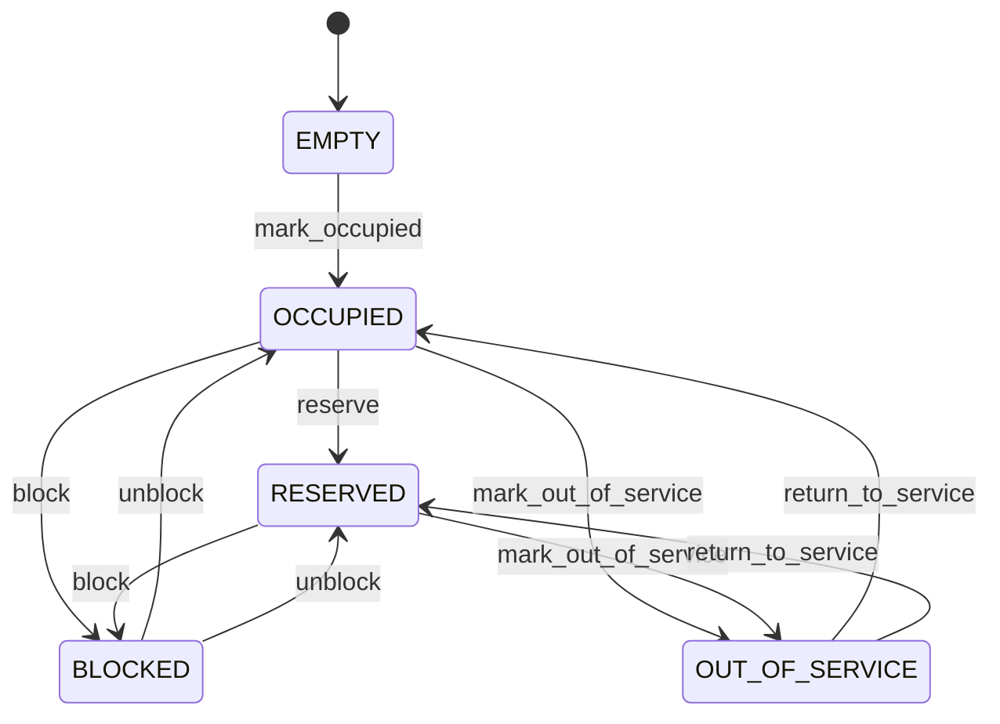

# Yard Tier

Represents the final, atomic physical position used to place and retrieve a container in a structured yard. YardSlot answers the operational question "exactly where is this container?" It is the location at which a move becomes physically executable and where occupancy can be validated without ambiguity. Used by yard management, gate operations, dispatch, crane/handling equipment, inventory visibility, container tracking, rehandling optimization, digital twins, and movement execution. The physical hierarchy is Yard → YardBlock → YardBay → YardTier → YardSlot. Container references the current slot, while ContainerMovement records every meaningful relocation. YardSlot should therefore represent current physical state, not the movement history. A valid placement requires the slot to be usable and compatible with the container's size, type, weight, hazardous classification, reefer requirements, stack rules, equipment access, and yard policy. A sophisticated allocator should also consider expected dwell time, retrieval priority, traffic distance, rehandle probability, and energy/equipment cost. Slot occupancy is current state. When a container moves, the origin becomes available and the destination becomes occupied as part of one controlled movement transaction. Historical positions must remain queryable from ContainerMovement so audit, dwell-time, rehandle, and optimization analysis are not lost. Latitude and longitude enable mapping and route calculations but are supplementary. Hierarchical addressing remains the authoritative operational structure because adjacent slots, stack relationships, and equipment access cannot be inferred reliably from coordinates alone. A slot is configured, may become active and empty, can be reserved for an expected placement, becomes occupied when a container arrives, and returns to empty after a successful departure. It can also be blocked or taken out of service without deleting its historical occupancy. Slot B03-012-04-02 is an EMPTY ground position. The yard optimizer reserves it for an inbound 40-foot container. When the container is physically placed, the slot becomes OCCUPIED and the Container.currentSlot is updated. When the container later moves to a repair area, the movement records the origin and destination and the original slot returns to EMPTY.

## Finding records

Lines are added from the parent: open a **Yard Bay** and choose the **Yard Tier** tab.

The list shows Slot Code, Position, Status, Latitude, Longitude, Tier, with the most recently changed record first. The **Help** button beside the title opens this window's help text.

- **Search**: type in the search box above the grid to narrow the rows. **Search** at the top left opens advanced search, where you pick a field, a comparison (equals, contains, starts with, before, after, and so on) and a value.
- **Sort**: click a column heading; click again to reverse.
- **Refresh**: the refresh button at the top right re-reads the rows and every dropdown, so a record created a moment ago by someone else appears.
- **Export**: **CSV** downloads the rows you are looking at.
- **Open a record**: click a row. The line under the title, "Showing 1 to n of N entries", tells you how many rows match.

## Adding a line

Open the parent record, choose the **Yard Tier** tab and use **New**. The line is tied to its parent automatically.

## Reading, changing and deleting a record

Click a row to open the record. Above the fields are the arrows that step through the list ("1 of 5"). Below them sit **Notes**, where anyone may leave a comment on the record, and the **Audit Trail**, which lists every change with who made it, when, and which fields changed.

- **Edit** (toolbar) makes the fields editable. Change them and choose **Save**; **Undo Changes** puts back what you changed and **Cancel Editing** leaves edit mode.
- **Copy Record** starts a new record from this one.
- **Delete Record** is available in edit mode and asks you to confirm; a record other records still depend on cannot be deleted.

Every change is also written to the [Audit Log](/administration/#audit-log).

## Fields

| Field | What you use | Rules | What to enter |
| --- | --- | --- | --- |
| Slot Code | Text | Required, Up to 100 characters | The human-readable operational address of the exact yard position. Provides the address operators use to identify where a container should be placed or retrieved. Used in handheld devices, yard maps, gate/interchange documents, move orders, search, reports, and equipment instructions. Its meaning is derived from the YardBlock, YardBay, YardTier, and local position hierarchy; it is not a substitute for those structural relationships. Required because yard execution needs an unambiguous physical address. |
| Position | Whole number | Required | The ordinal horizontal position of the slot within its parent YardTier according to the yard's addressing convention. Distinguishes adjacent storage positions on the same tier and provides deterministic placement/navigation. Used for physical addressing, yard visualization, movement planning, and layout validation. Position is scoped to the parent tier and should not be interpreted as a global coordinate or geographic distance. Required to identify the exact position within the tier. |
| Status | Choice | Required | The current operational state of the storage position. Determines whether the position is available, physically occupied, preallocated, temporarily restricted, or physically unavailable. Drives allocation, movement validation, yard optimization, equipment dispatch, and exception handling. OCCUPIED represents actual current placement; RESERVED represents intended future placement; BLOCKED and OUT_OF_SERVICE prevent normal placement regardless of whether the position is physically empty. Physically available for a valid container placement. Currently occupied by exactly one container. Held for an expected move or planned placement but not yet physically occupied. Temporarily unavailable because of an operational restriction such as traffic, safety, inspection, congestion, or local control. Physically or administratively unavailable for an extended reason such as damage, maintenance, construction, or reconfiguration. Required because slot state is an execution constraint for every placement or relocation. Choose one: Empty, Occupied, Reserved, Blocked, Out of service. |
| Latitude | Amount | Optional | The geographic latitude of the physical slot or its defined mapping reference point. Allows the atomic yard position to participate in geospatial visualization and route calculations. Used by digital twins, mapping, equipment routing, geospatial analysis, and integration with external mapping services. Coordinates complement hierarchical addressing and should correspond to the same physical position represented by slotCode. Optional where the yard operates entirely from a logical grid or local coordinate system. |
| Longitude | Amount | Optional | The geographic longitude of the physical slot or its defined mapping reference point. Completes the geographic coordinate for the exact storage position. Used with latitude for mapping, visualization, route calculation, and geospatial analysis. Longitude must describe the same physical reference point as latitude and does not replace the operational hierarchy. Optional where geographic coordinates are not maintained at slot level. |
| Tier | Lookup | Required | Places the slot within its parent YardTier and therefore determines its complete physical yard hierarchy. Used to derive bay, block, and yard context and validate addressing and stacking rules. Every YardSlot belongs to exactly one YardTier. Tier provides vertical context; position supplies local horizontal context; together with the parent hierarchy they identify the atomic storage address. Pick a record from **Yard Bay**. |

## How it connects to other records

A yard tier is a line of a **Yard Bay**. It has no window of its own: open the yard bay and use the **Yard Tier** tab to see and add lines.
- A yard tier has one **Container**.
- A yard tier has many **Container Movement** records.
- A yard tier belongs to one **Yard Bay**.

## Lifecycle: Yard slot lifecycle

A yard tier record starts as **Empty**. Open a record and the bar above its fields shows its current **State** and, after **Next**, a button for each move that leaves it; choose one to make the move. Any move the diagram does not draw is refused, for everyone including the administrator.

| From | To | Move |
| --- | --- | --- |
| Empty | Occupied | Mark occupied |
| Occupied | Reserved | Reserve |
| Occupied | Blocked | Block |
| Blocked | Occupied | Unblock |
| Reserved | Blocked | Block |
| Blocked | Reserved | Unblock |
| Occupied | Out of service | Mark out of service |
| Out of service | Occupied | Return to service |
| Reserved | Out of service | Mark out of service |
| Out of service | Reserved | Return to service |

## What happens when you save
Business rules run around the save. They are listed here and explained in full under [Business rules](/administration/rules/).

| Rule | When | Order |
| --- | --- | --- |
| Yard slot workflows after update | after a yard tier is changed | 100 |

Processes started from this record: [Yard slot exception raised](/administration/processes/#yard-slot-exception-raised).

## Who may use it

Anyone who holds a role with access to the **Yard Tier** window. Access is granted by role under [Roles and access](/administration/access/).
