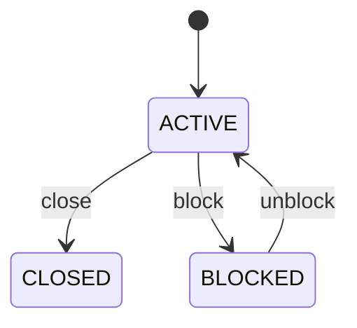

# Yard Bay

Represents one vertical level in a container stack and provides the model's explicit representation of stacking height and access dependency. YardTier answers the question "how high in this bay is the position?" It is essential for calculating stack height, determining whether equipment can reach a container, and understanding whether retrieving one container requires moving containers above it. Used by yard allocation, crane planning, stacking validation, rehandle optimization, safety controls, capacity planning, digital-twin visualization, and operational reporting. The physical hierarchy is Yard → YardBlock → YardBay → YardTier → YardSlot. YardTier should not be treated as the final location of a container; YardSlot is the atomic position. Container.currentSlot points to the exact position, while ContainerMovement records changes between positions. A higher tier generally implies greater retrieval dependency because containers beneath it can obstruct direct access. Placement algorithms therefore consider tier height together with container weight, allowable stacking, equipment reach, dwell time, expected retrieval order, hazardous/reefer rules, and rehandle cost. A tier can be structurally valid but operationally unusable because of equipment or safety restrictions. A tier can be active, temporarily blocked, or closed. Changing its status must not erase existing occupancy. If containers must be relocated, those relocations are explicit ContainerMovement events and the resulting slot state is updated separately. Bay B03-12 has tiers 1 through 5. A container at Tier 4 is above three lower stack positions. If the Tier 1 container is needed urgently, the yard optimizer may calculate one or more rehandles before retrieval. The tier model therefore directly contributes to movement cost and yard optimization.

## Finding records

Lines are added from the parent: open a **Yard Block** and choose the **Yard Bay** tab.

The list shows Tier Number, Status, Bay, with the most recently changed record first. The **Help** button beside the title opens this window's help text.

- **Search**: type in the search box above the grid to narrow the rows. **Search** at the top left opens advanced search, where you pick a field, a comparison (equals, contains, starts with, before, after, and so on) and a value.
- **Sort**: click a column heading; click again to reverse.
- **Refresh**: the refresh button at the top right re-reads the rows and every dropdown, so a record created a moment ago by someone else appears.
- **Export**: **CSV** downloads the rows you are looking at.
- **Open a record**: click a row. The line under the title, "Showing 1 to n of N entries", tells you how many rows match.

## Adding a line

Open the parent record, choose the **Yard Bay** tab and use **New**. The line is tied to its parent automatically.

## Reading, changing and deleting a record

Click a row to open the record. Above the fields are the arrows that step through the list ("1 of 5"). Below them sit **Notes**, where anyone may leave a comment on the record, and the **Audit Trail**, which lists every change with who made it, when, and which fields changed.

- **Edit** (toolbar) makes the fields editable. Change them and choose **Save**; **Undo Changes** puts back what you changed and **Cancel Editing** leaves edit mode.
- **Copy Record** starts a new record from this one.
- **Delete Record** is available in edit mode and asks you to confirm; a record other records still depend on cannot be deleted.

Every change is also written to the [Audit Log](/administration/#audit-log).

## Fields

| Field | What you use | Rules | What to enter |
| --- | --- | --- | --- |
| Tier Number | Whole number | Required | The ordinal vertical level of the tier within its parent YardBay. Expresses how high the tier is in the stack according to the yard's numbering convention, normally with 1 as the lowest level. Used to validate stack height, determine access dependencies, calculate rehandle risk, generate physical addresses, and instruct yard equipment. Tier number has meaning only within its YardBay; it is not a global location identifier. Required because vertical position is fundamental to container stacking. |
| Status | Choice | Required | The operational availability of the entire stack level. Determines whether subordinate positions can normally be used for placement, retrieval, or relocation. Used by allocation, stacking, crane planning, safety, and yard optimization algorithms. Tier status can make all subordinate YardSlots operationally unavailable even if their individual status is ACTIVE. Positions may be used subject to slot, container, equipment, safety, and yard rules. The tier is temporarily unavailable, for example because of equipment reach limits, safety restrictions, inspection, damage, or operational constraints. The tier is administratively unavailable for normal operations until explicitly reactivated or reconfigured. Required because a tier-level restriction propagates to its subordinate positions. Choose one: Active, Blocked, Closed. |
| Bay | Lookup | Required | Places the tier within its parent YardBay and therefore within the containing block and yard. Provides the physical addressing scope, inherited operating constraints, and relationship to other stack levels in the same bay. Every YardTier belongs to exactly one YardBay. The bay provides horizontal context; the tier provides vertical context. Pick a record from **Yard Block**. |

## How it connects to other records

A yard bay is a line of a **Yard Block**. It has no window of its own: open the yard block and use the **Yard Bay** tab to see and add lines.
- A yard bay belongs to one **Yard Block**.
- A yard bay has many **Yard Tier** records.

## Lifecycle: Yard tier lifecycle

A yard bay record starts as **Active** and ends as **Closed**. Open a record and the bar above its fields shows its current **State** and, after **Next**, a button for each move that leaves it; choose one to make the move. Any move the diagram does not draw is refused, for everyone including the administrator.

| From | To | Move |
| --- | --- | --- |
| Active | Closed | Close |
| Active | Blocked | Block |
| Blocked | Active | Unblock |

## What happens when you save
Business rules run around the save. They are listed here and explained in full under [Business rules](/administration/rules/).

| Rule | When | Order |
| --- | --- | --- |
| Yard tier workflows after update | after a yard bay is changed | 100 |

Processes started from this record: [Yard tier exception raised](/administration/processes/#yard-tier-exception-raised).

## Who may use it

Anyone who holds a role with access to the **Yard Bay** window. Access is granted by role under [Roles and access](/administration/access/).
