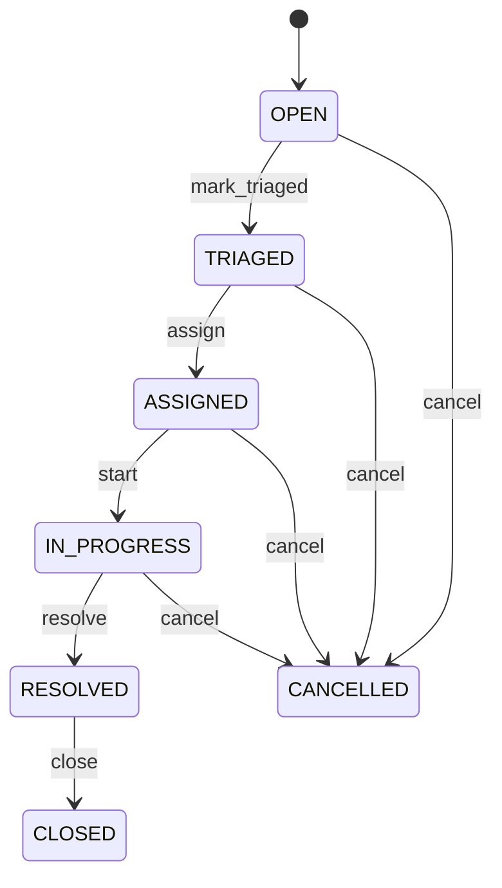

# Service Request

Represents a service management entity called ServiceRequest within the CEDM business model. ServiceRequest is a business concept with its own identity and lifecycle. It captures information that must remain understandable independently of a database, API, or user interface. Used by business processes, transactions, forms, reports, integrations, and domain capabilities that create, find, change, or relate ServiceRequest records. The entity participates in a wider business graph through relationships with Party, Party, Organization, Location, Task. These relationships provide the context needed to interpret the record rather than treating its fields as isolated database columns. The entity lifecycle is governed by its status, invariants, and related business processes. State changes must preserve the declared business meaning and relationships. A typical ServiceRequest record represents one identifiable business occurrence or master-data object that can be referenced by related CEDM processes.

## Finding records

Open **Service Request** from the menu or from its card on the dashboard.

The list shows Request Number, Request Type, Description, Priority, Status, Requested At, Resolved At, with the most recently changed record first. The **Help** button beside the title opens this window's help text.

- **Search**: type in the search box above the grid to narrow the rows. **Search** at the top left opens advanced search, where you pick a field, a comparison (equals, contains, starts with, before, after, and so on) and a value.
- **Sort**: click a column heading; click again to reverse.
- **Refresh**: the refresh button at the top right re-reads the rows and every dropdown, so a record created a moment ago by someone else appears.
- **Export**: **CSV** downloads the rows you are looking at.
- **Open a record**: click a row. The line under the title, "Showing 1 to n of N entries", tells you how many rows match.

## Creating a record

Choose **New** at the top of the list. The form opens on its own page, with the fields in sections. A badge beside each label names the control (Text, Dropdown, Date, and so on); a red star marks a required field; the question-mark icon shows that field's help; and a hint such as “max 300” shows the longest entry accepted.

1. Fill in the fields described under [Fields](#fields).
2. These are required and must be completed before the record can be saved: **Request Number**, **Request Type**, **Description**, **Priority**, **Status**, **Requested At**, **Requester**.
3. For a dropdown that points at another window, pick the matching record; if the record you need does not exist yet, create it in its own window first. A dropdown may narrow to what you have already chosen, for example the states of the chosen country.
4. Choose **Create** (or **Save** in the toolbar). You return to the record, and it appears at the top of the list. If something is wrong the form says which field and why, and nothing is saved.

## Reading, changing and deleting a record

Click a row to open the record. Above the fields are the arrows that step through the list ("1 of 5"). Below them sit **Notes**, where anyone may leave a comment on the record, and the **Audit Trail**, which lists every change with who made it, when, and which fields changed.

- **Edit** (toolbar) makes the fields editable. Change them and choose **Save**; **Undo Changes** puts back what you changed and **Cancel Editing** leaves edit mode.
- **Copy Record** starts a new record from this one.
- **Delete Record** is available in edit mode and asks you to confirm; a record other records still depend on cannot be deleted.

Every change is also written to the [Audit Log](/administration/#audit-log).

## Fields

| Field | What you use | Rules | What to enter |
| --- | --- | --- | --- |
| Request Number | Text | Required, Unique, Up to 100 characters | Captures the business meaning of request number for the ServiceRequest. It is interpreted together with the entity's other attributes and relationships to support the processes that manage this record. Used when creating, reviewing, searching, validating, reporting on, or integrating ServiceRequest records, where applicable. Its meaning is specific to ServiceRequest; it must be interpreted with the entity's relationships, lifecycle, and business rules rather than as an isolated technical value. Required because the business model cannot reliably interpret the record for its declared purpose without this value. |
| Request Type | Text | Required, Up to 100 characters | Captures the business meaning of request type for the ServiceRequest. It is interpreted together with the entity's other attributes and relationships to support the processes that manage this record. Used when creating, reviewing, searching, validating, reporting on, or integrating ServiceRequest records, where applicable. Its meaning is specific to ServiceRequest; it must be interpreted with the entity's relationships, lifecycle, and business rules rather than as an isolated technical value. Required because the business model cannot reliably interpret the record for its declared purpose without this value. |
| Description | Text | Required, Up to 4000 characters | A business description that explains the purpose, scope, or meaning of the record to users and downstream processes. Used when creating, reviewing, searching, validating, reporting on, or integrating ServiceRequest records, where applicable. Its meaning is specific to ServiceRequest; it must be interpreted with the entity's relationships, lifecycle, and business rules rather than as an isolated technical value. Required because the business model cannot reliably interpret the record for its declared purpose without this value. |
| Priority | Choice | Required | Captures the business meaning of priority for the ServiceRequest. It is interpreted together with the entity's other attributes and relationships to support the processes that manage this record. Used when creating, reviewing, searching, validating, reporting on, or integrating ServiceRequest records, where applicable. Its meaning is specific to ServiceRequest; it must be interpreted with the entity's relationships, lifecycle, and business rules rather than as an isolated technical value. Represents the low state or classification in the context of ServiceRequest. Represents the normal state or classification in the context of ServiceRequest. Represents the high state or classification in the context of ServiceRequest. Represents the critical state or classification in the context of ServiceRequest. Required because the business model cannot reliably interpret the record for its declared purpose without this value. Choose one: Low, Normal, High, Critical. |
| Status | Choice | Required | The lifecycle state of the record. It controls which business actions are normally permitted and how the record is treated by related processes. Used when creating, reviewing, searching, validating, reporting on, or integrating ServiceRequest records, where applicable. Its meaning is specific to ServiceRequest; it must be interpreted with the entity's relationships, lifecycle, and business rules rather than as an isolated technical value. Represents the open state or classification in the context of ServiceRequest. Represents the triaged state or classification in the context of ServiceRequest. Represents the assigned state or classification in the context of ServiceRequest. Represents the in progress state or classification in the context of ServiceRequest. Represents the resolved state or classification in the context of ServiceRequest. Represents the closed state or classification in the context of ServiceRequest. Represents the cancelled state or classification in the context of ServiceRequest. Required because the business model cannot reliably interpret the record for its declared purpose without this value. Choose one: Open, Triaged, Assigned, In progress, Resolved, Closed, Cancelled. |
| Requested At | Date and time | Required | Records when the requested event occurred. It establishes chronology, supports auditability, and helps coordinate related lifecycle and process activities. Used when creating, reviewing, searching, validating, reporting on, or integrating ServiceRequest records, where applicable. Its meaning is specific to ServiceRequest; it must be interpreted with the entity's relationships, lifecycle, and business rules rather than as an isolated technical value. Required because the business model cannot reliably interpret the record for its declared purpose without this value. |
| Resolved At | Date and time | Optional | Records when the resolved event occurred. It establishes chronology, supports auditability, and helps coordinate related lifecycle and process activities. Used when creating, reviewing, searching, validating, reporting on, or integrating ServiceRequest records, where applicable. Its meaning is specific to ServiceRequest; it must be interpreted with the entity's relationships, lifecycle, and business rules rather than as an isolated technical value. Optional because the business concept can remain valid when this value is not yet known or is not applicable. |
| Requester | Lookup | Required | Connects ServiceRequest to Party so related business context can be navigated and enforced. Used when processes need to find or reason about Party records associated with a ServiceRequest. The declared cardinality 1 expresses how many related records may participate in the relationship. The relationship is part of the CEDM semantic graph and is interpreted together with source and target entities, ownership, conditions, and invariants. Pick a record from **Party**. |
| Organization | Lookup | Optional | Connects ServiceRequest to Organization so related business context can be navigated and enforced. Used when processes need to find or reason about Organization records associated with a ServiceRequest. The declared cardinality 0..1 expresses how many related records may participate in the relationship. The relationship is part of the CEDM semantic graph and is interpreted together with source and target entities, ownership, conditions, and invariants. Pick a record from **Organization**. |
| Location | Lookup | Optional | Connects ServiceRequest to Location so related business context can be navigated and enforced. Used when processes need to find or reason about Location records associated with a ServiceRequest. The declared cardinality 0..1 expresses how many related records may participate in the relationship. The relationship is part of the CEDM semantic graph and is interpreted together with source and target entities, ownership, conditions, and invariants. Pick a record from **Location**. |
| Service Level Agreement | Lookup | Optional | SLA governing request service targets. Supplies response/resolution commitments. Deadline, escalation and compliance measurement. Optional when no SLA applies. Applied SLA/version must be retained for historical measurement. Pick a record from **Service Level Agreement**. |

## How it connects to other records
- A service request belongs to one **Party**.
- A service request belongs to one **Organization**.
- A service request belongs to one **Location**.
- A service request has many **Task** records.
- A service request belongs to one **Service Level Agreement**.

## Lifecycle: Service request lifecycle

A service request record starts as **Open** and ends as **Closed** or **Cancelled**. Open a record and the bar above its fields shows its current **State** and, after **Next**, a button for each move that leaves it; choose one to make the move. Any move the diagram does not draw is refused, for everyone including the administrator.

| From | To | Move |
| --- | --- | --- |
| Open | Triaged | Mark triaged |
| Triaged | Assigned | Assign |
| Assigned | In progress | Start |
| In progress | Resolved | Resolve |
| Resolved | Closed | Close |
| Open | Cancelled | Cancel |
| Triaged | Cancelled | Cancel |
| Assigned | Cancelled | Cancel |
| In progress | Cancelled | Cancel |

## What happens when you save
Business rules run around the save. They are listed here and explained in full under [Business rules](/administration/rules/).

| Rule | When | Order |
| --- | --- | --- |
| Service request workflows after update | after a service request is changed | 100 |

Processes started from this record: [Service request follow up required](/administration/processes/#service-request-follow-up-required).

## Who may use it

Anyone who holds a role with access to the **Service Request** window. Access is granted by role under [Roles and access](/administration/access/).
