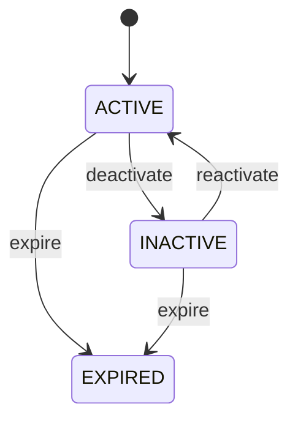

# Party Role

The bridge between stable Party identity and contextual business participation. Party answers who the actor is; PartyRole answers how that actor participates; Customer and Supplier add role-specific commercial behavior. Foundation for sales, procurement, employment, logistics, ownership, contracts, finance, and relationship management. Customer and Supplier specialize PartyRole. Party identity is never duplicated in those specializations. Transaction entities should retain the role context that was effective when the transaction was created or confirmed. Party onboarding → PartyRole creation → role-specific qualification/controls → transaction eligibility → transaction creation → transaction lifecycle. Role changes affect future eligibility but preserve historical role attribution. Create role → validate scope/eligibility → activate → optionally inactivate/expire → preserve historical references. A role ending does not end the Party or unrelated roles. One organization can be a Customer and Supplier simultaneously. Its Party record is shared; each PartyRole has its own roleType, scope, lifecycle, and specialized controls. A SalesOrder references the Customer role while a PurchaseOrder references the Supplier role.

## Finding records

Open **Party Role** from the menu or from its card on the dashboard.

The list shows Party, Role Type, Code, Valid From, Valid To, Status, Person, with the most recently changed record first. The **Help** button beside the title opens this window's help text.

- **Search**: type in the search box above the grid to narrow the rows. **Search** at the top left opens advanced search, where you pick a field, a comparison (equals, contains, starts with, before, after, and so on) and a value.
- **Sort**: click a column heading; click again to reverse.
- **Refresh**: the refresh button at the top right re-reads the rows and every dropdown, so a record created a moment ago by someone else appears.
- **Export**: **CSV** downloads the rows you are looking at.
- **Open a record**: click a row. The line under the title, "Showing 1 to n of N entries", tells you how many rows match.

## Creating a record

Choose **New** at the top of the list. The form opens on its own page, with the fields in sections. A badge beside each label names the control (Text, Dropdown, Date, and so on); a red star marks a required field; the question-mark icon shows that field's help; and a hint such as “max 300” shows the longest entry accepted.

1. Fill in the fields described under [Fields](#fields).
2. These are required and must be completed before the record can be saved: **Party**, **Role Type**, **Status**.
3. For a dropdown that points at another window, pick the matching record; if the record you need does not exist yet, create it in its own window first. A dropdown may narrow to what you have already chosen, for example the states of the chosen country.
4. Choose **Create** (or **Save** in the toolbar). You return to the record, and it appears at the top of the list. If something is wrong the form says which field and why, and nothing is saved.

## Reading, changing and deleting a record

Click a row to open the record. Above the fields are the arrows that step through the list ("1 of 5"). Below them sit **Notes**, where anyone may leave a comment on the record, and the **Audit Trail**, which lists every change with who made it, when, and which fields changed.

- **Edit** (toolbar) makes the fields editable. Change them and choose **Save**; **Undo Changes** puts back what you changed and **Cancel Editing** leaves edit mode.
- **Copy Record** starts a new record from this one.
- **Delete Record** is available in edit mode and asks you to confirm; a record other records still depend on cannot be deleted.

Every change is also written to the [Audit Log](/administration/#audit-log).

## Fields

| Field | What you use | Rules | What to enter |
| --- | --- | --- | --- |
| Party | Lookup | Required | Identifies the underlying person or organization performing this role. Provides common identity without duplicating Party data. One Party may have multiple PartyRoles simultaneously or historically. Connects role-specific processing back to the canonical identity. Required because a role cannot exist without a participant. Pick a record from **Party**. |
| Role Type | Choice | Required | Defines the business capacity in which the Party participates. Determines specialized capabilities, policies, workflows, and validations. Separate from Party.partyType, which describes whether the participant is a person or organization. Selects the applicable downstream role specialization and business process. Required for contextual participation. The role type of the party role is customer; set it when that is what the business means for this record. The role type of the party role is supplier; set it when that is what the business means for this record. The role type of the party role is employee; set it when that is what the business means for this record. The role type of the party role is partner; set it when that is what the business means for this record. The role type of the party role is carrier; set it when that is what the business means for this record. The role type of the party role is agent; set it when that is what the business means for this record. The role type of the party role is contractor; set it when that is what the business means for this record. The role type of the party role is owner; set it when that is what the business means for this record. The role type of the party role is investor; set it when that is what the business means for this record. The role type of the party role is other; set it when that is what the business means for this record. Choose one: Customer, Supplier, Employee, Partner, Carrier, Agent, Contractor, Owner, Investor, Other. |
| Code | Text | Up to 100 characters | Optional business-context identifier for this role instance. Supports operational search, integrations, reports, and legacy references. Identifies the role instance and must not replace Party or specialized role identifiers. Optional when partyRoleId is sufficient. |
| Valid From | Date | Optional | Date from which this role is eligible for ordinary business processing. Used by eligibility and transaction validation. Works with validTo and status; ending a role does not delete Party identity or other roles. Prevents premature use of a newly established role. Optional for immediately effective roles. |
| Valid To | Date | Optional | Date after which the role is no longer normally eligible for new business processing. Used by eligibility, renewal, reporting, and expiry workflows. Historical transactions may continue referencing the role after validTo. Prevents new use after role expiration while preserving historical attribution. Optional for open-ended roles. |
| Status | Choice | Required | Operational lifecycle of the PartyRole relationship. Controls whether the role can normally participate in new transactions, assignments, or authorizations. Role status is independent of Party.status and other PartyRole statuses. ACTIVE permits normal role use; INACTIVE temporarily prevents ordinary use; EXPIRED represents ended validity. Required for role eligibility decisions. The status of the party role is active; set it when that is what the business means for this record. The status of the party role is inactive; set it when that is what the business means for this record. The status of the party role is expired; set it when that is what the business means for this record. Choose one: Active, Inactive, Expired. |
| Person | Lookup | Optional | The Person this PartyRole belongs to. Pick a record from **Person**. |
| Organization | Lookup | Optional | Optional organizational scope in which the role is recognized. Supports multi-enterprise, subsidiary, business-unit, and operating-context scenarios. Zero means global/context-independent; one means explicitly scoped to one organization. Determines which organization can use the role for applicable transactions and policies. Pick a record from **Organization**. |

## How it connects to other records
- A party role belongs to one **Party**.
- A party role belongs to one **Person**.
- A party role belongs to one **Organization**.
- A party role has one **Customer**.

## Lifecycle: Party role lifecycle

A party role record starts as **Active** and ends as **Expired**. Open a record and the bar above its fields shows its current **State** and, after **Next**, a button for each move that leaves it; choose one to make the move. Any move the diagram does not draw is refused, for everyone including the administrator.

| From | To | Move |
| --- | --- | --- |
| Active | Inactive | Deactivate |
| Inactive | Active | Reactivate |
| Active | Expired | Expire |
| Inactive | Expired | Expire |

## What happens when you save
Business rules run around the save. They are listed here and explained in full under [Business rules](/administration/rules/).

| Rule | When | Order |
| --- | --- | --- |
| Party role invariants before create | before a party role is created | 100 |
| Party role invariants before update | before a party role is changed | 100 |

## Who may use it

Anyone who holds a role with access to the **Party Role** window. Access is granted by role under [Roles and access](/administration/access/).
