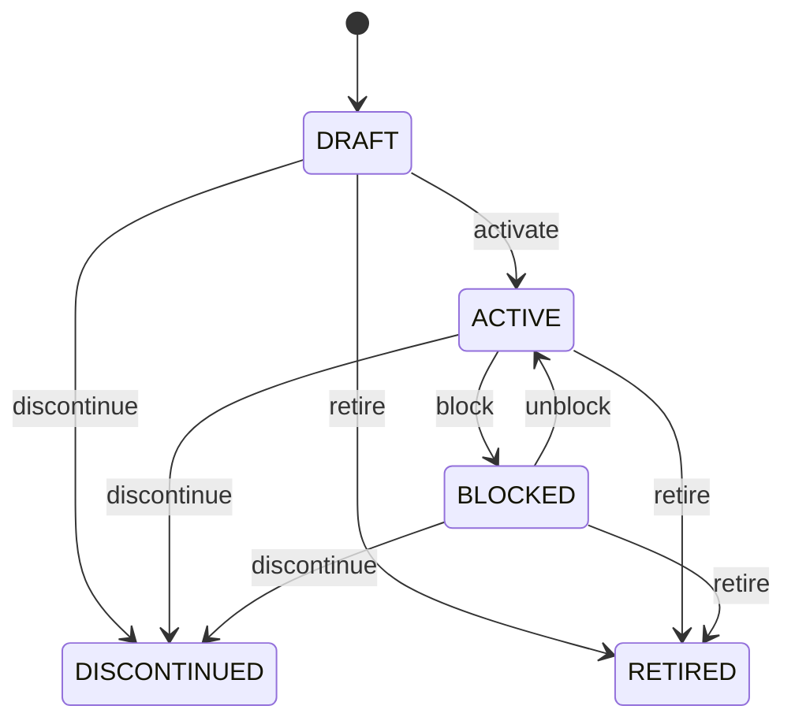

# Product

Governed product-family variation for configuration-specific commercial and operational use. Product defines the family/item concept; ProductVariant identifies a specific option combination such as size, color, grade or pack configuration. PIM, catalog, e-commerce, sales, procurement, inventory and manufacturing. Variant inherits/shared semantics from Product while allowing configuration-specific identity and SKU. Draft → active → blocked/discontinued → retired. Status/configuration changes revalidate open variant-specific demand and supply while preserving historical transactions.

## Finding records

Lines are added from the parent: open a **Product** and choose the **Product** tab.

The list shows Code, Sku, Status, Product, with the most recently changed record first. The **Help** button beside the title opens this window's help text.

- **Search**: type in the search box above the grid to narrow the rows. **Search** at the top left opens advanced search, where you pick a field, a comparison (equals, contains, starts with, before, after, and so on) and a value.
- **Sort**: click a column heading; click again to reverse.
- **Refresh**: the refresh button at the top right re-reads the rows and every dropdown, so a record created a moment ago by someone else appears.
- **Export**: **CSV** downloads the rows you are looking at.
- **Open a record**: click a row. The line under the title, "Showing 1 to n of N entries", tells you how many rows match.

## Adding a line

Open the parent record, choose the **Product** tab and use **New**. The line is tied to its parent automatically.

## Reading, changing and deleting a record

Click a row to open the record. Above the fields are the arrows that step through the list ("1 of 5"). Below them sit **Notes**, where anyone may leave a comment on the record, and the **Audit Trail**, which lists every change with who made it, when, and which fields changed.

- **Edit** (toolbar) makes the fields editable. Change them and choose **Save**; **Undo Changes** puts back what you changed and **Cancel Editing** leaves edit mode.
- **Copy Record** starts a new record from this one.
- **Delete Record** is available in edit mode and asks you to confirm; a record other records still depend on cannot be deleted.

Every change is also written to the [Audit Log](/administration/#audit-log).

## Fields

| Field | What you use | Rules | What to enter |
| --- | --- | --- | --- |
| Code | Text | Required, Unique, Up to 100 characters | Business code of variant. Human/integration identifier for the configuration. Catalog and transactions. Distinct from parent Product code. Required. |
| Sku | Text | Up to 100 characters | Stock-keeping code for variant. Operational inventory/commercial identifier where variants are stocked separately. WMS, commerce and integration. Does not replace immutable variant identity. Optional for non-stocked variants. |
| Status | Choice | Required | Variant lifecycle state. Controls future eligibility of this configuration. Catalog and transaction validation. Parent Product restrictions also apply. Being configured. Eligible for governed use. Temporarily prohibited. No longer offered for new demand. Lifecycle closed. Required. Choose one: Draft, Active, Blocked, Discontinued, Retired. |
| Product | Lookup | Required | Parent product family. Supplies shared identity and semantics. Catalog and master-data inheritance. Exactly one parent Product. Parent restrictions propagate to variant eligibility. Pick a record from **Product**. |

## How it connects to other records

A product is a line of a **Product**. It has no window of its own: open the product and use the **Product** tab to see and add lines.
- A product belongs to one **Product**.

## Lifecycle: Product variant lifecycle

A product record starts as **Draft** and ends as **Discontinued** or **Retired**. Open a record and the bar above its fields shows its current **State** and, after **Next**, a button for each move that leaves it; choose one to make the move. Any move the diagram does not draw is refused, for everyone including the administrator.

| From | To | Move |
| --- | --- | --- |
| Draft | Active | Activate |
| Active | Blocked | Block |
| Blocked | Active | Unblock |
| Draft | Discontinued | Discontinue |
| Active | Discontinued | Discontinue |
| Blocked | Discontinued | Discontinue |
| Draft | Retired | Retire |
| Active | Retired | Retire |
| Blocked | Retired | Retire |

## What happens when you save
Business rules run around the save. They are listed here and explained in full under [Business rules](/administration/rules/).

| Rule | When | Order |
| --- | --- | --- |
| Product variant workflows after update | after a product is changed | 100 |

Processes started from this record: [Product variant exception raised](/administration/processes/#product-variant-exception-raised).

## Who may use it

Anyone who holds a role with access to the **Product** window. Access is granted by role under [Roles and access](/administration/access/).
