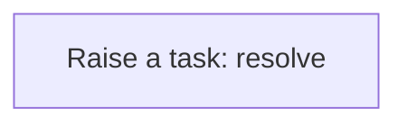
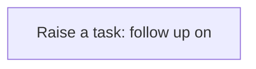
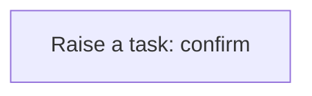

# Processes

A process is a sequence of steps the application runs for you: create a task, update a record, call a service. A business rule usually starts it; you can also run one by hand from the Workflow Designer. Every run is logged step by step in the Workflow Monitor. This application has **6** processes.

## Party exception raised {#party-exception-raised}

When a party is blocked, a high-priority task asks someone to resolve it.

Runs when a **Party** is changed, started by a business rule.

1. **Raise a task: resolve** — creates a **Task** record.

## Exchange rate follow up required {#exchange-rate-follow-up-required}

When a exchange rate is cancelled, a task asks someone to settle what depended on it.

Runs when a **Exchange Rate** is changed, started by a business rule.

1. **Raise a task: follow up on** — creates a **Task** record.

## Organization membership follow up required {#organization-membership-follow-up-required}

When a organization membership is cancelled, a task asks someone to settle what depended on it.

Runs when a **Organization Membership** is changed, started by a business rule.

1. **Raise a task: follow up on** — creates a **Task** record.

## Assignment follow up required {#assignment-follow-up-required}

When a assignment is cancelled, a task asks someone to settle what depended on it.

Runs when a **Assignment** is changed, started by a business rule.

1. **Raise a task: follow up on** — creates a **Task** record.

## Business transaction follow up required {#business-transaction-follow-up-required}

When a business transaction is cancelled or reversed, a task asks someone to settle what depended on it.

Runs when a **Business Transaction** is changed, started by a business rule.

1. **Raise a task: follow up on** — creates a **Task** record.

## Business transaction completion confirmed {#business-transaction-completion-confirmed}

When a business transaction is completed or posted, a task asks someone to confirm the outcome.

Runs when a **Business Transaction** is changed, started by a business rule.

1. **Raise a task: confirm** — creates a **Task** record.

