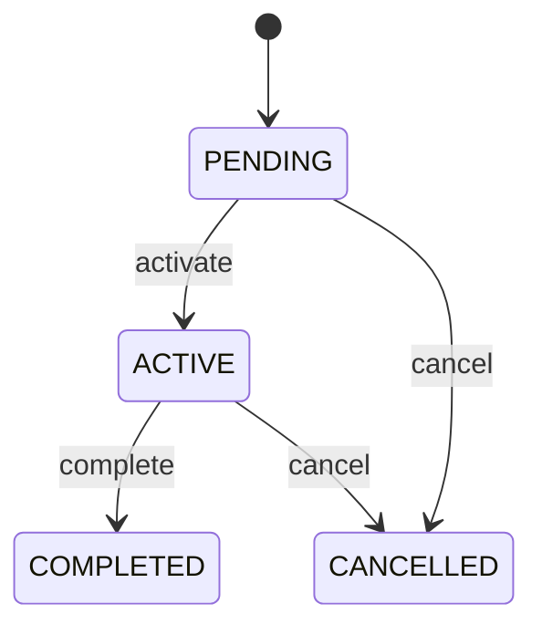

# Assignment

A governed allocation of responsibility for a Task or workflow activity to an eligible user, role, team, or organizational context. Provide implementation-neutral workflow or authorization semantics reusable across CEDM domains. A governed allocation of responsibility for a Task or workflow activity to an eligible user, role, team, or organizational context. Used when enterprise work requires explicit responsibility, state, authorization, or control evidence. Connects to business objects and workflow participants without replacing their domain transaction history. Progresses through governed states with immutable audit evidence for completed or cancelled work. Workflow orchestration, approval, assignment, escalation, access governance, and audit. Cross-domain enterprise process control.

## Finding records

Open **Assignment** from the menu or from its card on the dashboard.

The list shows Status, with the most recently changed record first. The **Help** button beside the title opens this window's help text.

- **Search**: type in the search box above the grid to narrow the rows. **Search** at the top left opens advanced search, where you pick a field, a comparison (equals, contains, starts with, before, after, and so on) and a value.
- **Sort**: click a column heading; click again to reverse.
- **Refresh**: the refresh button at the top right re-reads the rows and every dropdown, so a record created a moment ago by someone else appears.
- **Export**: **CSV** downloads the rows you are looking at.
- **Open a record**: click a row. The line under the title, "Showing 1 to n of N entries", tells you how many rows match.

## Creating a record

Choose **New** at the top of the list. The form opens on its own page, with the fields in sections. A badge beside each label names the control (Text, Dropdown, Date, and so on); a red star marks a required field; the question-mark icon shows that field's help; and a hint such as “max 300” shows the longest entry accepted.

1. Fill in the fields described under [Fields](#fields).
2. These are required and must be completed before the record can be saved: **Status**.
3. For a dropdown that points at another window, pick the matching record; if the record you need does not exist yet, create it in its own window first. A dropdown may narrow to what you have already chosen, for example the states of the chosen country.
4. Choose **Create** (or **Save** in the toolbar). You return to the record, and it appears at the top of the list. If something is wrong the form says which field and why, and nothing is saved.

## Reading, changing and deleting a record

Click a row to open the record. Above the fields are the arrows that step through the list ("1 of 5"). Below them sit **Notes**, where anyone may leave a comment on the record, and the **Audit Trail**, which lists every change with who made it, when, and which fields changed.

- **Edit** (toolbar) makes the fields editable. Change them and choose **Save**; **Undo Changes** puts back what you changed and **Cancel Editing** leaves edit mode.
- **Copy Record** starts a new record from this one.
- **Delete Record** is available in edit mode and asks you to confirm; a record other records still depend on cannot be deleted.

Every change is also written to the [Audit Log](/administration/#audit-log).

## Fields

| Field | What you use | Rules | What to enter |
| --- | --- | --- | --- |
| Status | Choice | Required | Governed lifecycle state of Assignment. Indicates current workflow/control usability. Execution and audit. Terminal history is retained. Awaiting activation or decision. Currently effective or executing. Successfully concluded. Terminated without normal completion. Required. Choose one: Pending, Active, Completed, Cancelled. |

## Lifecycle: Assignment lifecycle

A assignment record starts as **Pending** and ends as **Completed** or **Cancelled**. Open a record and the bar above its fields shows its current **State** and, after **Next**, a button for each move that leaves it; choose one to make the move. Any move the diagram does not draw is refused, for everyone including the administrator.

| From | To | Move |
| --- | --- | --- |
| Pending | Active | Activate |
| Active | Completed | Complete |
| Pending | Cancelled | Cancel |
| Active | Cancelled | Cancel |

## What happens when you save
Business rules run around the save. They are listed here and explained in full under [Business rules](/administration/rules/).

| Rule | When | Order |
| --- | --- | --- |
| Assignment workflows after update | after a assignment is changed | 100 |

Processes started from this record: [Assignment follow up required](/administration/processes/#assignment-follow-up-required).

## Who may use it

Anyone who holds a role with access to the **Assignment** window. Access is granted by role under [Roles and access](/administration/access/).
