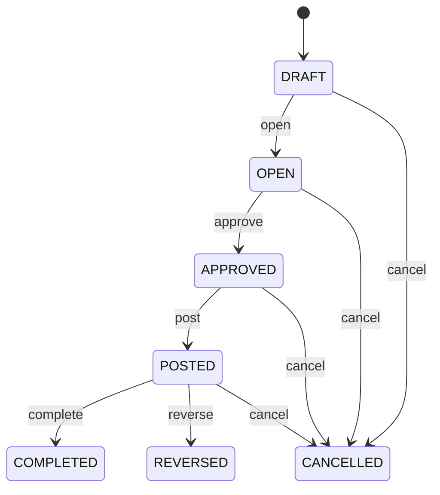

# Business Transaction

Represents a core business transaction called BusinessTransaction within the CEDM business model. BusinessTransaction is a business concept with its own identity and lifecycle. It captures information that must remain understandable independently of a database, API, or user interface. Used by business processes, transactions, forms, reports, integrations, and domain capabilities that create, find, change, or relate BusinessTransaction records. The entity participates in a wider business graph through relationships with Organization, Party, Product, Document, Location. These relationships provide the context needed to interpret the record rather than treating its fields as isolated database columns. The entity lifecycle is governed by its status, invariants, and related business processes. State changes must preserve the declared business meaning and relationships. A typical BusinessTransaction record represents one identifiable business occurrence or master-data object that can be referenced by related CEDM processes.

## Finding records

Open **Business Transaction** from the menu or from its card on the dashboard.

The list shows Transaction Number, Transaction Type, Transaction Date, Status, Currency, Total Amount, Reference Number, with the most recently changed record first. The **Help** button beside the title opens this window's help text.

- **Search**: type in the search box above the grid to narrow the rows. **Search** at the top left opens advanced search, where you pick a field, a comparison (equals, contains, starts with, before, after, and so on) and a value.
- **Sort**: click a column heading; click again to reverse.
- **Refresh**: the refresh button at the top right re-reads the rows and every dropdown, so a record created a moment ago by someone else appears.
- **Export**: **CSV** downloads the rows you are looking at.
- **Open a record**: click a row. The line under the title, "Showing 1 to n of N entries", tells you how many rows match.

## Creating a record

Choose **New** at the top of the list. The form opens on its own page, with the fields in sections. A badge beside each label names the control (Text, Dropdown, Date, and so on); a red star marks a required field; the question-mark icon shows that field's help; and a hint such as “max 300” shows the longest entry accepted.

1. Fill in the fields described under [Fields](#fields).
2. These are required and must be completed before the record can be saved: **Transaction Number**, **Transaction Type**, **Transaction Date**, **Status**.
3. For a dropdown that points at another window, pick the matching record; if the record you need does not exist yet, create it in its own window first. A dropdown may narrow to what you have already chosen, for example the states of the chosen country.
4. Choose **Create** (or **Save** in the toolbar). You return to the record, and it appears at the top of the list. If something is wrong the form says which field and why, and nothing is saved.

## Reading, changing and deleting a record

Click a row to open the record. Above the fields are the arrows that step through the list ("1 of 5"). Below them sit **Notes**, where anyone may leave a comment on the record, and the **Audit Trail**, which lists every change with who made it, when, and which fields changed.

- **Edit** (toolbar) makes the fields editable. Change them and choose **Save**; **Undo Changes** puts back what you changed and **Cancel Editing** leaves edit mode.
- **Copy Record** starts a new record from this one.
- **Delete Record** is available in edit mode and asks you to confirm; a record other records still depend on cannot be deleted.

Every change is also written to the [Audit Log](/administration/#audit-log).

## Fields

| Field | What you use | Rules | What to enter |
| --- | --- | --- | --- |
| Transaction Number | Text | Required, Up to 100 characters | Captures the business meaning of transaction number for the BusinessTransaction. It is interpreted together with the entity's other attributes and relationships to support the processes that manage this record. Used when creating, reviewing, searching, validating, reporting on, or integrating BusinessTransaction records, where applicable. Its meaning is specific to BusinessTransaction; it must be interpreted with the entity's relationships, lifecycle, and business rules rather than as an isolated technical value. Required because the business model cannot reliably interpret the record for its declared purpose without this value. |
| Transaction Type | Text | Required, Up to 100 characters | Captures the business meaning of transaction type for the BusinessTransaction. It is interpreted together with the entity's other attributes and relationships to support the processes that manage this record. Used when creating, reviewing, searching, validating, reporting on, or integrating BusinessTransaction records, where applicable. Its meaning is specific to BusinessTransaction; it must be interpreted with the entity's relationships, lifecycle, and business rules rather than as an isolated technical value. Required because the business model cannot reliably interpret the record for its declared purpose without this value. |
| Transaction Date | Date and time | Required | Records the business date associated with the transaction. It is used in chronology, eligibility, scheduling, reporting, and related business rules. Used when creating, reviewing, searching, validating, reporting on, or integrating BusinessTransaction records, where applicable. Its meaning is specific to BusinessTransaction; it must be interpreted with the entity's relationships, lifecycle, and business rules rather than as an isolated technical value. Required because the business model cannot reliably interpret the record for its declared purpose without this value. |
| Status | Choice | Required | The lifecycle state of the record. It controls which business actions are normally permitted and how the record is treated by related processes. Used when creating, reviewing, searching, validating, reporting on, or integrating BusinessTransaction records, where applicable. Its meaning is specific to BusinessTransaction; it must be interpreted with the entity's relationships, lifecycle, and business rules rather than as an isolated technical value. Represents the draft state or classification in the context of BusinessTransaction. Represents the open state or classification in the context of BusinessTransaction. Represents the approved state or classification in the context of BusinessTransaction. Represents the posted state or classification in the context of BusinessTransaction. Represents the completed state or classification in the context of BusinessTransaction. Represents the cancelled state or classification in the context of BusinessTransaction. Represents the reversed state or classification in the context of BusinessTransaction. Required because the business model cannot reliably interpret the record for its declared purpose without this value. Choose one: Draft, Open, Approved, Posted, Completed, Cancelled, Reversed. |
| Currency | Lookup | Optional | Identifies the currency in which monetary amounts on the record are expressed, allowing amounts to be interpreted and aggregated consistently. Used when creating, reviewing, searching, validating, reporting on, or integrating BusinessTransaction records, where applicable. This field connects BusinessTransaction to Currency. The reference establishes business context between the two entities and lets processes navigate from this record to the related Currency. Optional because the business concept can remain valid when this value is not yet known or is not applicable. Pick a record from **Currency**. |
| Total Amount | Amount | Optional | Captures the business meaning of total amount for the BusinessTransaction. It is interpreted together with the entity's other attributes and relationships to support the processes that manage this record. Used when creating, reviewing, searching, validating, reporting on, or integrating BusinessTransaction records, where applicable. Its meaning is specific to BusinessTransaction; it must be interpreted with the entity's relationships, lifecycle, and business rules rather than as an isolated technical value. Optional because the business concept can remain valid when this value is not yet known or is not applicable. |
| Reference Number | Text | Up to 200 characters | Captures the business meaning of reference number for the BusinessTransaction. It is interpreted together with the entity's other attributes and relationships to support the processes that manage this record. Used when creating, reviewing, searching, validating, reporting on, or integrating BusinessTransaction records, where applicable. Its meaning is specific to BusinessTransaction; it must be interpreted with the entity's relationships, lifecycle, and business rules rather than as an isolated technical value. Optional because the business concept can remain valid when this value is not yet known or is not applicable. |
| Organization | Lookup | Optional | Connects BusinessTransaction to Organization so related business context can be navigated and enforced. Used when processes need to find or reason about Organization records associated with a BusinessTransaction. The declared cardinality 0..1 expresses how many related records may participate in the relationship. The relationship is part of the CEDM semantic graph and is interpreted together with source and target entities, ownership, conditions, and invariants. Pick a record from **ERP**. |
| Location | Lookup | Optional | Connects BusinessTransaction to Location so related business context can be navigated and enforced. Used when processes need to find or reason about Location records associated with a BusinessTransaction. The declared cardinality 0..1 expresses how many related records may participate in the relationship. The relationship is part of the CEDM semantic graph and is interpreted together with source and target entities, ownership, conditions, and invariants. Pick a record from **Location**. |

## How it connects to other records
- A business transaction belongs to one **ERP**.
- A business transaction has many **Party** records.
- A business transaction belongs to one **Location**.

## Lifecycle: Business transaction lifecycle

A business transaction record starts as **Draft** and ends as **Completed** or **Cancelled** or **Reversed**. Open a record and the bar above its fields shows its current **State** and, after **Next**, a button for each move that leaves it; choose one to make the move. Any move the diagram does not draw is refused, for everyone including the administrator.

| From | To | Move |
| --- | --- | --- |
| Draft | Open | Open |
| Open | Approved | Approve |
| Approved | Posted | Post |
| Posted | Completed | Complete |
| Draft | Cancelled | Cancel |
| Open | Cancelled | Cancel |
| Approved | Cancelled | Cancel |
| Posted | Cancelled | Cancel |
| Posted | Reversed | Reverse |

## What happens when you save
Business rules run around the save. They are listed here and explained in full under [Business rules](/administration/rules/).

| Rule | When | Order |
| --- | --- | --- |
| Business transaction invariants before create | before a business transaction is created | 100 |
| Business transaction invariants before update | before a business transaction is changed | 100 |
| Business transaction workflows after update | after a business transaction is changed | 100 |

Processes started from this record: [Business transaction follow up required](/administration/processes/#business-transaction-follow-up-required), [Business transaction completion confirmed](/administration/processes/#business-transaction-completion-confirmed).

## Who may use it

Anyone who holds a role with access to the **Business Transaction** window. Access is granted by role under [Roles and access](/administration/access/).
