# Record lifecycles

A lifecycle is the set of states a record can be in and the moves between them. The application enforces it on every write, through the screen and through the API: a move the diagram does not draw is refused for everyone, administrators included. Role restrictions narrow who may make a particular move. This application has **39** lifecycles.


## Party: Party lifecycle

States: **Active**, **Inactive**, **Blocked**, **Retired**. A new record starts as **Active**; **Retired** ends the lifecycle.

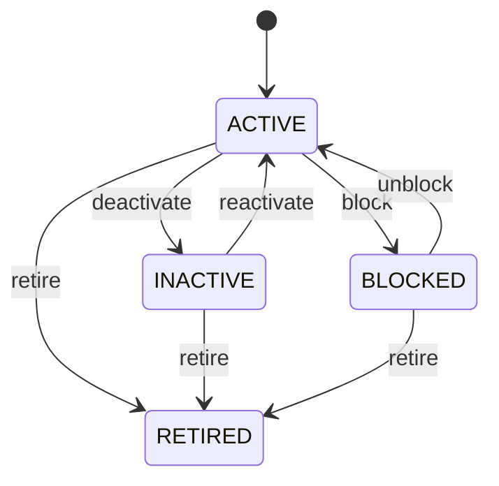

Any role that may change the record may make any move the diagram draws.


See [Party](/entities/foundation/party/) for the record itself.

## Organization: Organization lifecycle

States: **Draft**, **Active**, **Inactive**, **Retired**. A new record starts as **Draft**; **Retired** ends the lifecycle.

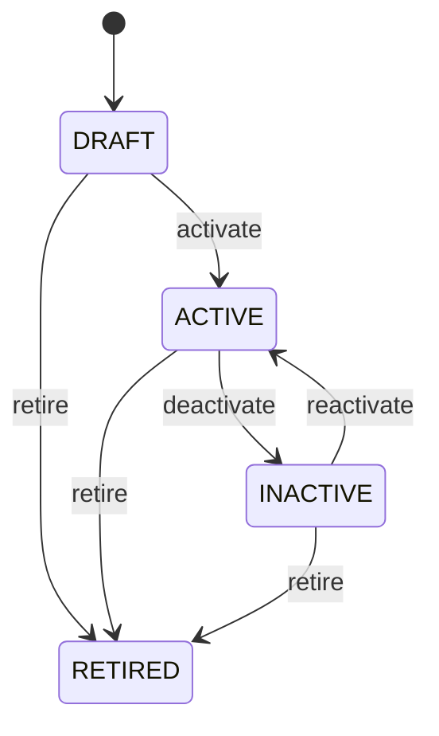

Any role that may change the record may make any move the diagram draws.


See [Organization](/entities/foundation/organization/) for the record itself.

## Party Role: Party role lifecycle

States: **Active**, **Inactive**, **Expired**. A new record starts as **Active**; **Expired** ends the lifecycle.

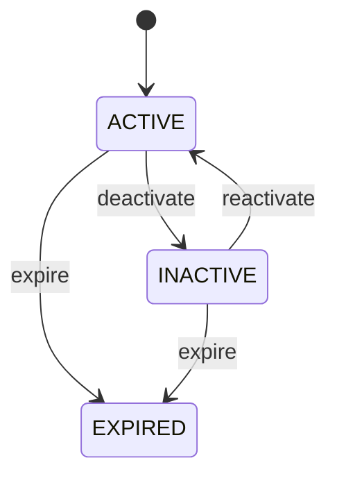

Any role that may change the record may make any move the diagram draws.


See [Party Role](/entities/foundation/party-role/) for the record itself.

## Address: Address lifecycle

States: **Active**, **Inactive**, **Retired**. A new record starts as **Active**; **Retired** ends the lifecycle.

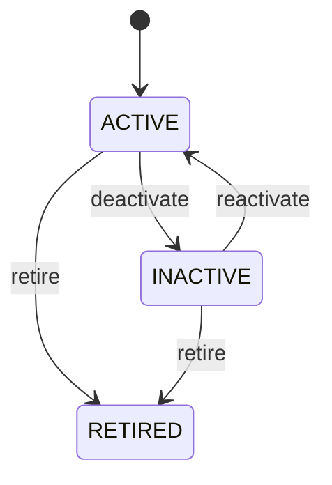

Any role that may change the record may make any move the diagram draws.


See [Address](/entities/foundation/address/) for the record itself.

## Location: Location lifecycle

States: **Planned**, **Active**, **Inactive**, **Closed**, **Retired**. A new record starts as **Planned**; **Closed**, **Retired** ends the lifecycle.

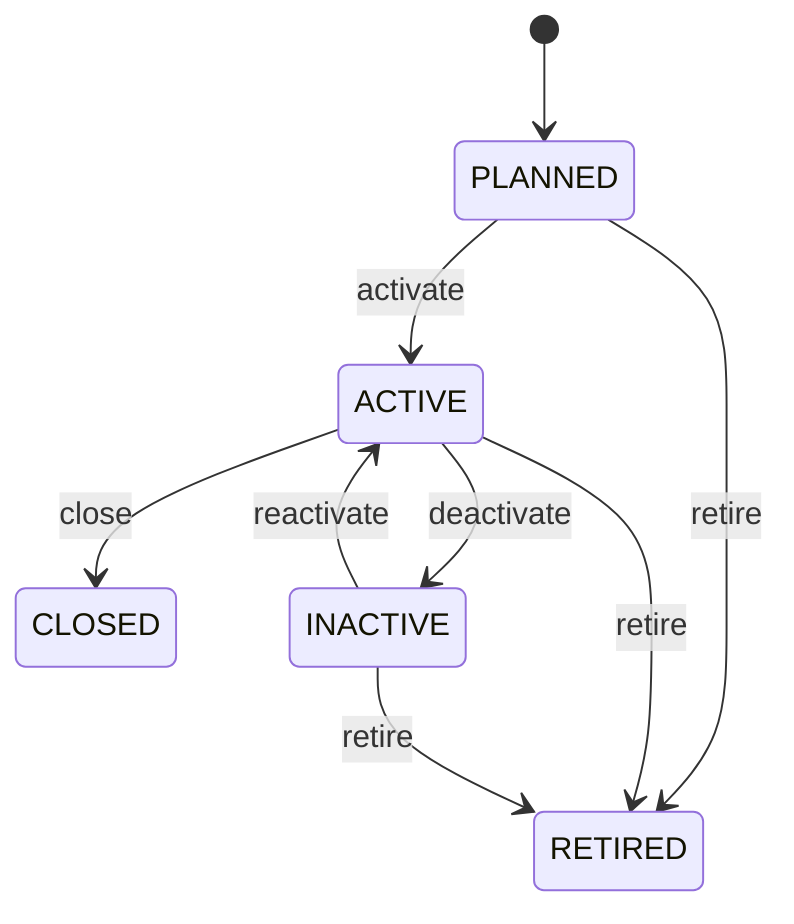

Any role that may change the record may make any move the diagram draws.


See [Location](/entities/foundation/location/) for the record itself.

## Currency: Currency lifecycle

States: **Active**, **Inactive**, **Retired**. A new record starts as **Active**; **Retired** ends the lifecycle.


Any role that may change the record may make any move the diagram draws.


See [Currency](/entities/foundation/currency/) for the record itself.

## Exchange Rate: Exchange rate lifecycle

States: **Draft**, **Active**, **Expired**, **Cancelled**. A new record starts as **Draft**; **Expired**, **Cancelled** ends the lifecycle.

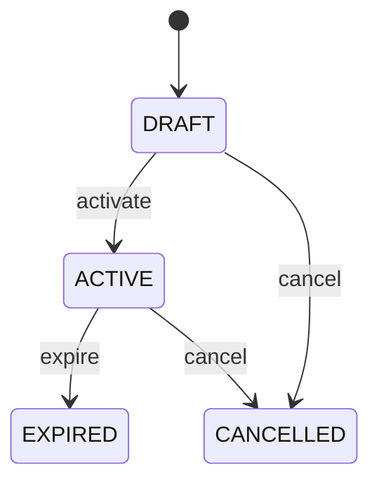

Any role that may change the record may make any move the diagram draws.


See [Exchange Rate](/entities/foundation/exchange-rate/) for the record itself.

## Unit Of Measure: Unit of measure lifecycle

States: **Active**, **Inactive**, **Retired**. A new record starts as **Active**; **Retired** ends the lifecycle.


Any role that may change the record may make any move the diagram draws.


See [Unit Of Measure](/entities/foundation/unit-of-measure/) for the record itself.

## Task: Task lifecycle

States: **Created**, **Ready**, **Assigned**, **In progress**, **Blocked**, **Completed**, **Cancelled**, **Failed**. A new record starts as **Created**; **Completed**, **Cancelled**, **Failed** ends the lifecycle.

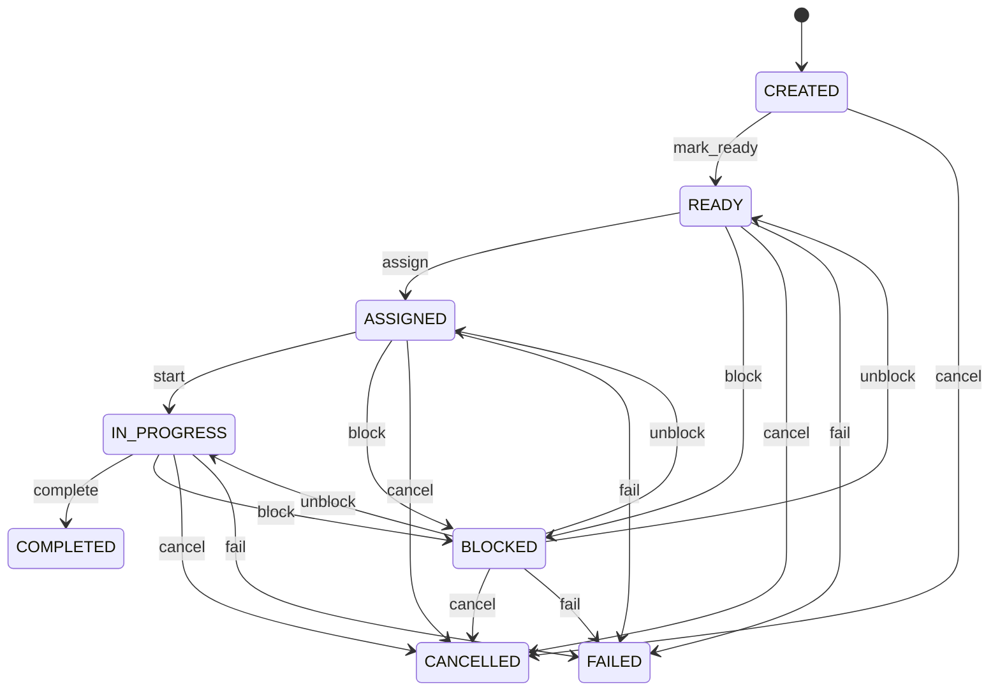

Any role that may change the record may make any move the diagram draws.


See [Task](/entities/foundation/task/) for the record itself.

## Account: Account lifecycle

States: **Active**, **Inactive**, **Retired**. A new record starts as **Active**; **Retired** ends the lifecycle.


Any role that may change the record may make any move the diagram draws.


See [Account](/entities/financial-accounting/account/) for the record itself.

## Journal Entry: Journal entry lifecycle

States: **Draft**, **Posted**, **Reversed**. A new record starts as **Draft**; **Reversed** ends the lifecycle.

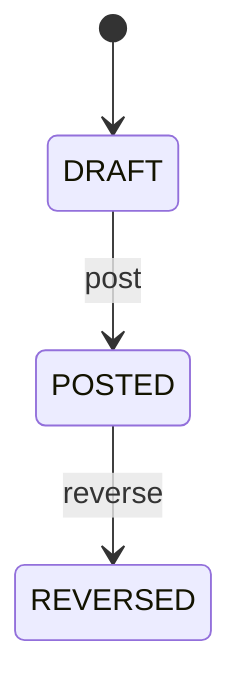

Any role that may change the record may make any move the diagram draws.


See [Journal Entry](/entities/financial-accounting/journal-entry/) for the record itself.

## Invoice: Invoice lifecycle

States: **Draft**, **Issued**, **Partially paid**, **Paid**, **Overdue**, **Cancelled**, **Void**. A new record starts as **Draft**; **Paid**, **Cancelled**, **Void** ends the lifecycle.

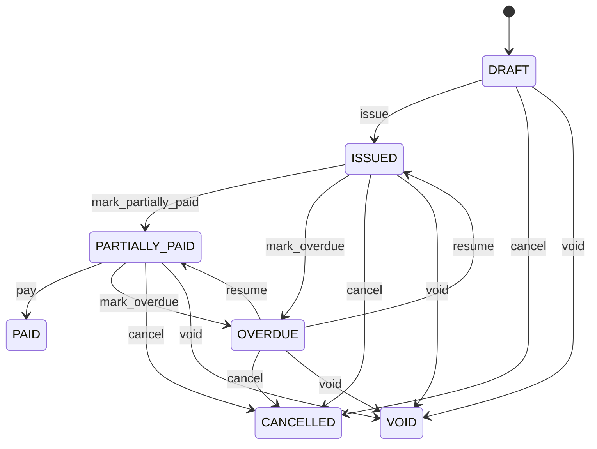

Any role that may change the record may make any move the diagram draws.


See [Invoice](/entities/financial-accounting/invoice/) for the record itself.

## Payment: Payment lifecycle

States: **Draft**, **Approved**, **Posted**, **Cleared**, **Void**, **Reversed**. A new record starts as **Draft**; **Cleared**, **Void**, **Reversed** ends the lifecycle.

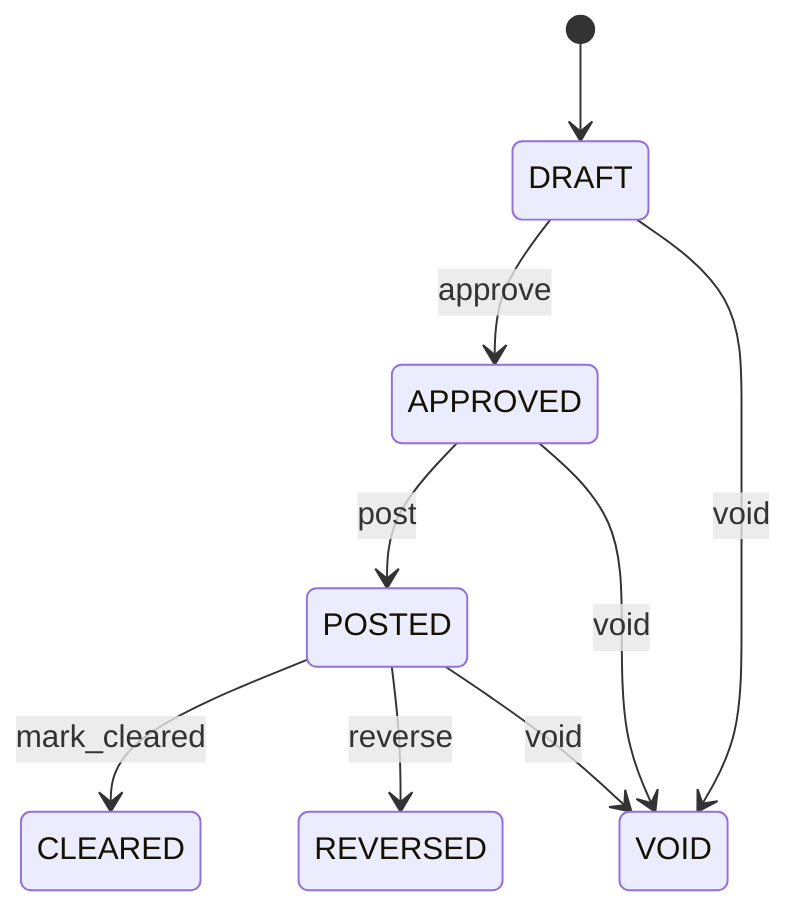

Any role that may change the record may make any move the diagram draws.


See [Payment](/entities/financial-accounting/payment/) for the record itself.

## Supplier: Supplier lifecycle

States: **Active**, **Inactive**, **Blocked**, **Retired**. A new record starts as **Active**; **Retired** ends the lifecycle.


Any role that may change the record may make any move the diagram draws.


See [Supplier](/entities/accounts-payable/supplier/) for the record itself.

## Purchase Order: Purchase order lifecycle

States: **Draft**, **Approved**, **Sent**, **Partially received**, **Received**, **Cancelled**, **Closed**. A new record starts as **Draft**; **Closed**, **Cancelled** ends the lifecycle.

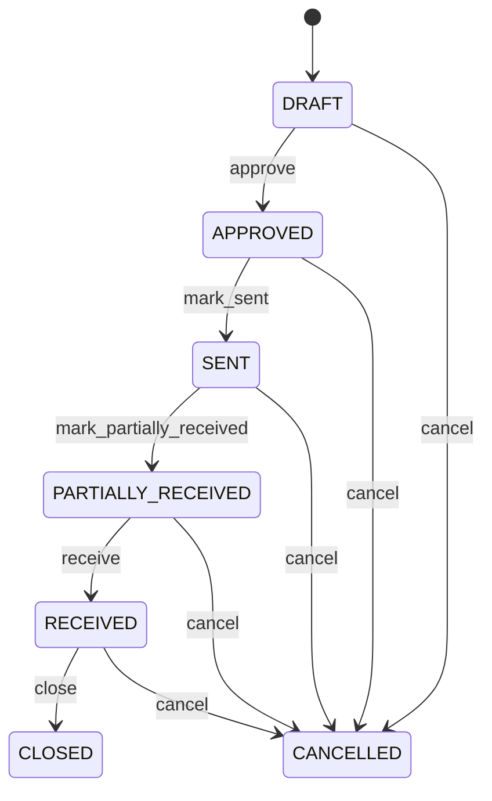

Any role that may change the record may make any move the diagram draws.


See [Purchase Order](/entities/accounts-payable/purchase-order/) for the record itself.

## Customer: Customer lifecycle

States: **Active**, **Inactive**, **Blocked**, **Retired**. A new record starts as **Active**; **Retired** ends the lifecycle.


Any role that may change the record may make any move the diagram draws.


See [Customer](/entities/accounts-receivable/customer/) for the record itself.

## Sales Order: Sales order lifecycle

States: **Draft**, **Confirmed**, **Allocated**, **Partially fulfilled**, **Fulfilled**, **Cancelled**. A new record starts as **Draft**; **Fulfilled**, **Cancelled** ends the lifecycle.

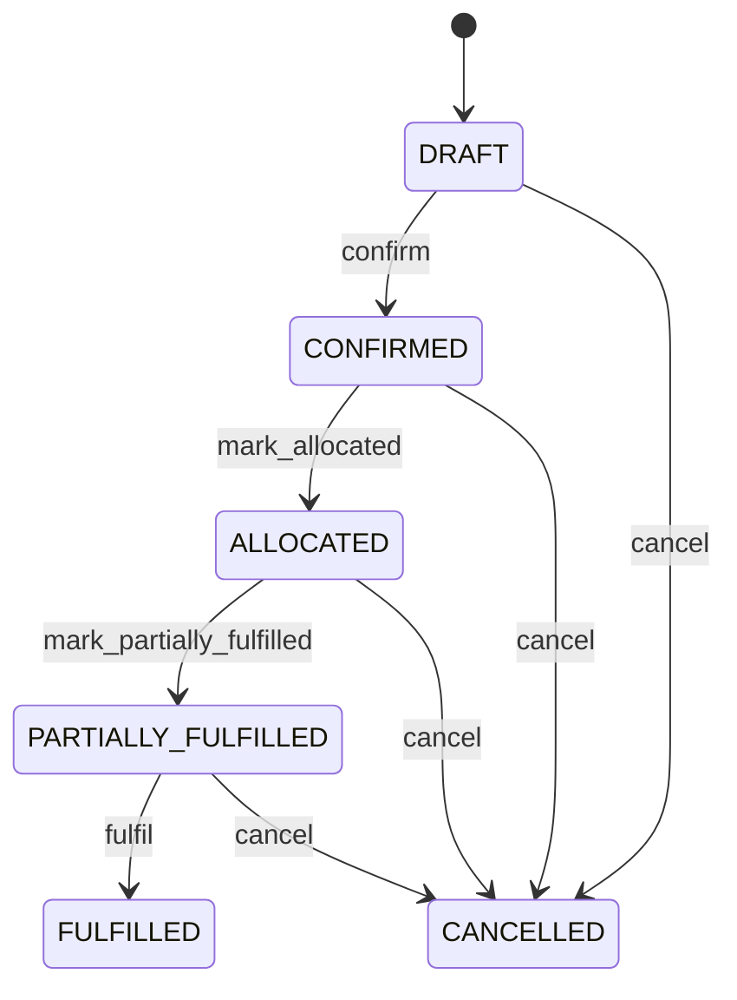

Any role that may change the record may make any move the diagram draws.


See [Sales Order](/entities/accounts-receivable/sales-order/) for the record itself.

## Budget: Budget lifecycle

States: **Draft**, **Submitted**, **Approved**, **Active**, **Superseded**, **Closed**. A new record starts as **Draft**; **Closed**, **Superseded** ends the lifecycle.

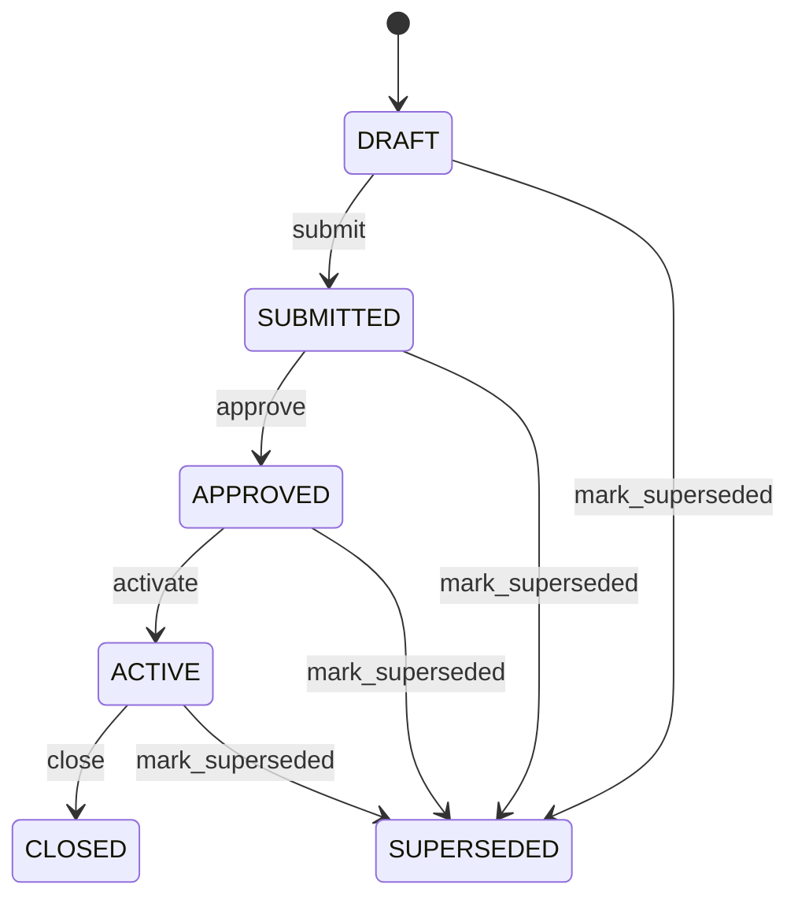

Any role that may change the record may make any move the diagram draws.


See [Budget](/entities/budgeting-and-planning/budget/) for the record itself.

## Scenario: Scenario lifecycle

States: **Draft**, **Active**, **Archived**. A new record starts as **Draft**; **Archived** ends the lifecycle.

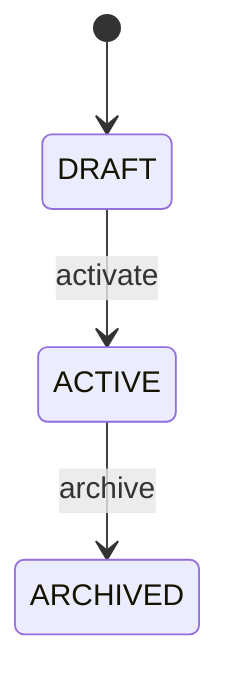

Any role that may change the record may make any move the diagram draws.


See [Scenario](/entities/budgeting-and-planning/scenario/) for the record itself.

## Ledger: Ledger lifecycle

States: **Draft**, **Active**, **Completed**, **Cancelled**. A new record starts as **Draft**; **Completed**, **Cancelled** ends the lifecycle.

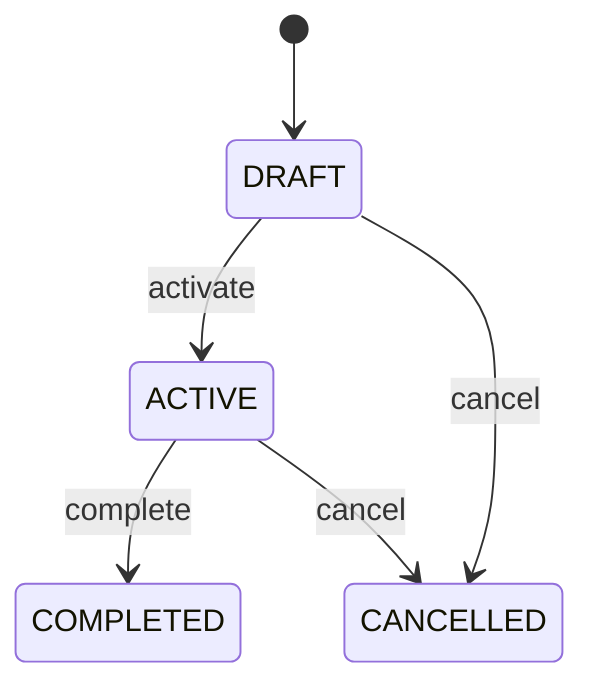

Any role that may change the record may make any move the diagram draws.


See [Ledger](/entities/finance-and-accounting-records/ledger/) for the record itself.

## Fiscal Period: Fiscal period lifecycle

States: **Future**, **Open**, **Soft closed**, **Closed**, **Locked**. A new record starts as **Future**; **Closed** ends the lifecycle.

```mermaid
stateDiagram-v2
  [*] --> FUTURE
  FUTURE --> OPEN: open
  OPEN --> SOFT_CLOSED: mark_soft_closed
  SOFT_CLOSED --> CLOSED: close
  OPEN --> LOCKED: lock
  LOCKED --> OPEN: unlock
```

Any role that may change the record may make any move the diagram draws.


See [Fiscal Period](/entities/finance-and-accounting-records/fiscal-period/) for the record itself.

## Payment: Payment allocation lifecycle

States: **Draft**, **Active**, **Reversed**, **Cancelled**. A new record starts as **Draft**; **Reversed**, **Cancelled** ends the lifecycle.

```mermaid
stateDiagram-v2
  [*] --> DRAFT
  DRAFT --> ACTIVE: activate
  ACTIVE --> REVERSED: reverse
  DRAFT --> CANCELLED: cancel
  ACTIVE --> CANCELLED: cancel
```

Any role that may change the record may make any move the diagram draws.


See [Payment](/entities/foundation/payment-allocation/) for the record itself.

## Payment Instruction: Payment instruction lifecycle

States: **Draft**, **Active**, **Completed**, **Cancelled**. A new record starts as **Draft**; **Completed**, **Cancelled** ends the lifecycle.

```mermaid
stateDiagram-v2
  [*] --> DRAFT
  DRAFT --> ACTIVE: activate
  ACTIVE --> COMPLETED: complete
  DRAFT --> CANCELLED: cancel
  ACTIVE --> CANCELLED: cancel
```

Any role that may change the record may make any move the diagram draws.


See [Payment Instruction](/entities/finance-and-accounting-records/payment-instruction/) for the record itself.

## Credit Note: Credit note lifecycle

States: **Draft**, **Approved**, **Posted**, **Partially applied**, **Fully applied**, **Refund due**, **Refunded**, **Cancelled**, **Reversed**. A new record starts as **Draft**; **Fully applied**, **Refunded**, **Cancelled**, **Reversed** ends the lifecycle.

```mermaid
stateDiagram-v2
  [*] --> DRAFT
  DRAFT --> APPROVED: approve
  APPROVED --> POSTED: post
  POSTED --> PARTIALLY_APPLIED: mark_partially_applied
  PARTIALLY_APPLIED --> REFUND_DUE: mark_refund_due
  REFUND_DUE --> FULLY_APPLIED: mark_fully_applied
  REFUND_DUE --> REFUNDED: refund
  DRAFT --> CANCELLED: cancel
  APPROVED --> CANCELLED: cancel
  POSTED --> CANCELLED: cancel
  PARTIALLY_APPLIED --> CANCELLED: cancel
  REFUND_DUE --> CANCELLED: cancel
  REFUND_DUE --> REVERSED: reverse
```

Any role that may change the record may make any move the diagram draws.


See [Credit Note](/entities/finance-and-accounting-records/credit-note/) for the record itself.

## Credit Note Application: Credit note application lifecycle

States: **Draft**, **Active**, **Reversed**, **Cancelled**. A new record starts as **Draft**; **Reversed**, **Cancelled** ends the lifecycle.

```mermaid
stateDiagram-v2
  [*] --> DRAFT
  DRAFT --> ACTIVE: activate
  ACTIVE --> REVERSED: reverse
  DRAFT --> CANCELLED: cancel
  ACTIVE --> CANCELLED: cancel
```

Any role that may change the record may make any move the diagram draws.


See [Credit Note Application](/entities/finance-and-accounting-records/credit-note-application/) for the record itself.

## Tax Code: Tax code lifecycle

States: **Draft**, **Active**, **Completed**, **Cancelled**. A new record starts as **Draft**; **Completed**, **Cancelled** ends the lifecycle.

```mermaid
stateDiagram-v2
  [*] --> DRAFT
  DRAFT --> ACTIVE: activate
  ACTIVE --> COMPLETED: complete
  DRAFT --> CANCELLED: cancel
  ACTIVE --> CANCELLED: cancel
```

Any role that may change the record may make any move the diagram draws.


See [Tax Code](/entities/finance-and-accounting-records/tax-code/) for the record itself.

## Tax Jurisdiction: Tax jurisdiction lifecycle

States: **Draft**, **Active**, **Completed**, **Cancelled**. A new record starts as **Draft**; **Completed**, **Cancelled** ends the lifecycle.

```mermaid
stateDiagram-v2
  [*] --> DRAFT
  DRAFT --> ACTIVE: activate
  ACTIVE --> COMPLETED: complete
  DRAFT --> CANCELLED: cancel
  ACTIVE --> CANCELLED: cancel
```

Any role that may change the record may make any move the diagram draws.


See [Tax Jurisdiction](/entities/finance-and-accounting-records/tax-jurisdiction/) for the record itself.

## Tax Rate: Tax rate lifecycle

States: **Draft**, **Active**, **Completed**, **Cancelled**. A new record starts as **Draft**; **Completed**, **Cancelled** ends the lifecycle.

```mermaid
stateDiagram-v2
  [*] --> DRAFT
  DRAFT --> ACTIVE: activate
  ACTIVE --> COMPLETED: complete
  DRAFT --> CANCELLED: cancel
  ACTIVE --> CANCELLED: cancel
```

Any role that may change the record may make any move the diagram draws.


See [Tax Rate](/entities/finance-and-accounting-records/tax-rate/) for the record itself.

## Tax Registration: Tax registration lifecycle

States: **Draft**, **Active**, **Completed**, **Cancelled**. A new record starts as **Draft**; **Completed**, **Cancelled** ends the lifecycle.

```mermaid
stateDiagram-v2
  [*] --> DRAFT
  DRAFT --> ACTIVE: activate
  ACTIVE --> COMPLETED: complete
  DRAFT --> CANCELLED: cancel
  ACTIVE --> CANCELLED: cancel
```

Any role that may change the record may make any move the diagram draws.


See [Tax Registration](/entities/finance-and-accounting-records/tax-registration/) for the record itself.

## Tax Rule: Tax rule lifecycle

States: **Draft**, **Active**, **Inactive**, **Retired**. A new record starts as **Draft**; **Retired** ends the lifecycle.

```mermaid
stateDiagram-v2
  [*] --> DRAFT
  DRAFT --> ACTIVE: activate
  ACTIVE --> INACTIVE: deactivate
  INACTIVE --> ACTIVE: reactivate
  DRAFT --> RETIRED: retire
  ACTIVE --> RETIRED: retire
  INACTIVE --> RETIRED: retire
```

Any role that may change the record may make any move the diagram draws.


See [Tax Rule](/entities/finance-and-accounting-records/tax-rule/) for the record itself.

## Tax Transaction: Tax transaction lifecycle

States: **Draft**, **Active**, **Completed**, **Cancelled**. A new record starts as **Draft**; **Completed**, **Cancelled** ends the lifecycle.

```mermaid
stateDiagram-v2
  [*] --> DRAFT
  DRAFT --> ACTIVE: activate
  ACTIVE --> COMPLETED: complete
  DRAFT --> CANCELLED: cancel
  ACTIVE --> CANCELLED: cancel
```

Any role that may change the record may make any move the diagram draws.


See [Tax Transaction](/entities/finance-and-accounting-records/tax-transaction/) for the record itself.

## Billing Cycle: Billing cycle lifecycle

States: **Draft**, **Active**, **Completed**, **Cancelled**. A new record starts as **Draft**; **Completed**, **Cancelled** ends the lifecycle.

```mermaid
stateDiagram-v2
  [*] --> DRAFT
  DRAFT --> ACTIVE: activate
  ACTIVE --> COMPLETED: complete
  DRAFT --> CANCELLED: cancel
  ACTIVE --> CANCELLED: cancel
```

Any role that may change the record may make any move the diagram draws.


See [Billing Cycle](/entities/finance-and-accounting-records/billing-cycle/) for the record itself.

## Charge: Charge lifecycle

States: **Draft**, **Active**, **Completed**, **Cancelled**. A new record starts as **Draft**; **Completed**, **Cancelled** ends the lifecycle.

```mermaid
stateDiagram-v2
  [*] --> DRAFT
  DRAFT --> ACTIVE: activate
  ACTIVE --> COMPLETED: complete
  DRAFT --> CANCELLED: cancel
  ACTIVE --> CANCELLED: cancel
```

Any role that may change the record may make any move the diagram draws.


See [Charge](/entities/finance-and-accounting-records/charge/) for the record itself.

## Subscription: Subscription lifecycle

States: **Draft**, **Active**, **Completed**, **Cancelled**. A new record starts as **Draft**; **Completed**, **Cancelled** ends the lifecycle.

```mermaid
stateDiagram-v2
  [*] --> DRAFT
  DRAFT --> ACTIVE: activate
  ACTIVE --> COMPLETED: complete
  DRAFT --> CANCELLED: cancel
  ACTIVE --> CANCELLED: cancel
```

Any role that may change the record may make any move the diagram draws.


See [Subscription](/entities/finance-and-accounting-records/subscription/) for the record itself.

## Subscription Plan: Subscription plan lifecycle

States: **Draft**, **Active**, **Completed**, **Cancelled**. A new record starts as **Draft**; **Completed**, **Cancelled** ends the lifecycle.

```mermaid
stateDiagram-v2
  [*] --> DRAFT
  DRAFT --> ACTIVE: activate
  ACTIVE --> COMPLETED: complete
  DRAFT --> CANCELLED: cancel
  ACTIVE --> CANCELLED: cancel
```

Any role that may change the record may make any move the diagram draws.


See [Subscription Plan](/entities/finance-and-accounting-records/subscription-plan/) for the record itself.

## Usage Record: Usage record lifecycle

States: **Draft**, **Active**, **Completed**, **Cancelled**. A new record starts as **Draft**; **Completed**, **Cancelled** ends the lifecycle.

```mermaid
stateDiagram-v2
  [*] --> DRAFT
  DRAFT --> ACTIVE: activate
  ACTIVE --> COMPLETED: complete
  DRAFT --> CANCELLED: cancel
  ACTIVE --> CANCELLED: cancel
```

Any role that may change the record may make any move the diagram draws.


See [Usage Record](/entities/finance-and-accounting-records/usage-record/) for the record itself.

## Bank Account: Bank account lifecycle

States: **Pending**, **Active**, **Blocked**, **Closed**. A new record starts as **Pending**; **Closed** ends the lifecycle.

```mermaid
stateDiagram-v2
  [*] --> PENDING
  PENDING --> ACTIVE: activate
  ACTIVE --> CLOSED: close
  ACTIVE --> BLOCKED: block
  BLOCKED --> ACTIVE: unblock
```

Any role that may change the record may make any move the diagram draws.


See [Bank Account](/entities/foundation/bank-account/) for the record itself.

## Asset: Asset lifecycle

States: **Planned**, **Active**, **Under maintenance**, **Held**, **Disposed**, **Retired**. A new record starts as **Planned**; **Disposed**, **Retired** ends the lifecycle.

```mermaid
stateDiagram-v2
  [*] --> PLANNED
  PLANNED --> ACTIVE: activate
  ACTIVE --> UNDER_MAINTENANCE: mark_under_maintenance
  UNDER_MAINTENANCE --> ACTIVE: return_to_service
  ACTIVE --> HELD: mark_held
  HELD --> ACTIVE: resume
  ACTIVE --> DISPOSED: mark_disposed
  UNDER_MAINTENANCE --> DISPOSED: mark_disposed
  HELD --> DISPOSED: mark_disposed
  PLANNED --> RETIRED: retire
  ACTIVE --> RETIRED: retire
  UNDER_MAINTENANCE --> RETIRED: retire
  HELD --> RETIRED: retire
```

Any role that may change the record may make any move the diagram draws.


See [Asset](/entities/foundation/asset/) for the record itself.

## Product: Product lifecycle

States: **Draft**, **Active**, **Discontinued**, **Blocked**, **Retired**. A new record starts as **Draft**; **Discontinued**, **Retired** ends the lifecycle.

```mermaid
stateDiagram-v2
  [*] --> DRAFT
  DRAFT --> ACTIVE: activate
  ACTIVE --> BLOCKED: block
  BLOCKED --> ACTIVE: unblock
  DRAFT --> DISCONTINUED: discontinue
  ACTIVE --> DISCONTINUED: discontinue
  BLOCKED --> DISCONTINUED: discontinue
  DRAFT --> RETIRED: retire
  ACTIVE --> RETIRED: retire
  BLOCKED --> RETIRED: retire
```

Any role that may change the record may make any move the diagram draws.


See [Product](/entities/foundation/product/) for the record itself.

