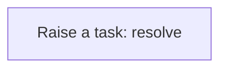
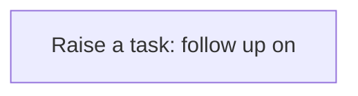
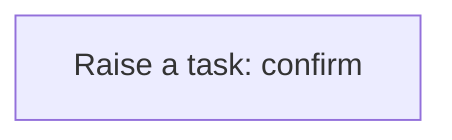
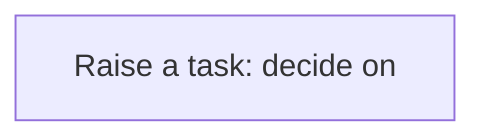

# Processes

A process is a sequence of steps the application runs for you: create a task, update a record, call a service. A business rule usually starts it; you can also run one by hand from the Workflow Designer. Every run is logged step by step in the Workflow Monitor. This application has **35** processes.


## Party exception raised {#party-exception-raised}

When a party is blocked, a high-priority task asks someone to resolve it.

Runs when a **Party** is changed, started by a business rule.



1. **Raise a task: resolve** — creates a **Task** record.


## Exchange rate follow up required {#exchange-rate-follow-up-required}

When a exchange rate is cancelled, a task asks someone to settle what depended on it.

Runs when a **Exchange Rate** is changed, started by a business rule.



1. **Raise a task: follow up on** — creates a **Task** record.


## Journal entry follow up required {#journal-entry-follow-up-required}

When a journal entry is reversed, a task asks someone to settle what depended on it.

Runs when a **Journal Entry** is changed, started by a business rule.


1. **Raise a task: follow up on** — creates a **Task** record.


## Journal entry completion confirmed {#journal-entry-completion-confirmed}

When a journal entry is posted, a task asks someone to confirm the outcome.

Runs when a **Journal Entry** is changed, started by a business rule.



1. **Raise a task: confirm** — creates a **Task** record.


## Invoice exception raised {#invoice-exception-raised}

When a invoice is overdue, a high-priority task asks someone to resolve it.

Runs when a **Invoice** is changed, started by a business rule.


1. **Raise a task: resolve** — creates a **Task** record.


## Invoice follow up required {#invoice-follow-up-required}

When a invoice is cancelled or void, a task asks someone to settle what depended on it.

Runs when a **Invoice** is changed, started by a business rule.


1. **Raise a task: follow up on** — creates a **Task** record.


## Payment follow up required {#payment-follow-up-required}

When a payment is void or reversed, a task asks someone to settle what depended on it.

Runs when a **Payment** is changed, started by a business rule.


1. **Raise a task: follow up on** — creates a **Task** record.


## Payment completion confirmed {#payment-completion-confirmed}

When a payment is posted, a task asks someone to confirm the outcome.

Runs when a **Payment** is changed, started by a business rule.


1. **Raise a task: confirm** — creates a **Task** record.


## Supplier exception raised {#supplier-exception-raised}

When a supplier is blocked, a high-priority task asks someone to resolve it.

Runs when a **Supplier** is changed, started by a business rule.


1. **Raise a task: resolve** — creates a **Task** record.


## Purchase order follow up required {#purchase-order-follow-up-required}

When a purchase order is cancelled, a task asks someone to settle what depended on it.

Runs when a **Purchase Order** is changed, started by a business rule.


1. **Raise a task: follow up on** — creates a **Task** record.


## Customer exception raised {#customer-exception-raised}

When a customer is blocked, a high-priority task asks someone to resolve it.

Runs when a **Customer** is changed, started by a business rule.


1. **Raise a task: resolve** — creates a **Task** record.


## Sales order follow up required {#sales-order-follow-up-required}

When a sales order is cancelled, a task asks someone to settle what depended on it.

Runs when a **Sales Order** is changed, started by a business rule.


1. **Raise a task: follow up on** — creates a **Task** record.


## Sales order completion confirmed {#sales-order-completion-confirmed}

When a sales order is fulfilled, a task asks someone to confirm the outcome.

Runs when a **Sales Order** is changed, started by a business rule.


1. **Raise a task: confirm** — creates a **Task** record.


## Budget approval requested {#budget-approval-requested}

When a budget is submitted, a task asks someone to decide on it.

Runs when a **Budget** is changed, started by a business rule.



1. **Raise a task: decide on** — creates a **Task** record.


## Ledger follow up required {#ledger-follow-up-required}

When a ledger is cancelled, a task asks someone to settle what depended on it.

Runs when a **Ledger** is changed, started by a business rule.


1. **Raise a task: follow up on** — creates a **Task** record.


## Payment allocation follow up required {#payment-allocation-follow-up-required}

When a payment allocation is cancelled or reversed, a task asks someone to settle what depended on it.

Runs when a **Payment** is changed, started by a business rule.


1. **Raise a task: follow up on** — creates a **Task** record.


## Payment instruction follow up required {#payment-instruction-follow-up-required}

When a payment instruction is cancelled, a task asks someone to settle what depended on it.

Runs when a **Payment Instruction** is changed, started by a business rule.


1. **Raise a task: follow up on** — creates a **Task** record.


## Credit note follow up required {#credit-note-follow-up-required}

When a credit note is cancelled or reversed, a task asks someone to settle what depended on it.

Runs when a **Credit Note** is changed, started by a business rule.


1. **Raise a task: follow up on** — creates a **Task** record.


## Credit note completion confirmed {#credit-note-completion-confirmed}

When a credit note is posted, a task asks someone to confirm the outcome.

Runs when a **Credit Note** is changed, started by a business rule.


1. **Raise a task: confirm** — creates a **Task** record.


## Credit note application follow up required {#credit-note-application-follow-up-required}

When a credit note application is cancelled or reversed, a task asks someone to settle what depended on it.

Runs when a **Credit Note Application** is changed, started by a business rule.


1. **Raise a task: follow up on** — creates a **Task** record.


## Tax code follow up required {#tax-code-follow-up-required}

When a tax code is cancelled, a task asks someone to settle what depended on it.

Runs when a **Tax Code** is changed, started by a business rule.

```mermaid
flowchart TD
  S0["Raise a task: follow up on"]

```

1. **Raise a task: follow up on** — creates a **Task** record.


## Tax jurisdiction follow up required {#tax-jurisdiction-follow-up-required}

When a tax jurisdiction is cancelled, a task asks someone to settle what depended on it.

Runs when a **Tax Jurisdiction** is changed, started by a business rule.

```mermaid
flowchart TD
  S0["Raise a task: follow up on"]

```

1. **Raise a task: follow up on** — creates a **Task** record.


## Tax rate follow up required {#tax-rate-follow-up-required}

When a tax rate is cancelled, a task asks someone to settle what depended on it.

Runs when a **Tax Rate** is changed, started by a business rule.

```mermaid
flowchart TD
  S0["Raise a task: follow up on"]

```

1. **Raise a task: follow up on** — creates a **Task** record.


## Tax registration follow up required {#tax-registration-follow-up-required}

When a tax registration is cancelled, a task asks someone to settle what depended on it.

Runs when a **Tax Registration** is changed, started by a business rule.

```mermaid
flowchart TD
  S0["Raise a task: follow up on"]

```

1. **Raise a task: follow up on** — creates a **Task** record.


## Tax transaction follow up required {#tax-transaction-follow-up-required}

When a tax transaction is cancelled, a task asks someone to settle what depended on it.

Runs when a **Tax Transaction** is changed, started by a business rule.

```mermaid
flowchart TD
  S0["Raise a task: follow up on"]

```

1. **Raise a task: follow up on** — creates a **Task** record.


## Tax transaction completion confirmed {#tax-transaction-completion-confirmed}

When a tax transaction is completed, a task asks someone to confirm the outcome.

Runs when a **Tax Transaction** is changed, started by a business rule.

```mermaid
flowchart TD
  S0["Raise a task: confirm"]

```

1. **Raise a task: confirm** — creates a **Task** record.


## Billing cycle follow up required {#billing-cycle-follow-up-required}

When a billing cycle is cancelled, a task asks someone to settle what depended on it.

Runs when a **Billing Cycle** is changed, started by a business rule.

```mermaid
flowchart TD
  S0["Raise a task: follow up on"]

```

1. **Raise a task: follow up on** — creates a **Task** record.


## Charge follow up required {#charge-follow-up-required}

When a charge is cancelled, a task asks someone to settle what depended on it.

Runs when a **Charge** is changed, started by a business rule.

```mermaid
flowchart TD
  S0["Raise a task: follow up on"]

```

1. **Raise a task: follow up on** — creates a **Task** record.


## Charge completion confirmed {#charge-completion-confirmed}

When a charge is completed, a task asks someone to confirm the outcome.

Runs when a **Charge** is changed, started by a business rule.

```mermaid
flowchart TD
  S0["Raise a task: confirm"]

```

1. **Raise a task: confirm** — creates a **Task** record.


## Subscription follow up required {#subscription-follow-up-required}

When a subscription is cancelled, a task asks someone to settle what depended on it.

Runs when a **Subscription** is changed, started by a business rule.

```mermaid
flowchart TD
  S0["Raise a task: follow up on"]

```

1. **Raise a task: follow up on** — creates a **Task** record.


## Subscription plan follow up required {#subscription-plan-follow-up-required}

When a subscription plan is cancelled, a task asks someone to settle what depended on it.

Runs when a **Subscription Plan** is changed, started by a business rule.

```mermaid
flowchart TD
  S0["Raise a task: follow up on"]

```

1. **Raise a task: follow up on** — creates a **Task** record.


## Usage record follow up required {#usage-record-follow-up-required}

When a usage record is cancelled, a task asks someone to settle what depended on it.

Runs when a **Usage Record** is changed, started by a business rule.

```mermaid
flowchart TD
  S0["Raise a task: follow up on"]

```

1. **Raise a task: follow up on** — creates a **Task** record.


## Bank account exception raised {#bank-account-exception-raised}

When a bank account is blocked, a high-priority task asks someone to resolve it.

Runs when a **Bank Account** is changed, started by a business rule.

```mermaid
flowchart TD
  S0["Raise a task: resolve"]

```

1. **Raise a task: resolve** — creates a **Task** record.


## Asset exception raised {#asset-exception-raised}

When a asset is held, a high-priority task asks someone to resolve it.

Runs when a **Asset** is changed, started by a business rule.

```mermaid
flowchart TD
  S0["Raise a task: resolve"]

```

1. **Raise a task: resolve** — creates a **Task** record.


## Product exception raised {#product-exception-raised}

When a product is blocked, a high-priority task asks someone to resolve it.

Runs when a **Product** is changed, started by a business rule.

```mermaid
flowchart TD
  S0["Raise a task: resolve"]

```

1. **Raise a task: resolve** — creates a **Task** record.


