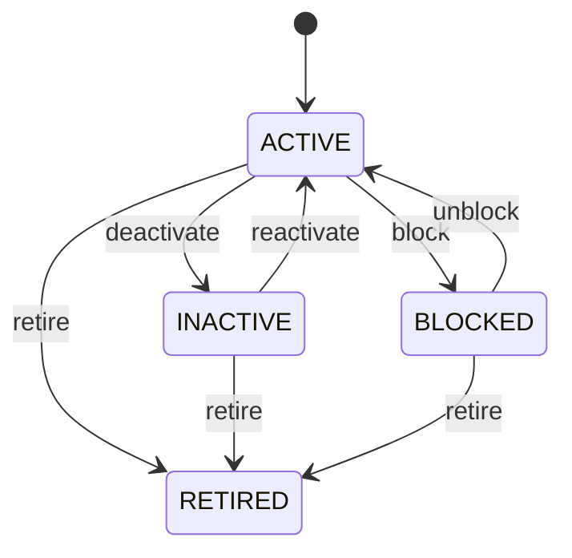

# Supplier

Represents the procurement-facing role of a Party that supplies business inputs and participates in reverse procurement, supplier claims, financial recovery and performance governance. Party provides identity, PartyRole provides the role, and Supplier adds procurement-specific qualification, terms and transaction history. SupplierClaim captures the case; SupplierClaimResolution captures the remedy; downstream transactions execute it; SupplierPerformanceAssessment interprets accumulated evidence for governance. Central to source-to-pay, sourcing, procurement, receiving, supplier returns, quality claims, accounts payable, supplier qualification, recovery and performance management. Supplier connects PartyRole to PurchaseOrder, GoodsReceipt, Invoice, Payment, SupplierReturn, SupplierCreditNote, SupplierDebitNote, SupplierClaim, SupplierClaimResolution, SupplierPerformanceAssessment, Product and PaymentTerm. Supplier qualification/status → PurchaseOrder → GoodsReceipt → Invoice matching → Payment; issue detection → SupplierClaim → SupplierClaimResolution → SupplierReturn and/or SupplierCreditNote/SupplierDebitNote/Payment → reconciliation; periodic evidence aggregation → SupplierPerformanceAssessment → governance/improvement decision. Onboard → qualify → active → suspend/block/inactive → retire. State changes constrain future activity without rewriting historical evidence. A supplier's quarterly assessment combines delivery receipts, inspection failures, claims and returns into an approved scorecard. The result informs qualification and improvement decisions while the underlying transactions remain unchanged.

## Finding records

Open **Supplier** from the menu or from its card on the dashboard.

The list shows Party Role, Supplier Code, Supplier Type, Qualification Status, Payment Terms, Status, Party, with the most recently changed record first. The **Help** button beside the title opens this window's help text.

- **Search**: type in the search box above the grid to narrow the rows. **Search** at the top left opens advanced search, where you pick a field, a comparison (equals, contains, starts with, before, after, and so on) and a value.
- **Sort**: click a column heading; click again to reverse.
- **Refresh**: the refresh button at the top right re-reads the rows and every dropdown, so a record created a moment ago by someone else appears.
- **Export**: **CSV** downloads the rows you are looking at.
- **Open a record**: click a row. The line under the title, "Showing 1 to n of N entries", tells you how many rows match.

## Creating a record

Choose **New** at the top of the list. The form opens on its own page, with the fields in sections. A badge beside each label names the control (Text, Dropdown, Date, and so on); a red star marks a required field; the question-mark icon shows that field's help; and a hint such as “max 300” shows the longest entry accepted.

1. Fill in the fields described under [Fields](#fields).
2. These are required and must be completed before the record can be saved: **Party Role**, **Supplier Code**, **Status**, **Party**, **Role Type**.
3. For a dropdown that points at another window, pick the matching record; if the record you need does not exist yet, create it in its own window first. A dropdown may narrow to what you have already chosen, for example the states of the chosen country.
4. Choose **Create** (or **Save** in the toolbar). You return to the record, and it appears at the top of the list. If something is wrong the form says which field and why, and nothing is saved.

## Reading, changing and deleting a record

Click a row to open the record. Above the fields are the arrows that step through the list ("1 of 5"). Below them sit **Notes**, where anyone may leave a comment on the record, and the **Audit Trail**, which lists every change with who made it, when, and which fields changed.

- **Edit** (toolbar) makes the fields editable. Change them and choose **Save**; **Undo Changes** puts back what you changed and **Cancel Editing** leaves edit mode.
- **Copy Record** starts a new record from this one.
- **Delete Record** is available in edit mode and asks you to confirm; a record other records still depend on cannot be deleted.

Every change is also written to the [Audit Log](/administration/#audit-log).

## Fields

| Field | What you use | Rules | What to enter |
| --- | --- | --- | --- |
| Party Role | Lookup | Required, Unique | PartyRole backing the Supplier specialization. Navigates to common party identity and role information. Supplier must not duplicate Party identity. Supplies shared party context to procurement and financial workflows. Required for role specialization. Pick a record from **Party Role**. |
| Supplier Code | Text | Required, Unique, Up to 100 characters | Enterprise supplier business reference. Used on purchase orders receipts invoices returns credits payments claims portals reports and integrations. Distinct from legal name and external registration identifiers. Identifies the supplier across procurement settlement recovery and performance. Required for operational recognition. |
| Supplier Type | Choice | Optional | Classification of supplier relationship. Supports onboarding compliance tax contracting and reporting. Does not replace Party identity classification. Supplies supplier classification to procurement policy. Optional. The supplier type of the supplier is individual; set it when that is what the business means for this record. The supplier type of the supplier is business; set it when that is what the business means for this record. The supplier type of the supplier is government; set it when that is what the business means for this record. The supplier type of the supplier is internal; set it when that is what the business means for this record. The supplier type of the supplier is other; set it when that is what the business means for this record. Choose one: Individual, Business, Government, Internal, Other. |
| Qualification Status | Choice | Optional | Procurement qualification state. Controls sourcing eligibility and supplier governance. Qualification is distinct from master lifecycle status and may consume SupplierPerformanceAssessment evidence. Gates new procurement commitments while historical transactions remain valid. Optional where supplier qualification is not used. The qualification status of the supplier is not reviewed; set it when that is what the business means for this record. The qualification status of the supplier is pending; set it when that is what the business means for this record. The qualification status of the supplier is qualified; set it when that is what the business means for this record. The qualification status of the supplier is suspended; set it when that is what the business means for this record. The qualification status of the supplier is disqualified; set it when that is what the business means for this record. Choose one: Not reviewed, Pending, Qualified, Suspended, Disqualified. |
| Payment Terms | Text | Optional | Default supplier settlement policy. Used by PurchaseOrder Invoice payables payment scheduling and cash forecasting. Transaction or contract terms may override the default. Supplies default payable timing. Optional. |
| Status | Choice | Required | Supplier relationship lifecycle state. Controls procurement eligibility. Historical transactions remain valid after state changes. New procurement return claim-resolution and performance workflows must evaluate status. Required for eligibility. The status of the supplier is active; set it when that is what the business means for this record. The status of the supplier is inactive; set it when that is what the business means for this record. The status of the supplier is blocked; set it when that is what the business means for this record. The status of the supplier is retired; set it when that is what the business means for this record. Choose one: Active, Inactive, Blocked, Retired. |
| Party | Lookup | Required | Identifies the underlying person or organization performing this role. Provides common identity without duplicating Party data. One Party may have multiple PartyRoles simultaneously or historically. Connects role-specific processing back to the canonical identity. Required because a role cannot exist without a participant. Pick a record from **Party**. |
| Role Type | Choice | Required | Defines the business capacity in which the Party participates. Determines specialized capabilities, policies, workflows, and validations. Separate from Party.partyType, which describes whether the participant is a person or organization. Selects the applicable downstream role specialization and business process. Required for contextual participation. The role type of the party role is customer; set it when that is what the business means for this record. The role type of the party role is supplier; set it when that is what the business means for this record. The role type of the party role is employee; set it when that is what the business means for this record. The role type of the party role is partner; set it when that is what the business means for this record. The role type of the party role is carrier; set it when that is what the business means for this record. The role type of the party role is agent; set it when that is what the business means for this record. The role type of the party role is contractor; set it when that is what the business means for this record. The role type of the party role is owner; set it when that is what the business means for this record. The role type of the party role is investor; set it when that is what the business means for this record. The role type of the party role is other; set it when that is what the business means for this record. Choose one: Customer, Supplier, Employee, Partner, Carrier, Agent, Contractor, Owner, Investor, Other. |
| Code | Text | Up to 100 characters | Optional business-context identifier for this role instance. Supports operational search, integrations, reports, and legacy references. Identifies the role instance and must not replace Party or specialized role identifiers. Optional when partyRoleId is sufficient. |
| Valid From | Date | Optional | Date from which this role is eligible for ordinary business processing. Used by eligibility and transaction validation. Works with validTo and status; ending a role does not delete Party identity or other roles. Prevents premature use of a newly established role. Optional for immediately effective roles. |
| Valid To | Date | Optional | Date after which the role is no longer normally eligible for new business processing. Used by eligibility, renewal, reporting, and expiry workflows. Historical transactions may continue referencing the role after validTo. Prevents new use after role expiration while preserving historical attribution. Optional for open-ended roles. |
| Organization | Lookup | Optional | Optional organizational scope in which the role is recognized. Supports multi-enterprise, subsidiary, business-unit, and operating-context scenarios. Zero means global/context-independent; one means explicitly scoped to one organization. Determines which organization can use the role for applicable transactions and policies. Pick a record from **Organization**. |

## How it connects to other records
- A supplier has one **Party Role**.
- A supplier has many **Invoice** records.
- A supplier has many **Address** records.
- A supplier has many **Purchase Order** records.
- A supplier has many **Payment** records.
- A supplier is linked to many **Product** records.
- A supplier belongs to one **Party**.
- A supplier belongs to one **Organization**.

## Lifecycle: Supplier lifecycle

A supplier record starts as **Active** and ends as **Retired**. Open a record and the bar above its fields shows its current **State** and, after **Next**, a button for each move that leaves it; choose one to make the move. Any move the diagram does not draw is refused, for everyone including the administrator.

| From | To | Move |
| --- | --- | --- |
| Active | Inactive | Deactivate |
| Inactive | Active | Reactivate |
| Active | Blocked | Block |
| Blocked | Active | Unblock |
| Active | Retired | Retire |
| Inactive | Retired | Retire |
| Blocked | Retired | Retire |

## What happens when you save
Business rules run around the save. They are listed here and explained in full under [Business rules](/administration/rules/).

| Rule | When | Order |
| --- | --- | --- |
| Supplier workflows after update | after a supplier is changed | 100 |

Processes started from this record: [Supplier exception raised](/administration/processes/#supplier-exception-raised).

## Who may use it

Anyone who holds a role with access to the **Supplier** window. Access is granted by role under [Roles and access](/administration/access/).
