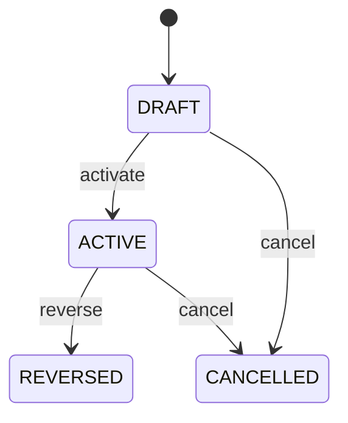

# Credit Note Application

Provides the auditable bridge by which a posted customer CreditNote is consumed against an Invoice. CreditNote establishes the authorized financial reduction; Invoice remains the original claim; CreditNoteApplication records exactly where and how much of the credit was used. Receivables, customer statements, returns, billing corrections, tax, reconciliation, audit and refund-versus-application decisions. CreditNoteLine explains source credit detail; InvoiceLine explains original claim detail; this entity records header-level application evidence; JournalEntry records accounting recognition; Payment records any separate refund. CreditNote posted → select eligible Invoice → validate remaining credit and invoice exposure → currency/rate validation → activate application → update CreditNote amountApplied/amountRemaining and Invoice amountCredited/amountOutstanding/status → reverse and reallocate when required. Draft → active → reversed/cancelled. Historical applications are retained. Changes to posted CreditNote or Invoice never rewrite an application; corrections use reversal and replacement applications. A posted USD 590 CreditNote is applied to a USD 590 open invoice. The application consumes USD 590 of available credit and reduces the invoice exposure by USD 590. If applied incorrectly, the application is reversed and a new application is created.

## Finding records

Open **Credit Note Application** from the menu or from its card on the dashboard.

The list shows Credit Note Amount, Invoice Amount, Exchange Rate, Applied At, Status, Reversal Of Application, Credit Note, with the most recently changed record first. The **Help** button beside the title opens this window's help text.

- **Search**: type in the search box above the grid to narrow the rows. **Search** at the top left opens advanced search, where you pick a field, a comparison (equals, contains, starts with, before, after, and so on) and a value.
- **Sort**: click a column heading; click again to reverse.
- **Refresh**: the refresh button at the top right re-reads the rows and every dropdown, so a record created a moment ago by someone else appears.
- **Export**: **CSV** downloads the rows you are looking at.
- **Open a record**: click a row. The line under the title, "Showing 1 to n of N entries", tells you how many rows match.

## Creating a record

Choose **New** at the top of the list. The form opens on its own page, with the fields in sections. A badge beside each label names the control (Text, Dropdown, Date, and so on); a red star marks a required field; the question-mark icon shows that field's help; and a hint such as “max 300” shows the longest entry accepted.

1. Fill in the fields described under [Fields](#fields).
2. These are required and must be completed before the record can be saved: **Credit Note Amount**, **Invoice Amount**, **Applied At**, **Status**, **Credit Note**, **Invoice**.
3. For a dropdown that points at another window, pick the matching record; if the record you need does not exist yet, create it in its own window first. A dropdown may narrow to what you have already chosen, for example the states of the chosen country.
4. Choose **Create** (or **Save** in the toolbar). You return to the record, and it appears at the top of the list. If something is wrong the form says which field and why, and nothing is saved.

## Reading, changing and deleting a record

Click a row to open the record. Above the fields are the arrows that step through the list ("1 of 5"). Below them sit **Notes**, where anyone may leave a comment on the record, and the **Audit Trail**, which lists every change with who made it, when, and which fields changed.

- **Edit** (toolbar) makes the fields editable. Change them and choose **Save**; **Undo Changes** puts back what you changed and **Cancel Editing** leaves edit mode.
- **Copy Record** starts a new record from this one.
- **Delete Record** is available in edit mode and asks you to confirm; a record other records still depend on cannot be deleted.

Every change is also written to the [Audit Log](/administration/#audit-log).

## Fields

| Field | What you use | Rules | What to enter |
| --- | --- | --- | --- |
| Credit Note Amount | Amount | Required | Portion of the CreditNote consumed by this application. Represents the source-side amount of credit allocated to an invoice. Controls remaining unapplied credit and reconciliation. Must use the CreditNote currency. Establishes the amount consumed from the credit. Required. |
| Invoice Amount | Amount | Required | Amount by which the Invoice claim is reduced by this application. Represents the target-side financial effect on the invoice. Drives Invoice amountCredited and amountOutstanding. Must use the Invoice currency and may differ from creditNoteAmount only under governed exchange-rate treatment. Supplies the claim-side adjustment. Required. |
| Exchange Rate | Lookup | Optional | Exchange rate used when CreditNote and Invoice currencies differ. Preserves conversion evidence for cross-currency credit application. Supports audit and reproducibility. Required for permitted cross-currency applications. Connects source credit value to target invoice value. Optional when currencies are identical. Pick a record from **Exchange Rate**. |
| Applied At | Date and time | Required | Timestamp when the application became effective. Establishes adjustment chronology. Supports accounting periods, statements, audit and reconciliation. Distinct from CreditNoteDate and InvoiceDate. Determines when the Invoice credit projection changes. Required. |
| Status | Choice | Required | Lifecycle state of the application. Indicates whether the application currently reduces the invoice. Controls credit and invoice projections. CreditNote and Invoice statuses remain independent historical facts. ACTIVE creates the application effect; reversal removes it through a compensating event. Required. The status of the credit note application is draft; set it when that is what the business means for this record. The status of the credit note application is active; set it when that is what the business means for this record. The status of the credit note application is reversed; set it when that is what the business means for this record. The status of the credit note application is cancelled; set it when that is what the business means for this record. Choose one: Draft, Active, Reversed, Cancelled. |
| Reversal Of Application | Lookup | Optional | Prior application reversed by this record. Links correction to the original adjustment application. Supports audit and controlled reallocation. Reversal is a new historical event and does not edit the original. Enables correction while preserving history. Optional for normal applications. Pick a record from **Credit Note Application**. |
| Credit Note | Lookup | Required | Customer credit note supplying the adjustment. Identifies the authorized financial credit being consumed. Supports credit lifecycle and reconciliation. Exactly one CreditNote supplies each application. Supplies available credit and currency context. Pick a record from **Credit Note**. |
| Invoice | Lookup | Required | Invoice receiving the financial reduction. Identifies the claim whose outstanding exposure is reduced. Supports receivables and statements. Exactly one Invoice is targeted. Supplies eligible outstanding exposure and currency context. Pick a record from **Invoice**. |

## How it connects to other records
- A credit note application belongs to one **Credit Note**.
- A credit note application belongs to one **Invoice**.
- A credit note application belongs to one **Exchange Rate**.

## Lifecycle: Credit note application lifecycle

A credit note application record starts as **Draft** and ends as **Reversed** or **Cancelled**. Open a record and the bar above its fields shows its current **State** and, after **Next**, a button for each move that leaves it; choose one to make the move. Any move the diagram does not draw is refused, for everyone including the administrator.

| From | To | Move |
| --- | --- | --- |
| Draft | Active | Activate |
| Active | Reversed | Reverse |
| Draft | Cancelled | Cancel |
| Active | Cancelled | Cancel |

## What happens when you save
Business rules run around the save. They are listed here and explained in full under [Business rules](/administration/rules/).

| Rule | When | Order |
| --- | --- | --- |
| Credit note application invariants before create | before a credit note application is created | 100 |
| Credit note application invariants before update | before a credit note application is changed | 100 |
| Credit note application workflows after update | after a credit note application is changed | 100 |

Processes started from this record: [Credit note application follow up required](/administration/processes/#credit-note-application-follow-up-required).

## Who may use it

Anyone who holds a role with access to the **Credit Note Application** window. Access is granted by role under [Roles and access](/administration/access/).
