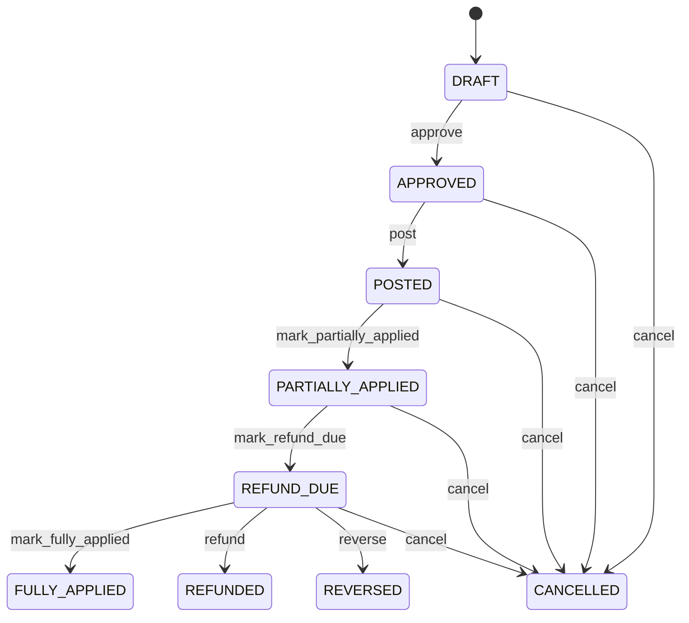

# Credit Note

Represents an explicit reduction of a customer's financial claim while preserving original invoice, return, accounting, application and refund evidence. CustomerReturn records reverse fulfillment; CreditNote records the financial adjustment; CreditNoteApplication records how it is consumed; Invoice remains the historical claim; JournalEntry records accounting; Payment records any refund cash. Customer returns, accounts receivable, billing corrections, tax adjustments, customer concessions, statements, audit and refunds. CustomerReturnLine provides returned quantity and approved credit basis. InvoiceLine provides original billed evidence. CreditNoteLine captures adjustment detail. CreditNoteApplication connects the adjustment to invoice exposure. JournalEntry records accounting. Payment records refund. Return authorized → received/inspected → disposition approved → credit eligibility calculated → CreditNote draft → approval → accounting determination → post → create CreditNoteApplication against open Invoice or establish refund due → refund Payment if required → reconcile → fully applied/refunded. Original Invoice and Payment history remain immutable. Draft → approved → posted → partially applied/fully applied or refund due → refunded, with cancellation and reversal paths. Changes to return disposition or original invoice evidence trigger revalidation of an unposted credit. Posted credit changes require explicit reversal and replacement. Applications are corrected by reversal/reallocation, and refund payments remain separate evidence. A customer returns five units with approved credit of USD 590. CreditNote is posted for USD 590. A CreditNoteApplication can consume the credit against an open invoice; if no eligible balance exists, the credit becomes refund due and a separate Payment settles it.

## Finding records

Open **Credit Note** from the menu or from its card on the dashboard.

The list shows Credit Note Number, Credit Note Date, Status, Currency, Reason Code, Subtotal, Tax Amount, with the most recently changed record first. The **Help** button beside the title opens this window's help text.

- **Search**: type in the search box above the grid to narrow the rows. **Search** at the top left opens advanced search, where you pick a field, a comparison (equals, contains, starts with, before, after, and so on) and a value.
- **Sort**: click a column heading; click again to reverse.
- **Refresh**: the refresh button at the top right re-reads the rows and every dropdown, so a record created a moment ago by someone else appears.
- **Export**: **CSV** downloads the rows you are looking at.
- **Open a record**: click a row. The line under the title, "Showing 1 to n of N entries", tells you how many rows match.

## Creating a record

Choose **New** at the top of the list. The form opens on its own page, with the fields in sections. A badge beside each label names the control (Text, Dropdown, Date, and so on); a red star marks a required field; the question-mark icon shows that field's help; and a hint such as “max 300” shows the longest entry accepted.

1. Fill in the fields described under [Fields](#fields).
2. These are required and must be completed before the record can be saved: **Credit Note Number**, **Credit Note Date**, **Status**, **Currency**, **Reason Code**, **Subtotal**, **Tax Amount**, **Total Amount**, **Amount Applied**, **Amount Refunded**, **Amount Remaining**, **Customer**.
3. For a dropdown that points at another window, pick the matching record; if the record you need does not exist yet, create it in its own window first. A dropdown may narrow to what you have already chosen, for example the states of the chosen country.
4. Choose **Create** (or **Save** in the toolbar). You return to the record, and it appears at the top of the list. If something is wrong the form says which field and why, and nothing is saved.

## Reading, changing and deleting a record

Click a row to open the record. Above the fields are the arrows that step through the list ("1 of 5"). Below them sit **Notes**, where anyone may leave a comment on the record, and the **Audit Trail**, which lists every change with who made it, when, and which fields changed.

- **Edit** (toolbar) makes the fields editable. Change them and choose **Save**; **Undo Changes** puts back what you changed and **Cancel Editing** leaves edit mode.
- **Copy Record** starts a new record from this one.
- **Delete Record** is available in edit mode and asks you to confirm; a record other records still depend on cannot be deleted.

Every change is also written to the [Audit Log](/administration/#audit-log).

## Fields

| Field | What you use | Rules | What to enter |
| --- | --- | --- | --- |
| Credit Note Number | Text | Required, Unique, Up to 100 characters | Business-facing reference assigned to the credit note. Identifies the adjustment in customer communication, tax documents, statements and finance operations. Used for reconciliation, customer service, reporting, tax and integrations. Distinct from creditNoteId and original Invoice.invoiceNumber. Provides the human-recognizable adjustment reference throughout its lifecycle. Required. |
| Credit Note Date | Date | Required | Commercial and accounting date of the credit adjustment. Establishes the temporal basis for accounting, tax and customer balance treatment. Used for accounting periods, tax reporting, statements and audit. May differ from CustomerReturn returnDate and refund payment date. Anchors the financial adjustment in the applicable accounting and tax period. Required. |
| Status | Choice | Required | Lifecycle state of the credit adjustment. Indicates preparation, authorization, accounting recognition, application to invoices, customer refund obligation, settlement, cancellation or reversal. Controls approval, posting, application, refund and correction workflows. CreditNote status is independent of Invoice, CustomerReturn, Payment and CreditNoteApplication status. POSTED establishes the financial adjustment; application reduces eligible outstanding receivable; refund states apply when money must be returned. Required. The status of the credit note is draft; set it when that is what the business means for this record. The status of the credit note is approved; set it when that is what the business means for this record. The status of the credit note is posted; set it when that is what the business means for this record. The status of the credit note is partially applied; set it when that is what the business means for this record. The status of the credit note is fully applied; set it when that is what the business means for this record. The status of the credit note is refund due; set it when that is what the business means for this record. The status of the credit note is refunded; set it when that is what the business means for this record. The status of the credit note is cancelled; set it when that is what the business means for this record. The status of the credit note is reversed; set it when that is what the business means for this record. Choose one: Draft, Approved, Posted, Partially applied, Fully applied, Refund due, Refunded, Cancelled, Reversed. |
| Currency | Lookup | Required | Currency in which the credit note is denominated. Defines the monetary denomination of all credit-note amounts. Used for calculation, tax, accounting, invoice application, customer balance and refund processing. Must normally match credited Invoice currency; permitted cross-currency application requires explicit ExchangeRate evidence. Establishes monetary basis for adjustment and application. Required. Pick a record from **Currency**. |
| Reason Code | Text | Required, Up to 100 characters | Controlled business reason for issuing the credit. Explains why customer exposure is reduced. Used for approval, policy, analytics, tax, audit and customer communication. Return reason and financial credit reason may differ. Determines applicable approval, calculation, tax and posting policy. Required. |
| Subtotal | Amount | Required | Aggregate credit value before document-level tax and adjustments. Sum of credit-note line bases after applicable line pricing treatment. Used for tax, reconciliation, accounting and reporting. Must reconcile with CreditNoteLine amounts and original transaction evidence. Feeds taxable amount and total credit calculation. Required. |
| Tax Amount | Amount | Required | Tax component reversed or credited by the adjustment. Represents tax reduction associated with credited transaction. Used for tax reporting, accounting and reconciliation. Must reconcile with CreditNoteLine tax evidence and original InvoiceLine treatment where applicable. Contributes to total adjustment. Required, including zero. |
| Total Amount | Amount | Required | Total monetary reduction represented by the credit note. Amount by which eligible customer exposure is reduced before application or refund settlement. Used for receivable adjustment, statements, tax, accounting, application and refund decisions. Not itself a cash refund; refund requires a separate Payment event. Maximum amount that can be applied or refunded under policy. Required. |
| Amount Applied | Amount | Required | Portion of the posted credit note already applied to eligible invoice balances. Represents non-cash use of the credit to reduce receivable exposure. Used for application status, statements and remaining credit calculation. Must reconcile with active CreditNoteApplication records. Changes through controlled application or reversal workflows. Required as a settlement projection. |
| Amount Refunded | Amount | Required | Portion of the credit actually paid back to the customer. Represents cash settlement of customer credit. Used for refund reconciliation, customer balance and audit. Must reconcile with refund Payment evidence. Changes only after an authorized refund Payment is posted and linked. Required as a refund projection. |
| Amount Remaining | Amount | Required | Unapplied and unrefunded portion of the posted credit. Represents remaining customer credit exposure available for application or refund. Drives application, refund and reconciliation decisions. Reconciles totalAmount against active application and refund evidence. Determines whether further application or refund is permitted. Required. |
| Customer | Lookup | Required | Customer whose financial exposure is reduced. Identifies party receiving financial benefit. Supports statements, receivables, approval, tax, refund and audit. Provides customer eligibility and settlement context. Pick a record from **Customer**. |

## How it connects to other records
- A credit note has many **Journal Entry** records.
- A credit note is linked to many **Invoice** records.
- A credit note is linked to many **Payment** records.
- A credit note belongs to one **Customer**.
- A credit note has many **Credit Note** records.
- A credit note has many **Credit Note Application** records.

## Lifecycle: Credit note lifecycle

A credit note record starts as **Draft** and ends as **Fully applied** or **Refunded** or **Cancelled** or **Reversed**. Open a record and the bar above its fields shows its current **State** and, after **Next**, a button for each move that leaves it; choose one to make the move. Any move the diagram does not draw is refused, for everyone including the administrator.

| From | To | Move |
| --- | --- | --- |
| Draft | Approved | Approve |
| Approved | Posted | Post |
| Posted | Partially applied | Mark partially applied |
| Partially applied | Refund due | Mark refund due |
| Refund due | Fully applied | Mark fully applied |
| Refund due | Refunded | Refund |
| Draft | Cancelled | Cancel |
| Approved | Cancelled | Cancel |
| Posted | Cancelled | Cancel |
| Partially applied | Cancelled | Cancel |
| Refund due | Cancelled | Cancel |
| Refund due | Reversed | Reverse |

## What happens when you save
Business rules run around the save. They are listed here and explained in full under [Business rules](/administration/rules/).

| Rule | When | Order |
| --- | --- | --- |
| Credit note invariants before create | before a credit note is created | 100 |
| Credit note invariants before update | before a credit note is changed | 100 |
| Credit note workflows after update | after a credit note is changed | 100 |

Processes started from this record: [Credit note follow up required](/administration/processes/#credit-note-follow-up-required), [Credit note completion confirmed](/administration/processes/#credit-note-completion-confirmed).

## Who may use it

Anyone who holds a role with access to the **Credit Note** window. Access is granted by role under [Roles and access](/administration/access/).
