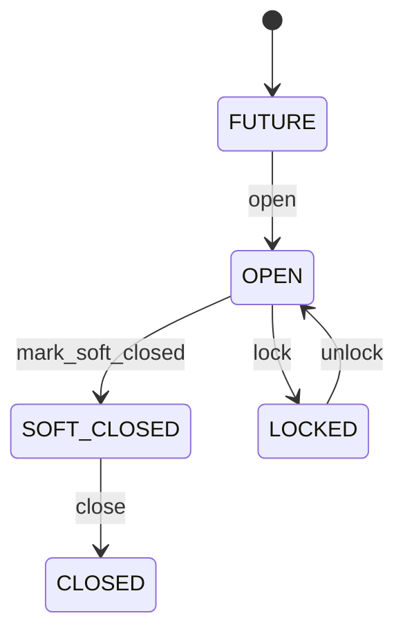

# Fiscal Period

Accounting-period control for posting, close and reporting. FiscalPeriod determines whether an accounting date is currently eligible for recognition; it does not replace JournalEntry. General ledger, AP, AR, treasury, assets, inventory accounting, tax and financial close. Organization defines books; JournalEntry carries accounting date; period state controls posting eligibility. Future → open → soft closed → closed → locked, with governed reopen where policy permits. Closing/reopening immediately revalidates pending postings and close processes while preserving already posted history.

## Finding records

Open **Fiscal Period** from the menu or from its card on the dashboard.

The list shows Code, Start Date, End Date, Status, Organization, with the most recently changed record first. The **Help** button beside the title opens this window's help text.

- **Search**: type in the search box above the grid to narrow the rows. **Search** at the top left opens advanced search, where you pick a field, a comparison (equals, contains, starts with, before, after, and so on) and a value.
- **Sort**: click a column heading; click again to reverse.
- **Refresh**: the refresh button at the top right re-reads the rows and every dropdown, so a record created a moment ago by someone else appears.
- **Export**: **CSV** downloads the rows you are looking at.
- **Open a record**: click a row. The line under the title, "Showing 1 to n of N entries", tells you how many rows match.

## Creating a record

Choose **New** at the top of the list. The form opens on its own page, with the fields in sections. A badge beside each label names the control (Text, Dropdown, Date, and so on); a red star marks a required field; the question-mark icon shows that field's help; and a hint such as “max 300” shows the longest entry accepted.

1. Fill in the fields described under [Fields](#fields).
2. These are required and must be completed before the record can be saved: **Code**, **Start Date**, **End Date**, **Status**, **Organization**.
3. For a dropdown that points at another window, pick the matching record; if the record you need does not exist yet, create it in its own window first. A dropdown may narrow to what you have already chosen, for example the states of the chosen country.
4. Choose **Create** (or **Save** in the toolbar). You return to the record, and it appears at the top of the list. If something is wrong the form says which field and why, and nothing is saved.

## Reading, changing and deleting a record

Click a row to open the record. Above the fields are the arrows that step through the list ("1 of 5"). Below them sit **Notes**, where anyone may leave a comment on the record, and the **Audit Trail**, which lists every change with who made it, when, and which fields changed.

- **Edit** (toolbar) makes the fields editable. Change them and choose **Save**; **Undo Changes** puts back what you changed and **Cancel Editing** leaves edit mode.
- **Copy Record** starts a new record from this one.
- **Delete Record** is available in edit mode and asks you to confirm; a record other records still depend on cannot be deleted.

Every change is also written to the [Audit Log](/administration/#audit-log).

## Fields

| Field | What you use | Rules | What to enter |
| --- | --- | --- | --- |
| Code | Text | Required, Up to 50 characters | Business period code. Human-facing accounting interval reference such as 2026-09. Journals, close and reports. Unique within organization/calendar context. Required. |
| Start Date | Date | Required | First accounting date in period. Defines lower posting boundary. Period determination. Inclusive with endDate. Required. |
| End Date | Date | Required | Last accounting date in period. Defines upper posting boundary. Period determination and close. Must not precede startDate. Required. |
| Status | Choice | Required | Posting-control state. Governs permitted accounting recognition and correction. Journal validation and close. Historical posted entries remain immutable. Not yet normally postable. Normal posting allowed. Restricted adjustment posting only. Ordinary posting prohibited. Administratively locked against posting/reopen without exceptional governance. Required. Choose one: Future, Open, Soft closed, Closed, Locked. |
| Organization | Lookup | Required | Accounting organization owning period. Establishes books/control boundary. Posting and reporting. Exactly one Organization. Journal organization must match. Pick a record from **Organization**. |

## How it connects to other records
- A fiscal period has many **Journal Entry** records.
- A fiscal period has many **Budget** records.
- A fiscal period has many **Forecast** records.
- A fiscal period belongs to one **Organization**.

## Lifecycle: Fiscal period lifecycle

A fiscal period record starts as **Future** and ends as **Closed**. Open a record and the bar above its fields shows its current **State** and, after **Next**, a button for each move that leaves it; choose one to make the move. Any move the diagram does not draw is refused, for everyone including the administrator.

| From | To | Move |
| --- | --- | --- |
| Future | Open | Open |
| Open | Soft closed | Mark soft closed |
| Soft closed | Closed | Close |
| Open | Locked | Lock |
| Locked | Open | Unlock |

## Who may use it

Anyone who holds a role with access to the **Fiscal Period** window. Access is granted by role under [Roles and access](/administration/access/).
