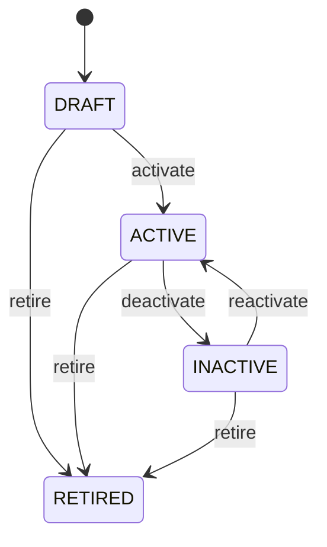

# Tax Rule

Defines reusable tax policy used to determine tax treatment and calculate tax amounts. TaxRule is policy; transaction tax evidence records what tax was actually determined and charged. Sales, procurement, invoicing, tax reporting, accounting and compliance. Discount determination normally establishes the post-discount base. Product, Customer, Organization, Location, transaction date and jurisdiction determine TaxRule applicability. InvoiceLine or TaxLine records the resulting tax. Gross amount → discount → taxable base → resolve effective TaxRule → calculate tax → round → snapshot tax evidence → invoice total → accounting/tax reporting. Policy changes trigger revalidation of eligible open transactions, not retroactive mutation. Draft → active for an effective period → inactive/retired. Future transactions respect lifecycle; historical tax calculations remain reproducible. Rate changes affect future determination and eligible open transactions; jurisdiction/scope changes trigger affected transaction validation; status changes prevent future selection; issued tax evidence remains unchanged. A taxable USD 900 post-discount base is subject to an 18% GST rule, producing USD 162 tax. If the rule later changes to 20%, the existing issued invoice retains USD 162 unless a legally authorized correction process creates a new tax document.

## Finding records

Open **Tax Rule** from the menu or from its card on the dashboard.

The list shows Code, Name, Rate, Jurisdiction Code, Tax Type, Valid From, Valid To, with the most recently changed record first. The **Help** button beside the title opens this window's help text.

- **Search**: type in the search box above the grid to narrow the rows. **Search** at the top left opens advanced search, where you pick a field, a comparison (equals, contains, starts with, before, after, and so on) and a value.
- **Sort**: click a column heading; click again to reverse.
- **Refresh**: the refresh button at the top right re-reads the rows and every dropdown, so a record created a moment ago by someone else appears.
- **Export**: **CSV** downloads the rows you are looking at.
- **Open a record**: click a row. The line under the title, "Showing 1 to n of N entries", tells you how many rows match.

## Creating a record

Choose **New** at the top of the list. The form opens on its own page, with the fields in sections. A badge beside each label names the control (Text, Dropdown, Date, and so on); a red star marks a required field; the question-mark icon shows that field's help; and a hint such as “max 300” shows the longest entry accepted.

1. Fill in the fields described under [Fields](#fields).
2. These are required and must be completed before the record can be saved: **Code**, **Name**, **Rate**, **Tax Type**, **Status**.
3. For a dropdown that points at another window, pick the matching record; if the record you need does not exist yet, create it in its own window first. A dropdown may narrow to what you have already chosen, for example the states of the chosen country.
4. Choose **Create** (or **Save** in the toolbar). You return to the record, and it appears at the top of the list. If something is wrong the form says which field and why, and nothing is saved.

## Reading, changing and deleting a record

Click a row to open the record. Above the fields are the arrows that step through the list ("1 of 5"). Below them sit **Notes**, where anyone may leave a comment on the record, and the **Audit Trail**, which lists every change with who made it, when, and which fields changed.

- **Edit** (toolbar) makes the fields editable. Change them and choose **Save**; **Undo Changes** puts back what you changed and **Cancel Editing** leaves edit mode.
- **Copy Record** starts a new record from this one.
- **Delete Record** is available in edit mode and asks you to confirm; a record other records still depend on cannot be deleted.

Every change is also written to the [Audit Log](/administration/#audit-log).

## Fields

| Field | What you use | Rules | What to enter |
| --- | --- | --- | --- |
| Code | Text | Required, Unique, Up to 100 characters | The code of the tax rule: a value the business records on it. Entered or maintained when a tax rule is created or changed; shown on its form and available to search and reports. Read together with the tax rule's other fields and its relationships; it is not meaningful on its own. Required: a tax rule cannot be understood without its code. |
| Name | Text | Required, Up to 200 characters | The name of the tax rule: a value the business records on it. Entered or maintained when a tax rule is created or changed; shown on its form and available to search and reports. Read together with the tax rule's other fields and its relationships; it is not meaningful on its own. Required: a tax rule cannot be understood without its name. |
| Rate | Amount | Required | The rate of the tax rule: a number the business records on it. Entered or maintained when a tax rule is created or changed; shown on its form and available to search and reports. Read together with the tax rule's other fields and its relationships; it is not meaningful on its own. Required: a tax rule cannot be understood without its rate. |
| Jurisdiction Code | Text | Up to 100 characters | The jurisdiction code of the tax rule: a value the business records on it. Entered or maintained when a tax rule is created or changed; shown on its form and available to search and reports. Read together with the tax rule's other fields and its relationships; it is not meaningful on its own. |
| Tax Type | Choice | Required | The tax type of the tax rule: a value the business records on it. Entered or maintained when a tax rule is created or changed; shown on its form and available to search and reports. Read together with the tax rule's other fields and its relationships; it is not meaningful on its own. Required: a tax rule cannot be understood without its tax type. The tax type of the tax rule is sales; set it when that is what the business means for this record. The tax type of the tax rule is vat; set it when that is what the business means for this record. The tax type of the tax rule is gst; set it when that is what the business means for this record. The tax type of the tax rule is use; set it when that is what the business means for this record. The tax type of the tax rule is withholding; set it when that is what the business means for this record. The tax type of the tax rule is other; set it when that is what the business means for this record. Choose one: Sales, Vat, Gst, Use, Withholding, Other. |
| Valid From | Date and time | Optional | The valid from of the tax rule: a point in time the business records on it. Entered or maintained when a tax rule is created or changed; shown on its form and available to search and reports. Read together with the tax rule's other fields and its relationships; it is not meaningful on its own. |
| Valid To | Date and time | Optional | The valid to of the tax rule: a point in time the business records on it. Entered or maintained when a tax rule is created or changed; shown on its form and available to search and reports. Read together with the tax rule's other fields and its relationships; it is not meaningful on its own. |
| Status | Choice | Required | The status of the tax rule: a value the business records on it. Entered or maintained when a tax rule is created or changed; shown on its form and available to search and reports. Read together with the tax rule's other fields and its relationships; it is not meaningful on its own. Required: a tax rule cannot be understood without its status. The status of the tax rule is draft; set it when that is what the business means for this record. The status of the tax rule is active; set it when that is what the business means for this record. The status of the tax rule is inactive; set it when that is what the business means for this record. The status of the tax rule is retired; set it when that is what the business means for this record. Choose one: Draft, Active, Inactive, Retired. |
| Invoice Line | Lookup | Optional | The InvoiceLine this TaxRule belongs to. Pick a record from **Invoice**. |
| Credit Note Line | Lookup | Optional | The CreditNoteLine this TaxRule belongs to. Pick a record from **Credit Note**. |
| Jurisdiction | Lookup | Optional | Links a tax rule to location, the jurisdiction it relates to. Chosen from the existing location records when the tax rule is created or edited. A tax rule has at most one location in this role. Lets the tax rule be found from, and reported with, its location. Pick a record from **Location**. |

## How it connects to other records
- A tax rule belongs to one **Invoice**.
- A tax rule belongs to one **Credit Note**.
- A tax rule belongs to one **Location**.
- A tax rule has many **Product** records.
- A tax rule has many **Customer** records.
- A tax rule has many **Organization** records.

## Lifecycle: Tax rule lifecycle

A tax rule record starts as **Draft** and ends as **Retired**. Open a record and the bar above its fields shows its current **State** and, after **Next**, a button for each move that leaves it; choose one to make the move. Any move the diagram does not draw is refused, for everyone including the administrator.

| From | To | Move |
| --- | --- | --- |
| Draft | Active | Activate |
| Active | Inactive | Deactivate |
| Inactive | Active | Reactivate |
| Draft | Retired | Retire |
| Active | Retired | Retire |
| Inactive | Retired | Retire |

## What happens when you save
Business rules run around the save. They are listed here and explained in full under [Business rules](/administration/rules/).

| Rule | When | Order |
| --- | --- | --- |
| Tax rule invariants before create | before a tax rule is created | 100 |
| Tax rule invariants before update | before a tax rule is changed | 100 |

## Who may use it

Anyone who holds a role with access to the **Tax Rule** window. Access is granted by role under [Roles and access](/administration/access/).
