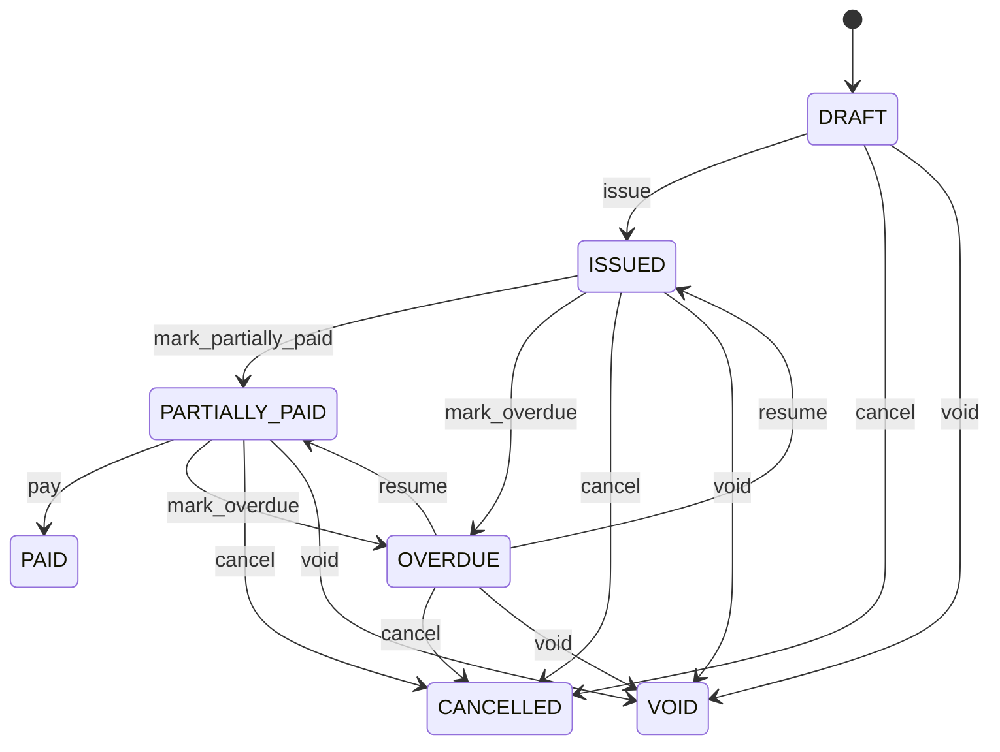

# Invoice

Represents a formal financial claim and its controlled settlement and adjustment state. Invoice records what was originally claimed. Payment records money moved. PaymentAllocation records how money is applied. CreditNote, SupplierCreditNote, and SupplierDebitNote record separate authorized financial adjustments; their application entities record claim-level consumption. Used by order-to-cash, procure-to-pay, accounting, tax, collections, payments, reconciliation, customer credit, supplier recovery and audit. SalesOrder provides commercial commitment, Shipment or delivery provides fulfillment where applicable, GoodsReceipt provides accepted procurement fulfillment, Invoice provides the claim, CreditNote provides customer reduction, SupplierCreditNote provides supplier reduction, SupplierDebitNote provides buyer recovery, Payment provides settlement, and application entities connect each adjustment to the claim. Invoice preparation → line calculation → discount → taxable base → tax determination → total → PaymentTerm due-date calculation → issue → payment → PaymentAllocation and/or approved adjustment application → amountSettled/amountCredited/amountOutstanding → PARTIALLY_PAID or PAID. Supplier credit and debit applications remain explicit non-cash financial evidence. Draft → issued → partially paid or overdue → paid, with cancellation and void paths. Corrections use CreditNote, SupplierCreditNote, SupplierDebitNote, controlled adjustments, or allocation/application reversals rather than silently rewriting posted evidence. Changes to Customer, Supplier, Product, UOM, pricing, discount, tax, Currency, SalesOrder, PurchaseOrder, GoodsReceipt, return, claim, credit, or debit evidence affecting an open transaction trigger controlled revalidation. Posted invoice history is not silently recalculated. Posted adjustments and applications are corrected through explicit reversal/replacement. A purchase invoice totals 10,000 EUR. A 1,000 EUR supplier credit and a 500 EUR supplier debit are each explicitly applied through their application entities; the invoice's original values remain unchanged while payable exposure is reconciled from the active settlement and adjustment evidence.

## Finding records

Open **Invoice** from the menu or from its card on the dashboard.

The list shows Invoice Number, Invoice Date, Due Date, Invoice Type, Status, Currency, Subtotal, with the most recently changed record first. The **Help** button beside the title opens this window's help text.

- **Search**: type in the search box above the grid to narrow the rows. **Search** at the top left opens advanced search, where you pick a field, a comparison (equals, contains, starts with, before, after, and so on) and a value.
- **Sort**: click a column heading; click again to reverse.
- **Refresh**: the refresh button at the top right re-reads the rows and every dropdown, so a record created a moment ago by someone else appears.
- **Export**: **CSV** downloads the rows you are looking at.
- **Open a record**: click a row. The line under the title, "Showing 1 to n of N entries", tells you how many rows match.

## Creating a record

Choose **New** at the top of the list. The form opens on its own page, with the fields in sections. A badge beside each label names the control (Text, Dropdown, Date, and so on); a red star marks a required field; the question-mark icon shows that field's help; and a hint such as “max 300” shows the longest entry accepted.

1. Fill in the fields described under [Fields](#fields).
2. These are required and must be completed before the record can be saved: **Invoice Number**, **Invoice Date**, **Invoice Type**, **Status**, **Currency**, **Subtotal**, **Discount Amount**, **Taxable Amount**, **Tax Amount**, **Total Amount**, **Amount Settled**, **Amount Credited**, **Amount Outstanding**.
3. For a dropdown that points at another window, pick the matching record; if the record you need does not exist yet, create it in its own window first. A dropdown may narrow to what you have already chosen, for example the states of the chosen country.
4. Choose **Create** (or **Save** in the toolbar). You return to the record, and it appears at the top of the list. If something is wrong the form says which field and why, and nothing is saved.

## Reading, changing and deleting a record

Click a row to open the record. Above the fields are the arrows that step through the list ("1 of 5"). Below them sit **Notes**, where anyone may leave a comment on the record, and the **Audit Trail**, which lists every change with who made it, when, and which fields changed.

- **Edit** (toolbar) makes the fields editable. Change them and choose **Save**; **Undo Changes** puts back what you changed and **Cancel Editing** leaves edit mode.
- **Copy Record** starts a new record from this one.
- **Delete Record** is available in edit mode and asks you to confirm; a record other records still depend on cannot be deleted.

Every change is also written to the [Audit Log](/administration/#audit-log).

## Fields

| Field | What you use | Rules | What to enter |
| --- | --- | --- | --- |
| Invoice Number | Text | Required, Unique, Up to 100 characters | Business-facing invoice reference. Identifier communicated to customers, suppliers, tax authorities, and financial operations. Used in documents, statements, reconciliation, collections, payables, and integrations. Distinct from invoiceId and source order numbers. Provides the human-recognizable reference throughout the claim lifecycle. Required for operational and financial communication. |
| Invoice Date | Date | Required | Accounting and commercial date assigned to the invoice. Establishes the date used for financial chronology and applicable billing and tax rules. Used for accounting periods, tax, payment-term calculation, aging, reporting, and reconciliation. Distinct from payment, bank settlement, credit-note, debit-note, and clearing dates. Provides the temporal anchor for invoice issuance and applicable PaymentTerm calculation. Required for financial chronology. |
| Due Date | Date | Optional | Transaction-level date by which the claim is expected to be settled. Result of applying the effective PaymentTerm and due-date basis to the invoice. Drives aging, collections, cash forecasting, and payment planning. PaymentTerm is policy; dueDate is the invoice-specific result and must not be silently recalculated after issue. Determines when the outstanding claim becomes overdue under the applicable policy. Optional while terms remain unresolved or for claim types without a due date. |
| Invoice Type | Choice | Required | Defines the commercial direction and accounting nature of the invoice document. Determines whether the document establishes a receivable, payable, or adjustment. Used by accounting, tax, receivables, payables, matching, and reporting. Must agree with Customer/Supplier and source transaction relationships. A dedicated CreditNote or SupplierDebitNote is preferred for explicit financial adjustments. Controls which party, matching, tax, and settlement processes apply. Required for correct financial treatment. The invoice type of the invoice is sales; set it when that is what the business means for this record. The invoice type of the invoice is purchase; set it when that is what the business means for this record. The invoice type of the invoice is credit note; set it when that is what the business means for this record. The invoice type of the invoice is debit note; set it when that is what the business means for this record. Choose one: Sales, Purchase, Credit note, Debit note. |
| Status | Choice | Required | Lifecycle state of the financial claim. Indicates whether the claim is being prepared, outstanding, settled, overdue, cancelled, or voided. Controls issuance, settlement, aging, cancellation, reporting, and accounting workflows. PaymentAllocation supplies settlement evidence; CreditNote and SupplierDebitNoteApplication supply authorized adjustment evidence; Payment status alone must never determine invoice payment status. ISSUED establishes the claim; active allocations and authorized adjustment applications change settlement projection; PAID requires no remaining amount under policy; OVERDUE is time-based and may coexist with partial settlement. Claim is being prepared and is not issued. Claim is formally outstanding. Active settlement evidence covers part of the amount due after authorized adjustments. Active settlement evidence and authorized adjustments fully satisfy the claim under policy. Claim remains outstanding after its due date. Claim has been cancelled under authorized controls. Claim has been invalidated under accounting controls. Required for controlled claim lifecycle. Choose one: Draft, Issued, Partially paid, Paid, Overdue, Cancelled, Void. |
| Currency | Lookup | Required | Currency denomination shared by the invoice's monetary values. Defines the monetary denomination of the claim and its calculated totals. Used for accounting, payment allocation, tax, reconciliation, reporting, and credit or debit adjustment. Payment, CreditNote, SupplierCreditNote, or SupplierDebitNote may use another currency only under explicitly governed exchange-rate treatment. Provides the denomination against which invoice amounts, settlement and adjustments are evaluated. Required for interpreting the claim. Pick a record from **Currency**. |
| Subtotal | Amount | Required | Aggregate of invoice line amounts before document-level tax and other applicable document adjustments. Represents the pre-tax financial base derived from invoice lines after line-level pricing treatment. Used for tax calculation, accounting, reconciliation, and document totals. Must use invoice currency and reconcile with InvoiceLine monetary values. Feeds document-level discount, tax, and total calculations according to policy. Required for claim calculation. |
| Discount Amount | Amount | Required | Aggregate document-level discount applied after applicable line pricing and before taxable base where policy requires. Represents a document-level reduction distinct from line-level discounts and settlement discounts. Used for invoice calculation, tax determination, reporting, and reconciliation. Must reconcile with applicable DiscountRule evidence and must not be confused with credit notes or early-payment discounts. Reduces the applicable document base before tax according to the invoice calculation policy. Required as a zero-valued projection when no document discount exists. |
| Taxable Amount | Amount | Required | Aggregate monetary base on which applicable invoice taxes are calculated. Represents the amount subject to tax after applicable discounts and exemptions. Used for tax calculation, tax reporting, audit, and reconciliation. Must reconcile with InvoiceLine taxable amounts and document-level tax determinations. Supplies the base for TaxRule application and tax calculation. Required for deterministic tax calculation. |
| Tax Amount | Amount | Required | Aggregate tax amount calculated under applicable TaxRules and transaction tax determinations. Represents tax charged or otherwise recognized on the claim, not the taxable base. Used for tax reporting, invoice totals, accounting, and reconciliation. Must reconcile with transaction-level tax evidence and jurisdictional treatment. Contributes to totalAmount and downstream tax/accounting reporting. Required, including zero when no tax applies. |
| Total Amount | Amount | Required | Total financial claim after applicable line values, discounts, taxes, credits, debits, and document adjustments. Represents the amount owed under the original invoice before settlement allocations and later adjustment applications. Used for settlement, aging, statements, reporting, and accounting. Represents the original claim itself, not the amount already paid or subsequently adjusted. Provides the claim base against which active PaymentAllocation and authorized adjustment application evidence are evaluated. Required for financial settlement. |
| Amount Settled | Amount | Required | Projection of active settlement amounts applied to this invoice. Represents how much of the claim is settled according to active PaymentAllocation records. Used to calculate outstanding balance and derive settlement status. Not an independent cash event; Payment and PaymentAllocation provide the underlying evidence. Changes when allocations are posted, activated, reversed, or corrected. Required as a settlement projection. |
| Amount Credited | Amount | Required | Projection of active CreditNote amounts applied against this invoice claim. Represents authorized financial reductions supported by posted CreditNote evidence. Used for customer balance, invoice settlement, statements, reconciliation and reporting. CreditNote is a separate financial document; this projection must not rewrite original Invoice or InvoiceLine values. Changes through controlled credit-note application or reversal workflows. Required as a zero-valued adjustment projection when no credits apply. |
| Amount Outstanding | Amount | Required | Projection of the portion of the invoice claim that remains unsettled after authorized credits and debits. Represents current open exposure under the applicable accounting and rounding policy. Drives collections, payment allocation, aging, statements, and cash forecasting. Normally reconciles totalAmount less active settlement and authorized adjustment applications in invoice currency. Determines whether additional allocation or adjustment application is permitted and whether PAID can be reached. Required for operational settlement decisions. |
| Customer | Lookup | Optional | Customer associated with a sales invoice. Identifies the party against whom a receivable claim is established. Supports receivables, statements, collections, tax, credit, and customer reporting. Required for SALES invoices unless another controlled party model applies. Supplies commercial party context for the claim and settlement. Pick a record from **Customer**. |
| Supplier | Lookup | Optional | Supplier associated with a purchase invoice. Identifies the party to whom a payable claim relates. Supports payables, supplier statements, procurement reconciliation, tax, and payment processing. Required for PURCHASE invoices unless another controlled party model applies. Supplies commercial party context for three-way matching and settlement. Pick a record from **Supplier**. |
| Sales Order | Lookup | Optional | Sales commitment from which a sales invoice may originate. Connects customer demand commitment to the resulting financial claim. Supports order-to-cash traceability, billing reconciliation, and revenue processes. SalesOrder is the commercial commitment; Invoice is the financial claim. Provides source context for sales billing. Pick a record from **Sales Order**. |
| Purchase Order | Lookup | Optional | Procurement commitment against which a supplier invoice may be evaluated. Connects supplier commitment to the resulting payable claim. Supports three-way matching and accounts payable controls. PurchaseOrder is commitment; GoodsReceipt is accepted fulfillment; Invoice is the claim. Supplies ordered quantity and price context for InvoiceLine matching. Pick a record from **Purchase Order**. |

## How it connects to other records
- A invoice belongs to one **Currency**.
- A invoice belongs to one **Customer**.
- A invoice belongs to one **Supplier**.
- A invoice has many **Invoice** records.
- A invoice has many **Payment** records.
- A invoice belongs to one **Sales Order**.
- A invoice belongs to one **Purchase Order**.
- A invoice is linked to many **Credit Note** records.
- A invoice has many **Credit Note Application** records.

## Lifecycle: Invoice lifecycle

A invoice record starts as **Draft** and ends as **Paid** or **Cancelled** or **Void**. Open a record and the bar above its fields shows its current **State** and, after **Next**, a button for each move that leaves it; choose one to make the move. Any move the diagram does not draw is refused, for everyone including the administrator.

| From | To | Move |
| --- | --- | --- |
| Draft | Issued | Issue |
| Issued | Partially paid | Mark partially paid |
| Partially paid | Paid | Pay |
| Issued | Overdue | Mark overdue |
| Overdue | Issued | Resume |
| Partially paid | Overdue | Mark overdue |
| Overdue | Partially paid | Resume |
| Draft | Cancelled | Cancel |
| Issued | Cancelled | Cancel |
| Partially paid | Cancelled | Cancel |
| Overdue | Cancelled | Cancel |
| Draft | Void | Void |
| Issued | Void | Void |
| Partially paid | Void | Void |
| Overdue | Void | Void |

## What happens when you save
Business rules run around the save. They are listed here and explained in full under [Business rules](/administration/rules/).

| Rule | When | Order |
| --- | --- | --- |
| Invoice invariants before create | before a invoice is created | 100 |
| Invoice invariants before update | before a invoice is changed | 100 |
| Invoice workflows after update | after a invoice is changed | 100 |

Processes started from this record: [Invoice exception raised](/administration/processes/#invoice-exception-raised), [Invoice follow up required](/administration/processes/#invoice-follow-up-required).

## Who may use it

Anyone who holds a role with access to the **Invoice** window. Access is granted by role under [Roles and access](/administration/access/).
