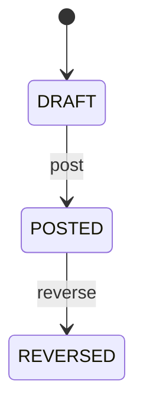

# Journal Entry

Represents accounting recognition of a business event in a balanced double-entry ledger. JournalEntry is the accounting representation, not the operational event itself. Payment records settlement activity, BankTransaction records external bank evidence, Invoice records a claim, CreditNote records customer adjustment, SupplierCreditNote records supplier payable adjustment, SupplierDebitNote records buyer recovery, and JournalEntry records accounting recognition. General ledger, accounts receivable, accounts payable, treasury, inventory accounting, asset accounting, tax, audit, period close and financial reporting. sourceTransaction provides generic origin. Payment, CreditNote, SupplierCreditNote and SupplierDebitNote provide direct traceability when applicable. JournalEntryLine contains debit/credit effects. Organization provides accounting boundary. Business event → accounting determination → JournalEntry draft → line validation → balance validation → POSTED. Customer and supplier credit/debit posting follows adjustment calculation and approval and must create/link required accounting recognition. Payment workflow independently progresses through payment states and bank reconciliation. Draft entries may be prepared and corrected under authorization. Posting establishes immutable recognition. Corrections after posting use explicit reversal and replacement entries. Changes to unposted CreditNote, SupplierCreditNote or SupplierDebitNote require accounting recalculation. Posted adjustment changes require reversal/replacement JournalEntry treatment; posted journal history is never destructively rewritten. A USD 500 SupplierDebitNote increases supplier recovery exposure. A balanced JournalEntry records the authorized accounting consequence. If the debit is later reversed, the original JournalEntry remains and a compensating reversal entry is posted.

## Finding records

Open **Journal Entry** from the menu or from its card on the dashboard.

The list shows Entry Number, Entry Date, Status, Description, Currency, Payment, Credit Note, with the most recently changed record first. The **Help** button beside the title opens this window's help text.

- **Search**: type in the search box above the grid to narrow the rows. **Search** at the top left opens advanced search, where you pick a field, a comparison (equals, contains, starts with, before, after, and so on) and a value.
- **Sort**: click a column heading; click again to reverse.
- **Refresh**: the refresh button at the top right re-reads the rows and every dropdown, so a record created a moment ago by someone else appears.
- **Export**: **CSV** downloads the rows you are looking at.
- **Open a record**: click a row. The line under the title, "Showing 1 to n of N entries", tells you how many rows match.

## Creating a record

Choose **New** at the top of the list. The form opens on its own page, with the fields in sections. A badge beside each label names the control (Text, Dropdown, Date, and so on); a red star marks a required field; the question-mark icon shows that field's help; and a hint such as “max 300” shows the longest entry accepted.

1. Fill in the fields described under [Fields](#fields).
2. These are required and must be completed before the record can be saved: **Entry Number**, **Entry Date**, **Status**.
3. For a dropdown that points at another window, pick the matching record; if the record you need does not exist yet, create it in its own window first. A dropdown may narrow to what you have already chosen, for example the states of the chosen country.
4. Choose **Create** (or **Save** in the toolbar). You return to the record, and it appears at the top of the list. If something is wrong the form says which field and why, and nothing is saved.

## Reading, changing and deleting a record

Click a row to open the record. Above the fields are the arrows that step through the list ("1 of 5"). Below them sit **Notes**, where anyone may leave a comment on the record, and the **Audit Trail**, which lists every change with who made it, when, and which fields changed.

- **Edit** (toolbar) makes the fields editable. Change them and choose **Save**; **Undo Changes** puts back what you changed and **Cancel Editing** leaves edit mode.
- **Copy Record** starts a new record from this one.
- **Delete Record** is available in edit mode and asks you to confirm; a record other records still depend on cannot be deleted.

Every change is also written to the [Audit Log](/administration/#audit-log).

## Fields

| Field | What you use | Rules | What to enter |
| --- | --- | --- | --- |
| Entry Number | Text | Required, Unique, Up to 100 characters | Human-facing accounting journal reference. Used by accountants, auditors, reports and integrations. Distinct from source transaction numbers such as Invoice, Payment, CreditNote, SupplierCreditNote and SupplierDebitNote references. Identifies the accounting record in ledgers and audit trails. Required. |
| Entry Date | Date and time | Required | Accounting date at which the entry is recognized. Determines accounting period, reporting chronology and period controls. May differ from originating transaction, bank value, invoice, CreditNote, SupplierCreditNote or SupplierDebitNote date. Controls the period into which the entry is posted. Required. |
| Status | Choice | Required | Accounting lifecycle state. Controls editing, posting, reporting and reversal permissions. Independent of Payment, Invoice, CreditNote, SupplierCreditNote, SupplierDebitNote and BankTransaction statuses. DRAFT permits preparation; POSTED establishes recognition; REVERSED preserves original history while counteracting its effect. Required. The status of the journal entry is draft; set it when that is what the business means for this record. The status of the journal entry is posted; set it when that is what the business means for this record. The status of the journal entry is reversed; set it when that is what the business means for this record. Choose one: Draft, Posted, Reversed. |
| Description | Text | Up to 1000 characters | Human-readable explanation of the accounting event. Supports review, audit, reconciliation and reporting. Complements source transaction and lines; must not be sole accounting evidence. Helps accountants understand why the entry was generated. Optional when source and line information fully explain the event. |
| Currency | Lookup | Optional | The Currency this JournalEntry belongs to. Pick a record from **Currency**. |
| Payment | Lookup | Optional | Payment whose financial recognition is represented when applicable. Supports cash, receivable, payable, clearing, fee and settlement accounting traceability. Optional because not every journal entry originates from a payment. A posted payment may generate accounting recognition while Payment status remains separate. Pick a record from **Payment**. |
| Credit Note | Lookup | Optional | Customer CreditNote whose financial adjustment is represented. Supports receivable, revenue, tax, inventory-related and refund-obligation accounting traceability. Optional because not every journal entry represents a customer credit. CreditNote posting requires appropriate accounting recognition. Pick a record from **Credit Note**. |
| Organization | Lookup | Optional | Organization whose books recognize the accounting entry. Supports legal-entity accounting, reporting, period control and ledger ownership. Optional when organization is inherited from ledger context. Determines accounting boundary and applicable chart/period policies. Pick a record from **Organization**. |
| Fiscal Period | Lookup | Optional | Accounting control period containing entryDate. Establishes posting eligibility and close context. Posting, close, reporting and audit. Required for POSTED entries under period-controlled accounting; optional while draft before determination. Organization/date must resolve to an eligible period before posting. Pick a record from **Fiscal Period**. |
| Ledger | Lookup | Optional | The Ledger this JournalEntry belongs to. Pick a record from **Ledger**. |

## How it connects to other records
- A journal entry belongs to one **Currency**.
- A journal entry has many **Journal Entry Line** records.
- A journal entry belongs to one **Payment**.
- A journal entry belongs to one **Credit Note**.
- A journal entry belongs to one **Organization**.
- A journal entry belongs to one **Fiscal Period**.
- A journal entry belongs to one **Ledger**.

## Lifecycle: Journal entry lifecycle

A journal entry record starts as **Draft** and ends as **Reversed**. Open a record and the bar above its fields shows its current **State** and, after **Next**, a button for each move that leaves it; choose one to make the move. Any move the diagram does not draw is refused, for everyone including the administrator.

| From | To | Move |
| --- | --- | --- |
| Draft | Posted | Post |
| Posted | Reversed | Reverse |

## What happens when you save
Business rules run around the save. They are listed here and explained in full under [Business rules](/administration/rules/).

| Rule | When | Order |
| --- | --- | --- |
| Journal entry workflows after update | after a journal entry is changed | 100 |

Processes started from this record: [Journal entry follow up required](/administration/processes/#journal-entry-follow-up-required), [Journal entry completion confirmed](/administration/processes/#journal-entry-completion-confirmed).

## Who may use it

Anyone who holds a role with access to the **Journal Entry** window. Access is granted by role under [Roles and access](/administration/access/).
