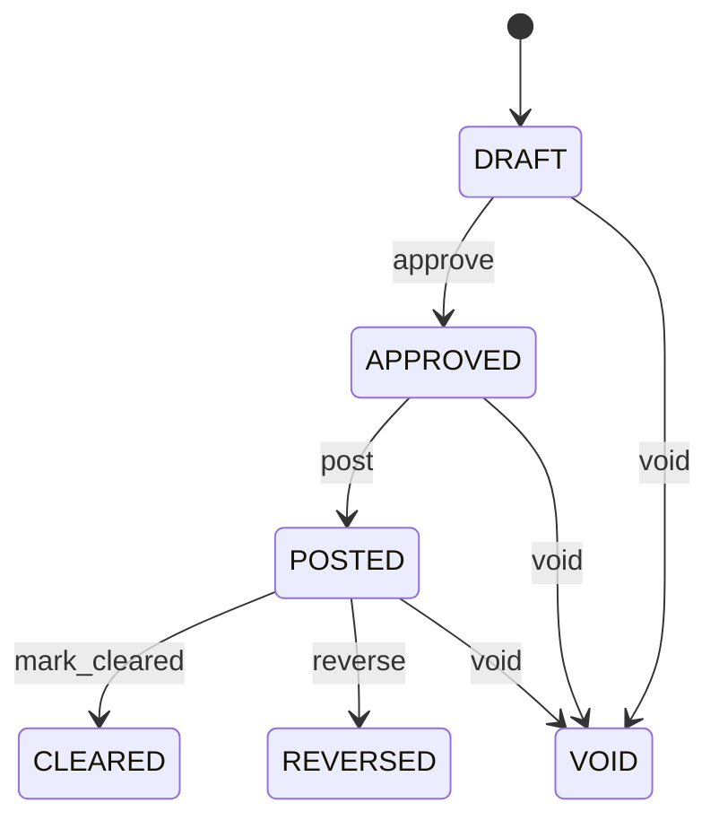

# Payment

Represents movement or recognition of money while keeping payment execution, claim settlement, bank evidence, accounting recognition, customer refunds and supplier-credit refunds as separate connected facts. Payment is the settlement event. Invoice is the claim. PaymentAllocation applies receipt payments to claims. CreditNote is a customer financial adjustment. SupplierCreditNote is a supplier payable adjustment. A refund or settlement Payment is separate cash evidence. Accounts receivable, accounts payable, treasury, banking integrations, cash management, reconciliation, collections, supplier payments, customer refunds and supplier-credit refunds. Currency defines denomination. PaymentAllocation connects receipt Payments to claims. CreditNote connects customer refunds. SupplierCreditNote connects supplier-credit cash settlements when a supplier returns funds. BankTransaction confirms external settlement. JournalEntry records accounting consequences. Receipt Payment → approval → posting → allocation → bank evidence → cleared. Customer credit: CreditNote posted → application or refund due → DISBURSEMENT Payment → bank reconciliation. Supplier credit: SupplierCreditNote posted → application against payable or supplier refund due → RECEIPT Payment from supplier → bank reconciliation. Original payment and credit histories remain immutable. Draft → approved → posted → cleared, with controlled void and reversal paths. Payment, Invoice, CreditNote, SupplierCreditNote, BankTransaction and JournalEntry retain independent lifecycle states because they represent different business facts. Changes to CreditNote or SupplierCreditNote settlement obligations require validation of linked payment eligibility. Payment reversal requires corresponding reversal of affected refund/settlement projections and accounting evidence; it must never rewrite the originating credit note. A supplier has a EUR 300 unapplied SupplierCreditNote. The supplier refunds EUR 300 rather than applying it to another invoice. A new RECEIPT Payment for EUR 300 is linked to the SupplierCreditNote and reconciled to bank evidence. The original supplier credit remains unchanged except for its controlled cash-settlement projection.

## Finding records

Open **Payment** from the menu or from its card on the dashboard.

The list shows Payment Number, Payment Date, Direction, Status, Amount, Currency, Payment Method, with the most recently changed record first. The **Help** button beside the title opens this window's help text.

- **Search**: type in the search box above the grid to narrow the rows. **Search** at the top left opens advanced search, where you pick a field, a comparison (equals, contains, starts with, before, after, and so on) and a value.
- **Sort**: click a column heading; click again to reverse.
- **Refresh**: the refresh button at the top right re-reads the rows and every dropdown, so a record created a moment ago by someone else appears.
- **Export**: **CSV** downloads the rows you are looking at.
- **Open a record**: click a row. The line under the title, "Showing 1 to n of N entries", tells you how many rows match.

## Creating a record

Choose **New** at the top of the list. The form opens on its own page, with the fields in sections. A badge beside each label names the control (Text, Dropdown, Date, and so on); a red star marks a required field; the question-mark icon shows that field's help; and a hint such as “max 300” shows the longest entry accepted.

1. Fill in the fields described under [Fields](#fields).
2. These are required and must be completed before the record can be saved: **Payment Number**, **Payment Date**, **Direction**, **Status**, **Amount**, **Currency**, **Payment Method**.
3. For a dropdown that points at another window, pick the matching record; if the record you need does not exist yet, create it in its own window first. A dropdown may narrow to what you have already chosen, for example the states of the chosen country.
4. Choose **Create** (or **Save** in the toolbar). You return to the record, and it appears at the top of the list. If something is wrong the form says which field and why, and nothing is saved.

## Reading, changing and deleting a record

Click a row to open the record. Above the fields are the arrows that step through the list ("1 of 5"). Below them sit **Notes**, where anyone may leave a comment on the record, and the **Audit Trail**, which lists every change with who made it, when, and which fields changed.

- **Edit** (toolbar) makes the fields editable. Change them and choose **Save**; **Undo Changes** puts back what you changed and **Cancel Editing** leaves edit mode.
- **Copy Record** starts a new record from this one.
- **Delete Record** is available in edit mode and asks you to confirm; a record other records still depend on cannot be deleted.

Every change is also written to the [Audit Log](/administration/#audit-log).

## Fields

| Field | What you use | Rules | What to enter |
| --- | --- | --- | --- |
| Payment Number | Text | Required, Unique, Up to 100 characters | Business-facing payment reference. Reference communicated in remittance, statements, bank reconciliation and payment inquiries. Finance, counterparties, integrations and reconciliation. Distinct from paymentId and bank transaction identifiers. Correlates internal payment evidence with operational and external references. Required. |
| Payment Date | Date and time | Required | Timestamp at which the payment event is recognized by the business process. Establishes internal settlement chronology. Accounting periods, cash reporting, reconciliation and settlement analysis. Distinct from bank value date, clearing date, posting date, allocation date and credit-note date. Provides event time for internal payment processing. Required. |
| Direction | Choice | Required | Indicates whether the organization receives or disburses money. Establishes cash-flow direction and payer/payee interpretation. Receivables, payables, treasury, accounting and refunds/credit settlements. Customer refund and supplier-credit refund/settlement payments are DISBURSEMENT events and never rewrite original receipt payments. Determines cash-flow and settlement path. Required. The direction of the payment is receipt; set it when that is what the business means for this record. The direction of the payment is disbursement; set it when that is what the business means for this record. Choose one: Receipt, Disbursement. |
| Status | Choice | Required | Lifecycle state of the payment event. Indicates authorization, internal recognition, external clearing, invalidation or reversal. Controls execution, reconciliation, reporting and correction. Independent of Invoice, CreditNote, SupplierCreditNote and BankTransaction statuses. APPROVED authorizes processing; POSTED recognizes internally; CLEARED confirms external evidence; VOID/REVERSED handle correction. Required. The status of the payment is draft; set it when that is what the business means for this record. The status of the payment is approved; set it when that is what the business means for this record. The status of the payment is posted; set it when that is what the business means for this record. The status of the payment is cleared; set it when that is what the business means for this record. The status of the payment is void; set it when that is what the business means for this record. The status of the payment is reversed; set it when that is what the business means for this record. Choose one: Draft, Approved, Posted, Cleared, Void, Reversed. |
| Amount | Amount | Required | Total monetary value of the payment event. Represents money received or disbursed, not the amount allocated to one claim or credit. Cash position, allocation validation, accounting and reconciliation. PaymentAllocation distributes receipt payments; a credit-settlement payment settles an explicit customer or supplier credit obligation. Provides source monetary amount. Required. |
| Currency | Lookup | Required | Currency denomination of the payment. Defines interpretation of payment amount. Allocation, exchange-rate selection, bank reconciliation, accounting and reporting. May differ from invoice or credit currency only with explicit ExchangeRate evidence. Establishes source currency. Required. Pick a record from **Currency**. |
| Payment Method | Choice | Required | Mechanism through which payment is executed or received. Describes how money moves rather than which obligation it settles. Execution, bank matching, treasury and reconciliation. Refund or supplier-credit settlement method must satisfy applicable policy. Determines expected settlement evidence. Required. The payment method of the payment is cash; set it when that is what the business means for this record. The payment method of the payment is bank transfer; set it when that is what the business means for this record. The payment method of the payment is card; set it when that is what the business means for this record. The payment method of the payment is cheque; set it when that is what the business means for this record. The payment method of the payment is direct debit; set it when that is what the business means for this record. The payment method of the payment is other; set it when that is what the business means for this record. Choose one: Cash, Bank transfer, Card, Cheque, Direct debit, Other. |
| Value Date | Date | Optional | Economic effective date of funds under settlement convention. Distinguishes economic cash availability from internal creation time. Cash forecasting, interest, reconciliation and accounting analysis. May differ from paymentDate and bank clearing timestamp. Provides settlement timing context. Optional when no separate value date exists. |
| External Reference | Text | Up to 250 characters | External remittance, bank, processor or instrument reference. Connects internal payment evidence to external settlement identifier. Bank reconciliation, remittance matching, gateway reconciliation and audit. Does not replace allocations or credit identities. Helps resolve external evidence. Optional. |
| Payer | Lookup | Optional | Party providing money for a receipt or associated with a disbursement. Identifies source-side party. Customer receipts, refunds, supplier settlements and audit. Optional for aggregated/external settlement. Supplies party context. Pick a record from **Party**. |
| Bank Account | Lookup | Optional | Bank account through which payment is expected to be received or disbursed. Connects payment to internal financial account. Treasury, cash management, execution and reconciliation. Optional for cash or externally managed methods. Provides account context. Pick a record from **Bank Account**. |
| Supplier | Lookup | Optional | The Supplier this Payment belongs to. Pick a record from **Supplier**. |
| Customer | Lookup | Optional | The Customer this Payment belongs to. Pick a record from **Customer**. |
| Cash Position | Lookup | Optional | The CashPosition this Payment belongs to. Pick a record from **Cash Position**. |

## How it connects to other records
- A payment belongs to one **Currency**.
- A payment has many **Journal Entry** records.
- A payment belongs to one **Party**.
- A payment has many **Payment** records.
- A payment belongs to one **Bank Account**.
- A payment is linked to many **Credit Note** records.
- A payment belongs to one **Supplier**.
- A payment belongs to one **Customer**.
- A payment has many **Payment Instruction** records.
- A payment belongs to one **Cash Position**.

## Lifecycle: Payment lifecycle

A payment record starts as **Draft** and ends as **Cleared** or **Void** or **Reversed**. Open a record and the bar above its fields shows its current **State** and, after **Next**, a button for each move that leaves it; choose one to make the move. Any move the diagram does not draw is refused, for everyone including the administrator.

| From | To | Move |
| --- | --- | --- |
| Draft | Approved | Approve |
| Approved | Posted | Post |
| Posted | Cleared | Mark cleared |
| Draft | Void | Void |
| Approved | Void | Void |
| Posted | Void | Void |
| Posted | Reversed | Reverse |

## What happens when you save
Business rules run around the save. They are listed here and explained in full under [Business rules](/administration/rules/).

| Rule | When | Order |
| --- | --- | --- |
| Payment invariants before create | before a payment is created | 100 |
| Payment invariants before update | before a payment is changed | 100 |
| Payment workflows after update | after a payment is changed | 100 |

Processes started from this record: [Payment follow up required](/administration/processes/#payment-follow-up-required), [Payment completion confirmed](/administration/processes/#payment-completion-confirmed).

## Who may use it

Anyone who holds a role with access to the **Payment** window. Access is granted by role under [Roles and access](/administration/access/).
