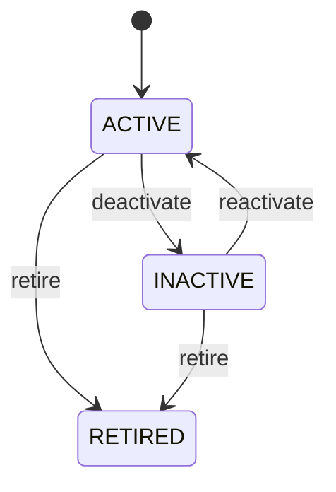

# Address

Reusable address master data with explicit rules for ownership, primary selection, lifecycle, and historical transaction evidence. Address is reusable master data, but an address printed on an issued invoice, shipment, order, or other historical document is transaction evidence and must remain reproducible even if the master address changes. Supports Party, Organization, Customer, Supplier, Location, order, fulfillment, invoicing, taxation, shipping, reporting, and integration workflows. Party and Location may reuse an Address. Operational documents should resolve the effective address at transaction time and preserve the result where historical reproduction is required. Address create/update → validate country/geography → validate Party/Location dependency → select effective address → transaction captures address evidence → later master-data changes affect future selection only. Active → inactive/retired. Retirement prevents new normal use but does not remove historical references or snapshots. A Customer changes its billing address. The Customer master now points to the new active address, while already issued Invoices retain the address effective when they were issued.

## Finding records

Open **Address** from the menu or from its card on the dashboard.

The list shows Address Type, Line1, Line2, Line3, City Name, Postal Code, Latitude, with the most recently changed record first. The **Help** button beside the title opens this window's help text.

- **Search**: type in the search box above the grid to narrow the rows. **Search** at the top left opens advanced search, where you pick a field, a comparison (equals, contains, starts with, before, after, and so on) and a value.
- **Sort**: click a column heading; click again to reverse.
- **Refresh**: the refresh button at the top right re-reads the rows and every dropdown, so a record created a moment ago by someone else appears.
- **Export**: **CSV** downloads the rows you are looking at.
- **Open a record**: click a row. The line under the title, "Showing 1 to n of N entries", tells you how many rows match.

## Creating a record

Choose **New** at the top of the list. The form opens on its own page, with the fields in sections. A badge beside each label names the control (Text, Dropdown, Date, and so on); a red star marks a required field; the question-mark icon shows that field's help; and a hint such as “max 300” shows the longest entry accepted.

1. Fill in the fields described under [Fields](#fields).
2. These are required and must be completed before the record can be saved: **Address Type**, **Line1**, **Is Primary**, **Status**, **Country**.
3. For a dropdown that points at another window, pick the matching record; if the record you need does not exist yet, create it in its own window first. A dropdown may narrow to what you have already chosen, for example the states of the chosen country.
4. Choose **Create** (or **Save** in the toolbar). You return to the record, and it appears at the top of the list. If something is wrong the form says which field and why, and nothing is saved.

## Reading, changing and deleting a record

Click a row to open the record. Above the fields are the arrows that step through the list ("1 of 5"). Below them sit **Notes**, where anyone may leave a comment on the record, and the **Audit Trail**, which lists every change with who made it, when, and which fields changed.

- **Edit** (toolbar) makes the fields editable. Change them and choose **Save**; **Undo Changes** puts back what you changed and **Cancel Editing** leaves edit mode.
- **Copy Record** starts a new record from this one.
- **Delete Record** is available in edit mode and asks you to confirm; a record other records still depend on cannot be deleted.

Every change is also written to the [Audit Log](/administration/#audit-log).

## Fields

| Field | What you use | Rules | What to enter |
| --- | --- | --- | --- |
| Address Type | Choice | Required | The address type of the address: a value the business records on it. Entered or maintained when a address is created or changed; shown on its form and available to search and reports. Read together with the address's other fields and its relationships; it is not meaningful on its own. Required: a address cannot be understood without its address type. The address type of the address is residential; set it when that is what the business means for this record. The address type of the address is business; set it when that is what the business means for this record. The address type of the address is billing; set it when that is what the business means for this record. The address type of the address is shipping; set it when that is what the business means for this record. The address type of the address is registered; set it when that is what the business means for this record. The address type of the address is postal; set it when that is what the business means for this record. The address type of the address is other; set it when that is what the business means for this record. Choose one: Residential, Business, Billing, Shipping, Registered, Postal, Other. |
| Line1 | Text | Required, Up to 200 characters | The line1 of the address: a value the business records on it. Entered or maintained when a address is created or changed; shown on its form and available to search and reports. Read together with the address's other fields and its relationships; it is not meaningful on its own. Required: a address cannot be understood without its line1. |
| Line2 | Text | Up to 200 characters | The line2 of the address: a value the business records on it. Entered or maintained when a address is created or changed; shown on its form and available to search and reports. Read together with the address's other fields and its relationships; it is not meaningful on its own. |
| Line3 | Text | Up to 200 characters | The line3 of the address: a value the business records on it. Entered or maintained when a address is created or changed; shown on its form and available to search and reports. Read together with the address's other fields and its relationships; it is not meaningful on its own. |
| City Name | Text | Up to 150 characters | The name of the town or locality when it is not in the list of cities. Filled only when no city can be chosen; leave it empty when the city is picked from the list. Stands in for the city relationship; an address states one or the other. |
| Postal Code | Text | Up to 30 characters | The postal code of the address: a value the business records on it. Entered or maintained when a address is created or changed; shown on its form and available to search and reports. Read together with the address's other fields and its relationships; it is not meaningful on its own. |
| Latitude | Amount | Optional | The latitude of the address: a number the business records on it. Entered or maintained when a address is created or changed; shown on its form and available to search and reports. Read together with the address's other fields and its relationships; it is not meaningful on its own. |
| Longitude | Amount | Optional | The longitude of the address: a number the business records on it. Entered or maintained when a address is created or changed; shown on its form and available to search and reports. Read together with the address's other fields and its relationships; it is not meaningful on its own. |
| Is Primary | Yes / No | Required | The is primary of the address: a yes/no indicator the business records on it. Entered or maintained when a address is created or changed; shown on its form and available to search and reports. Read together with the address's other fields and its relationships; it is not meaningful on its own. Required: a address cannot be understood without its is primary. |
| Status | Choice | Required | The status of the address: a value the business records on it. Entered or maintained when a address is created or changed; shown on its form and available to search and reports. Read together with the address's other fields and its relationships; it is not meaningful on its own. Required: a address cannot be understood without its status. The status of the address is active; set it when that is what the business means for this record. The status of the address is inactive; set it when that is what the business means for this record. The status of the address is retired; set it when that is what the business means for this record. Choose one: Active, Inactive, Retired. |
| Party | Lookup | Optional | Party that maintains or uses this reusable address. Provides party master-data context for address selection. Pick a record from **Party**. |
| Person | Lookup | Optional | The Person this Address belongs to. Pick a record from **Person**. |
| Organization | Lookup | Optional | The Organization this Address belongs to. Pick a record from **Organization**. |
| Country | Lookup | Required | The country the address is in. Chosen from the list of countries; the states and cities offered are narrowed by it. Exactly one country. Every address names its country, which settles the format, tax and trade rules that apply to it. Pick a record from **Country**. |
| State Province | Lookup | Optional | The state, province or equivalent division the address is in. Chosen after the country, from the divisions of that country. At most one; some countries have no divisions in the list. Must be a division of the address's own country. Pick a record from **State Province**. The choices narrow to the “Country” you have entered. |
| City | Lookup | Optional | The city the address is in, chosen from the list. Chosen after the state or province, from the cities of that division or country; use the city name field when the city is not listed. At most one. Must be a city of the address's own country, and of its state or province where one is stated. Pick a record from **City**. The choices narrow to the “State Province” and “Country” you have entered. |
| Supplier | Lookup | Optional | The Supplier this Address belongs to. Pick a record from **Supplier**. |
| Customer | Lookup | Optional | The Customer this Address belongs to. Pick a record from **Customer**. |

## How it connects to other records
- A address belongs to one **Party**.
- A address belongs to one **Person**.
- A address belongs to one **Organization**.
- A address belongs to one **Country**.
- A address belongs to one **State Province**.
- A address belongs to one **City**.
- A address has one **Location**.
- A address belongs to one **Supplier**.
- A address belongs to one **Customer**.

## Lifecycle: Address lifecycle

A address record starts as **Active** and ends as **Retired**. Open a record and the bar above its fields shows its current **State** and, after **Next**, a button for each move that leaves it; choose one to make the move. Any move the diagram does not draw is refused, for everyone including the administrator.

| From | To | Move |
| --- | --- | --- |
| Active | Inactive | Deactivate |
| Inactive | Active | Reactivate |
| Active | Retired | Retire |
| Inactive | Retired | Retire |

## What happens when you save
Business rules run around the save. They are listed here and explained in full under [Business rules](/administration/rules/).

| Rule | When | Order |
| --- | --- | --- |
| Address invariants before create | before a address is created | 100 |
| Address invariants before update | before a address is changed | 100 |

## Who may use it

Anyone who holds a role with access to the **Address** window. Access is granted by role under [Roles and access](/administration/access/).
