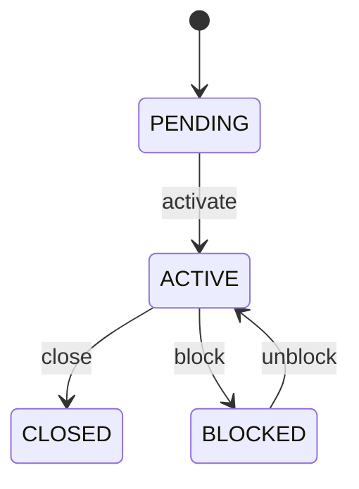

# Bank Account

Represents the controlled banking account context through which cash is received, disbursed, observed, and reconciled. BankAccount is master data for the financial account; it is not a bank transaction, payment, or accounting entry. Central to treasury, Payment execution, BankTransaction ingestion, bank reconciliation, cash reporting, and accounting. Party provides ownership context. Organization provides the financial institution. Payment represents internal settlement events. BankTransaction represents external statement evidence. JournalEntry represents accounting consequences. BankAccount setup → verification → activation → Payment execution/receipt → BankTransaction import → account/date/currency/reference reconciliation → Payment clearing → accounting reconciliation. Account closure affects future activity but preserves historical evidence. Pending → active → blocked or closed. Lifecycle controls future operational use and never deletes historical transactions. A USD current account at a bank is ACTIVE. Customer Payments are received into it, corresponding USD BankTransactions are imported from the bank feed, each is reconciled to the appropriate Payment, and the Payment becomes CLEARED only after controlled matching.

## Finding records

Open **Bank Account** from the menu or from its card on the dashboard.

The list shows Account Number, Account Type, Currency, Status, Institution, with the most recently changed record first. The **Help** button beside the title opens this window's help text.

- **Search**: type in the search box above the grid to narrow the rows. **Search** at the top left opens advanced search, where you pick a field, a comparison (equals, contains, starts with, before, after, and so on) and a value.
- **Sort**: click a column heading; click again to reverse.
- **Refresh**: the refresh button at the top right re-reads the rows and every dropdown, so a record created a moment ago by someone else appears.
- **Export**: **CSV** downloads the rows you are looking at.
- **Open a record**: click a row. The line under the title, "Showing 1 to n of N entries", tells you how many rows match.

## Creating a record

Choose **New** at the top of the list. The form opens on its own page, with the fields in sections. A badge beside each label names the control (Text, Dropdown, Date, and so on); a red star marks a required field; the question-mark icon shows that field's help; and a hint such as “max 300” shows the longest entry accepted.

1. Fill in the fields described under [Fields](#fields).
2. These are required and must be completed before the record can be saved: **Account Number**, **Account Type**, **Currency**, **Status**, **Institution**.
3. For a dropdown that points at another window, pick the matching record; if the record you need does not exist yet, create it in its own window first. A dropdown may narrow to what you have already chosen, for example the states of the chosen country.
4. Choose **Create** (or **Save** in the toolbar). You return to the record, and it appears at the top of the list. If something is wrong the form says which field and why, and nothing is saved.

## Reading, changing and deleting a record

Click a row to open the record. Above the fields are the arrows that step through the list ("1 of 5"). Below them sit **Notes**, where anyone may leave a comment on the record, and the **Audit Trail**, which lists every change with who made it, when, and which fields changed.

- **Edit** (toolbar) makes the fields editable. Change them and choose **Save**; **Undo Changes** puts back what you changed and **Cancel Editing** leaves edit mode.
- **Copy Record** starts a new record from this one.
- **Delete Record** is available in edit mode and asks you to confirm; a record other records still depend on cannot be deleted.

Every change is also written to the [Audit Log](/administration/#audit-log).

## Fields

| Field | What you use | Rules | What to enter |
| --- | --- | --- | --- |
| Account Number | Text | Required, Up to 100 characters | Banking identifier for the account, subject to applicable security and masking controls. Identifies the account at the financial institution for operational settlement and reconciliation. Used for payment routing, bank-feed matching, statements, and treasury operations, subject to sensitive-data controls. Must be interpreted with institution and account identity; it is not a CEDM entity identifier. Allows external bank activity and payment instructions to be associated with the correct account. Required where the banking institution provides an account identifier. |
| Account Type | Choice | Required | Classification of the banking account's operational purpose. Describes how the account is intended to function in treasury and settlement processes. Used for payment eligibility, cash reporting, treasury controls, and accounting configuration. Account type does not determine accounting treatment by itself; ledger configuration may provide additional context. Helps determine which Payment directions and banking operations are appropriate. Operational transaction account normally used for frequent receipts/disbursements. Account primarily maintained for savings or reserve purposes. Account associated with borrowing or loan-related banking arrangements. Account holding funds under controlled escrow arrangements. Controlled account type outside the standard classifications. Required for account governance. Choose one: Current, Savings, Loan, Escrow, Other. |
| Currency | Lookup | Required | Currency in which the bank account is normally denominated. Establishes the account's primary monetary denomination and expected statement currency. Used by Payment, BankTransaction, reconciliation, cash reporting, and treasury controls. A BankTransaction normally uses the account currency, although supported multi-currency bank products may require additional transaction-level currency rules. Provides a currency baseline for validating Payment and BankTransaction activity. Required for monetary account interpretation. Pick a record from **Currency**. |
| Status | Choice | Required | Lifecycle state controlling whether the account can participate in new banking operations. Indicates whether the account is awaiting activation, available, restricted, or closed. Used by Payment execution, bank-feed ingestion, reconciliation, treasury, and account administration. Closing an account must not invalidate historical BankTransactions, Payments, or JournalEntries. ACTIVE permits normal use; BLOCKED prevents applicable new activity; CLOSED prevents new normal use while historical evidence remains accessible. Account setup or verification is incomplete. Available for authorized banking activity. Temporarily prohibited from applicable activity. Permanently unavailable for new normal activity. Required for account lifecycle control. Choose one: Pending, Active, Blocked, Closed. |
| Institution | Lookup | Required | Financial institution maintaining the bank account. Supports bank-feed configuration, payment routing, statements, reconciliation, and institution-specific rules. Exactly one institution maintains the account in this model. Connects account operations to the correct banking organization. Pick a record from **Organization**. |

## How it connects to other records
- A bank account has many **Payment** records.
- A bank account has many **Payment Instruction** records.
- A bank account has many **Cash Position** records.
- A bank account has many **Party** records.
- A bank account belongs to one **Organization**.

## Lifecycle: Bank account lifecycle

A bank account record starts as **Pending** and ends as **Closed**. Open a record and the bar above its fields shows its current **State** and, after **Next**, a button for each move that leaves it; choose one to make the move. Any move the diagram does not draw is refused, for everyone including the administrator.

| From | To | Move |
| --- | --- | --- |
| Pending | Active | Activate |
| Active | Closed | Close |
| Active | Blocked | Block |
| Blocked | Active | Unblock |

## What happens when you save
Business rules run around the save. They are listed here and explained in full under [Business rules](/administration/rules/).

| Rule | When | Order |
| --- | --- | --- |
| Bank account workflows after update | after a bank account is changed | 100 |

Processes started from this record: [Bank account exception raised](/administration/processes/#bank-account-exception-raised).

## Who may use it

Anyone who holds a role with access to the **Bank Account** window. Access is granted by role under [Roles and access](/administration/access/).
