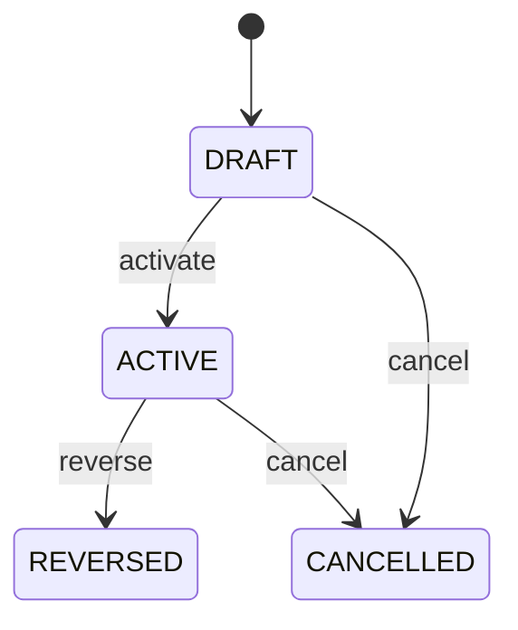

# Payment

Provides the controlled bridge between a Payment event and an Invoice claim. Payment says money moved; Invoice says money is owed; PaymentAllocation says exactly how much of that payment satisfies that claim. Central to receivables, payables, collections, payment reconciliation, bank reconciliation, refunds, reallocation, and accounting. Payment supplies source funds. Invoice supplies target obligation. Currency defines denominations. ExchangeRate converts denominations when required. Invoice derives settlement projections from active allocations. Payment received or posted → validate available unapplied amount → select Invoice → compare currencies → select approved ExchangeRate if required → calculate target invoice amount → apply rounding policy → activate PaymentAllocation → update Invoice amountSettled/amountOutstanding/status → reconcile with bank and accounting evidence. Draft allocation → validation → active settlement → optional reversal/cancellation → corrected allocation if needed. Historical allocations are never silently rewritten. A EUR 5,000 Payment is applied to a USD invoice using an approved EUR-to-USD ExchangeRate. paymentAmount remains EUR 5,000, invoiceAmount records the USD claim value satisfied, ExchangeRate preserves the conversion evidence, and any rounding adjustment is explicit. The Invoice is not marked paid until its active allocations satisfy its outstanding amount.

## Finding records

Lines are added from the parent: open a **Payment** and choose the **Payment** tab.

The list shows Payment, Invoice, Payment Amount, Invoice Amount, Exchange Rate, Allocated At, Status, with the most recently changed record first. The **Help** button beside the title opens this window's help text.

- **Search**: type in the search box above the grid to narrow the rows. **Search** at the top left opens advanced search, where you pick a field, a comparison (equals, contains, starts with, before, after, and so on) and a value.
- **Sort**: click a column heading; click again to reverse.
- **Refresh**: the refresh button at the top right re-reads the rows and every dropdown, so a record created a moment ago by someone else appears.
- **Export**: **CSV** downloads the rows you are looking at.
- **Open a record**: click a row. The line under the title, "Showing 1 to n of N entries", tells you how many rows match.

## Adding a line

Open the parent record, choose the **Payment** tab and use **New**. The line is tied to its parent automatically.

## Reading, changing and deleting a record

Click a row to open the record. Above the fields are the arrows that step through the list ("1 of 5"). Below them sit **Notes**, where anyone may leave a comment on the record, and the **Audit Trail**, which lists every change with who made it, when, and which fields changed.

- **Edit** (toolbar) makes the fields editable. Change them and choose **Save**; **Undo Changes** puts back what you changed and **Cancel Editing** leaves edit mode.
- **Copy Record** starts a new record from this one.
- **Delete Record** is available in edit mode and asks you to confirm; a record other records still depend on cannot be deleted.

Every change is also written to the [Audit Log](/administration/#audit-log).

## Fields

| Field | What you use | Rules | What to enter |
| --- | --- | --- | --- |
| Payment | Lookup | Required | Payment from which the allocated settlement amount originates. Identifies the cash or settlement event being applied. Supports payment reconciliation, bank matching, and settlement audit. The allocation cannot create or replace the underlying Payment event. Supplies the source monetary amount and payment currency for allocation. Required to trace settlement to its source. Pick a record from **Payment**. |
| Invoice | Lookup | Required | Invoice claim to which the payment is applied. Identifies the financial obligation being reduced by the allocation. Supports receivables/payables settlement, aging, statements, and reconciliation. The allocation reduces the claim; it does not change the original Invoice total. Supplies the target claim and invoice currency for settlement comparison. Required to identify the settlement target. Pick a record from **Invoice**. |
| Payment Amount | Amount | Required | Portion of the Payment amount consumed by this allocation in the Payment currency. Represents how much of the source payment is assigned to this claim. Supports remaining-payment calculation and reconciliation to the Payment. Must use the Payment currency and must not exceed the unapplied source payment amount under policy. Establishes the source-side settlement quantity before any cross-currency conversion. Required for allocation calculation. |
| Invoice Amount | Amount | Required | Amount of the Invoice claim satisfied by this allocation in the Invoice currency. Represents the claim-side effect of the allocation. Drives Invoice amountSettled and amountOutstanding projections. May differ numerically and in currency from paymentAmount when an approved ExchangeRate is used. Supplies the target-side settlement value applied to the claim. Required for deterministic claim settlement. |
| Exchange Rate | Lookup | Optional | Exchange-rate record used when Payment and Invoice currencies differ. Preserves the exact conversion context used to translate payment currency into invoice currency. Supports audit, reconciliation, accounting, and reproducibility of cross-currency settlement. Required for cross-currency allocation and normally absent when currencies are identical. Connects paymentAmount to invoiceAmount through an approved conversion rule. Optional when source and target currencies are identical. Pick a record from **Exchange Rate**. |
| Allocated At | Date and time | Required | Timestamp at which the allocation became effective. Establishes settlement chronology and supports period-sensitive reconciliation. Used for aging, accounting period determination, audit, and dispute investigation. Distinct from Payment creation time and bank clearing time. Determines when the Invoice settlement projection is changed. Required for settlement chronology. |
| Status | Choice | Required | Lifecycle state of the allocation. Indicates whether the allocation currently affects settlement or has been reversed/cancelled. Controls Invoice settlement projections, reconciliation, and audit. Invoice amountSettled must be derived from active allocations rather than every historical allocation record. ACTIVE affects settlement; REVERSED removes the allocation effect through a controlled correction; CANCELLED prevents activation. Required for controlled settlement state. The status of the payment allocation is draft; set it when that is what the business means for this record. The status of the payment allocation is active; set it when that is what the business means for this record. The status of the payment allocation is reversed; set it when that is what the business means for this record. The status of the payment allocation is cancelled; set it when that is what the business means for this record. Choose one: Draft, Active, Reversed, Cancelled. |
| Reversal Of Allocation | Lookup | Optional | Original allocation that this record reverses. Links a correction to the settlement evidence it negates. Supports audit, dispute resolution, reallocation, and accounting correction. A reversal is a new historical event and does not rewrite the original allocation. Enables controlled reversal followed by a corrected allocation. Optional for normal allocations. Pick a record from **Payment**. |
| Rounding Adjustment | Amount | Optional | Explicit rounding difference required to reconcile source and target settlement values under the approved conversion and currency precision policy. Represents a controlled rounding effect, not an unexplained difference in payment or invoice value. Used in cross-currency reconciliation and accounting adjustment. Must use an appropriate currency and remain within configured tolerance. Makes small conversion/precision differences explicit and auditable. Optional when no rounding adjustment is required. |
| Currency | Lookup | Optional | The Currency this PaymentAllocation belongs to. Pick a record from **Currency**. |

## How it connects to other records

A payment is a line of a **Payment**. It has no window of its own: open the payment and use the **Payment** tab to see and add lines.
- A payment belongs to one **Currency**.
- A payment belongs to one **Invoice**.
- A payment belongs to one **Payment**.
- A payment belongs to one **Exchange Rate**.

## Lifecycle: Payment allocation lifecycle

A payment record starts as **Draft** and ends as **Reversed** or **Cancelled**. Open a record and the bar above its fields shows its current **State** and, after **Next**, a button for each move that leaves it; choose one to make the move. Any move the diagram does not draw is refused, for everyone including the administrator.

| From | To | Move |
| --- | --- | --- |
| Draft | Active | Activate |
| Active | Reversed | Reverse |
| Draft | Cancelled | Cancel |
| Active | Cancelled | Cancel |

## What happens when you save
Business rules run around the save. They are listed here and explained in full under [Business rules](/administration/rules/).

| Rule | When | Order |
| --- | --- | --- |
| Payment allocation invariants before create | before a payment is created | 100 |
| Payment allocation invariants before update | before a payment is changed | 100 |
| Payment allocation workflows after update | after a payment is changed | 100 |

Processes started from this record: [Payment allocation follow up required](/administration/processes/#payment-allocation-follow-up-required).

## Who may use it

Anyone who holds a role with access to the **Payment** window. Access is granted by role under [Roles and access](/administration/access/).
