# Record lifecycles

A lifecycle is the set of states a record can be in and the moves between them. The application enforces it on every write, through the screen and through the API: a move the diagram does not draw is refused for everyone, administrators included. Role restrictions narrow who may make a particular move. This application has **18** lifecycles.

## Party: Party lifecycle

States: **Active**, **Inactive**, **Blocked**, **Retired**. A new record starts as **Active**; **Retired** ends the lifecycle.

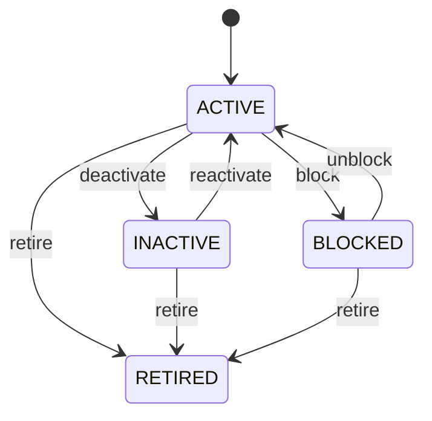

Any role that may change the record may make any move the diagram draws.

See [Party](/entities/foundation/party/) for the record itself.

## Organization: Organization lifecycle

States: **Draft**, **Active**, **Inactive**, **Retired**. A new record starts as **Draft**; **Retired** ends the lifecycle.

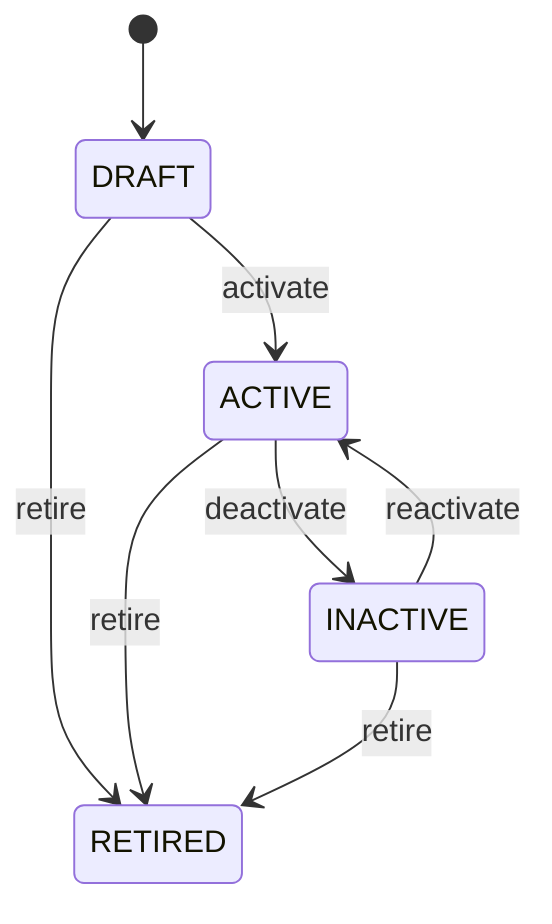

Any role that may change the record may make any move the diagram draws.

See [Organization](/entities/foundation/organization/) for the record itself.

## Party Role: Party role lifecycle

States: **Active**, **Inactive**, **Expired**. A new record starts as **Active**; **Expired** ends the lifecycle.

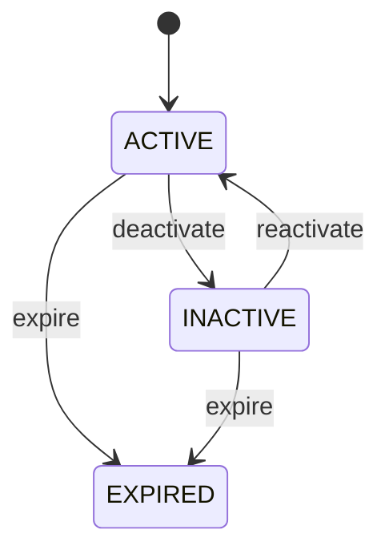

Any role that may change the record may make any move the diagram draws.

See [Party Role](/entities/foundation/party-role/) for the record itself.

## Address: Address lifecycle

States: **Active**, **Inactive**, **Retired**. A new record starts as **Active**; **Retired** ends the lifecycle.

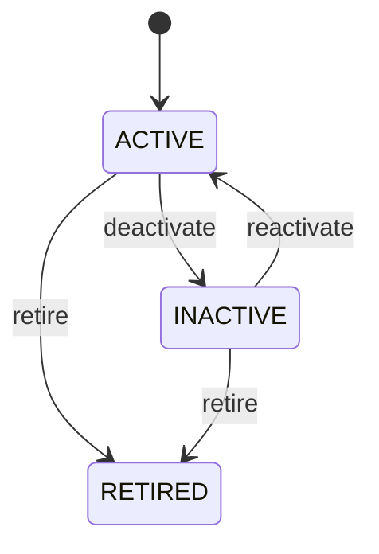

Any role that may change the record may make any move the diagram draws.

See [Address](/entities/foundation/address/) for the record itself.

## Location: Location lifecycle

States: **Planned**, **Active**, **Inactive**, **Closed**, **Retired**. A new record starts as **Planned**; **Closed**, **Retired** ends the lifecycle.

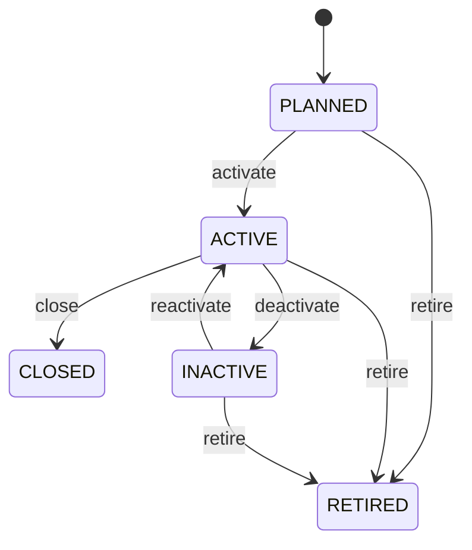

Any role that may change the record may make any move the diagram draws.

See [Location](/entities/foundation/location/) for the record itself.

## Currency: Currency lifecycle

States: **Active**, **Inactive**, **Retired**. A new record starts as **Active**; **Retired** ends the lifecycle.

Any role that may change the record may make any move the diagram draws.

See [Currency](/entities/foundation/currency/) for the record itself.

## Exchange Rate: Exchange rate lifecycle

States: **Draft**, **Active**, **Expired**, **Cancelled**. A new record starts as **Draft**; **Expired**, **Cancelled** ends the lifecycle.

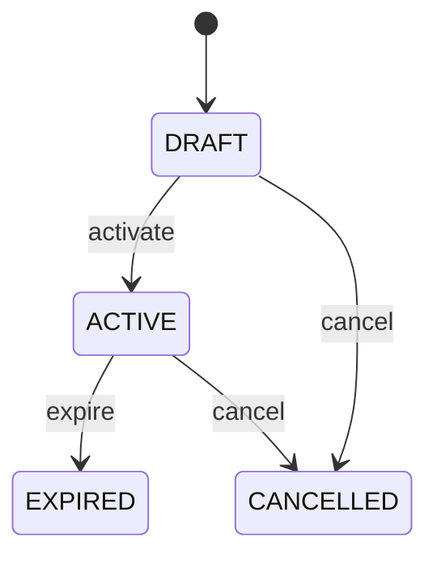

Any role that may change the record may make any move the diagram draws.

See [Exchange Rate](/entities/foundation/exchange-rate/) for the record itself.

## Unit Of Measure: Unit of measure lifecycle

States: **Active**, **Inactive**, **Retired**. A new record starts as **Active**; **Retired** ends the lifecycle.

Any role that may change the record may make any move the diagram draws.

See [Unit Of Measure](/entities/foundation/unit-of-measure/) for the record itself.

## Task: Task lifecycle

States: **Created**, **Ready**, **Assigned**, **In progress**, **Blocked**, **Completed**, **Cancelled**, **Failed**. A new record starts as **Created**; **Completed**, **Cancelled**, **Failed** ends the lifecycle.

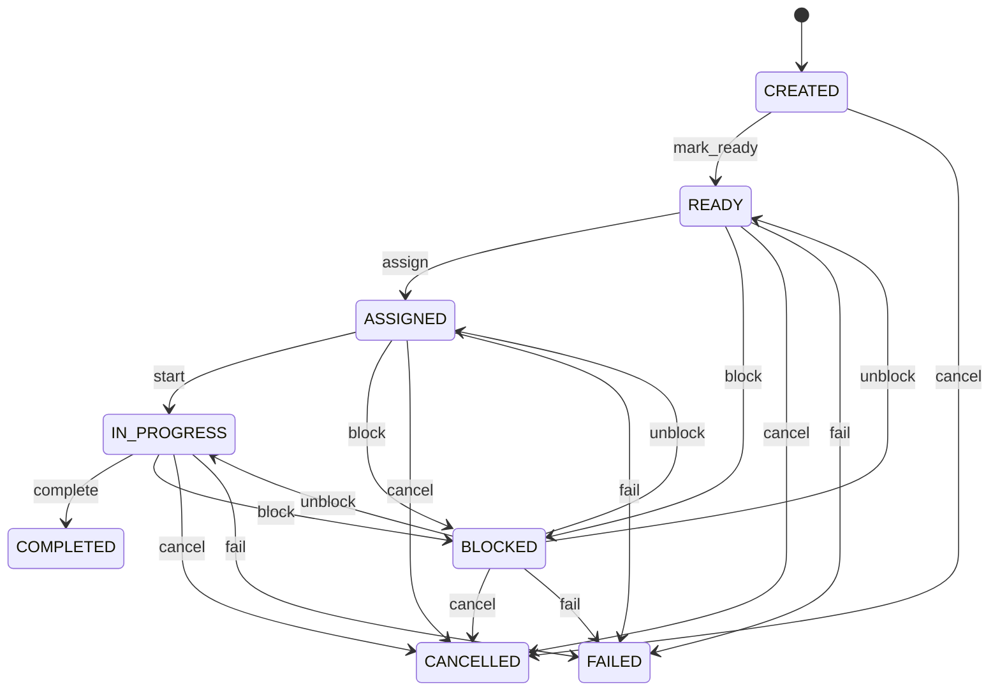

Any role that may change the record may make any move the diagram draws.

See [Task](/entities/foundation/task/) for the record itself.

## Healthcare Patient: Healthcare patient lifecycle

States: **Active**, **Inactive**, **Deceased**, **Merged**. A new record starts as **Active**.

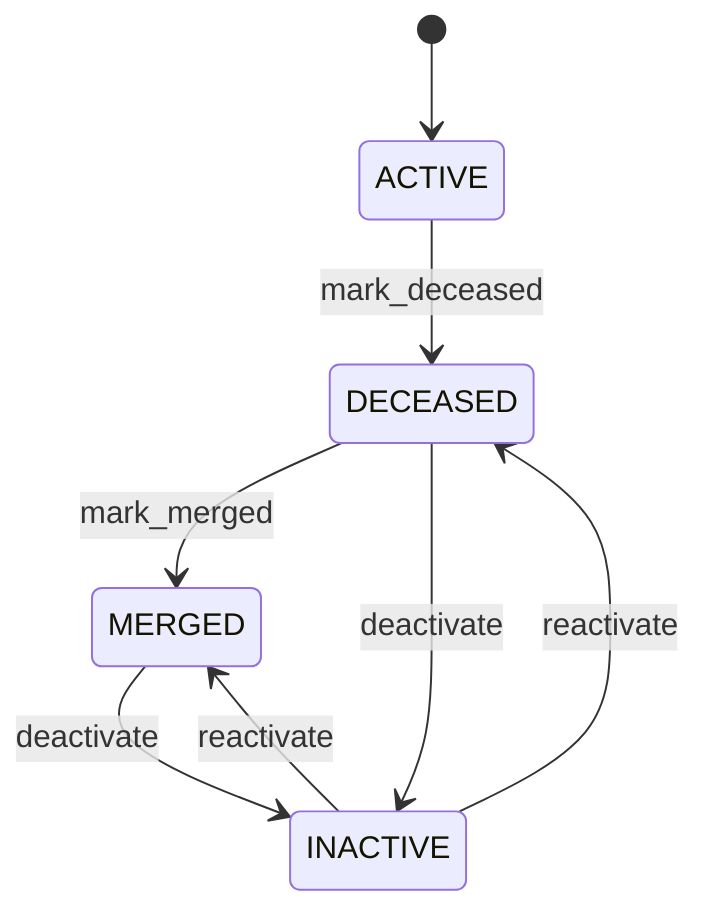

Any role that may change the record may make any move the diagram draws.

See [Healthcare Patient](/entities/healthcare/healthcare-patient/) for the record itself.

## Healthcare Provider: Healthcare provider lifecycle

States: **Active**, **Inactive**, **Suspended**, **Retired**. A new record starts as **Active**; **Retired** ends the lifecycle.

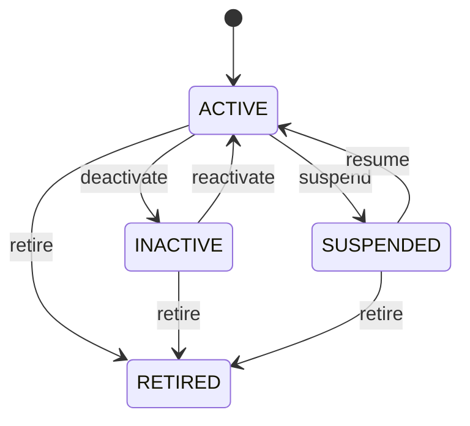

Any role that may change the record may make any move the diagram draws.

See [Healthcare Provider](/entities/healthcare/healthcare-provider/) for the record itself.

## Healthcare Encounter: Healthcare encounter lifecycle

States: **Planned**, **In progress**, **Completed**, **Cancelled**. A new record starts as **Planned**; **Completed**, **Cancelled** ends the lifecycle.

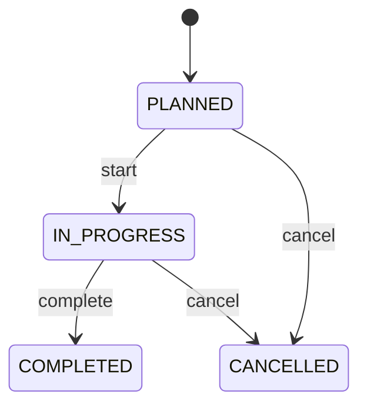

Any role that may change the record may make any move the diagram draws.

See [Healthcare Encounter](/entities/healthcare/healthcare-encounter/) for the record itself.

## Healthcare Encounter: Healthcare order lifecycle

States: **Draft**, **Active**, **Completed**, **Cancelled**. A new record starts as **Draft**; **Completed**, **Cancelled** ends the lifecycle.

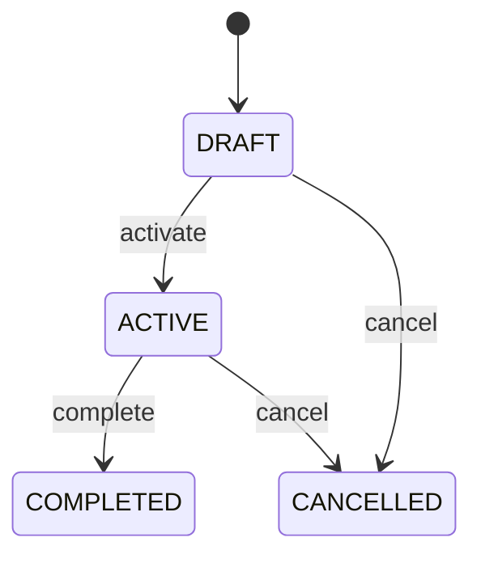

Any role that may change the record may make any move the diagram draws.

See [Healthcare Encounter](/entities/foundation/healthcare-order/) for the record itself.

## Healthcare Encounter: Procedure lifecycle

States: **Planned**, **In progress**, **Completed**, **Cancelled**. A new record starts as **Planned**; **Completed**, **Cancelled** ends the lifecycle.

Any role that may change the record may make any move the diagram draws.

See [Healthcare Encounter](/entities/foundation/procedure/) for the record itself.

## Medication: Medication lifecycle

States: **Active**, **Inactive**, **Retired**. A new record starts as **Active**; **Retired** ends the lifecycle.

Any role that may change the record may make any move the diagram draws.

See [Medication](/entities/healthcare/medication/) for the record itself.

## Prescription: Prescription lifecycle

States: **Draft**, **Active**, **Completed**, **Cancelled**, **Discontinued**. A new record starts as **Draft**; **Completed**, **Cancelled**, **Discontinued** ends the lifecycle.

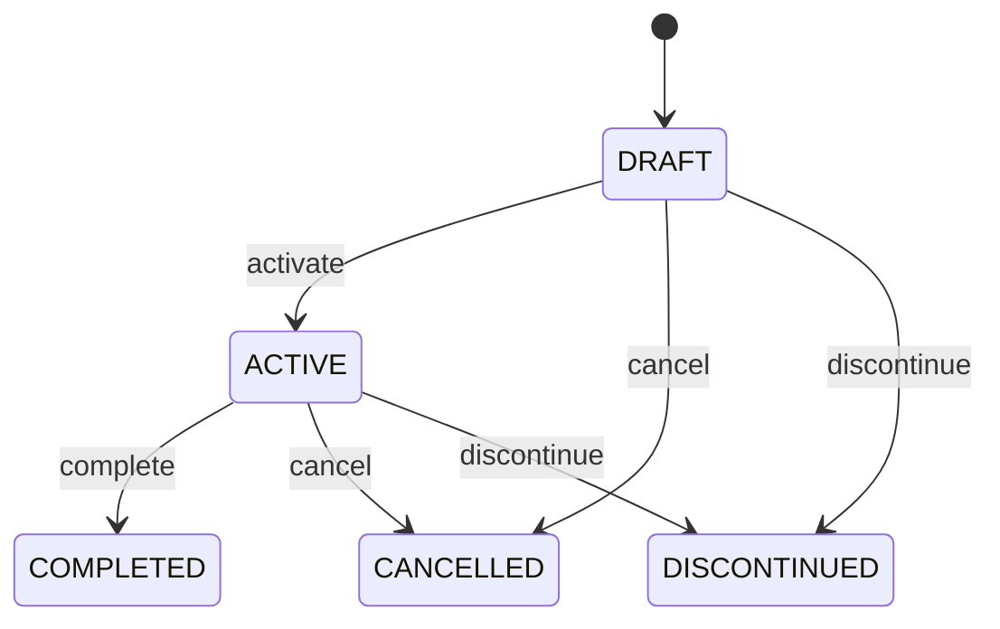

Any role that may change the record may make any move the diagram draws.

See [Prescription](/entities/healthcare/prescription/) for the record itself.

## Healthcare Patient: Allergy lifecycle

States: **Draft**, **Active**, **Completed**, **Cancelled**. A new record starts as **Draft**; **Completed**, **Cancelled** ends the lifecycle.

Any role that may change the record may make any move the diagram draws.

See [Healthcare Patient](/entities/foundation/allergy/) for the record itself.

## Care Plan: Care plan lifecycle

States: **Draft**, **Active**, **Completed**, **Cancelled**. A new record starts as **Draft**; **Completed**, **Cancelled** ends the lifecycle.

Any role that may change the record may make any move the diagram draws.

See [Care Plan](/entities/healthcare/care-plan/) for the record itself.

