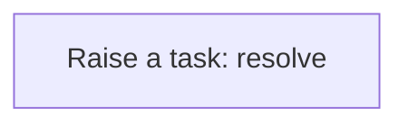
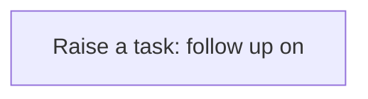
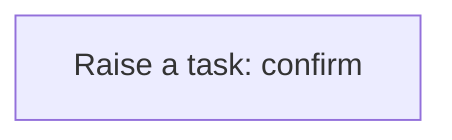

# Processes

A process is a sequence of steps the application runs for you: create a task, update a record, call a service. A business rule usually starts it; you can also run one by hand from the Workflow Designer. Every run is logged step by step in the Workflow Monitor. This application has **11** processes.

## Party exception raised {#party-exception-raised}

When a party is blocked, a high-priority task asks someone to resolve it.

Runs when a **Party** is changed, started by a business rule.

1. **Raise a task: resolve** — creates a **Task** record.

## Exchange rate follow up required {#exchange-rate-follow-up-required}

When a exchange rate is cancelled, a task asks someone to settle what depended on it.

Runs when a **Exchange Rate** is changed, started by a business rule.

1. **Raise a task: follow up on** — creates a **Task** record.

## Healthcare encounter follow up required {#healthcare-encounter-follow-up-required}

When a healthcare encounter is cancelled, a task asks someone to settle what depended on it.

Runs when a **Healthcare Encounter** is changed, started by a business rule.

1. **Raise a task: follow up on** — creates a **Task** record.

## Healthcare encounter completion confirmed {#healthcare-encounter-completion-confirmed}

When a healthcare encounter is completed, a task asks someone to confirm the outcome.

Runs when a **Healthcare Encounter** is changed, started by a business rule.

1. **Raise a task: confirm** — creates a **Task** record.

## Healthcare order follow up required {#healthcare-order-follow-up-required}

When a healthcare order is cancelled, a task asks someone to settle what depended on it.

Runs when a **Healthcare Encounter** is changed, started by a business rule.

1. **Raise a task: follow up on** — creates a **Task** record.

## Healthcare order completion confirmed {#healthcare-order-completion-confirmed}

When a healthcare order is completed, a task asks someone to confirm the outcome.

Runs when a **Healthcare Encounter** is changed, started by a business rule.

1. **Raise a task: confirm** — creates a **Task** record.

## Procedure follow up required {#procedure-follow-up-required}

When a procedure is cancelled, a task asks someone to settle what depended on it.

Runs when a **Healthcare Encounter** is changed, started by a business rule.

1. **Raise a task: follow up on** — creates a **Task** record.

## Prescription follow up required {#prescription-follow-up-required}

When a prescription is cancelled, a task asks someone to settle what depended on it.

Runs when a **Prescription** is changed, started by a business rule.

1. **Raise a task: follow up on** — creates a **Task** record.

## Prescription completion confirmed {#prescription-completion-confirmed}

When a prescription is completed, a task asks someone to confirm the outcome.

Runs when a **Prescription** is changed, started by a business rule.

1. **Raise a task: confirm** — creates a **Task** record.

## Allergy follow up required {#allergy-follow-up-required}

When a allergy is cancelled, a task asks someone to settle what depended on it.

Runs when a **Healthcare Patient** is changed, started by a business rule.

1. **Raise a task: follow up on** — creates a **Task** record.

## Care plan follow up required {#care-plan-follow-up-required}

When a care plan is cancelled, a task asks someone to settle what depended on it.

Runs when a **Care Plan** is changed, started by a business rule.

1. **Raise a task: follow up on** — creates a **Task** record.

