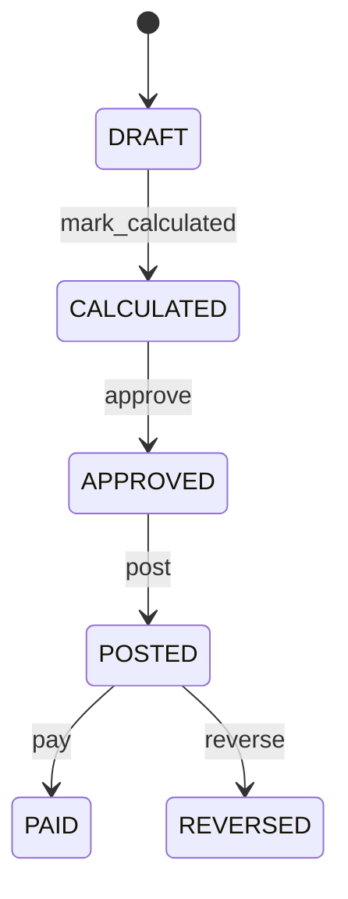

# Payroll

Governs auditable gross-to-net payroll calculation and its downstream accounting and settlement. Payroll calculates employee compensation obligations; JournalEntry records accounting; Payment records settlement. Human capital management, payroll operations, finance, compliance, employee service, and audit. Employee and Employment provide eligibility; attendance and leave may supply time inputs; JournalEntry and Payment record separate downstream effects. Draft → calculated → approved → posted → paid, with controlled reversal. Changes to open-period employment/time/compensation inputs trigger recalculation; posted or paid history is corrected through controlled reversal.

## Finding records

Open **Payroll** from the menu or from its card on the dashboard.

The list shows Payroll Number, Period Start, Period End, Gross Amount, Net Amount, Status, Employee, with the most recently changed record first. The **Help** button beside the title opens this window's help text.

- **Search**: type in the search box above the grid to narrow the rows. **Search** at the top left opens advanced search, where you pick a field, a comparison (equals, contains, starts with, before, after, and so on) and a value.
- **Sort**: click a column heading; click again to reverse.
- **Refresh**: the refresh button at the top right re-reads the rows and every dropdown, so a record created a moment ago by someone else appears.
- **Export**: **CSV** downloads the rows you are looking at.
- **Open a record**: click a row. The line under the title, "Showing 1 to n of N entries", tells you how many rows match.

## Creating a record

Choose **New** at the top of the list. The form opens on its own page, with the fields in sections. A badge beside each label names the control (Text, Dropdown, Date, and so on); a red star marks a required field; the question-mark icon shows that field's help; and a hint such as “max 300” shows the longest entry accepted.

1. Fill in the fields described under [Fields](#fields).
2. These are required and must be completed before the record can be saved: **Payroll Number**, **Period Start**, **Period End**, **Gross Amount**, **Net Amount**, **Status**, **Employee**, **Employment**.
3. For a dropdown that points at another window, pick the matching record; if the record you need does not exist yet, create it in its own window first. A dropdown may narrow to what you have already chosen, for example the states of the chosen country.
4. Choose **Create** (or **Save** in the toolbar). You return to the record, and it appears at the top of the list. If something is wrong the form says which field and why, and nothing is saved.

## Reading, changing and deleting a record

Click a row to open the record. Above the fields are the arrows that step through the list ("1 of 5"). Below them sit **Notes**, where anyone may leave a comment on the record, and the **Audit Trail**, which lists every change with who made it, when, and which fields changed.

- **Edit** (toolbar) makes the fields editable. Change them and choose **Save**; **Undo Changes** puts back what you changed and **Cancel Editing** leaves edit mode.
- **Copy Record** starts a new record from this one.
- **Delete Record** is available in edit mode and asks you to confirm; a record other records still depend on cannot be deleted.

Every change is also written to the [Audit Log](/administration/#audit-log).

## Fields

| Field | What you use | Rules | What to enter |
| --- | --- | --- | --- |
| Payroll Number | Text | Required, Unique, Up to 100 characters | Business-facing payroll reference. Identifies the payroll calculation or result operationally. Review, payslip correlation, finance, and audit. Distinct from Payment and JournalEntry references. Required. |
| Period Start | Date | Required | Start of the payroll earning period. Defines the first date whose approved employment inputs belong to the calculation. Eligibility, attendance, leave, compensation, and reporting. Must not follow periodEnd. Required. |
| Period End | Date | Required | End of the payroll earning period. Defines the final date included in the calculation. Payroll cutoff and reconciliation. Must be on or after periodStart. Required. |
| Gross Amount | Amount | Required | Gross calculated employee earnings before deductions. Records total earnings recognized by the payroll calculation. Payroll review, finance, and reporting. Must reconcile with governed earning inputs. Required. |
| Net Amount | Amount | Required | Net amount payable after authorized deductions. Establishes the payroll settlement obligation before Payment execution. Payroll approval and payment instruction. Payment settles this obligation but is separate evidence. Required. |
| Status | Choice | Required | Lifecycle state of payroll processing. Controls calculation, approval, accounting, settlement, and reversal. Payroll workflow and audit. PAID requires settlement evidence; POSTED requires accounting evidence. Inputs are being prepared. Gross-to-net calculation completed. Authorized for posting/settlement. Accounting impact recorded. Settlement completed. Prior effects corrected through controlled reversal. Required. Choose one: Draft, Calculated, Approved, Posted, Paid, Reversed. |
| Employee | Lookup | Required | Employee whose compensation is calculated. Supplies employment identity and eligibility context. Payroll, reporting, and audit. Exactly one employee owns this payroll result. Employment must be eligible for the period. Pick a record from **Employee**. |
| Employment | Lookup | Required | Employment relationship governing the payroll result. Supplies organizational and contractual employment context. Eligibility and compensation interpretation. Exactly one applicable employment is required. Must overlap the payroll period. Pick a record from **Employment**. |

## How it connects to other records
- A payroll belongs to one **Employee**.
- A payroll belongs to one **Employment**.

## Lifecycle: Payroll lifecycle

A payroll record starts as **Draft** and ends as **Paid** or **Reversed**. Open a record and the bar above its fields shows its current **State** and, after **Next**, a button for each move that leaves it; choose one to make the move. Any move the diagram does not draw is refused, for everyone including the administrator.

| From | To | Move |
| --- | --- | --- |
| Draft | Calculated | Mark calculated |
| Calculated | Approved | Approve |
| Approved | Posted | Post |
| Posted | Paid | Pay |
| Posted | Reversed | Reverse |

## What happens when you save
Business rules run around the save. They are listed here and explained in full under [Business rules](/administration/rules/).

| Rule | When | Order |
| --- | --- | --- |
| Payroll invariants before create | before a payroll is created | 100 |
| Payroll invariants before update | before a payroll is changed | 100 |
| Payroll workflows after update | after a payroll is changed | 100 |

Processes started from this record: [Payroll follow up required](/administration/processes/#payroll-follow-up-required), [Payroll completion confirmed](/administration/processes/#payroll-completion-confirmed).

## Who may use it

Anyone who holds a role with access to the **Payroll** window. Access is granted by role under [Roles and access](/administration/access/).
