# Record lifecycles

A lifecycle is the set of states a record can be in and the moves between them. The application enforces it on every write, through the screen and through the API: a move the diagram does not draw is refused for everyone, administrators included. Role restrictions narrow who may make a particular move. This application has **20** lifecycles.

## Party: Party lifecycle

States: **Active**, **Inactive**, **Blocked**, **Retired**. A new record starts as **Active**; **Retired** ends the lifecycle.

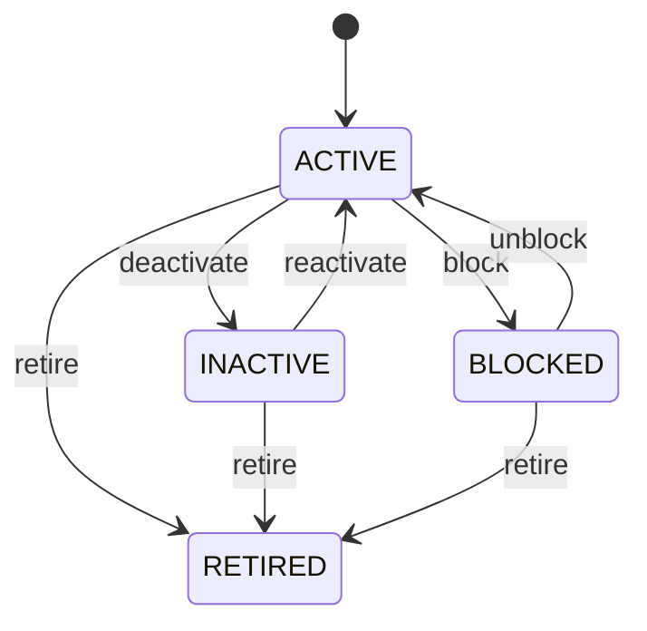

Any role that may change the record may make any move the diagram draws.

See [Party](/entities/foundation/party/) for the record itself.

## Organization: Organization lifecycle

States: **Draft**, **Active**, **Inactive**, **Retired**. A new record starts as **Draft**; **Retired** ends the lifecycle.

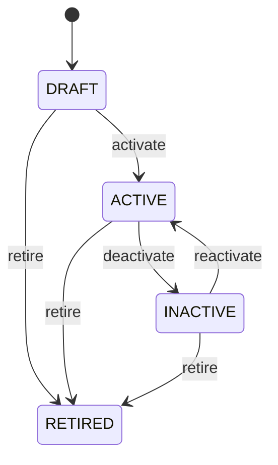

Any role that may change the record may make any move the diagram draws.

See [Organization](/entities/foundation/organization/) for the record itself.

## Party Role: Party role lifecycle

States: **Active**, **Inactive**, **Expired**. A new record starts as **Active**; **Expired** ends the lifecycle.

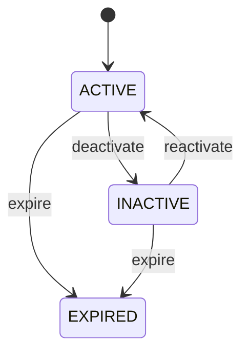

Any role that may change the record may make any move the diagram draws.

See [Party Role](/entities/foundation/party-role/) for the record itself.

## Address: Address lifecycle

States: **Active**, **Inactive**, **Retired**. A new record starts as **Active**; **Retired** ends the lifecycle.

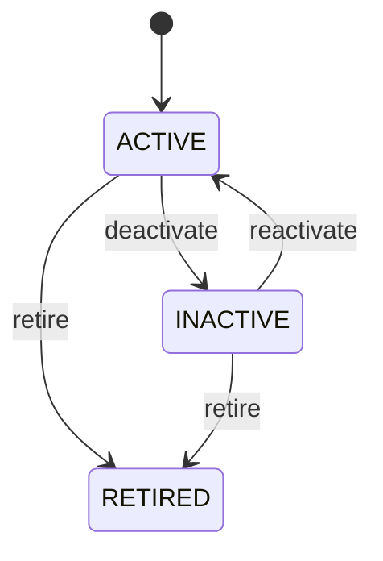

Any role that may change the record may make any move the diagram draws.

See [Address](/entities/foundation/address/) for the record itself.

## Location: Location lifecycle

States: **Planned**, **Active**, **Inactive**, **Closed**, **Retired**. A new record starts as **Planned**; **Closed**, **Retired** ends the lifecycle.

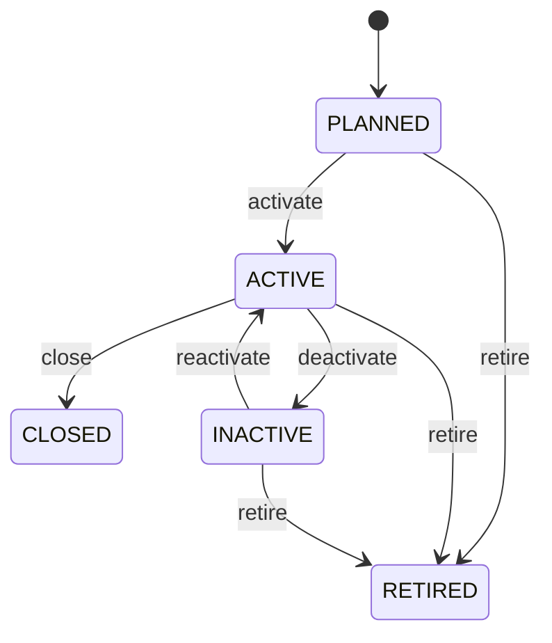

Any role that may change the record may make any move the diagram draws.

See [Location](/entities/foundation/location/) for the record itself.

## Currency: Currency lifecycle

States: **Active**, **Inactive**, **Retired**. A new record starts as **Active**; **Retired** ends the lifecycle.

Any role that may change the record may make any move the diagram draws.

See [Currency](/entities/foundation/currency/) for the record itself.

## Exchange Rate: Exchange rate lifecycle

States: **Draft**, **Active**, **Expired**, **Cancelled**. A new record starts as **Draft**; **Expired**, **Cancelled** ends the lifecycle.

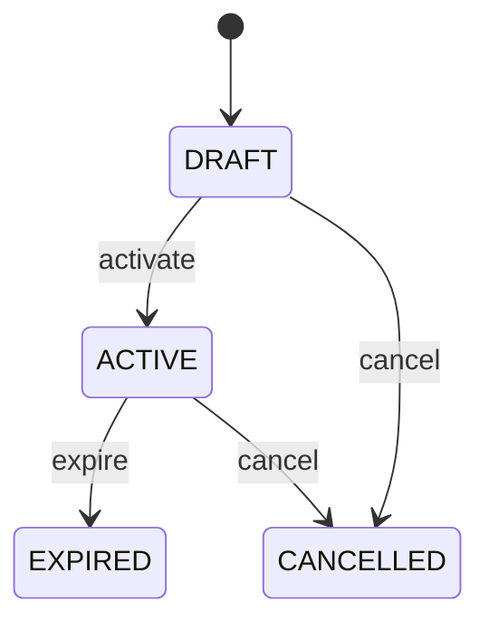

Any role that may change the record may make any move the diagram draws.

See [Exchange Rate](/entities/foundation/exchange-rate/) for the record itself.

## Unit Of Measure: Unit of measure lifecycle

States: **Active**, **Inactive**, **Retired**. A new record starts as **Active**; **Retired** ends the lifecycle.

Any role that may change the record may make any move the diagram draws.

See [Unit Of Measure](/entities/foundation/unit-of-measure/) for the record itself.

## Task: Task lifecycle

States: **Created**, **Ready**, **Assigned**, **In progress**, **Blocked**, **Completed**, **Cancelled**, **Failed**. A new record starts as **Created**; **Completed**, **Cancelled**, **Failed** ends the lifecycle.

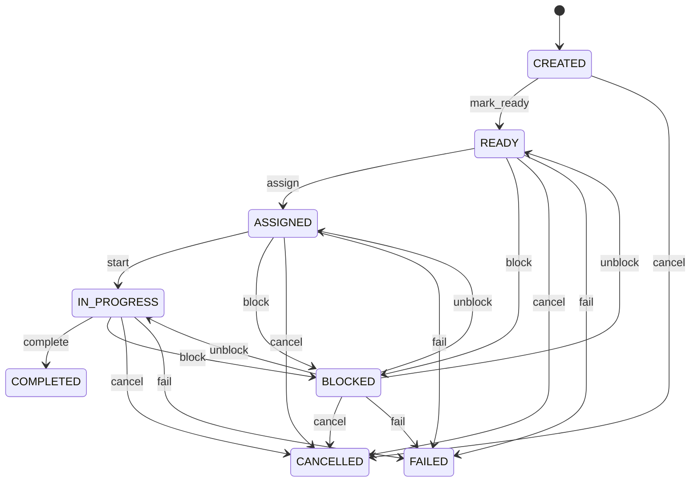

Any role that may change the record may make any move the diagram draws.

See [Task](/entities/foundation/task/) for the record itself.

## Inventory Reservation: Inventory reservation lifecycle

States: **Pending**, **Active**, **Partially consumed**, **Released**, **Consumed**, **Cancelled**, **Expired**. A new record starts as **Pending**; **Consumed**, **Cancelled**, **Expired** ends the lifecycle.

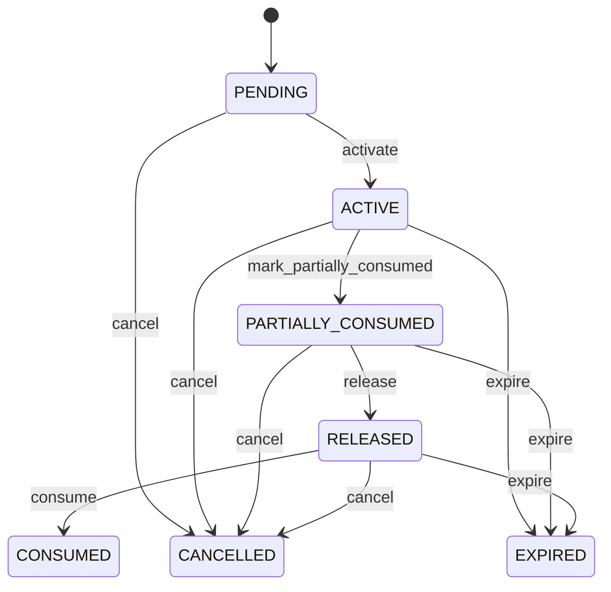

Any role that may change the record may make any move the diagram draws.

See [Inventory Reservation](/entities/inventory-management/inventory-reservation/) for the record itself.

## Inventory Transfer: Inventory transfer lifecycle

States: **Planned**, **Released**, **In progress**, **Completed**, **Cancelled**. A new record starts as **Planned**; **Completed**, **Cancelled** ends the lifecycle.

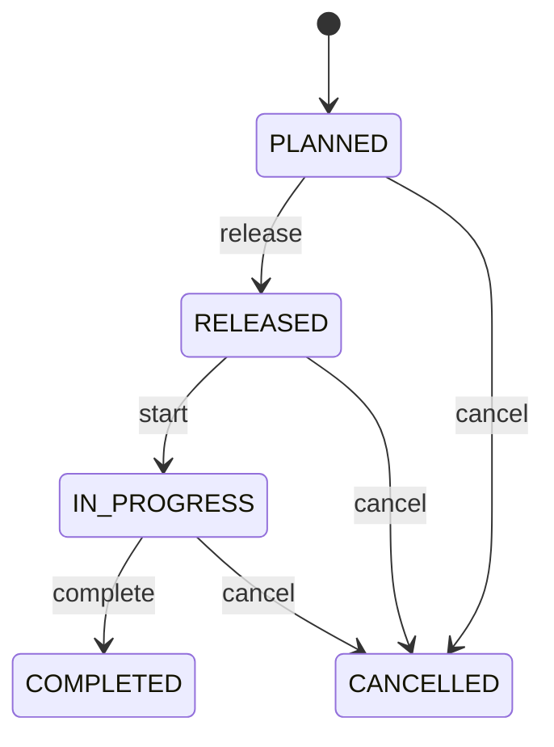

Any role that may change the record may make any move the diagram draws.

See [Inventory Transfer](/entities/inventory-management/inventory-transfer/) for the record itself.

## Lot: Lot lifecycle

States: **Active**, **Hold**, **Quarantined**, **Released**, **Expired**, **Rejected**, **Consumed**, **Closed**. A new record starts as **Active**; **Consumed**, **Expired**, **Rejected** ends the lifecycle.

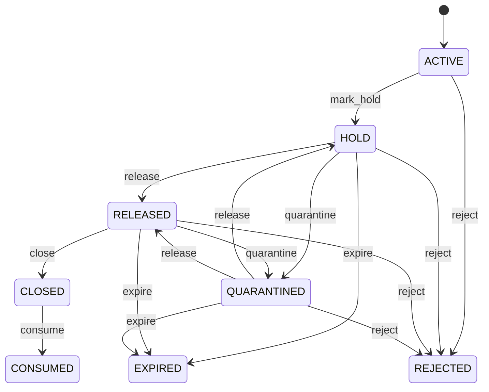

Any role that may change the record may make any move the diagram draws.

See [Lot](/entities/inventory-management/lot/) for the record itself.

## Serial Number: Serial number lifecycle

States: **Expected**, **Available**, **Reserved**, **In transit**, **Installed**, **Consumed**, **Returned**, **Quarantined**, **Scrapped**, **Retired**. A new record starts as **Expected**; **Returned**, **Scrapped**, **Retired** ends the lifecycle.

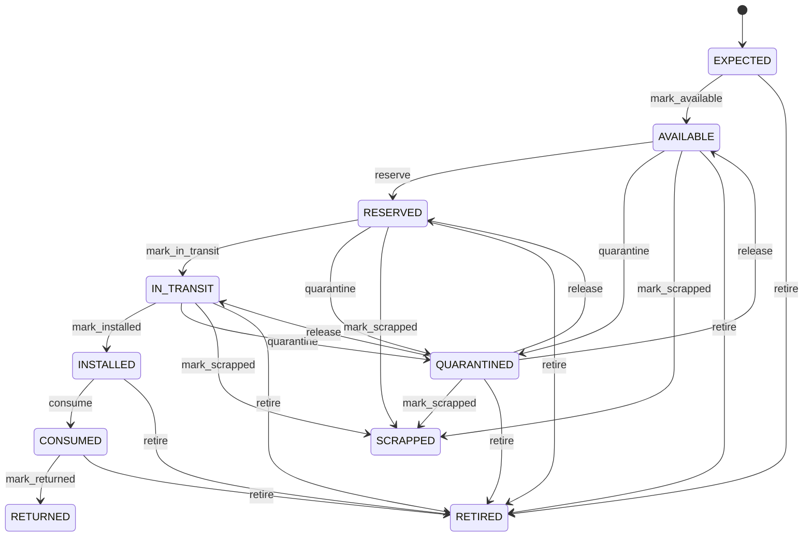

Any role that may change the record may make any move the diagram draws.

See [Serial Number](/entities/inventory-management/serial-number/) for the record itself.

## Product: Product lifecycle

States: **Draft**, **Active**, **Discontinued**, **Blocked**, **Retired**. A new record starts as **Draft**; **Discontinued**, **Retired** ends the lifecycle.

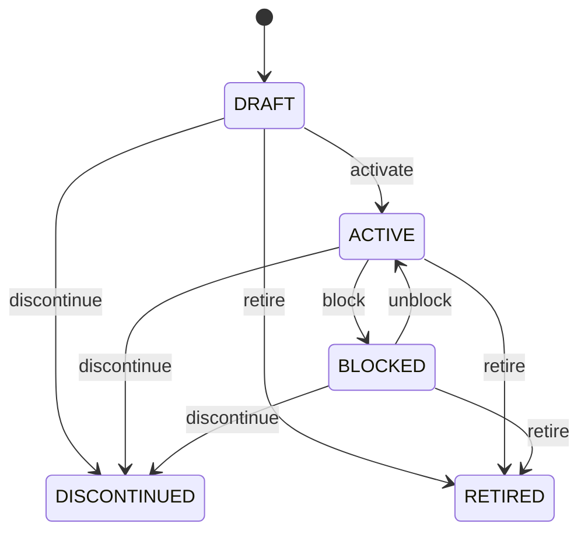

Any role that may change the record may make any move the diagram draws.

See [Product](/entities/inventory-management/product/) for the record itself.

## Warehouse: Inventory location lifecycle

States: **Active**, **Blocked**, **Inactive**. A new record starts as **Active**.

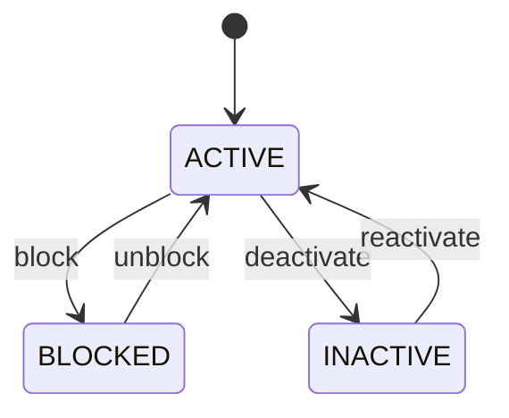

Any role that may change the record may make any move the diagram draws.

See [Warehouse](/entities/foundation/inventory-location/) for the record itself.

## Warehouse: Warehouse lifecycle

States: **Planned**, **Active**, **Suspended**, **Closed**. A new record starts as **Planned**; **Closed** ends the lifecycle.

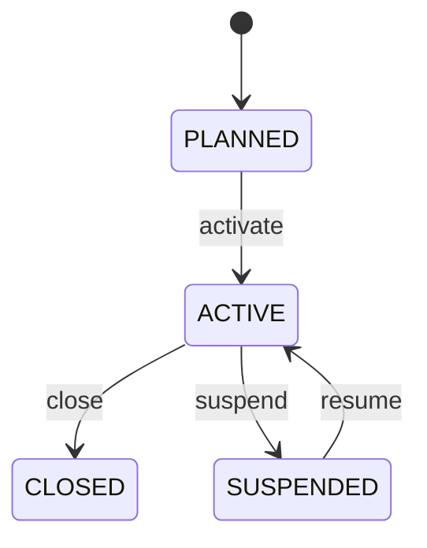

Any role that may change the record may make any move the diagram draws.

See [Warehouse](/entities/warehouse-management/warehouse/) for the record itself.

## Putaway: Putaway lifecycle

States: **Planned**, **Released**, **In progress**, **Completed**, **Cancelled**, **Exception**. A new record starts as **Planned**; **Completed**, **Cancelled** ends the lifecycle.

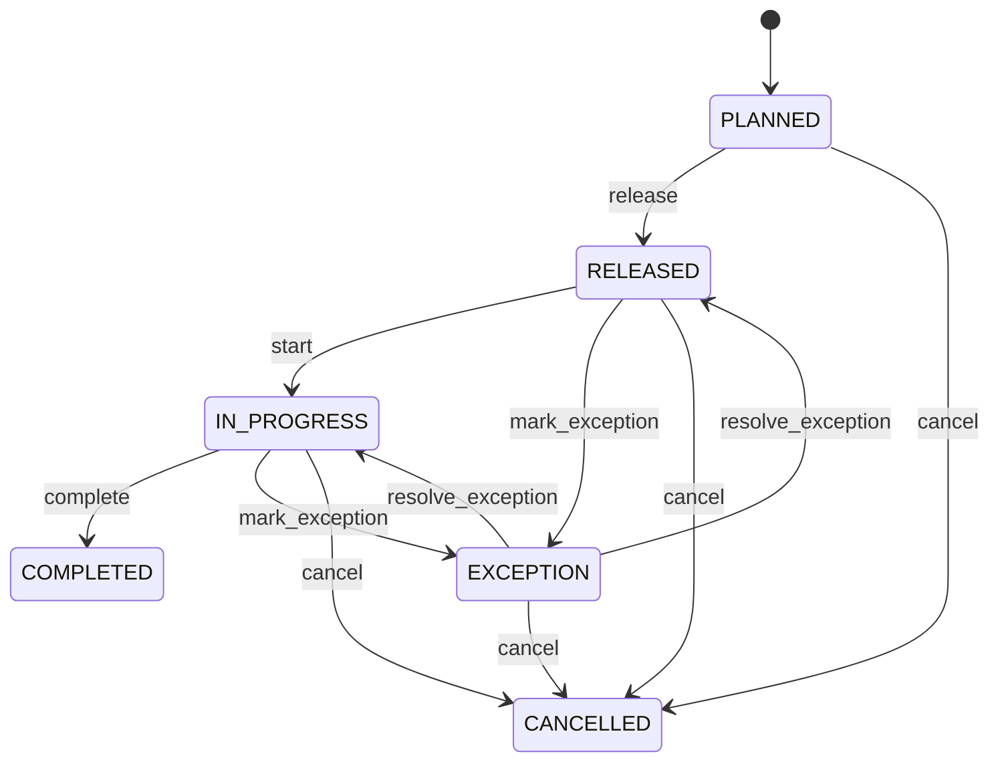

Any role that may change the record may make any move the diagram draws.

See [Putaway](/entities/warehouse-management/putaway/) for the record itself.

## Picking: Picking lifecycle

States: **Planned**, **Released**, **In progress**, **Picked**, **Short**, **Cancelled**, **Exception**. A new record starts as **Planned**; **Cancelled** ends the lifecycle.

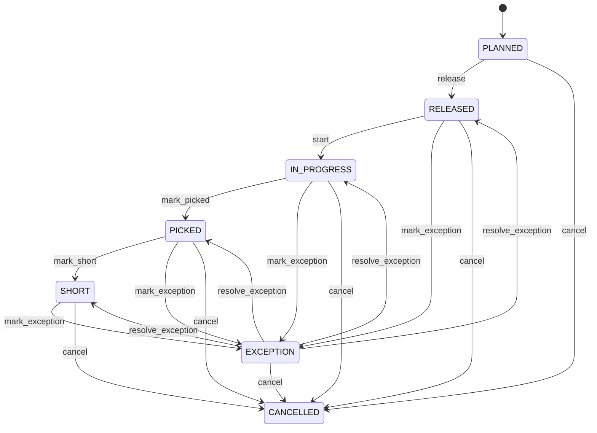

Any role that may change the record may make any move the diagram draws.

See [Picking](/entities/warehouse-management/picking/) for the record itself.

## Packing: Packing lifecycle

States: **Planned**, **In progress**, **Packed**, **Cancelled**, **Exception**. A new record starts as **Planned**; **Cancelled** ends the lifecycle.

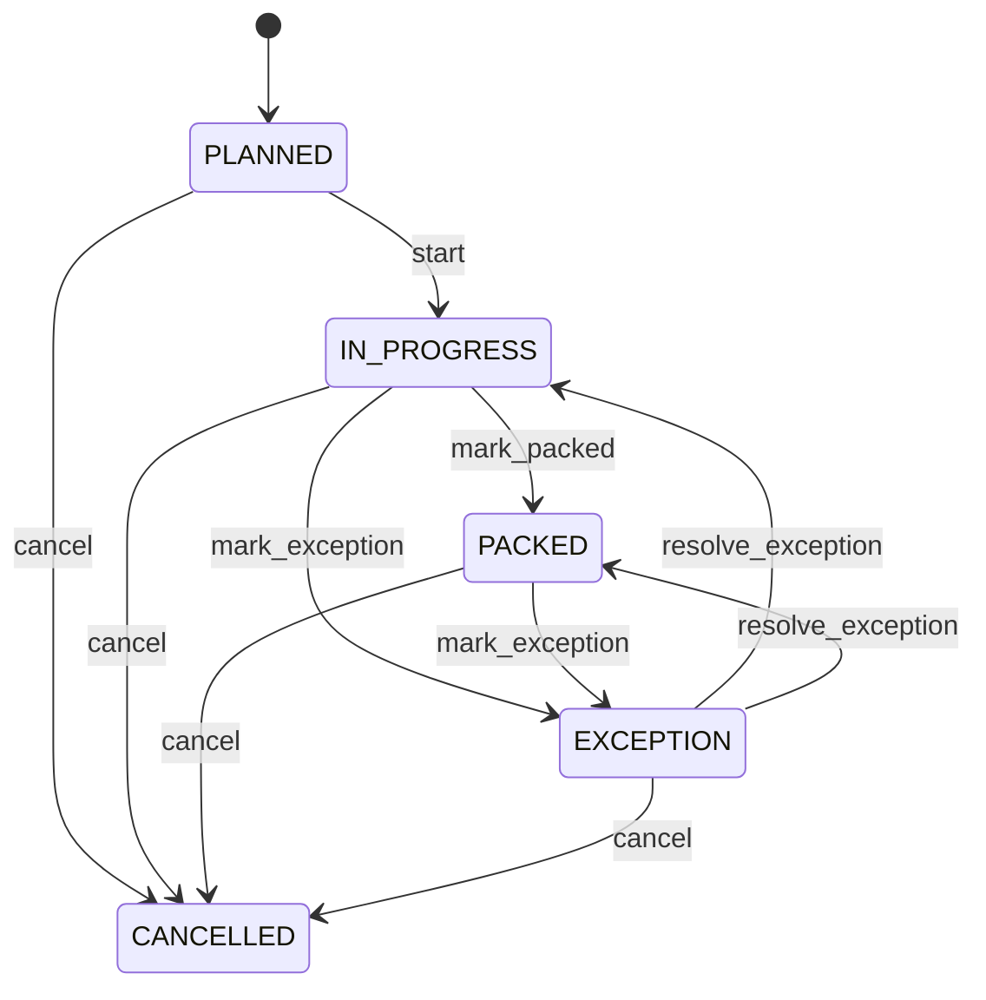

Any role that may change the record may make any move the diagram draws.

See [Packing](/entities/warehouse-management/packing/) for the record itself.

## Wave: Wave lifecycle

States: **Planned**, **Released**, **In progress**, **Completed**, **Cancelled**. A new record starts as **Planned**; **Completed**, **Cancelled** ends the lifecycle.

Any role that may change the record may make any move the diagram draws.

See [Wave](/entities/warehouse-management/wave/) for the record itself.

