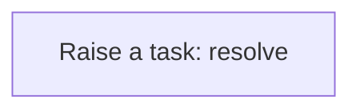
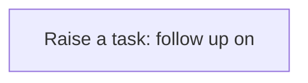
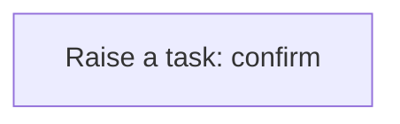

# Processes

A process is a sequence of steps the application runs for you: create a task, update a record, call a service. A business rule usually starts it; you can also run one by hand from the Workflow Designer. Every run is logged step by step in the Workflow Monitor. This application has **19** processes.

## Party exception raised {#party-exception-raised}

When a party is blocked, a high-priority task asks someone to resolve it.

Runs when a **Party** is changed, started by a business rule.

1. **Raise a task: resolve** — creates a **Task** record.

## Exchange rate follow up required {#exchange-rate-follow-up-required}

When a exchange rate is cancelled, a task asks someone to settle what depended on it.

Runs when a **Exchange Rate** is changed, started by a business rule.

1. **Raise a task: follow up on** — creates a **Task** record.

## Inventory reservation follow up required {#inventory-reservation-follow-up-required}

When a inventory reservation is cancelled, a task asks someone to settle what depended on it.

Runs when a **Inventory Reservation** is changed, started by a business rule.

1. **Raise a task: follow up on** — creates a **Task** record.

## Inventory transfer follow up required {#inventory-transfer-follow-up-required}

When a inventory transfer is cancelled, a task asks someone to settle what depended on it.

Runs when a **Inventory Transfer** is changed, started by a business rule.

1. **Raise a task: follow up on** — creates a **Task** record.

## Inventory transfer completion confirmed {#inventory-transfer-completion-confirmed}

When a inventory transfer is completed, a task asks someone to confirm the outcome.

Runs when a **Inventory Transfer** is changed, started by a business rule.

1. **Raise a task: confirm** — creates a **Task** record.

## Lot exception raised {#lot-exception-raised}

When a lot is quarantined, a high-priority task asks someone to resolve it.

Runs when a **Lot** is changed, started by a business rule.

1. **Raise a task: resolve** — creates a **Task** record.

## Lot follow up required {#lot-follow-up-required}

When a lot is rejected, a task asks someone to settle what depended on it.

Runs when a **Lot** is changed, started by a business rule.

1. **Raise a task: follow up on** — creates a **Task** record.

## Serial number exception raised {#serial-number-exception-raised}

When a serial number is quarantined, a high-priority task asks someone to resolve it.

Runs when a **Serial Number** is changed, started by a business rule.

1. **Raise a task: resolve** — creates a **Task** record.

## Product exception raised {#product-exception-raised}

When a product is blocked, a high-priority task asks someone to resolve it.

Runs when a **Product** is changed, started by a business rule.

1. **Raise a task: resolve** — creates a **Task** record.

## Inventory location exception raised {#inventory-location-exception-raised}

When a inventory location is blocked, a high-priority task asks someone to resolve it.

Runs when a **Warehouse** is changed, started by a business rule.

1. **Raise a task: resolve** — creates a **Task** record.

## Putaway exception raised {#putaway-exception-raised}

When a putaway is exception, a high-priority task asks someone to resolve it.

Runs when a **Putaway** is changed, started by a business rule.

1. **Raise a task: resolve** — creates a **Task** record.

## Putaway follow up required {#putaway-follow-up-required}

When a putaway is cancelled, a task asks someone to settle what depended on it.

Runs when a **Putaway** is changed, started by a business rule.

1. **Raise a task: follow up on** — creates a **Task** record.

## Putaway completion confirmed {#putaway-completion-confirmed}

When a putaway is completed, a task asks someone to confirm the outcome.

Runs when a **Putaway** is changed, started by a business rule.

1. **Raise a task: confirm** — creates a **Task** record.

## Picking exception raised {#picking-exception-raised}

When a picking is exception, a high-priority task asks someone to resolve it.

Runs when a **Picking** is changed, started by a business rule.

1. **Raise a task: resolve** — creates a **Task** record.

## Picking follow up required {#picking-follow-up-required}

When a picking is cancelled, a task asks someone to settle what depended on it.

Runs when a **Picking** is changed, started by a business rule.

1. **Raise a task: follow up on** — creates a **Task** record.

## Packing exception raised {#packing-exception-raised}

When a packing is exception, a high-priority task asks someone to resolve it.

Runs when a **Packing** is changed, started by a business rule.

1. **Raise a task: resolve** — creates a **Task** record.

## Packing follow up required {#packing-follow-up-required}

When a packing is cancelled, a task asks someone to settle what depended on it.

Runs when a **Packing** is changed, started by a business rule.

1. **Raise a task: follow up on** — creates a **Task** record.

## Wave follow up required {#wave-follow-up-required}

When a wave is cancelled, a task asks someone to settle what depended on it.

Runs when a **Wave** is changed, started by a business rule.

1. **Raise a task: follow up on** — creates a **Task** record.

## Wave completion confirmed {#wave-completion-confirmed}

When a wave is completed, a task asks someone to confirm the outcome.

Runs when a **Wave** is changed, started by a business rule.

1. **Raise a task: confirm** — creates a **Task** record.

