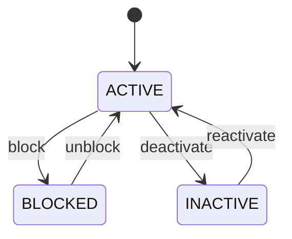

# Warehouse

Granular inventory position whose lifecycle controls future execution while preserving historical inventory state. A location is operational infrastructure, not merely an address. Changing its status can affect receiving, put-away, reservations, picking, transfers, replenishment and shipment staging. Receiving, warehouse execution, picking, replenishment, stock counting, transfers, reservation, fulfillment, quarantine and yard operations. Warehouse supplies facility context. InventoryLocation supplies operational position. InventoryBalance supplies current state. InventoryMovement supplies historical event evidence. InventoryReservation supplies committed demand. Location create → configure capacity/type → activate → participate in receiving/put-away/reservation/picking/transfer → block or quarantine when necessary → resolve dependent stock/reservations → inactive. Status changes trigger dependency validation rather than simply toggling a flag. Location status changes affect future transaction eligibility; location hierarchy/warehouse changes require validation of balances and open reservations; capacity/type changes require validation of affected put-away and transfer rules; historical movements remain unchanged. Configured → ACTIVE → BLOCKED/QUARANTINE operational state → resolved or INACTIVE. Existing stock is retained and must be deliberately relocated or handled through authorized workflow. A storage rack is blocked because of damage. New put-away and allocation are stopped. Existing stock and reservations are identified; reservations are moved or released and stock is transferred to valid locations. Historical movements still point to the original rack.

## Finding records

Lines are added from the parent: open a **Warehouse** and choose the **Warehouse** tab.

The list shows Code, Location Type, Status, Capacity, Warehouse, Warehouse Zone, with the most recently changed record first. The **Help** button beside the title opens this window's help text.

- **Search**: type in the search box above the grid to narrow the rows. **Search** at the top left opens advanced search, where you pick a field, a comparison (equals, contains, starts with, before, after, and so on) and a value.
- **Sort**: click a column heading; click again to reverse.
- **Refresh**: the refresh button at the top right re-reads the rows and every dropdown, so a record created a moment ago by someone else appears.
- **Export**: **CSV** downloads the rows you are looking at.
- **Open a record**: click a row. The line under the title, "Showing 1 to n of N entries", tells you how many rows match.

## Adding a line

Open the parent record, choose the **Warehouse** tab and use **New**. The line is tied to its parent automatically.

## Reading, changing and deleting a record

Click a row to open the record. Above the fields are the arrows that step through the list ("1 of 5"). Below them sit **Notes**, where anyone may leave a comment on the record, and the **Audit Trail**, which lists every change with who made it, when, and which fields changed.

- **Edit** (toolbar) makes the fields editable. Change them and choose **Save**; **Undo Changes** puts back what you changed and **Cancel Editing** leaves edit mode.
- **Copy Record** starts a new record from this one.
- **Delete Record** is available in edit mode and asks you to confirm; a record other records still depend on cannot be deleted.

Every change is also written to the [Audit Log](/administration/#audit-log).

## Fields

| Field | What you use | Rules | What to enter |
| --- | --- | --- | --- |
| Code | Text | Required, Unique, Up to 100 characters | The code of the inventory location: a value the business records on it. Entered or maintained when a inventory location is created or changed; shown on its form and available to search and reports. Read together with the inventory location's other fields and its relationships; it is not meaningful on its own. Required: a inventory location cannot be understood without its code. |
| Location Type | Choice | Required | The location type of the inventory location: a value the business records on it. Entered or maintained when a inventory location is created or changed; shown on its form and available to search and reports. Read together with the inventory location's other fields and its relationships; it is not meaningful on its own. Required: a inventory location cannot be understood without its location type. The location type of the inventory location is receiving; set it when that is what the business means for this record. The location type of the inventory location is bin; set it when that is what the business means for this record. The location type of the inventory location is shelf; set it when that is what the business means for this record. The location type of the inventory location is rack; set it when that is what the business means for this record. The location type of the inventory location is floor; set it when that is what the business means for this record. The location type of the inventory location is pick; set it when that is what the business means for this record. The location type of the inventory location is staging; set it when that is what the business means for this record. The location type of the inventory location is quarantine; set it when that is what the business means for this record. The location type of the inventory location is yard slot; set it when that is what the business means for this record. The location type of the inventory location is other; set it when that is what the business means for this record. Choose one: Receiving, Bin, Shelf, Rack, Floor, Pick, Staging, Quarantine, Yard slot, Other. |
| Status | Choice | Required | Controls whether the location can participate in normal future inventory operations. Applies to receiving, put-away, picking, transfer, allocation, replenishment, counting and staging. Status constrains future operations; it never deletes current balances or historical movements. Status changes trigger dependent-workflow validation before operational eligibility changes become effective. The status of the inventory location is active; set it when that is what the business means for this record. The status of the inventory location is blocked; set it when that is what the business means for this record. The status of the inventory location is inactive; set it when that is what the business means for this record. Choose one: Active, Blocked, Inactive. |
| Capacity | Amount | Optional | The capacity of the inventory location: a number the business records on it. Entered or maintained when a inventory location is created or changed; shown on its form and available to search and reports. Read together with the inventory location's other fields and its relationships; it is not meaningful on its own. |
| Warehouse | Lookup | Required | Links a inventory location to warehouse, the warehouse it relates to. Chosen from the existing warehouse records when the inventory location is created or edited. A inventory location has exactly one warehouse in this role. Lets the inventory location be found from, and reported with, its warehouse. Pick a record from **Warehouse**. |
| Warehouse Zone | Lookup | Optional | Operational warehouse zone containing this inventory location. Supplies storage/process/control classification. Putaway, picking, quarantine, replenishment and reporting. Optional for locations outside zoned warehouses. Location eligibility must comply with zone controls. Pick a record from **Warehouse**. |

## How it connects to other records

A warehouse is a line of a **Warehouse**. It has no window of its own: open the warehouse and use the **Warehouse** tab to see and add lines.
- A warehouse has many **Inventory Location** records.
- A warehouse has many **Inventory Movement** records.
- A warehouse has many **Inventory Reservation** records.
- A warehouse has many **Inventory Transfer** records.
- A warehouse has many **Inventory Count** records.
- A warehouse has many **Inventory Adjustment** records.
- A warehouse belongs to one **Warehouse**.
- A warehouse has many **Handling Unit** records.
- A warehouse has many **Warehouse** records.
- A warehouse has many **Putaway** records.
- A warehouse has many **Picking** records.

## Lifecycle: Inventory location lifecycle

A warehouse record starts as **Active**. Open a record and the bar above its fields shows its current **State** and, after **Next**, a button for each move that leaves it; choose one to make the move. Any move the diagram does not draw is refused, for everyone including the administrator.

| From | To | Move |
| --- | --- | --- |
| Active | Blocked | Block |
| Blocked | Active | Unblock |
| Active | Inactive | Deactivate |
| Inactive | Active | Reactivate |

## What happens when you save
Business rules run around the save. They are listed here and explained in full under [Business rules](/administration/rules/).

| Rule | When | Order |
| --- | --- | --- |
| Inventory location invariants before create | before a warehouse is created | 100 |
| Inventory location invariants before update | before a warehouse is changed | 100 |
| Inventory location workflows after update | after a warehouse is changed | 100 |

Processes started from this record: [Inventory location exception raised](/administration/processes/#inventory-location-exception-raised).

## Who may use it

Anyone who holds a role with access to the **Warehouse** window. Access is granted by role under [Roles and access](/administration/access/).
