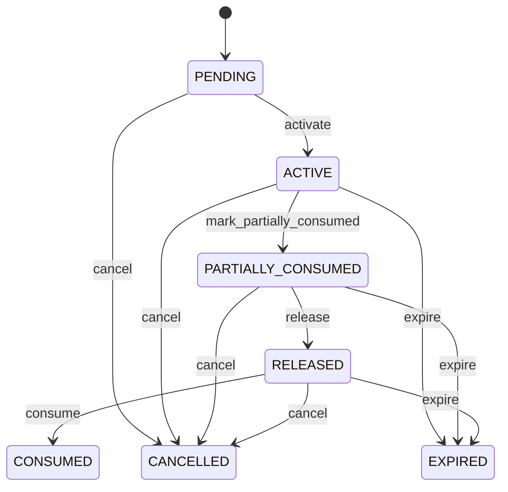

# Inventory Reservation

Controls the commitment of available inventory to demand while separating reservation state from physical stock movement. Reservation means stock is committed, not physically moved. Physical movement occurs only when an authorized fulfillment or inventory movement workflow posts it. Sales fulfillment, maintenance demand, allocation, picking, replenishment, production and inventory control. Product identifies stock, InventoryLocation identifies where it is reserved, InventoryBalance supplies available state, and SalesOrderLine supplies one possible demand source. Demand approved → availability checked → reservation created → InventoryBalance reserved/available updated → pick/issue/fulfillment → reservation consumed and InventoryMovement posted. Cancellation/expiry releases reserved quantity. Master or location changes trigger revalidation. Pending → Active → Partially consumed → Consumed, or Active → Released/Cancelled/Expired. Terminal states preserve history. Reservation creation, increase, consumption and release require transactional concurrency control so available inventory cannot be reserved twice. 100 units are available. A SalesOrderLine reserves 30, making 70 available. Picking consumes 10 reserved units and posts the corresponding issue movement; the reservation has 20 remaining. If the location is blocked, the reservation must be transferred or released before the stock can be considered available elsewhere.

## Finding records

Open **Inventory Reservation** from the menu or from its card on the dashboard.

The list shows Quantity Reserved, Quantity Consumed, Quantity Released, Status, Priority, Expires At, Product, with the most recently changed record first. The **Help** button beside the title opens this window's help text.

- **Search**: type in the search box above the grid to narrow the rows. **Search** at the top left opens advanced search, where you pick a field, a comparison (equals, contains, starts with, before, after, and so on) and a value.
- **Sort**: click a column heading; click again to reverse.
- **Refresh**: the refresh button at the top right re-reads the rows and every dropdown, so a record created a moment ago by someone else appears.
- **Export**: **CSV** downloads the rows you are looking at.
- **Open a record**: click a row. The line under the title, "Showing 1 to n of N entries", tells you how many rows match.

## Creating a record

Choose **New** at the top of the list. The form opens on its own page, with the fields in sections. A badge beside each label names the control (Text, Dropdown, Date, and so on); a red star marks a required field; the question-mark icon shows that field's help; and a hint such as “max 300” shows the longest entry accepted.

1. Fill in the fields described under [Fields](#fields).
2. These are required and must be completed before the record can be saved: **Quantity Reserved**, **Quantity Consumed**, **Quantity Released**, **Status**, **Product**, **Inventory Location**, **Inventory Balance**.
3. For a dropdown that points at another window, pick the matching record; if the record you need does not exist yet, create it in its own window first. A dropdown may narrow to what you have already chosen, for example the states of the chosen country.
4. Choose **Create** (or **Save** in the toolbar). You return to the record, and it appears at the top of the list. If something is wrong the form says which field and why, and nothing is saved.

## Reading, changing and deleting a record

Click a row to open the record. Above the fields are the arrows that step through the list ("1 of 5"). Below them sit **Notes**, where anyone may leave a comment on the record, and the **Audit Trail**, which lists every change with who made it, when, and which fields changed.

- **Edit** (toolbar) makes the fields editable. Change them and choose **Save**; **Undo Changes** puts back what you changed and **Cancel Editing** leaves edit mode.
- **Copy Record** starts a new record from this one.
- **Delete Record** is available in edit mode and asks you to confirm; a record other records still depend on cannot be deleted.

Every change is also written to the [Audit Log](/administration/#audit-log).

## Fields

| Field | What you use | Rules | What to enter |
| --- | --- | --- | --- |
| Quantity Reserved | Amount | Required | The quantity reserved of the inventory reservation: a number the business records on it. Entered or maintained when a inventory reservation is created or changed; shown on its form and available to search and reports. Read together with the inventory reservation's other fields and its relationships; it is not meaningful on its own. Required: a inventory reservation cannot be understood without its quantity reserved. |
| Quantity Consumed | Amount | Required | The quantity consumed of the inventory reservation: a number the business records on it. Entered or maintained when a inventory reservation is created or changed; shown on its form and available to search and reports. Read together with the inventory reservation's other fields and its relationships; it is not meaningful on its own. Required: a inventory reservation cannot be understood without its quantity consumed. |
| Quantity Released | Amount | Required | The quantity released of the inventory reservation: a number the business records on it. Entered or maintained when a inventory reservation is created or changed; shown on its form and available to search and reports. Read together with the inventory reservation's other fields and its relationships; it is not meaningful on its own. Required: a inventory reservation cannot be understood without its quantity released. |
| Status | Choice | Required | The status of the inventory reservation: a value the business records on it. Entered or maintained when a inventory reservation is created or changed; shown on its form and available to search and reports. Read together with the inventory reservation's other fields and its relationships; it is not meaningful on its own. Required: a inventory reservation cannot be understood without its status. The status of the inventory reservation is pending; set it when that is what the business means for this record. The status of the inventory reservation is active; set it when that is what the business means for this record. The status of the inventory reservation is partially consumed; set it when that is what the business means for this record. The status of the inventory reservation is released; set it when that is what the business means for this record. The status of the inventory reservation is consumed; set it when that is what the business means for this record. The status of the inventory reservation is cancelled; set it when that is what the business means for this record. The status of the inventory reservation is expired; set it when that is what the business means for this record. Choose one: Pending, Active, Partially consumed, Released, Consumed, Cancelled, Expired. |
| Priority | Whole number | Optional | The priority of the inventory reservation: a whole number the business records on it. Entered or maintained when a inventory reservation is created or changed; shown on its form and available to search and reports. Read together with the inventory reservation's other fields and its relationships; it is not meaningful on its own. |
| Expires At | Date and time | Optional | The expires at of the inventory reservation: a point in time the business records on it. Entered or maintained when a inventory reservation is created or changed; shown on its form and available to search and reports. Read together with the inventory reservation's other fields and its relationships; it is not meaningful on its own. |
| Product | Lookup | Required | Links a inventory reservation to product, the product it relates to. Chosen from the existing product records when the inventory reservation is created or edited. A inventory reservation has exactly one product in this role. Lets the inventory reservation be found from, and reported with, its product. Pick a record from **Product**. |
| Inventory Location | Lookup | Required | Links a inventory reservation to inventory location, the inventory location it relates to. Chosen from the existing inventory location records when the inventory reservation is created or edited. A inventory reservation has exactly one inventory location in this role. Lets the inventory reservation be found from, and reported with, its inventory location. Pick a record from **Warehouse**. |
| Inventory Balance | Lookup | Required | Links a inventory reservation to inventory balance, the inventory balance it relates to. Chosen from the existing inventory balance records when the inventory reservation is created or edited. A inventory reservation has exactly one inventory balance in this role. Lets the inventory reservation be found from, and reported with, its inventory balance. Pick a record from **Inventory Location**. |

## How it connects to other records
- A inventory reservation belongs to one **Product**.
- A inventory reservation belongs to one **Warehouse**.
- A inventory reservation belongs to one **Inventory Location**.
- A inventory reservation has many **Picking** records.

## Lifecycle: Inventory reservation lifecycle

A inventory reservation record starts as **Pending** and ends as **Consumed** or **Cancelled** or **Expired**. Open a record and the bar above its fields shows its current **State** and, after **Next**, a button for each move that leaves it; choose one to make the move. Any move the diagram does not draw is refused, for everyone including the administrator.

| From | To | Move |
| --- | --- | --- |
| Pending | Active | Activate |
| Active | Partially consumed | Mark partially consumed |
| Partially consumed | Released | Release |
| Released | Consumed | Consume |
| Pending | Cancelled | Cancel |
| Active | Cancelled | Cancel |
| Partially consumed | Cancelled | Cancel |
| Released | Cancelled | Cancel |
| Active | Expired | Expire |
| Partially consumed | Expired | Expire |
| Released | Expired | Expire |

## What happens when you save
Business rules run around the save. They are listed here and explained in full under [Business rules](/administration/rules/).

| Rule | When | Order |
| --- | --- | --- |
| Inventory reservation workflows after update | after a inventory reservation is changed | 100 |

Processes started from this record: [Inventory reservation follow up required](/administration/processes/#inventory-reservation-follow-up-required).

## Who may use it

Anyone who holds a role with access to the **Inventory Reservation** window. Access is granted by role under [Roles and access](/administration/access/).
