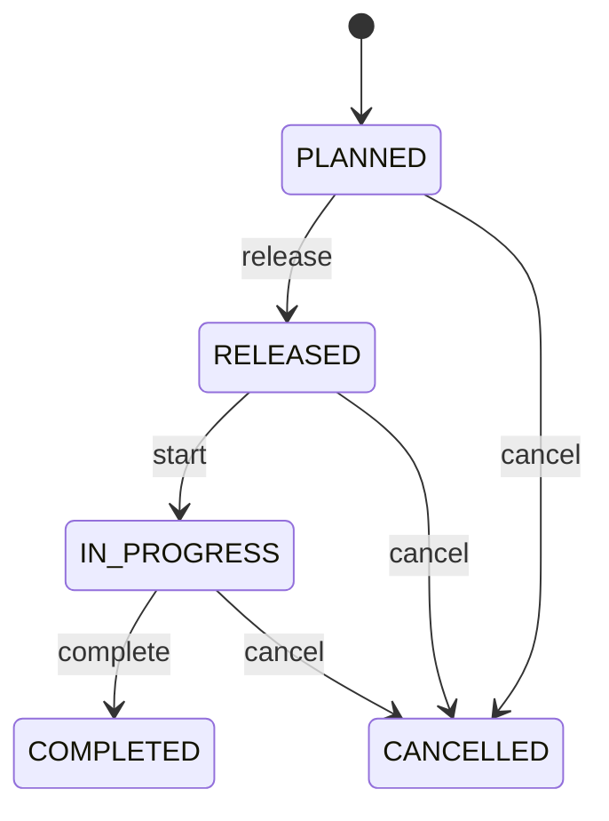

# Inventory Transfer

Warehouse/inventory relocation authorization separated from stock ledger events. InventoryTransfer explains why and where stock should move; InventoryMovement records what stock actually changed location. Putaway, replenishment, staging, inter-bin relocation and controlled warehouse transfers. Product/Lot/Serial identify stock; InventoryLocation supplies origin/destination; InventoryMovement provides authoritative physical effect. Planned → released → in progress → completed or cancelled. Release reserves/validates eligible stock where policy requires; execution updates balances only through movements.

## Finding records

Open **Inventory Transfer** from the menu or from its card on the dashboard.

The list shows Transfer Number, Requested Quantity, Status, Product, Source Location, Lot, with the most recently changed record first. The **Help** button beside the title opens this window's help text.

- **Search**: type in the search box above the grid to narrow the rows. **Search** at the top left opens advanced search, where you pick a field, a comparison (equals, contains, starts with, before, after, and so on) and a value.
- **Sort**: click a column heading; click again to reverse.
- **Refresh**: the refresh button at the top right re-reads the rows and every dropdown, so a record created a moment ago by someone else appears.
- **Export**: **CSV** downloads the rows you are looking at.
- **Open a record**: click a row. The line under the title, "Showing 1 to n of N entries", tells you how many rows match.

## Creating a record

Choose **New** at the top of the list. The form opens on its own page, with the fields in sections. A badge beside each label names the control (Text, Dropdown, Date, and so on); a red star marks a required field; the question-mark icon shows that field's help; and a hint such as “max 300” shows the longest entry accepted.

1. Fill in the fields described under [Fields](#fields).
2. These are required and must be completed before the record can be saved: **Transfer Number**, **Requested Quantity**, **Status**, **Product**, **Source Location**.
3. For a dropdown that points at another window, pick the matching record; if the record you need does not exist yet, create it in its own window first. A dropdown may narrow to what you have already chosen, for example the states of the chosen country.
4. Choose **Create** (or **Save** in the toolbar). You return to the record, and it appears at the top of the list. If something is wrong the form says which field and why, and nothing is saved.

## Reading, changing and deleting a record

Click a row to open the record. Above the fields are the arrows that step through the list ("1 of 5"). Below them sit **Notes**, where anyone may leave a comment on the record, and the **Audit Trail**, which lists every change with who made it, when, and which fields changed.

- **Edit** (toolbar) makes the fields editable. Change them and choose **Save**; **Undo Changes** puts back what you changed and **Cancel Editing** leaves edit mode.
- **Copy Record** starts a new record from this one.
- **Delete Record** is available in edit mode and asks you to confirm; a record other records still depend on cannot be deleted.

Every change is also written to the [Audit Log](/administration/#audit-log).

## Fields

| Field | What you use | Rules | What to enter |
| --- | --- | --- | --- |
| Transfer Number | Text | Required, Unique, Up to 100 characters | Human-facing transfer reference. Operational identifier for relocation work. Warehouse execution and reconciliation. Distinct from movement numbers. Required. |
| Requested Quantity | Amount | Required | Quantity authorized for relocation. Defines transfer demand. Execution and variance reconciliation. Interpreted with Product and traceability identities. Required. |
| Status | Choice | Required | Transfer lifecycle state. Controls warehouse execution eligibility. Transfer orchestration and audit. Posted movements remain immutable regardless of header state. Prepared but not executable. Authorized. Physical relocation underway. Authorized quantity reconciled. Remaining work terminated. Required. Choose one: Planned, Released, In progress, Completed, Cancelled. |
| Product | Lookup | Required | Product being relocated. Defines inventory item affected. Validation and reconciliation. Exactly one Product. All movements must match. Pick a record from **Product**. |
| Source Location | Lookup | Required | Location inventory leaves. Defines transfer origin. Availability and warehouse execution. Exactly one source. Must differ from target and hold eligible stock. Pick a record from **Warehouse**. |
| Lot | Lookup | Optional | Lot being transferred. Preserves batch identity across relocation. Traceability and FEFO. Required under lot-control policy. Source/target stock remains same lot. Pick a record from **Lot**. |

## How it connects to other records
- A inventory transfer has many **Inventory Movement** records.
- A inventory transfer belongs to one **Product**.
- A inventory transfer belongs to one **Warehouse**.
- A inventory transfer belongs to one **Lot**.
- A inventory transfer has many **Serial Number** records.
- A inventory transfer has many **Putaway** records.

## Lifecycle: Inventory transfer lifecycle

A inventory transfer record starts as **Planned** and ends as **Completed** or **Cancelled**. Open a record and the bar above its fields shows its current **State** and, after **Next**, a button for each move that leaves it; choose one to make the move. Any move the diagram does not draw is refused, for everyone including the administrator.

| From | To | Move |
| --- | --- | --- |
| Planned | Released | Release |
| Released | In progress | Start |
| In progress | Completed | Complete |
| Planned | Cancelled | Cancel |
| Released | Cancelled | Cancel |
| In progress | Cancelled | Cancel |

## What happens when you save
Business rules run around the save. They are listed here and explained in full under [Business rules](/administration/rules/).

| Rule | When | Order |
| --- | --- | --- |
| Inventory transfer invariants before create | before a inventory transfer is created | 100 |
| Inventory transfer invariants before update | before a inventory transfer is changed | 100 |
| Inventory transfer workflows after update | after a inventory transfer is changed | 100 |

Processes started from this record: [Inventory transfer follow up required](/administration/processes/#inventory-transfer-follow-up-required), [Inventory transfer completion confirmed](/administration/processes/#inventory-transfer-completion-confirmed).

## Who may use it

Anyone who holds a role with access to the **Inventory Transfer** window. Access is granted by role under [Roles and access](/administration/access/).
