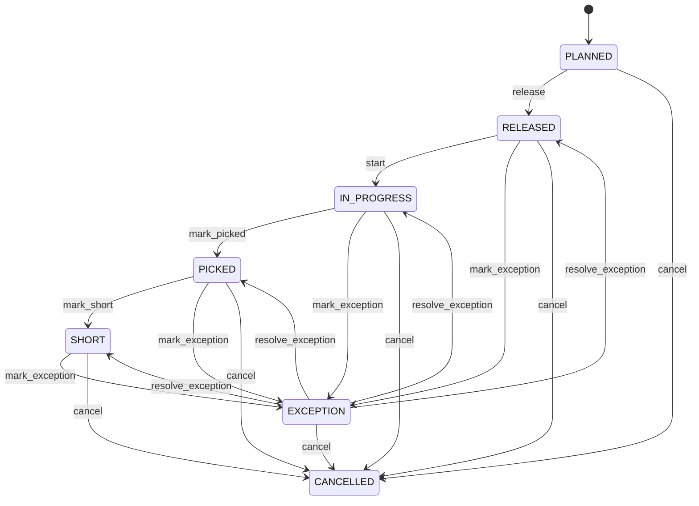

# Picking

Warehouse inventory-selection task for authorized demand. Picking selects/handles committed stock; inventory and fulfillment ledgers remain authoritative separately. Sales fulfillment, production staging, transfer and service demand. Reservation supplies commitment; InventoryLocation supplies source; ShipmentLine may supply outbound demand. Planned → released → in progress → picked/short, cancelled or exception.

## Finding records

Open **Picking** from the menu or from its card on the dashboard.

The list shows Quantity, Status, Reservation, Source Location, Handling Unit, Wave, with the most recently changed record first. The **Help** button beside the title opens this window's help text.

- **Search**: type in the search box above the grid to narrow the rows. **Search** at the top left opens advanced search, where you pick a field, a comparison (equals, contains, starts with, before, after, and so on) and a value.
- **Sort**: click a column heading; click again to reverse.
- **Refresh**: the refresh button at the top right re-reads the rows and every dropdown, so a record created a moment ago by someone else appears.
- **Export**: **CSV** downloads the rows you are looking at.
- **Open a record**: click a row. The line under the title, "Showing 1 to n of N entries", tells you how many rows match.

## Creating a record

Choose **New** at the top of the list. The form opens on its own page, with the fields in sections. A badge beside each label names the control (Text, Dropdown, Date, and so on); a red star marks a required field; the question-mark icon shows that field's help; and a hint such as “max 300” shows the longest entry accepted.

1. Fill in the fields described under [Fields](#fields).
2. These are required and must be completed before the record can be saved: **Quantity**, **Status**, **Source Location**.
3. For a dropdown that points at another window, pick the matching record; if the record you need does not exist yet, create it in its own window first. A dropdown may narrow to what you have already chosen, for example the states of the chosen country.
4. Choose **Create** (or **Save** in the toolbar). You return to the record, and it appears at the top of the list. If something is wrong the form says which field and why, and nothing is saved.

## Reading, changing and deleting a record

Click a row to open the record. Above the fields are the arrows that step through the list ("1 of 5"). Below them sit **Notes**, where anyone may leave a comment on the record, and the **Audit Trail**, which lists every change with who made it, when, and which fields changed.

- **Edit** (toolbar) makes the fields editable. Change them and choose **Save**; **Undo Changes** puts back what you changed and **Cancel Editing** leaves edit mode.
- **Copy Record** starts a new record from this one.
- **Delete Record** is available in edit mode and asks you to confirm; a record other records still depend on cannot be deleted.

Every change is also written to the [Audit Log](/administration/#audit-log).

## Fields

| Field | What you use | Rules | What to enter |
| --- | --- | --- | --- |
| Quantity | Amount | Required | Quantity directed to pick. Defines execution demand. Pick confirmation and variance. Must reconcile with reservation and inventory events. Required. |
| Status | Choice | Required | Picking execution state. Controls warehouse task progression. Wave/pick orchestration. PICKED is warehouse evidence, not shipment delivery. Proposed. Authorized. Being picked. Required quantity confirmed. Quantity short. Terminated. Requires resolution. Required. Choose one: Planned, Released, In progress, Picked, Short, Cancelled, Exception. |
| Reservation | Lookup | Optional | Inventory commitment supplying pick demand. Prevents picking unallocated demand where reservation is required. Fulfillment. Optional under non-reservation workflows. Consumption must reconcile. Pick a record from **Inventory Reservation**. |
| Source Location | Lookup | Required | Storage position picked from. Defines source custody. WMS execution. Exactly one source. Must hold eligible stock. Pick a record from **Warehouse**. |
| Handling Unit | Lookup | Optional | Handling unit used for picked stock. Supports tote/carton/pallet execution. Scanning and packing. Optional. Custody must reconcile. Pick a record from **Handling Unit**. |
| Wave | Lookup | Optional | The Wave this Picking belongs to. Pick a record from **Wave**. |

## How it connects to other records
- A picking belongs to one **Inventory Reservation**.
- A picking belongs to one **Warehouse**.
- A picking belongs to one **Handling Unit**.
- A picking has many **Packing** records.
- A picking belongs to one **Wave**.

## Lifecycle: Picking lifecycle

A picking record starts as **Planned** and ends as **Cancelled**. Open a record and the bar above its fields shows its current **State** and, after **Next**, a button for each move that leaves it; choose one to make the move. Any move the diagram does not draw is refused, for everyone including the administrator.

| From | To | Move |
| --- | --- | --- |
| Planned | Released | Release |
| Released | In progress | Start |
| In progress | Picked | Mark picked |
| Picked | Short | Mark short |
| Released | Exception | Mark exception |
| Exception | Released | Resolve exception |
| In progress | Exception | Mark exception |
| Exception | In progress | Resolve exception |
| Picked | Exception | Mark exception |
| Exception | Picked | Resolve exception |
| Short | Exception | Mark exception |
| Exception | Short | Resolve exception |
| Planned | Cancelled | Cancel |
| Released | Cancelled | Cancel |
| In progress | Cancelled | Cancel |
| Picked | Cancelled | Cancel |
| Short | Cancelled | Cancel |
| Exception | Cancelled | Cancel |

## What happens when you save
Business rules run around the save. They are listed here and explained in full under [Business rules](/administration/rules/).

| Rule | When | Order |
| --- | --- | --- |
| Picking invariants before create | before a picking is created | 100 |
| Picking invariants before update | before a picking is changed | 100 |
| Picking workflows after update | after a picking is changed | 100 |

Processes started from this record: [Picking exception raised](/administration/processes/#picking-exception-raised), [Picking follow up required](/administration/processes/#picking-follow-up-required).

## Who may use it

Anyone who holds a role with access to the **Picking** window. Access is granted by role under [Roles and access](/administration/access/).
