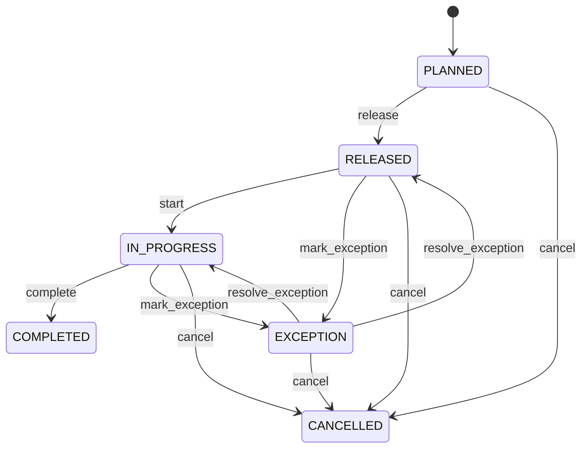

# Putaway

Directed inbound/staging-to-storage warehouse task. Putaway says where stock should be stored; InventoryTransfer/InventoryMovement prove physical relocation. Receiving, cross-dock exceptions, replenishment and storage optimization. InventoryLocation/Zone define eligibility; HandlingUnit supports physical execution. Planned → released → in progress → completed, cancelled or exception.

## Finding records

Open **Putaway** from the menu or from its card on the dashboard.

The list shows Quantity, Status, Product, Source Location, Handling Unit, Inventory Transfer, Wave, with the most recently changed record first. The **Help** button beside the title opens this window's help text.

- **Search**: type in the search box above the grid to narrow the rows. **Search** at the top left opens advanced search, where you pick a field, a comparison (equals, contains, starts with, before, after, and so on) and a value.
- **Sort**: click a column heading; click again to reverse.
- **Refresh**: the refresh button at the top right re-reads the rows and every dropdown, so a record created a moment ago by someone else appears.
- **Export**: **CSV** downloads the rows you are looking at.
- **Open a record**: click a row. The line under the title, "Showing 1 to n of N entries", tells you how many rows match.

## Creating a record

Choose **New** at the top of the list. The form opens on its own page, with the fields in sections. A badge beside each label names the control (Text, Dropdown, Date, and so on); a red star marks a required field; the question-mark icon shows that field's help; and a hint such as “max 300” shows the longest entry accepted.

1. Fill in the fields described under [Fields](#fields).
2. These are required and must be completed before the record can be saved: **Quantity**, **Status**, **Product**, **Source Location**, **Inventory Transfer**.
3. For a dropdown that points at another window, pick the matching record; if the record you need does not exist yet, create it in its own window first. A dropdown may narrow to what you have already chosen, for example the states of the chosen country.
4. Choose **Create** (or **Save** in the toolbar). You return to the record, and it appears at the top of the list. If something is wrong the form says which field and why, and nothing is saved.

## Reading, changing and deleting a record

Click a row to open the record. Above the fields are the arrows that step through the list ("1 of 5"). Below them sit **Notes**, where anyone may leave a comment on the record, and the **Audit Trail**, which lists every change with who made it, when, and which fields changed.

- **Edit** (toolbar) makes the fields editable. Change them and choose **Save**; **Undo Changes** puts back what you changed and **Cancel Editing** leaves edit mode.
- **Copy Record** starts a new record from this one.
- **Delete Record** is available in edit mode and asks you to confirm; a record other records still depend on cannot be deleted.

Every change is also written to the [Audit Log](/administration/#audit-log).

## Fields

| Field | What you use | Rules | What to enter |
| --- | --- | --- | --- |
| Quantity | Amount | Required | Quantity directed for storage. Defines task execution quantity. Putaway confirmation and variance. Must reconcile with transfer/movement. Required. |
| Status | Choice | Required | Putaway task state. Controls executable storage work. WMS orchestration. Completion alone does not alter stock without inventory posting. Proposed. Authorized. Being executed. Confirmed and reconciled. Terminated. Requires resolution. Required. Choose one: Planned, Released, In progress, Completed, Cancelled, Exception. |
| Product | Lookup | Required | Product being stored. Identifies handled inventory. Location eligibility. Exactly one Product. Must match transfer. Pick a record from **Product**. |
| Source Location | Lookup | Required | Receiving/staging origin. Current controlled position. Execution. Exactly one source. Must contain eligible stock. Pick a record from **Warehouse**. |
| Handling Unit | Lookup | Optional | Physical pallet/carton/tote moved as unit. Supports scan-based execution. WMS mobility. Optional for loose stock. Handling-unit location must reconcile. Pick a record from **Handling Unit**. |
| Inventory Transfer | Lookup | Required | Inventory relocation authorization/execution associated with putaway. Separates warehouse task from stock ledger. Reconciliation. Exactly one governed transfer. Completed task must reconcile to posted movement. Pick a record from **Inventory Transfer**. |
| Wave | Lookup | Optional | The Wave this Putaway belongs to. Pick a record from **Wave**. |

## How it connects to other records
- A putaway belongs to one **Product**.
- A putaway belongs to one **Warehouse**.
- A putaway belongs to one **Handling Unit**.
- A putaway belongs to one **Inventory Transfer**.
- A putaway belongs to one **Wave**.

## Lifecycle: Putaway lifecycle

A putaway record starts as **Planned** and ends as **Completed** or **Cancelled**. Open a record and the bar above its fields shows its current **State** and, after **Next**, a button for each move that leaves it; choose one to make the move. Any move the diagram does not draw is refused, for everyone including the administrator.

| From | To | Move |
| --- | --- | --- |
| Planned | Released | Release |
| Released | In progress | Start |
| In progress | Completed | Complete |
| Released | Exception | Mark exception |
| Exception | Released | Resolve exception |
| In progress | Exception | Mark exception |
| Exception | In progress | Resolve exception |
| Planned | Cancelled | Cancel |
| Released | Cancelled | Cancel |
| In progress | Cancelled | Cancel |
| Exception | Cancelled | Cancel |

## What happens when you save
Business rules run around the save. They are listed here and explained in full under [Business rules](/administration/rules/).

| Rule | When | Order |
| --- | --- | --- |
| Putaway invariants before create | before a putaway is created | 100 |
| Putaway invariants before update | before a putaway is changed | 100 |
| Putaway workflows after update | after a putaway is changed | 100 |

Processes started from this record: [Putaway exception raised](/administration/processes/#putaway-exception-raised), [Putaway follow up required](/administration/processes/#putaway-follow-up-required), [Putaway completion confirmed](/administration/processes/#putaway-completion-confirmed).

## Who may use it

Anyone who holds a role with access to the **Putaway** window. Access is granted by role under [Roles and access](/administration/access/).
