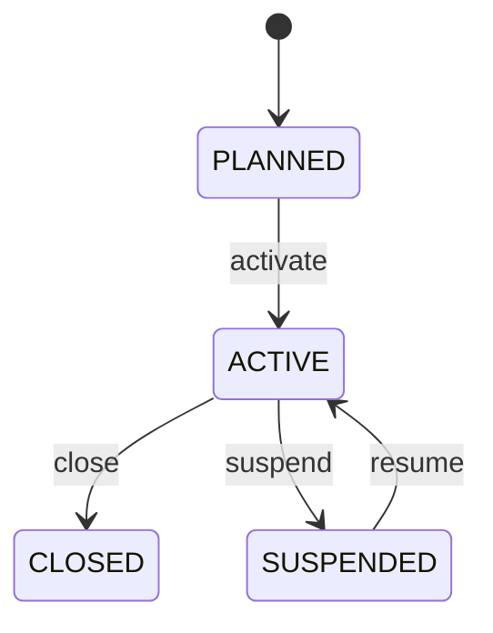

# Warehouse

Represents a managed facility where inventory is physically or operationally received, stored, controlled, fulfilled, and dispatched. Warehouse is more than an address: it is an operational capability with storage structure, inventory processes, capacity constraints, and an operating lifecycle. It provides the facility context in which InventoryLocation and InventoryMovement events occur. Used by procurement, receiving, inventory control, warehouse management, order fulfillment, shipping, transportation, capacity planning, and stock reporting. Warehouse specializes Location for inventory operations. InventoryLocation defines where stock is held inside the facility. InventoryMovement records stock events. Shipment and PurchaseOrder/SalesOrder provide inbound or outbound business context. Warehouse should not itself be used as a substitute for the current stock balance. A planned warehouse is configured before operation. Active warehouses can participate in normal inventory flows. Suspended warehouses temporarily restrict operations. Closed warehouses stop normal activity while retaining historical inventory, shipment, and transaction records for audit and reconciliation. A distribution center is represented as a Warehouse with a physical Location, warehouse code DC01, and multiple InventoryLocations for receiving, reserve storage, picking, staging, and dispatch. A PurchaseOrder receipt creates InventoryMovement into receiving, put-away transfers stock into reserve locations, and an outbound Shipment consumes stock from picking or staging locations.

## Finding records

Open **Warehouse** from the menu or from its card on the dashboard.

The list shows Location, Warehouse Code, Warehouse Type, Capacity, Status, Code, Name, with the most recently changed record first. The **Help** button beside the title opens this window's help text.

- **Search**: type in the search box above the grid to narrow the rows. **Search** at the top left opens advanced search, where you pick a field, a comparison (equals, contains, starts with, before, after, and so on) and a value.
- **Sort**: click a column heading; click again to reverse.
- **Refresh**: the refresh button at the top right re-reads the rows and every dropdown, so a record created a moment ago by someone else appears.
- **Export**: **CSV** downloads the rows you are looking at.
- **Open a record**: click a row. The line under the title, "Showing 1 to n of N entries", tells you how many rows match.

## Creating a record

Choose **New** at the top of the list. The form opens on its own page, with the fields in sections. A badge beside each label names the control (Text, Dropdown, Date, and so on); a red star marks a required field; the question-mark icon shows that field's help; and a hint such as “max 300” shows the longest entry accepted.

1. Fill in the fields described under [Fields](#fields).
2. These are required and must be completed before the record can be saved: **Location**, **Warehouse Code**, **Warehouse Type**, **Status**, **Code**, **Name**, **Location Type**.
3. For a dropdown that points at another window, pick the matching record; if the record you need does not exist yet, create it in its own window first. A dropdown may narrow to what you have already chosen, for example the states of the chosen country.
4. Choose **Create** (or **Save** in the toolbar). You return to the record, and it appears at the top of the list. If something is wrong the form says which field and why, and nothing is saved.

## Reading, changing and deleting a record

Click a row to open the record. Above the fields are the arrows that step through the list ("1 of 5"). Below them sit **Notes**, where anyone may leave a comment on the record, and the **Audit Trail**, which lists every change with who made it, when, and which fields changed.

- **Edit** (toolbar) makes the fields editable. Change them and choose **Save**; **Undo Changes** puts back what you changed and **Cancel Editing** leaves edit mode.
- **Copy Record** starts a new record from this one.
- **Delete Record** is available in edit mode and asks you to confirm; a record other records still depend on cannot be deleted.

Every change is also written to the [Audit Log](/administration/#audit-log).

## Fields

| Field | What you use | Rules | What to enter |
| --- | --- | --- | --- |
| Location | Lookup | Required, Unique | Identifies the Location record that supplies the address and geographic context for the warehouse. Used for routing, delivery, tax, service coverage, mapping, and operational location management. Warehouse specializes Location; this reference connects warehouse-specific operational semantics with the reusable CEDM location model rather than duplicating address data. Required because a warehouse must have a defined physical or operational location. Pick a record from **Location**. |
| Warehouse Code | Text | Required, Unique, Up to 100 characters | The organization-assigned business code used by warehouse personnel and systems to identify the facility. Used in inventory documents, receiving, picking, shipping, integrations, labels, reports, and warehouse routing. It is a human/system operational identifier and should not be confused with warehouseId or the Location identity. Required because warehouse operations need a concise stable business reference. |
| Warehouse Type | Choice | Required | Classifies the operating model and handling characteristics of the warehouse. Drives storage rules, temperature controls, customs controls, fulfillment workflows, capacity planning, and reporting. Type describes operational capability and regulatory context; it does not by itself define individual storage locations or inventory status. A warehouse supporting ordinary storage and handling requirements without a specialized operating classification. A facility or controlled area designed to maintain inventory within specified low-temperature conditions. A facility operating under customs or bonded-storage controls where goods may remain subject to customs restrictions. A facility optimized for inbound receipt, order fulfillment, consolidation, cross-docking, and outbound distribution. A warehouse or backroom operation primarily supporting retail-store or direct retail fulfillment. A warehouse whose operating model is not adequately represented by the standard classifications. Required because operational processes depend on facility capabilities and controls. Choose one: General, Cold storage, Bonded, Distribution, Retail, Other. |
| Capacity | Amount | Optional | The nominal storage or handling capacity of the warehouse under a defined capacity measurement convention. Used for capacity planning, utilization reporting, allocation, expansion analysis, and operational constraints. Capacity must be interpreted with the warehouse's UnitOfMeasure and storage model; a bare number does not establish whether capacity means pallets, cubic volume, container slots, weight, or another measure. Optional when capacity is managed at detailed InventoryLocation or slot level instead of as a warehouse aggregate. |
| Status | Choice | Required | The operating lifecycle state of the warehouse and whether it can participate in normal inventory processes. Controls receiving, storage, picking, shipping, allocation, and operational reporting. Warehouse status describes facility availability; InventoryLocation status and InventoryMovement events govern detailed stock behavior within the facility. The facility is being prepared and is not yet available for normal warehouse operations. The facility is operational and may accept the business processes allowed by its capabilities. Operations are temporarily restricted, for example because of maintenance, safety, regulatory, staffing, or operational conditions. The warehouse has ceased normal operations and should not receive new inventory transactions except controlled closure activities. Required because inventory processes need to know whether the facility can operate. Choose one: Planned, Active, Suspended, Closed. |
| Code | Text | Required, Unique, Up to 100 characters | The code of the location: a value the business records on it. Entered or maintained when a location is created or changed; shown on its form and available to search and reports. Read together with the location's other fields and its relationships; it is not meaningful on its own. Required: a location cannot be understood without its code. |
| Name | Text | Required, Up to 200 characters | The name of the location: a value the business records on it. Entered or maintained when a location is created or changed; shown on its form and available to search and reports. Read together with the location's other fields and its relationships; it is not meaningful on its own. Required: a location cannot be understood without its name. |
| Location Type | Choice | Required | The location type of the location: a value the business records on it. Entered or maintained when a location is created or changed; shown on its form and available to search and reports. Read together with the location's other fields and its relationships; it is not meaningful on its own. Required: a location cannot be understood without its location type. The location type of the location is site; set it when that is what the business means for this record. The location type of the location is warehouse; set it when that is what the business means for this record. The location type of the location is store; set it when that is what the business means for this record. The location type of the location is office; set it when that is what the business means for this record. The location type of the location is factory; set it when that is what the business means for this record. The location type of the location is yard; set it when that is what the business means for this record. The location type of the location is port; set it when that is what the business means for this record. The location type of the location is depot; set it when that is what the business means for this record. The location type of the location is virtual; set it when that is what the business means for this record. The location type of the location is other; set it when that is what the business means for this record. Choose one: Site, Warehouse, Store, Office, Factory, Yard, Port, Depot, Virtual, Other. |
| Address | Lookup | Optional | The address id of the location: a link to another record the business records on it. Entered or maintained when a location is created or changed; shown on its form and available to search and reports. Read together with the location's other fields and its relationships; it is not meaningful on its own. Pick a record from **Address**. |
| Parent Location | Lookup | Optional | The parent location id of the location: a link to another record the business records on it. Entered or maintained when a location is created or changed; shown on its form and available to search and reports. Read together with the location's other fields and its relationships; it is not meaningful on its own. Pick a record from **Parent Location**. |
| Organization | Lookup | Optional | Links a location to organization, the organization it relates to. Chosen from the existing organization records when the location is created or edited. A location has at most one organization in this role. Lets the location be found from, and reported with, its organization. Pick a record from **Organization**. |

## How it connects to other records
- A warehouse has many **Warehouse** records.
- A warehouse belongs to one **Location**.
- A warehouse has many **Wave** records.
- A warehouse has many **Location** records.
- A warehouse belongs to one **Address**.
- A warehouse belongs to one **Organization**.

## Lifecycle: Warehouse lifecycle

A warehouse record starts as **Planned** and ends as **Closed**. Open a record and the bar above its fields shows its current **State** and, after **Next**, a button for each move that leaves it; choose one to make the move. Any move the diagram does not draw is refused, for everyone including the administrator.

| From | To | Move |
| --- | --- | --- |
| Planned | Active | Activate |
| Active | Closed | Close |
| Active | Suspended | Suspend |
| Suspended | Active | Resume |

## What happens when you save
Business rules run around the save. They are listed here and explained in full under [Business rules](/administration/rules/).

| Rule | When | Order |
| --- | --- | --- |
| Warehouse invariants before create | before a warehouse is created | 100 |
| Warehouse invariants before update | before a warehouse is changed | 100 |

## Who may use it

Anyone who holds a role with access to the **Warehouse** window. Access is granted by role under [Roles and access](/administration/access/).
