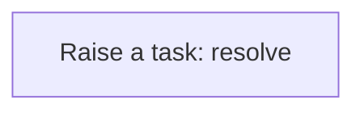
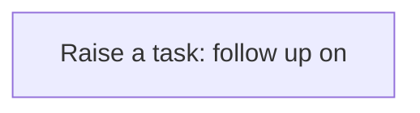

# Processes

A process is a sequence of steps the application runs for you: create a task, update a record, call a service. A business rule usually starts it; you can also run one by hand from the Workflow Designer. Every run is logged step by step in the Workflow Monitor. This application has **8** processes.

## Party exception raised {#party-exception-raised}

When a party is blocked, a high-priority task asks someone to resolve it.

Runs when a **Party** is changed, started by a business rule.

1. **Raise a task: resolve** — creates a **Task** record.

## Exchange rate follow up required {#exchange-rate-follow-up-required}

When a exchange rate is cancelled, a task asks someone to settle what depended on it.

Runs when a **Exchange Rate** is changed, started by a business rule.

1. **Raise a task: follow up on** — creates a **Task** record.

## Experiment exception raised {#experiment-exception-raised}

When a experiment is failed, a high-priority task asks someone to resolve it.

Runs when a **Experiment** is changed, started by a business rule.

1. **Raise a task: resolve** — creates a **Task** record.

## Experiment follow up required {#experiment-follow-up-required}

When a experiment is cancelled, a task asks someone to settle what depended on it.

Runs when a **Experiment** is changed, started by a business rule.

1. **Raise a task: follow up on** — creates a **Task** record.

## Sample exception raised {#sample-exception-raised}

When a sample is quarantined, a high-priority task asks someone to resolve it.

Runs when a **Sample** is changed, started by a business rule.

1. **Raise a task: resolve** — creates a **Task** record.

## Chemical batch exception raised {#chemical-batch-exception-raised}

When a chemical batch is quarantined, a high-priority task asks someone to resolve it.

Runs when a **Chemical Batch** is changed, started by a business rule.

1. **Raise a task: resolve** — creates a **Task** record.

## Chemical batch follow up required {#chemical-batch-follow-up-required}

When a chemical batch is rejected, a task asks someone to settle what depended on it.

Runs when a **Chemical Batch** is changed, started by a business rule.

1. **Raise a task: follow up on** — creates a **Task** record.

## Product exception raised {#product-exception-raised}

When a product is blocked, a high-priority task asks someone to resolve it.

Runs when a **Product** is changed, started by a business rule.

1. **Raise a task: resolve** — creates a **Task** record.

